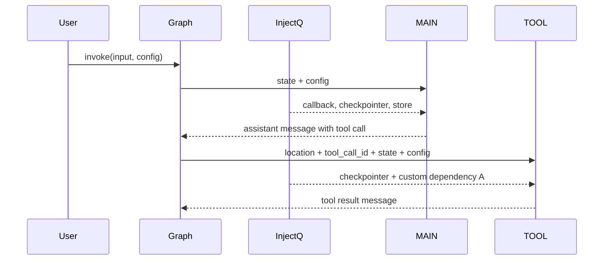

# Dependency Injection

**Source example:** [`agentflow/examples/react-injection/react_di.py`](https://github.com/10xHub/Agentflow/blob/main/examples/react-injection/react_di.py)

## What you will build

A ReAct-style graph that uses dependency injection to provide shared services to both the main node and tool functions. The example injects:

- a custom application dependency
- the compiled graph checkpointer
- the callback manager
- the store abstraction
- config and state objects passed by the runtime

## Prerequisites

- Python 3.11 or later
- `10xscale-agentflow` installed
- `injectq` installed
- A provider key such as `GEMINI_API_KEY`

Install the extra dependency:

```bash
pip install injectq
```

## Why use dependency injection in AgentFlow

Dependency injection keeps your node and tool signatures explicit without forcing you to manually create or pass every shared object at each call site.

```mermaid
flowchart LR
    A[InjectQ container] --> B[StateGraph container]
    B --> C[MAIN node]
    B --> D[TOOL node]
    E[compile(checkpointer=...)] --> C
    E --> D
    F[runtime state + config] --> C
    F --> D
```

Use this pattern when:

- multiple nodes need the same shared service
- you want testable, explicit dependencies
- your tools need access to stateful infrastructure

## Step 1 — Create and populate the container

The example gets a singleton `InjectQ` instance and registers a custom class:

```python
from injectq import Inject, InjectQ


class A:
    pass


container = InjectQ.get_instance()
container.bind_instance(A, A())
```

Later, the graph is created with that container:

```python
graph = StateGraph(container=container)
```

That makes the container available across graph execution.

## Step 2 — Inject dependencies into a tool

The weather tool uses normal runtime parameters and injected services side by side:

```python
from agentflow.storage.checkpointer import InMemoryCheckpointer
from agentflow.core.state import AgentState, Message
from agentflow.core.state.message_block import ToolResultBlock


def get_weather(
    location: str,
    tool_call_id: str,
    state: AgentState,
    config: dict,
    checkpointer: InMemoryCheckpointer = Inject[InMemoryCheckpointer],
    a: A = Inject[A],
) -> Message:
    res = f"The weather in {location} is sunny"
    return Message.tool_message(
        content=[
            ToolResultBlock(
                call_id=tool_call_id,
                output=res,
                status="completed",
            )
        ],
    )
```

The key idea is that `location`, `tool_call_id`, `state`, and `config` come from the graph runtime, while `checkpointer` and `a` come from injection.

## Step 3 — Inject dependencies into a node

The main node can also receive injected services:

```python
from agentflow.storage.store.base_store import BaseStore
from agentflow.utils.callbacks import CallbackManager


async def main_agent(
    state: AgentState,
    config: dict,
    callback: CallbackManager = Inject[CallbackManager],
    checkpointer: InMemoryCheckpointer = Inject[InMemoryCheckpointer],
    store: BaseStore | None = Inject[BaseStore],
):
    ...
```

This is useful for:

- audit logging
- callback orchestration
- long-term storage access
- shared business services

## Runtime and injected data flow



## Step 4 — Build the graph

The rest of the graph looks like a standard ReAct loop:

```python
tool_node = ToolNode([get_weather])

graph = StateGraph(container=container)
graph.add_node("MAIN", main_agent)
graph.add_node("TOOL", tool_node)

graph.add_conditional_edges("MAIN", should_use_tools, {"TOOL": "TOOL", END: END})
graph.add_edge("TOOL", "MAIN")
graph.set_entry_point("MAIN")

app = graph.compile(checkpointer=checkpointer)
```

Compiling with a checkpointer makes that checkpointer available to the runtime, and the example demonstrates injecting it into node code.

## Step 5 — Run the example

```python
inp = {"messages": [Message.text_message("Please call the get_weather function for New York City")]}
config = {"thread_id": "12345", "recursion_limit": 10}

res = app.invoke(inp, config=config)
```

What to expect:

- the main node prints injected and runtime values
- the tool receives the injected checkpointer and custom class
- the message history contains the tool call and the tool result

## What is injected and what is not

| Value | Source |
|---|---|
| `state` | AgentFlow runtime |
| `config` | AgentFlow runtime |
| `tool_call_id` | AgentFlow runtime |
| `checkpointer` | compiled graph and DI integration |
| `callback` | DI container / runtime wiring |
| `store` | DI container / runtime wiring |
| `a` | custom container binding |

## Common mistakes

- Forgetting to install `injectq`.
- Creating a container but not passing it to `StateGraph(container=container)`.
- Assuming injected parameters will appear in the tool schema sent to the model.
- Treating optional injected services like `store` as always present.

## Key concepts

| Concept | Details |
|---|---|
| `InjectQ` | Shared dependency container |
| `Inject[T]` | Marks a parameter as injectable |
| `StateGraph(container=...)` | Connects the container to graph execution |
| runtime parameters | Values the graph provides automatically during node and tool execution |

## What you learned

- How to register dependencies in `InjectQ`.
- How to inject services into both tools and graph nodes.
- How dependency injection fits into a normal ReAct loop.
- When DI is helpful for larger production-oriented graphs.

## Next step

→ [MCP Server](/docs/tutorials/from-examples/mcp-server) to expose tools over the Model Context Protocol.
