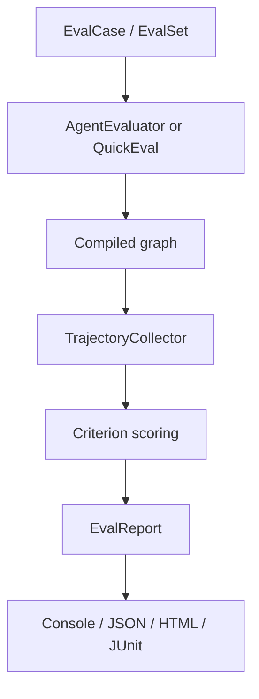
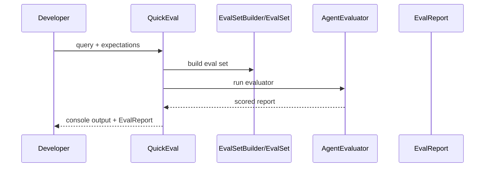
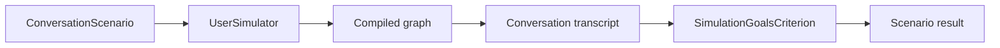
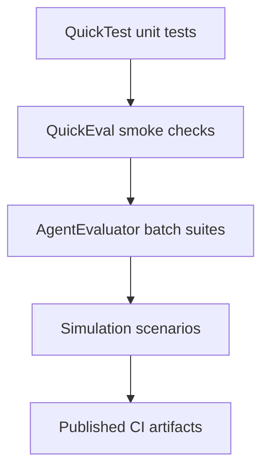

# Evaluation

**Source examples:**

- `agentflow/examples/evaluation/samples.py`
- `agentflow/examples/evaluation/test3/test_weather_simulator.py`
- `agentflow/examples/evaluation/test4/test_single_turn.py`
- `agentflow/examples/evaluation/test5/test_multi_turn.py`

## What you will build

An evaluation workflow that moves beyond deterministic unit tests and starts scoring whether an agent behaved correctly.

This tutorial covers four practical layers:

- defining datasets with `EvalCase`, `ToolCall`, and `EvalSet`
- running quick checks with `QuickEval`
- running full evaluations with `AgentEvaluator`
- generating CI-friendly reports

## When to use evaluation instead of testing

Use regular tests when you need deterministic pass/fail checks on graph structure.

Use evaluation when you need to answer questions like:

- Did the agent call the right tool?
- Did it call tools in the right order?
- Did the response roughly match the expected answer?
- Did a simulated user accomplish their goal?

## Evaluation architecture



## Step 1 - Define evaluation cases

The shared `samples.py` file shows the basic shape:

```python
NYC = EvalCase.single_turn(
    eval_id="nyc_happy",
    name="NYC - happy path",
    user_query="Please call the get_weather function for New York City",
    expected_response="The weather in New York City is sunny",
    expected_tools=[ToolCall(name="get_weather")],
)
```

That one case captures three things:

- the user query
- the expected response text
- the expected tool call

The same file also builds grouped datasets such as `HAPPY_PATH_CASES`, `ALL_CASES`, and a reusable `EVAL_SET`.

This is exactly what you want for CI: one shared source of truth for your evaluation fixtures.

## Step 2 - Start with `QuickEval` for fast feedback

One of the examples uses `QuickEval.check()`:

```python
report = await QuickEval.check(
    graph=compiled_graph,
    collector=collector,
    query="What is the weather in London?",
    expected_response_contains="sunny",
    expected_tools=["get_weather"],
    threshold=0.5,
    print_results=True,
)
```

`QuickEval` is the evaluation equivalent of `QuickTest`:

- less setup
- fewer moving parts
- good for quick local checks

Other example helpers include:

- `QuickEval.batch()`
- `QuickEval.tool_usage()`
- `QuickEval.conversation_flow()`
- `QuickEval.preset()`

## Quick evaluation flow



## Step 3 - Score tool usage and trajectory quality

The evaluation fixtures are especially strong on tool-call validation.

In `samples.py`, cases can define exact expected tool sequences:

```python
WEATHER_THEN_FORECAST = EvalCase.single_turn(
    eval_id="traj_weather_then_forecast",
    user_query="First tell me the current weather in New York City, then give me the 5-day forecast",
    expected_tools=[
        ToolCall(name="get_weather"),
        ToolCall(name="get_forecast"),
    ],
)
```

That enables criteria such as:

```python
CriterionConfig.trajectory(
    threshold=1.0,
    match_type=MatchType.EXACT,
)
```

Useful match modes:

| Match type | Meaning |
|---|---|
| `EXACT` | Same steps, same order, same count |
| `IN_ORDER` | Expected steps must appear in order, extras allowed |
| `ANY_ORDER` | Expected steps can appear in any order |

If tool sequencing matters in production, trajectory checks are often more valuable than plain response matching.

## Step 4 - Run richer evaluations with `AgentEvaluator`

The deeper examples create full configs:

```python
config = EvalConfig(
    criteria={
        "tool_name_match_score": CriterionConfig.tool_name_match(threshold=1.0),
        "response_match_score": CriterionConfig.response_match(threshold=0.3),
    },
    reporter={"enabled": True},
)

evaluator = AgentEvaluator(compiled_graph, collector, config=config)
result = await evaluator.evaluate_case(WEATHER_CASE)
```

This gives you full result objects with:

- pass/fail state
- criterion-by-criterion scores
- actual response text
- actual tool calls
- duration

That extra structure is what you need when debugging why an evaluation failed in CI.

## Step 5 - Add simulation for multi-turn behavior

`test3/test_weather_simulator.py` demonstrates the simulation layer.

It defines a scenario like this:

```python
WEATHER_SINGLE_CITY = ConversationScenario(
    scenario_id="weather_single_city",
    description="User wants to know the current weather in Tokyo for trip planning",
    starting_prompt="I'm thinking of visiting Tokyo soon. Can you help me?",
    goals=["Get weather information for Tokyo"],
    max_turns=4,
)
```

Then it runs a `UserSimulator` against the graph.

This is powerful when you care about outcomes over multiple turns, not just a single response.

Simulation view:



This is a good fit for support agents, onboarding agents, and any workflow where success depends on the whole conversation arc.

## Step 6 - Generate reports for CI

The examples also show report generation:

```python
ReporterConfig(
    enabled=True,
    output_dir=tmpdir,
    console=False,
    json_report=True,
    html=True,
    junit_xml=True,
    timestamp_files=False,
)
```

That means an evaluation run can produce machine-readable and human-readable outputs at the same time.

Practical CI pattern:

1. run the evaluation suite in a dedicated job
2. store JSON, HTML, and JUnit artifacts
3. fail the build when critical criteria fall below threshold
4. inspect the detailed report to understand regressions

## Suggested CI layering



This layered approach keeps fast checks fast while still giving you deeper quality analysis where it matters.

## Notes about the example suite

A few of the example modules intentionally call `pytest.skip(...)` at import time so they do not affect normal root-level test runs. That is useful for docs because it models a common pattern:

- keep evaluation examples in the repo
- do not force them into every default unit test run
- execute them in a dedicated evaluation workflow instead

## What to verify

If you adapt these patterns into your own repo, confirm that:

- shared fixtures live in one place like `samples.py`
- tool-call expectations are explicit where they matter
- thresholds are realistic and not overly permissive
- report files are saved somewhere your CI system can collect

## Common mistakes

- Treating evaluation thresholds like static truth instead of something you tune over time.
- Using only response text matching when tool trajectory is the real product requirement.
- Running expensive simulator-based evaluation on every tiny local iteration.
- Mixing flaky live-provider dependencies into the same job as deterministic unit tests.

## Related docs

- [Evaluation Reference](/docs/reference/python/evaluation)
- [Testing Tutorial](/docs/tutorials/from-examples/testing)
- [Testing Reference](/docs/reference/python/testing)

## What you learned

- How AgentFlow evaluation datasets are modeled with `EvalCase`, `ToolCall`, and `EvalSet`.
- How `QuickEval` helps with quick local scoring.
- How `AgentEvaluator`, trajectory checks, simulation, and report generation support CI-grade evaluation workflows.

## Next step

→ Continue with [Graceful Shutdown](/docs/tutorials/from-examples/graceful-shutdown) to document how long-running AgentFlow services should stop cleanly.
