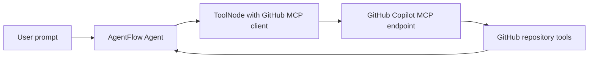
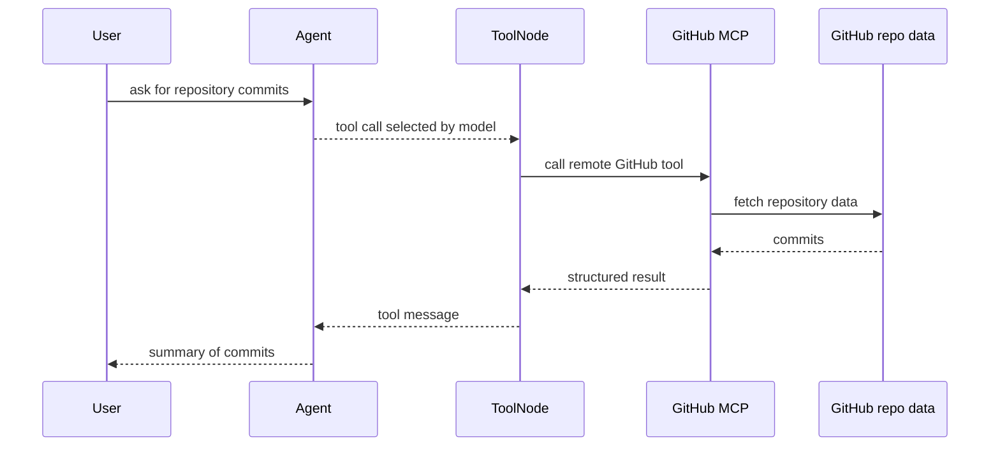

# GitHub MCP

**Source example:** [`agentflow/examples/github-mcp/git_mcp.py`](https://github.com/10xHub/Agentflow/blob/main/examples/github-mcp/git_mcp.py)

## What you will build

A ReAct agent that connects to the GitHub Copilot MCP endpoint and asks it to retrieve repository commit data through MCP tools.

## Prerequisites

- Python 3.11 or later
- `10xscale-agentflow` installed
- `fastmcp` installed
- a Google model key such as `GEMINI_API_KEY`
- `GITHUB_TOKEN` with access to the GitHub MCP endpoint

Install:

```bash
pip install fastmcp
```

Set environment variables:

```bash
export GITHUB_TOKEN=your_token_here
export GEMINI_API_KEY=your_google_key_here
```

## External service requirement

This tutorial depends on a remote hosted MCP service:

```text
https://api.githubcopilot.com/mcp/
```

If your token is missing or invalid, the MCP tool discovery or invocation will fail.

## Architecture



## Step 1 — Configure the remote MCP server

The example registers a `github` server:

```python
config = {
    "mcpServers": {
        "github": {
            "url": "https://api.githubcopilot.com/mcp/",
            "headers": {"Authorization": f"Bearer {os.getenv('GITHUB_TOKEN')}"},
            "transport": "streamable-http",
        },
    }
}
```

This is the same pattern as the local MCP examples, but with:

- a hosted remote endpoint
- auth headers

## Step 2 — Build an MCP-backed ToolNode

```python
client_http = Client(config)
tool_node = ToolNode(functions=[], client=client_http)
```

The agent then uses that `tool_node` like any other tool source.

## Step 3 — Create the ReAct graph

The graph is a standard `MAIN -> TOOL -> MAIN` loop:

```python
main_agent = Agent(
    model="gemini-2.0-flash",
    provider="google",
    system_prompt=[...],
    tools=tool_node,
    trim_context=True,
)
```

The routing function checks whether the assistant emitted tool calls and either routes to `TOOL` or ends the run.

## GitHub MCP execution flow



## Step 4 — Ask for repository data

The example asks the agent to list commits:

```python
inp = {
    "messages": [
        Message.text_message(
            "Please call the list_commits function for the github repo "
            "'https://github.com/suchith83/portfolio' of the 'suchith83' username, "
            "and give me the all commits in that repo."
        )
    ]
}
config = {"thread_id": "12345", "recursion_limit": 10}

res = app.invoke(inp, config=config)
```

## Step 5 — Print message history

The example includes a pretty-printer to inspect:

- role
- content
- tool calls
- metadata

That is useful when integrating remote MCP tools, because it helps you see:

- which tool was chosen
- how the tool call arguments were structured
- what data came back from the server

## Verification

Successful behavior should include:

- the graph completes without auth errors
- the message history contains at least one tool call
- the final assistant message summarizes repository commit information

## Common mistakes

- Missing `GITHUB_TOKEN`.
- Using a token that lacks the required access.
- Assuming all GitHub MCP tools are always available.
- Treating remote MCP latency like local function-call latency.

## Key concepts

| Concept | Details |
|---|---|
| hosted MCP endpoint | Remote shared tool service |
| auth header | Required to access protected MCP tools |
| MCP-backed ReAct graph | Standard AgentFlow loop with remote tool execution |

## What you learned

- How to connect AgentFlow to a hosted MCP server.
- How to authorize GitHub MCP requests.
- How to inspect a graph run that depends on remote repository tooling.

## Next step

→ [MCP File Download](/docs/tutorials/from-examples/mcp-file-download) to retrieve repository files rather than repository metadata.
