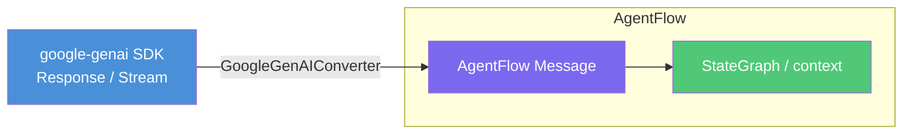
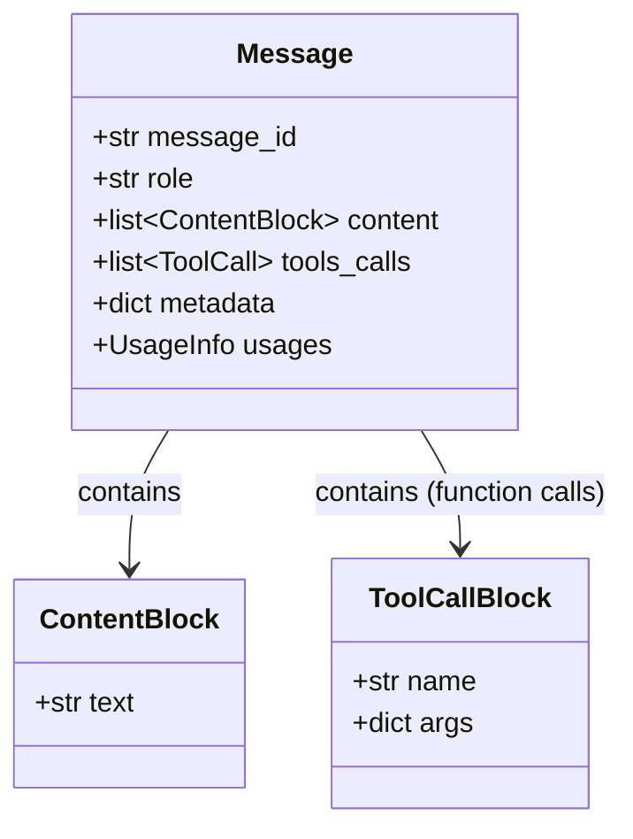
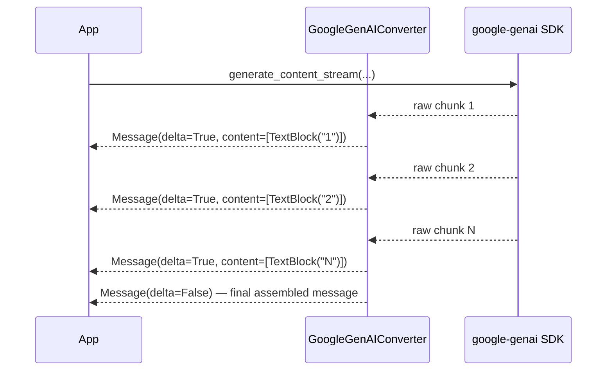

# Google GenAI Adapter

**Source example:** [`agentflow/examples/google_genai_example.py`](https://github.com/10xHub/Agentflow/blob/main/examples/google_genai_example.py)

## What you will build

Three standalone examples that demonstrate how to use the `GoogleGenAIConverter` adapter:

1. **Standard response** — convert a single `generate_content` response into an AgentFlow `Message`.
2. **Streaming response** — consume a `generate_content_stream` and yield `StreamChunk` messages as they arrive.
3. **Function calling** — inspect tool call blocks from a model response.

## Prerequisites

- Python 3.11 or later
- `10xscale-agentflow` installed
- `google-genai` SDK installed:

  ```bash
  pip install google-genai
  ```

- `GEMINI_API_KEY` or `GOOGLE_API_KEY` set in your environment (or `.env` file)

:::note Optional dependency
`google-genai` is **not** bundled with `10xscale-agentflow`. You must install it separately. The examples catch `ImportError` and print a clear install message if the package is missing.
:::

## Adapter architecture



The `GoogleGenAIConverter` lives in `agentflow.runtime.adapters.llm`. It is the bridge between the raw SDK objects (which are provider-specific) and the provider-neutral `Message` format that the rest of AgentFlow operates on.

## Example 1 — Standard response

```python
import asyncio
import os

from agentflow.runtime.adapters.llm import GoogleGenAIConverter
from google import genai
from google.genai import types

async def standard_response_example():
    api_key = os.getenv("GEMINI_API_KEY") or os.getenv("GOOGLE_API_KEY")
    client = genai.Client(api_key=api_key)

    try:
        response = client.models.generate_content(
            model="gemini-2.0-flash-exp",
            contents="Write a haiku about Python programming",
            config=types.GenerateContentConfig(temperature=0.7, max_output_tokens=100),
        )

        converter = GoogleGenAIConverter()
        message = await converter.convert_response(response)

        print(f"Message ID   : {message.message_id}")
        print(f"Role         : {message.role}")
        print(f"Token usage  : {message.usages}")
        for block in message.content:
            if hasattr(block, "text"):
                print(f"Text         : {block.text}")
    finally:
        client.close()

asyncio.run(standard_response_example())
```

### What `convert_response` returns



## Example 2 — Streaming response

```python
async def streaming_response_example():
    api_key = os.getenv("GEMINI_API_KEY") or os.getenv("GOOGLE_API_KEY")
    client = genai.Client(api_key=api_key)

    try:
        stream = client.models.generate_content_stream(
            model="gemini-2.0-flash-exp",
            contents="Count from 1 to 5, one number at a time",
            config=types.GenerateContentConfig(temperature=0.7),
        )

        converter = GoogleGenAIConverter()
        config = {"thread_id": "example-thread"}

        async for message in converter.convert_streaming_response(
            config=config,
            node_name="google_genai_node",
            response=stream,
        ):
            if message.delta:
                # Streaming chunk — print text as it arrives
                for block in message.content:
                    if hasattr(block, "text"):
                        print(block.text, end="", flush=True)
            else:
                # Final assembled message
                print(f"\nFinal message ID: {message.message_id}")
    finally:
        client.close()
```

### Streaming event flow



The `delta` flag distinguishes streaming chunks from the final assembled `Message`. Your code should buffer or display delta messages and store/use the final one.

## Example 3 — Function calling

```python
async def function_calling_example():
    api_key = os.getenv("GEMINI_API_KEY") or os.getenv("GOOGLE_API_KEY")
    client = genai.Client(api_key=api_key)

    try:
        def get_weather(location: str) -> str:
            """Get the weather for a location."""
            return "sunny"

        response = client.models.generate_content(
            model="gemini-2.0-flash-exp",
            contents="What's the weather like in Boston?",
            config=types.GenerateContentConfig(
                tools=[get_weather],
                automatic_function_calling=types.AutomaticFunctionCallingConfig(disable=True),
            ),
        )

        converter = GoogleGenAIConverter()
        message = await converter.convert_response(response)

        print(f"Tool calls: {len(message.tools_calls or [])}")
        if message.tools_calls:
            for tc in message.tools_calls:
                print(f"  Function : {tc['function']['name']}")
                print(f"  Arguments: {tc['function']['arguments']}")
    finally:
        client.close()
```

## Running all examples

```python
import asyncio

asyncio.run(standard_response_example())
asyncio.run(streaming_response_example())
asyncio.run(function_calling_example())
```

## When to use `GoogleGenAIConverter` directly

The `Agent` class already handles Google GenAI internally when you set `provider="google"`. Use `GoogleGenAIConverter` directly when:

- You need to call the SDK outside of a `StateGraph` (e.g. in a background job).
- You want fine-grained control over model config parameters that `Agent` does not expose.
- You are building a custom node that calls the SDK and needs to produce AgentFlow-compatible messages.

For the common case — an LLM that calls tools inside a graph — use the `Agent` class instead. See [Agent Class Pattern](./agent-class).

## Key concepts

| Concept | Details |
|---|---|
| `GoogleGenAIConverter` | Translates google-genai SDK responses into AgentFlow `Message` objects |
| `convert_response()` | Awaitable — converts a single completed response |
| `convert_streaming_response()` | Async generator — yields delta messages and a final assembled message |
| `message.delta` | `True` for streaming chunks, `False` for the final complete message |
| `message.tools_calls` | List of tool call dicts when the LLM requested function execution |

## What you learned

- How to install and import `GoogleGenAIConverter`.
- How to convert both standard and streaming google-genai responses into `Message` objects.
- How to detect and inspect function call responses.
- When to use the converter directly vs. using the `Agent` class.

## Next step

→ [Tool Decorator](./tool-decorator) — use the `@tool` decorator to attach metadata, tags, and capabilities to your tool functions.
