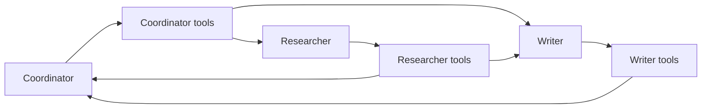
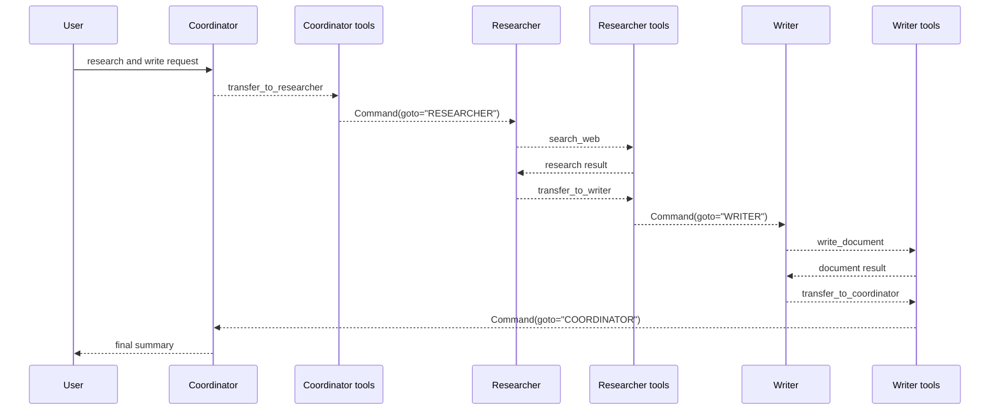

# Handoff

**Source example:** [`agentflow/examples/handoff/handoff_multi_agent.py`](https://github.com/10xHub/Agentflow/blob/main/examples/handoff/handoff_multi_agent.py)

## What you will build

A multi-agent graph with three specialists:

- `COORDINATOR`
- `RESEARCHER`
- `WRITER`

Instead of routing only from fixed external rules, agents can transfer control to each other by calling handoff tools created with `create_handoff_tool(...)`.

## Prerequisites

- Python 3.11 or later
- `10xscale-agentflow` installed
- a provider key such as `GEMINI_API_KEY`

## Why handoff is different from basic multiagent routing

In a basic multiagent graph, the graph code decides the next node. In a handoff graph, the model can choose a transfer tool that moves control to another specialist.



## Step 1 — Define regular tools

The example includes ordinary tools such as:

- `get_weather`
- `search_web`
- `write_document`

These work like normal AgentFlow tools.

## Step 2 — Create handoff tools

The key addition is `create_handoff_tool(...)`:

```python
from agentflow.prebuilt.tools import create_handoff_tool


coordinator_tools = ToolNode(
    [
        create_handoff_tool(
            "researcher", "Transfer to research specialist for detailed investigation"
        ),
        create_handoff_tool("writer", "Transfer to writing specialist for content creation"),
        get_weather,
    ]
)
```

Other agents also get handoff tools:

```python
researcher_tools = ToolNode(
    [
        search_web,
        create_handoff_tool("coordinator", "Transfer back to coordinator for delegation"),
        create_handoff_tool("writer", "Transfer to writer with research findings"),
    ]
)
```

That means the model can decide:

- stay local and use a normal tool
- transfer to another specialist

## Step 3 — Create specialist agents

Each agent gets:

- its own system prompt
- its own tool node
- its own responsibility

For example, the coordinator is responsible for delegation, while the writer is responsible for content creation.

## Handoff execution flow



## Step 4 — Build agent-specific routing

Each agent has its own `should_continue_*` router:

```python
def should_continue_coordinator(state: AgentState) -> str:
    if not state.context or len(state.context) == 0:
        return "COORDINATOR_TOOLS"
    last_message = state.context[-1]
    if hasattr(last_message, "tools_calls") and last_message.tools_calls and last_message.role == "assistant":
        return "COORDINATOR_TOOLS"
    if last_message.role == "tool":
        return "COORDINATOR"
    return END
```

The researcher and writer use the same pattern with their own tool nodes.

## Step 5 — Build the graph

The graph contains agent nodes and tool nodes:

```python
graph.add_node("COORDINATOR", coordinator_agent)
graph.add_node("COORDINATOR_TOOLS", coordinator_tools)
graph.add_node("RESEARCHER", researcher_agent)
graph.add_node("RESEARCHER_TOOLS", researcher_tools)
graph.add_node("WRITER", writer_agent)
graph.add_node("WRITER_TOOLS", writer_tools)
```

Important note from the example:

- you do not need explicit edges from tool nodes back to agents for handoffs
- the handoff tools return a command that the graph understands and uses to navigate

## Step 6 — Run the example

The example request is:

```python
inp = {
    "messages": [
        Message.text_message(
            "Please research quantum computing and write a brief article about it."
        )
    ]
}
config = {"thread_id": "handoff-demo-001", "recursion_limit": 15}
```

Expected high-level flow:

1. coordinator delegates research
2. researcher searches and transfers to writer
3. writer writes and transfers back
4. coordinator finalizes the response

## Verification

Run:

```bash
python agentflow/examples/handoff/handoff_multi_agent.py
```

You should see:

- tool calls for transfer tools
- normal tool calls like `search_web` or `write_document`
- a final message history covering multiple specialists

## Handoff vs normal tools

| Tool type | Effect |
|---|---|
| normal tool | returns data to the current agent |
| handoff tool | changes which agent owns the next step |

## Common mistakes

- Treating handoff tools like ordinary data-returning tools.
- Forgetting to give each specialist only the tools it should use.
- Making prompts unclear about when delegation should happen.
- Setting `recursion_limit` too low for a multi-agent workflow.

## Key concepts

| Concept | Details |
|---|---|
| `create_handoff_tool` | Creates a tool that transfers execution to another agent |
| specialist tool nodes | Each agent gets a constrained toolset |
| command-based routing | Handoff navigation is handled by the graph runtime |

## What you learned

- How to build a handoff-driven multi-agent system.
- How specialists can transfer work between each other.
- Why handoffs are more flexible than fixed coordinator routing.

## Next step

→ Continue with production-oriented guides and troubleshooting once your advanced example tutorials are in place.
