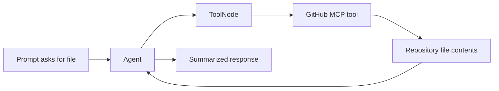
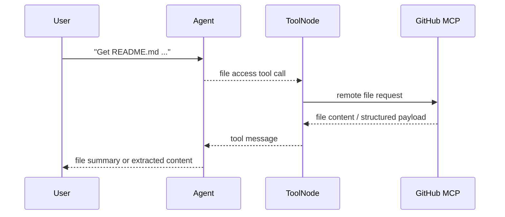

# MCP File Download

**Source example:** [`agentflow/examples/github-mcp/mcp_file_download.py`](https://github.com/10xHub/Agentflow/blob/main/examples/github-mcp/mcp_file_download.py)

## What you will build

A GitHub-MCP-backed agent that asks a remote MCP server to fetch a file from a repository, then uses the result inside the normal AgentFlow message loop.

## Prerequisites

- Python 3.11 or later
- `10xscale-agentflow` installed
- `fastmcp` installed
- `GITHUB_TOKEN`
- a model key such as `GEMINI_API_KEY`

## Why this is a separate tutorial

`github-mcp.md` focuses on repository metadata such as commits. This page focuses on file retrieval, which is a common pattern for:

- reading `README.md`
- fetching config files
- summarizing source files

## Tool flow



## Step 1 — Configure the remote GitHub MCP server

The config is the same as the repository example:

```python
config = {
    "mcpServers": {
        "github": {
            "url": "https://api.githubcopilot.com/mcp/",
            "headers": {"Authorization": f"Bearer {os.getenv('GITHUB_TOKEN')}"},
            "transport": "streamable-http",
        },
    }
}
```

## Step 2 — Create the MCP-backed ToolNode and graph

The graph structure is unchanged:

```python
client_http = Client(config)
tool_node = ToolNode(tools=[], client=client_http)

main_agent = Agent(
    model="gemini-2.0-flash",
    provider="google",
    system_prompt=[...],
    tools=tool_node,
    trim_context=True,
)
```

The important difference is the prompt you send.

## Step 3 — Ask for a repository file

The example requests `README.md`:

```python
inp = {
    "messages": [
        Message.text_message(
            "Get Readme.md file form the github repo "
            "'https://github.com/suchith83/portfolio' of the 'suchith83' username,."
        )
    ]
}
config = {"thread_id": "12345", "recursion_limit": 10}

res = app.invoke(inp, config=config)
```

Because the agent has access to GitHub MCP tools, it can choose the appropriate remote file-access tool and bring the result back into the message history.

## File retrieval sequence



## Logging and debugging

This example enables more logging than the other GitHub MCP page:

```python
logging.basicConfig(level=logging.INFO)
logging.getLogger("agentflow").setLevel(logging.DEBUG)
```

That is helpful when debugging:

- tool discovery
- remote tool invocation
- file retrieval failures

## Verification

Successful behavior should include:

- a tool call in message history
- a tool result related to repository file retrieval
- a final assistant message that references README content

## Common mistakes

- Missing or invalid `GITHUB_TOKEN`.
- Assuming the file path exactly matches what the remote tool expects.
- Forgetting that remote tools may return structured data rather than plain text.
- Treating MCP file retrieval as a local filesystem operation.

## Key concepts

| Concept | Details |
|---|---|
| file-oriented MCP tool | Remote tool that fetches repository file content |
| debug logging | Helps inspect remote tool behavior |
| same ReAct loop | Only the task and remote tool change, not the graph shape |

## What you learned

- How to use MCP for file retrieval workflows.
- How to debug remote file-oriented tool calls.
- How AgentFlow can summarize or transform file content after retrieval.

## Next step

→ [Memory](/docs/tutorials/from-examples/memory) to add long-term user memory to a graph.
