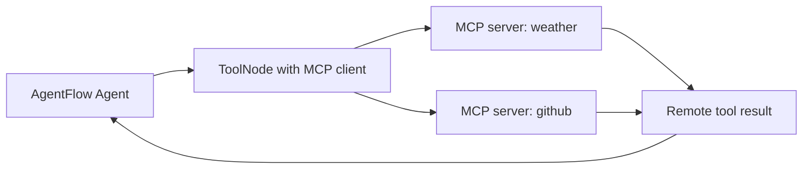
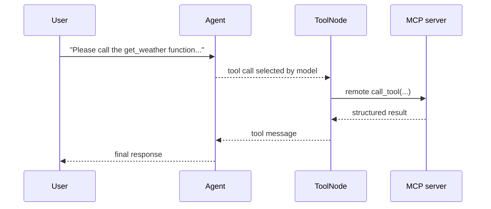

# MCP ReAct Agent

**Source example:** [`agentflow/examples/react-mcp/react-mcp.py`](https://github.com/10xHub/Agentflow/blob/main/examples/react-mcp/react-mcp.py)

## What you will build

A ReAct graph whose tools are not local Python functions, but remote MCP tools discovered through a FastMCP client.

## Prerequisites

- Python 3.11 or later
- `10xscale-agentflow` installed
- `fastmcp` installed
- a running MCP server, such as the weather server from the earlier tutorial
- a provider key such as `GEMINI_API_KEY`

Install:

```bash
pip install fastmcp
```

## Why this pattern matters

This is where MCP becomes useful in a real graph. The model sees tool schemas from remote servers, chooses one, and `ToolNode` invokes it over MCP.



## Step 1 — Configure MCP servers

The example registers two named servers:

```python
config = {
    "mcpServers": {
        "weather": {
            "url": "http://127.0.0.1:8000/mcp",
            "transport": "streamable-http",
        },
        "github": {
            "url": "http://127.0.0.1:8000/mcp",
            "transport": "streamable-http",
        },
    }
}
```

Each entry becomes a remote tool source for the client.

## Step 2 — Create an MCP-backed ToolNode

Instead of passing local functions, the example passes an MCP client:

```python
from fastmcp import Client
from agentflow.core import ToolNode


client_http = Client(config)
tool_node = ToolNode(tools=[], client=client_http)
```

This tells AgentFlow:

- local tools list is empty
- tool discovery and execution should happen through MCP

## ReAct with remote tools



## Step 3 — Build the Agent

The `Agent` is configured the same way as a local-tool ReAct agent:

```python
main_agent = Agent(
    model="gemini-2.0-flash",
    provider="google",
    system_prompt=[
        {
            "role": "system",
            "content": """
                You are a helpful assistant.
                Your task is to assist the user in finding information and answering questions.
            """,
        },
    ],
    tools=tool_node,
    trim_context=True,
)
```

The important part is `tools=tool_node`.

## Step 4 — Wire the graph

The routing logic is the same ReAct loop used elsewhere:

```python
graph = StateGraph()
graph.add_node("MAIN", main_agent)
graph.add_node("TOOL", tool_node)

graph.add_conditional_edges("MAIN", should_use_tools, {"TOOL": "TOOL", END: END})
graph.add_edge("TOOL", "MAIN")
graph.set_entry_point("MAIN")

app = graph.compile(checkpointer=checkpointer)
```

## Step 5 — Run the graph

```python
inp = {"messages": [Message.text_message("Please call the get_weather function for New York City")]}
config = {"thread_id": "12345", "recursion_limit": 10}

res = app.invoke(inp, config=config)
```

Expected behavior:

- the model sees remote MCP tool schemas
- it selects `get_weather`
- the MCP-backed `ToolNode` calls the remote service
- the final assistant response includes the remote tool result

## Local tools vs MCP tools

| Pattern | Use when |
|---|---|
| Local `ToolNode([fn1, fn2])` | the tool lives in the same Python process |
| `ToolNode(tools=[], client=client_http)` | the tool is hosted remotely behind MCP |
| Mixed local and remote | when some tools are local and others are shared services |

## Common mistakes

- Forgetting to run the MCP server first.
- Passing an MCP client but not giving the `Agent` the `tool_node`.
- Using the wrong MCP server URL or transport.
- Expecting remote tools to behave exactly like local Python functions in logs and error handling.

## Key concepts

| Concept | Details |
|---|---|
| MCP-backed `ToolNode` | Tool execution goes through a remote MCP client |
| remote tool schema | The model can choose remote tools like local ones |
| ReAct loop | Still `MAIN -> TOOL -> MAIN`, only tool transport changes |

## What you learned

- How to combine MCP with an AgentFlow ReAct graph.
- How `ToolNode` can broker remote tool calls.
- Why MCP is a clean boundary between tool hosting and graph orchestration.

## Next step

→ [GitHub MCP](/docs/tutorials/from-examples/github-mcp) for a real remote MCP integration against GitHub tooling.
