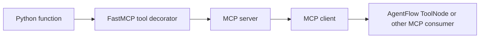
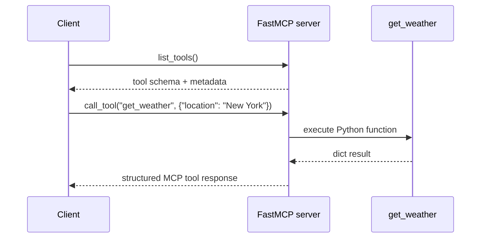

# MCP Server

**Source example:** [`agentflow/examples/react-mcp/server.py`](https://github.com/10xHub/Agentflow/blob/main/examples/react-mcp/server.py)

## What you will build

A small MCP server that exposes a `get_weather` tool over HTTP using FastMCP. This is the server-side half of the MCP tutorials.

## Prerequisites

- Python 3.11 or later
- `fastmcp` installed

Install the dependency:

```bash
pip install fastmcp
```

## What MCP gives you

MCP turns a local Python function into a remotely callable tool with discoverable schema and metadata.



Use this when:

- you want tools to live outside the agent process
- multiple clients should share the same tool service
- you want standardized tool discovery and invocation

## Step 1 — Create the MCP server

The example creates a named server:

```python
from fastmcp import FastMCP


mcp = FastMCP("My MCP Server")
```

That name helps identify the server to clients and in logs.

## Step 2 — Expose a tool

The weather function is registered with metadata:

```python
@mcp.tool(
    description="Get the weather for a specific location",
    tags={"weather", "information"},
    exclude_args=["user_details"],
)
def get_weather(location: str, user: dict | None = None) -> dict:
    print(f"User Details: {user}")
    return {
        "location": location,
        "temperature": "22°C",
        "description": "Sunny",
    }
```

What this gives you:

- a discoverable name and schema
- descriptive metadata for clients
- structured return data

The example also shows the idea of excluding server-side-only arguments. In your own code, make sure `exclude_args` matches real parameter names you want hidden from the public tool schema.

## MCP server request flow



## Step 3 — Run the server

The example starts FastMCP with streamable HTTP transport:

```python
if __name__ == "__main__":
    mcp.run(transport="streamable-http")
```

Run it:

```bash
python agentflow/examples/react-mcp/server.py
```

By default, the companion client example expects the MCP endpoint at:

```text
http://127.0.0.1:8000/mcp
```

## Why this example matters for AgentFlow

AgentFlow can treat remote MCP tools like normal tools when you connect a FastMCP client to a `ToolNode`. That lets you separate:

- tool hosting
- tool authentication
- graph orchestration

## Verification

You can verify the server is working by pairing it with the next tutorial:

- [MCP Client](/docs/tutorials/from-examples/mcp-client)

If the client can list `get_weather` and call it successfully, the server is exposed correctly.

## Common mistakes

- Starting the client before the server is running.
- Using the wrong transport; this example uses `streamable-http`.
- Assuming excluded arguments are hidden automatically if the name is wrong.
- Returning values that are not serializable by the server stack.

## Key concepts

| Concept | Details |
|---|---|
| `FastMCP` | Lightweight MCP server implementation |
| `@mcp.tool(...)` | Registers a Python callable as a remotely invokable tool |
| `tags` | Metadata that clients can inspect for filtering or UX |
| `streamable-http` | Transport used by the example server and clients |

## What you learned

- How to turn a Python function into an MCP tool.
- How FastMCP exposes tool metadata and schema.
- How to run an MCP server that AgentFlow can consume later.

## Next step

→ [MCP Client](/docs/tutorials/from-examples/mcp-client) to connect to the server and inspect or invoke its tools.
