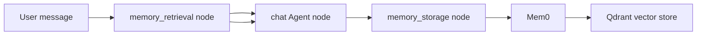
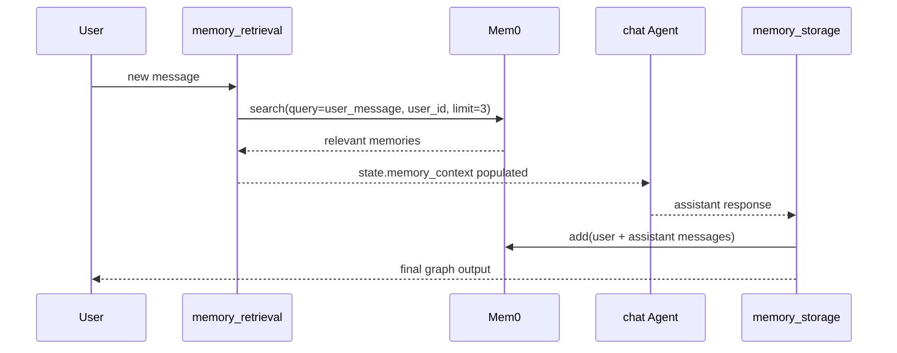

# Memory

**Source example:** [`agentflow/examples/memory/simple_personalized_agent.py`](https://github.com/10xHub/Agentflow/blob/main/examples/memory/simple_personalized_agent.py)

## What you will build

A simple personalized agent that remembers user preferences across turns by:

- retrieving relevant memories before response generation
- injecting those memories into the system prompt
- storing the new interaction after the response is produced

## Prerequisites

- Python 3.11 or later
- `10xscale-agentflow` installed
- `mem0ai` installed
- a Google model key such as `GOOGLE_API_KEY`
- `MEM0_API_KEY`
- Qdrant connection settings if you use the same vector-store setup as the example

Install:

```bash
pip install 10xscale-agentflow mem0ai python-dotenv
```

Recommended environment variables:

```bash
export GOOGLE_API_KEY=your_google_key
export MEM0_API_KEY=your_mem0_key
export QDRANT_URL=https://your-qdrant-cluster
export QDRANT_API_KEY=your_qdrant_key
```

## Memory architecture



This example uses a three-step graph:

1. retrieve relevant memory
2. generate a response
3. persist the new interaction

## Step 1 — Extend state with memory fields

The example adds `user_id` and `memory_context` to `AgentState`:

```python
class MemoryAgentState(AgentState):
    user_id: str = ""
    memory_context: str = ""
```

`memory_context` becomes prompt-ready text after the retrieval step.

## Step 2 — Configure Mem0

The example initializes Mem0 with:

- Qdrant as the vector store
- Gemini as the LLM
- Gemini embeddings

```python
config = {
    "vector_store": {
        "provider": "qdrant",
        "config": {
            "collection_name": "simple_agent_memory",
            "url": os.getenv("QDRANT_URL"),
            "api_key": os.getenv("QDRANT_API_KEY"),
            "embedding_model_dims": 768,
        },
    },
    "llm": {
        "provider": "gemini",
        "config": {"model": "gemini-2.0-flash-exp", "temperature": 0.1},
    },
    "embedder": {"provider": "gemini", "config": {"model": "models/text-embedding-004"}},
}

self.memory = Memory.from_config(config)
```

## Step 3 — Build a graph around memory retrieval and storage

The graph uses three nodes:

```python
graph = StateGraph[MemoryAgentState](MemoryAgentState())

graph.add_node("memory_retrieval", self._memory_retrieval_node)
graph.add_node("chat", self.response_agent)
graph.add_node("memory_storage", self._memory_storage_node)

graph.set_entry_point("memory_retrieval")
graph.add_edge("memory_retrieval", "chat")
graph.add_edge("chat", "memory_storage")
graph.add_edge("memory_storage", END)
```

Unlike a ReAct loop, this graph is linear. Each turn always:

- fetches context
- responds
- stores the interaction

## Memory retrieval and storage flow



## Step 4 — Retrieve relevant memories

The retrieval node searches memory by semantic similarity:

```python
memory_results = self.memory.search(
    query=user_message,
    user_id=user_id,
    limit=3,
)
```

If results exist, it turns them into prompt text:

```python
state.memory_context = "Relevant memories:\n" + "\n".join([f"- {m}" for m in memories])
```

That text is then interpolated into the system prompt.

## Step 5 — Use memory in the system prompt

The `Agent` node includes `{memory_context}`:

```python
system_prompt=[
    {
        "role": "system",
        "content": """You are a helpful AI assistant with memory of past conversations.

{memory_context}

Be conversational, helpful, and reference past interactions when relevant.""",
    },
]
```

This is the bridge between retrieved vector memory and model behavior.

## Step 6 — Store the interaction

After the response is generated, the graph stores the conversation:

```python
interaction = [
    {"role": "user", "content": user_message.content},
    {"role": "assistant", "content": ai_message.content},
]

self.memory.add(
    messages=interaction,
    user_id=state.user_id,
    metadata={"app_id": self.app_id},
)
```

## Step 7 — Chat with a stable user ID

The chat method ties memory to a user:

```python
config = {
    "thread_id": user_id,
    "recursion_limit": 10,
    "user_id": user_id,
}
```

The same `user_id` across turns allows later retrieval to find the prior memory.

## Run the example

```bash
python agentflow/examples/memory/simple_personalized_agent.py
```

Expected behavior:

- the first turn stores user preferences
- later turns retrieve them and mention them naturally

## Common mistakes

- Changing `user_id` every turn and expecting shared memory.
- Forgetting required external keys for Mem0 or Qdrant.
- Confusing checkpointed short-term thread state with long-term semantic memory.
- Expecting memory retrieval to be exact keyword matching rather than semantic search.

## Key concepts

| Concept | Details |
|---|---|
| `memory_retrieval` node | Reads relevant long-term memory before the model runs |
| `memory_storage` node | Persists the finished interaction after the model responds |
| `memory_context` | Prompt-ready text derived from semantic search results |
| `user_id` | Stable identity used for memory partitioning |

## What you learned

- How to add long-term memory to an AgentFlow graph.
- How to separate retrieval, response, and storage into different nodes.
- How semantic memory becomes prompt context.

## Next step

→ [Qdrant Memory](/docs/tutorials/from-examples/qdrant-memory) for a more advanced personalized agent with richer state and session handling.
