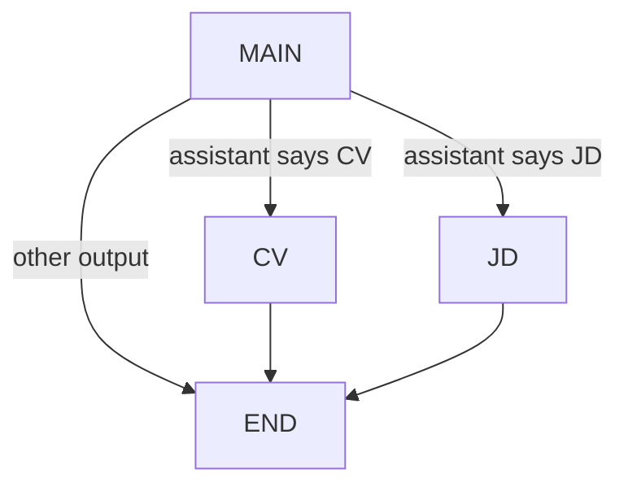
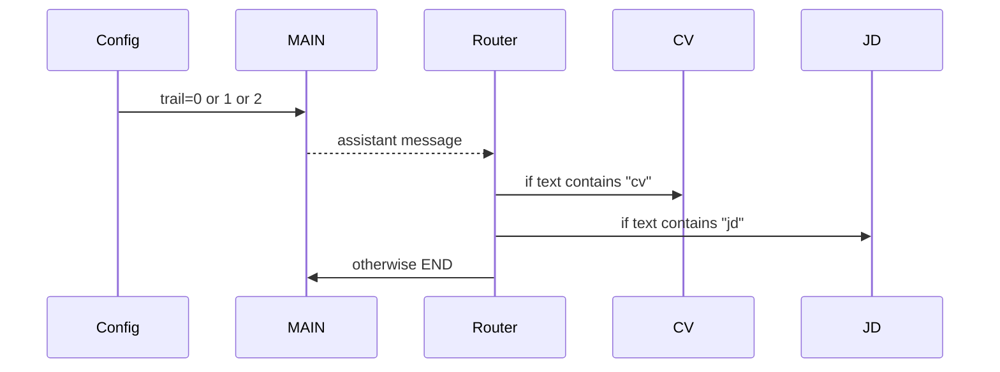

# Multiagent

**Source example:** [`agentflow/examples/multiagent/multiagent.py`](https://github.com/10xHub/Agentflow/blob/main/examples/multiagent/multiagent.py)

## What you will build

A small multi-node graph with:

- a `MAIN` node that decides what kind of work is needed
- a `CV` node for CV-specific work
- a `JD` node for job-description work

This example is intentionally simple and deterministic. It is a good introduction to multi-agent routing before you add handoff tools or remote services.

## Prerequisites

- Python 3.11 or later
- `10xscale-agentflow` installed

## Graph layout



## Step 1 — Define specialized nodes

The example uses plain functions as nodes:

```python
def cv_agent(state: AgentState, config: dict | None = None):
    return Message.text_message("CV Created Successfully", role="assistant")


def jd_agent(state: AgentState, config: dict | None = None):
    return Message.text_message("JD Created Successfully", role="assistant")
```

These are specialized worker nodes.

## Step 2 — Create a coordinator-style main node

The `MAIN` node decides which specialist should run by looking at `config["trail"]`:

```python
def main_agent(state: AgentState, config: dict):
    is_end = config.get("trail", 2)
    if is_end == 0:
        return Message.text_message("CV", role="assistant")
    elif is_end == 1:
        return Message.text_message("JD", role="assistant")
    else:
        return Message.text_message("Thank you for contacting me", role="assistant")
```

This example is not using an LLM to decide. It uses a deterministic config flag to make routing behavior easy to test and understand.

## Routing logic



## Step 3 — Route based on the last message

The routing function looks at the text from the latest assistant message:

```python
def should_use_tools(state: AgentState) -> str:
    last_message = state.context[-1]
    msg = last_message.text()
    if "cv" in msg.lower():
        return "CV"
    if "jd" in msg.lower():
        return "JD"
    return END
```

## Step 4 — Build the graph

```python
graph = StateGraph()
graph.add_node("MAIN", main_agent)
graph.add_node("CV", cv_agent)
graph.add_node("JD", jd_agent)

graph.add_conditional_edges("MAIN", should_use_tools, {"CV": "CV", "JD": "JD", END: END})
graph.add_edge("CV", END)
graph.add_edge("JD", END)
graph.set_entry_point("MAIN")

app = graph.compile()
```

## Step 5 — Run multiple scenarios

The example demonstrates three cases:

```python
config = {"thread_id": "12345", "recursion_limit": 10, "trail": 0}
```

Results:

- `trail = 0` routes to `CV`
- `trail = 1` routes to `JD`
- `trail = 2` ends after `MAIN`

## Verification

Run:

```bash
python agentflow/examples/multiagent/multiagent.py
```

You should see three runs printed:

- one ending in `CV Created Successfully`
- one ending in `JD Created Successfully`
- one ending with the generic `MAIN` response

## When to use this pattern

Use this type of graph when:

- you have a coordinator and a few clear specialists
- routing rules are simple
- you want separate nodes without tool-based handoff yet

If you need agent-to-agent delegation initiated by the model itself, use the next tutorial:

- [Handoff](/docs/tutorials/from-examples/handoff)

## Common mistakes

- Assuming “multiagent” always means separate LLMs. It can also mean multiple graph nodes with distinct responsibilities.
- Making routing depend on text that is too fragile or ambiguous.
- Forgetting to explicitly connect specialist nodes to `END` or another next node.

## Key concepts

| Concept | Details |
|---|---|
| coordinator node | Chooses which specialist should run |
| specialist node | Focused node for one type of work |
| conditional routing | Maps node output to the next node |

## What you learned

- How to model multiple specialists in one graph.
- How to route work based on the latest message.
- How a simple multiagent graph differs from handoff-based delegation.

## Next step

→ [Handoff](/docs/tutorials/from-examples/handoff) to let specialized agents transfer control between each other dynamically.
