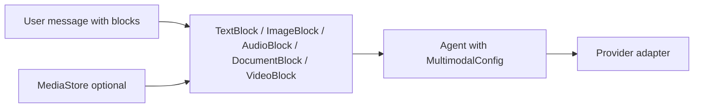
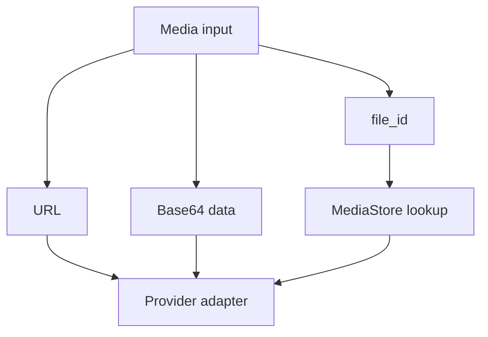
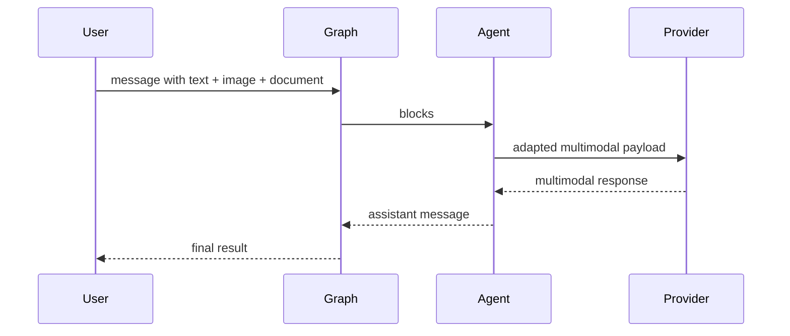

# Multimodal

**Source example:** [`agentflow/examples/multimodal/multimodal_agent.py`](https://github.com/10xHub/Agentflow/blob/main/examples/multimodal/multimodal_agent.py)

## What you will build

A single-node graph that accepts multiple content types:

- images
- audio
- video
- documents

The tutorial also shows three ways to provide media:

- external URL
- inline base64 data
- uploaded `file_id`

## Prerequisites

- Python 3.11 or later
- `10xscale-agentflow` installed
- a multimodal-capable provider key such as `GOOGLE_API_KEY`

## Multimodal architecture



## Step 1 — Set up storage

The example uses:

```python
checkpointer = InMemoryCheckpointer()
media_store = InMemoryMediaStore()
```

Why two stores:

- `checkpointer` tracks thread state
- `media_store` stores uploaded media for `file_id` workflows

You can skip the media store if you only use external URLs or inline base64.

## Step 2 — Configure the Agent for multimodal input

The example creates an agent with `MultimodalConfig`:

```python
agent = Agent(
    model="gemini-2.5-flash",
    provider="google",
    system_prompt=[
        {
            "role": "system",
            "content": (
                "You are a helpful multimodal assistant. "
                "Describe what you see in any images, "
                "transcribe any audio, and summarize any documents."
            ),
        },
    ],
    multimodal_config=MultimodalConfig(
        image_handling=ImageHandling.BASE64,
        document_handling=DocumentHandling.EXTRACT_TEXT,
    ),
)
```

This controls how media is prepared for the provider.

## Media input paths



## Step 3 — Build the graph

The graph is intentionally simple:

```python
graph = StateGraph()
graph.add_node("agent", agent)
graph.set_entry_point("agent")
graph.add_edge("agent", END)

app = graph.compile(checkpointer=checkpointer)
```

## Step 4 — Build multimodal messages

Each message is made of blocks.

### External URL image

```python
Message(
    role="user",
    content=[
        TextBlock(text="What is in this image?"),
        ImageBlock(
            media=MediaRef(
                kind="url",
                url="https://...",
                mime_type="image/png",
            )
        ),
    ],
)
```

### Inline base64 image

```python
ImageBlock(
    media=MediaRef(
        kind="data",
        data_base64=png_b64,
        mime_type="image/png",
    )
)
```

### Uploaded `file_id`

```python
file_id = loop.run_until_complete(media_store.store(data=sample_image, mime_type="image/png"))

ImageBlock(
    media=MediaRef(
        kind="file_id",
        file_id=file_id,
        mime_type="image/png",
    )
)
```

## Step 5 — Use other media blocks

The example also demonstrates:

- `AudioBlock`
- `DocumentBlock`
- `VideoBlock`

That means a single message can mix multiple modalities.

## Mixed-media execution flow



## Step 6 — Run examples

The example defines named scenarios:

```python
EXAMPLES = {
    "url": ("External URL image", build_message_with_external_url),
    "base64": ("Inline base64 image", build_message_with_base64),
    "file_id": ("Uploaded file_id image", build_message_with_file_id),
    "audio": ("Audio input", build_message_with_audio),
    "document": ("Document input", build_message_with_document),
    "video": ("Video input", build_message_with_video),
    "mixed": ("Mixed media types", build_mixed_message),
}
```

Run a few:

```bash
python agentflow/examples/multimodal/multimodal_agent.py url base64 file_id
```

Or let the script run the default examples:

```bash
python agentflow/examples/multimodal/multimodal_agent.py
```

## When to use each media strategy

| Strategy | Best for |
|---|---|
| URL | public remote media already hosted elsewhere |
| base64 | small inline test data and quick experiments |
| `file_id` | production usage, reuse, and repeated access |

## Common mistakes

- Using inline base64 for large files in production.
- Forgetting a media store when you rely on `file_id`.
- Choosing a model that does not support your target media type.
- Sending MIME types that do not match the payload.

## Key concepts

| Concept | Details |
|---|---|
| `MediaRef` | Canonical reference to media payloads |
| block-based content | Messages can contain text and media together |
| `MultimodalConfig` | Controls adaptation for image and document handling |
| `InMemoryMediaStore` | Supports uploaded file workflows through `file_id` |

## What you learned

- How to structure multimodal messages in AgentFlow.
- How to choose between URL, base64, and `file_id`.
- How multimodal agent configuration affects provider adaptation.

## Next step

→ [Multiagent](/docs/tutorials/from-examples/multiagent) to route between multiple specialized nodes in one graph.
