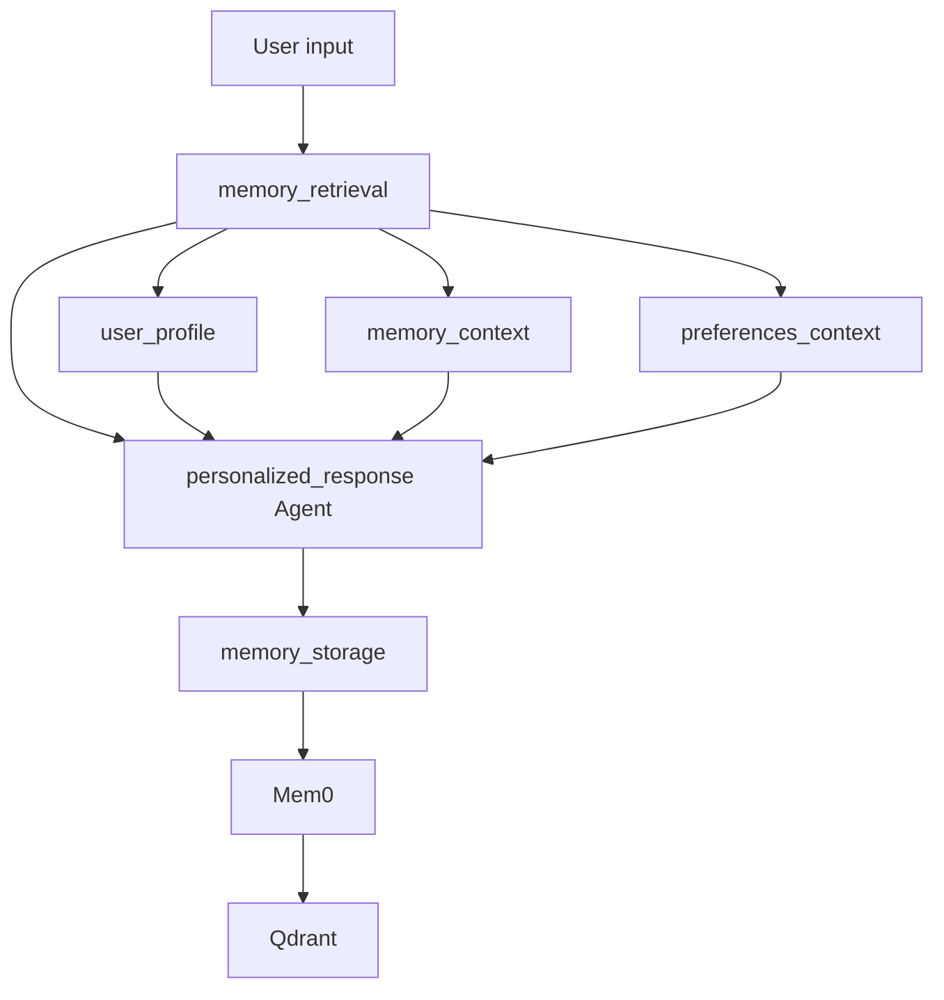
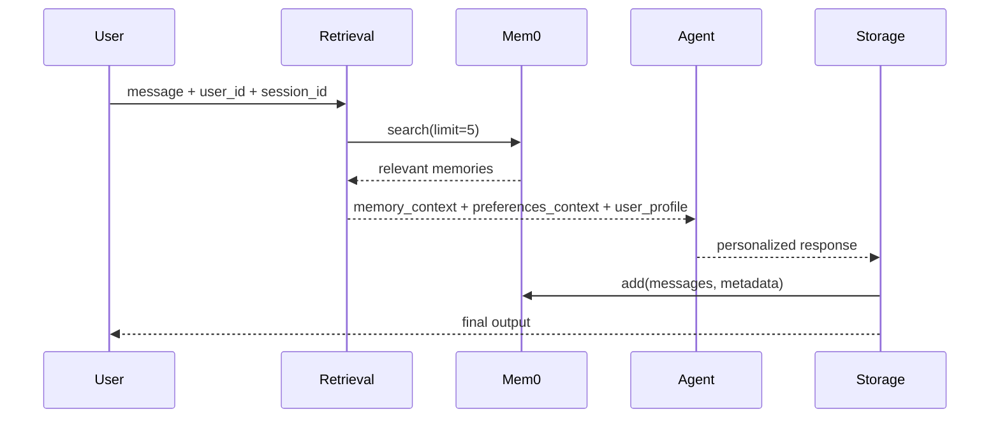

# Qdrant Memory

**Source example:** [`agentflow/examples/memory/personalized_agent_qdrant.py`](https://github.com/10xHub/Agentflow/blob/main/examples/memory/personalized_agent_qdrant.py)

## What you will build

A more advanced memory-enabled agent that:

- tracks `user_id` and `session_id`
- builds richer personalized prompt context
- stores metadata with each memory
- exposes helper methods to inspect or delete stored memories

## Prerequisites

- Python 3.11 or later
- `10xscale-agentflow` installed
- `mem0ai` installed
- `python-dotenv`
- `GOOGLE_API_KEY`
- `MEM0_API_KEY`
- `QDRANT_URL`
- `QDRANT_API_KEY`

Install:

```bash
pip install 10xscale-agentflow mem0ai python-dotenv qdrant-client
```

## Required environment variables

```bash
export GOOGLE_API_KEY=your_google_key
export MEM0_API_KEY=your_mem0_key
export QDRANT_URL=https://your-cluster.qdrant.io
export QDRANT_API_KEY=your_qdrant_key
```

## Advanced memory architecture



## Step 1 — Create a richer state model

The example extends `AgentState` with several fields:

```python
class PersonalizedAgentState(AgentState):
    user_id: str = ""
    user_profile: dict[str, Any] = {}
    session_id: str = ""
    conversation_summary: str = ""
    interaction_count: int = 0
    memory_context: str = ""
    preferences_context: str = ""
```

This richer state lets the graph carry both prompt-ready text and structured metadata.

## Step 2 — Configure Mem0 and Qdrant

The vector store uses Qdrant, while Gemini is used for both LLM calls and embeddings:

```python
self.mem0_config = {
    "vector_store": {
        "provider": "qdrant",
        "config": {
            "collection_name": "personalized_agent_memory",
            "url": os.getenv("QDRANT_URL"),
            "api_key": os.getenv("QDRANT_API_KEY"),
            "embedding_model_dims": 768,
        },
    },
    "llm": {
        "provider": "gemini",
        "config": {
            "model": "gemini-2.0-flash-exp",
            "temperature": 0.1,
            "max_tokens": 1000,
            "top_p": 0.9,
        },
    },
    "embedder": {"provider": "gemini", "config": {"model": "models/text-embedding-004"}},
}
```

## Step 3 — Personalize the system prompt

The response agent receives interpolated state fields:

```python
system_prompt=[
    {
        "role": "system",
        "content": """You are a highly personalized AI assistant.

User ID: {user_id}
Interaction Count: {interaction_count}

{memory_context}
{preferences_context}

Instructions:
1. Reference relevant past interactions when appropriate
2. Adapt your communication style based on user preferences
3. Be helpful, engaging, and maintain conversation continuity
4. If this is a new user, introduce yourself warmly
5. Always provide thoughtful, context-aware responses
""",
    },
]
```

This is more expressive than the basic memory example because it uses:

- identity
- interaction count
- summarized memory
- extracted preferences

## Retrieval and storage lifecycle



## Step 4 — Retrieve context and infer preferences

The retrieval node:

- searches memory
- extracts recent memories
- heuristically identifies preference-like phrases
- writes both prompt text and structured data back into state

That means the state carries:

- prompt strings for the model
- structured profile information for your own application code

## Step 5 — Store interaction metadata

The storage node adds metadata to each memory write:

```python
metadata = {
    "app_id": self.app_id,
    "session_id": state.session_id,
    "interaction_count": state.interaction_count,
    "user_id": state.user_id,
}

result = self.memory.add(
    messages=interaction,
    user_id=state.user_id,
    metadata=metadata,
)
```

That metadata is useful for:

- analytics
- cleanup
- filtering
- debugging session-specific behavior

## Step 6 — Use session-aware config

The chat method passes user and session identity in config:

```python
config = {
    "thread_id": session_id,
    "configurable": {"user_id": user_id, "session_id": session_id},
}
```

This separates:

- thread execution identity
- user memory identity
- session grouping

## Step 7 — Inspect and delete memories

The example also provides helper methods:

- `get_user_memories(user_id, limit=10)`
- `delete_user_memories(user_id)`

Those are practical additions when you need:

- user-visible history
- privacy deletion
- debugging tools

## Run the demo

Demo conversation:

```bash
python agentflow/examples/memory/personalized_agent_qdrant.py demo
```

Interactive mode:

```bash
python agentflow/examples/memory/personalized_agent_qdrant.py
```

Interactive commands:

- normal chat input
- `memories`
- `quit`

## Common mistakes

- Missing any of the four required external environment variables.
- Using the wrong embedding dimension for your chosen embedding model.
- Confusing user-level memory with session-level thread state.
- Writing memory metadata that your retrieval workflow never uses.

## Key concepts

| Concept | Details |
|---|---|
| `user_profile` | Structured data derived from retrieved memories |
| `preferences_context` | Prompt-ready text built from inferred preferences |
| `session_id` | Groups a conversation run while preserving user-level memory |
| metadata-rich memory writes | Makes later filtering and operations easier |

## What you learned

- How to build a richer long-term memory graph.
- How to separate user identity from session identity.
- How to carry both prompt text and structured profile data in state.

## Next step

→ [Multimodal](/docs/tutorials/from-examples/multimodal) to accept images, audio, video, and documents in an AgentFlow graph.
