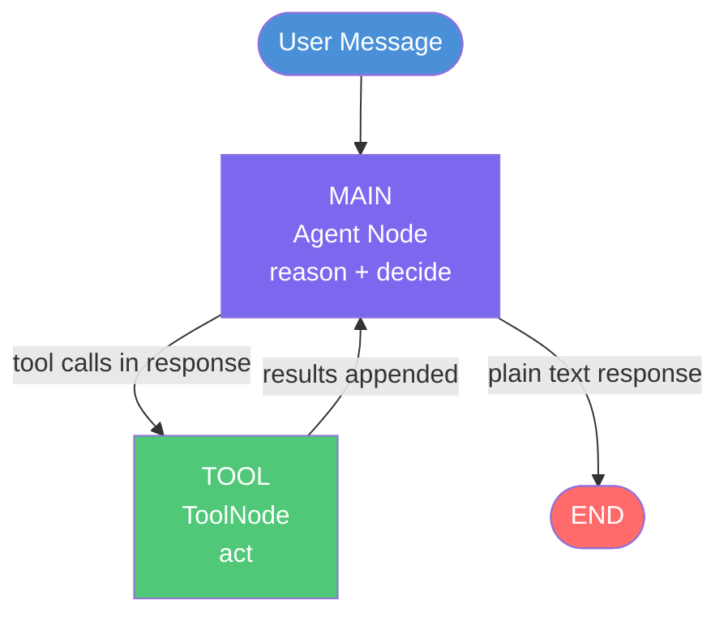
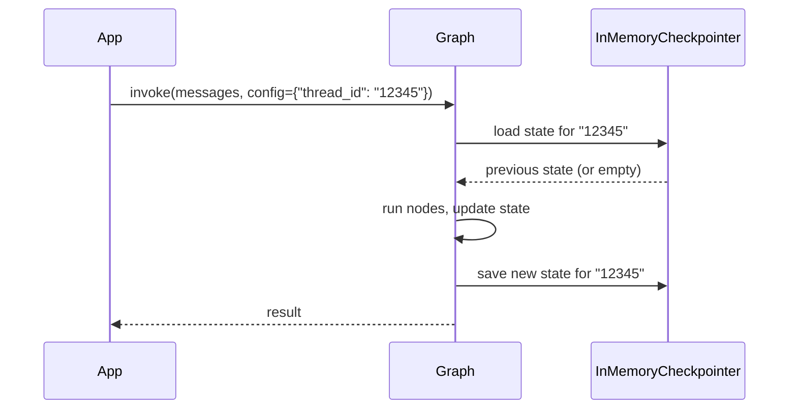
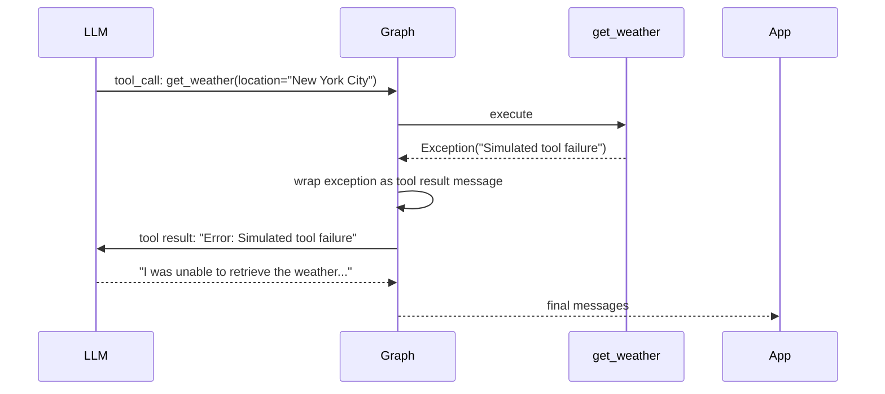

# ReAct Agent

**Source example:** [`agentflow/examples/react/react_sync.py`](https://github.com/10xHub/Agentflow/blob/main/examples/react/react_sync.py)

## What you will build

A ReAct (Reason + Act) agent that:

- Maintains conversation history across turns using `InMemoryCheckpointer`.
- Extends `AgentState` with a custom field (`jd_name`).
- Injects `tool_call_id` and `state` automatically into tool functions so tools can read conversation context.
- Handles tool errors gracefully — the tool raises an exception and the LLM recovers.

## Prerequisites

- Python 3.11 or later
- `10xscale-agentflow` installed
- Google Gemini API key set as `GEMINI_API_KEY`

## What is ReAct?

ReAct is a prompting pattern where the LLM alternates between **reasoning** (thinking about what to do) and **acting** (calling a tool). The graph implements this as a loop:



## Step 1 — Custom state and checkpointer

```python
from agentflow.core.state import AgentState
from agentflow.storage.checkpointer import InMemoryCheckpointer


class CustomAgentState(AgentState):
    jd_name: str = "CustomAgentState"


checkpointer = InMemoryCheckpointer()
```

The checkpointer stores the full `AgentState` (including conversation history and custom fields) keyed by `thread_id`. On the next `invoke` call with the same `thread_id`, the graph resumes from where it left off.



## Step 2 — Tool with injectable parameters

```python
def get_weather(
    location: str,
    tool_call_id: str | None = None,
    state: CustomAgentState | None = None,
) -> str:
    """Get current weather for a location.

    tool_call_id and state are injected automatically — they do not appear
    in the LLM's tool schema.
    """
    if tool_call_id:
        print(f"Tool call ID: {tool_call_id}")
    if state and hasattr(state, "context"):
        print(f"Messages in context: {len(state.context)}")

    # This tool raises to demonstrate error handling
    raise Exception("Simulated tool failure for testing error handling.")
```

Injectable parameters are resolved at call time:

| Parameter | Injected value |
|---|---|
| `tool_call_id: str` | The call ID assigned by the LLM for this invocation |
| `state: AgentState` (or subclass) | The current graph state |

## Step 3 — Agent with reasoning config

```python
from agentflow.core import Agent, StateGraph, ToolNode
from agentflow.utils.constants import END


tool_node = ToolNode([get_weather])

agent = Agent(
    model="gemini-3-flash-preview",
    provider="google",
    system_prompt=[
        {"role": "system", "content": "You are a helpful assistant."},
        {"role": "user", "content": "Today's date is 2024-06-15"},
    ],
    trim_context=True,
    reasoning_config=True,   # enables chain-of-thought reasoning
    tool_node=tool_node,
)
```

`reasoning_config=True` activates the model's extended thinking mode (where supported). `trim_context=True` automatically trims the message history to stay within the model's context window.

## Step 4 — Graph wiring

```python
def should_use_tools(state: AgentState) -> str:
    if not state.context or len(state.context) == 0:
        return "TOOL"

    last_message = state.context[-1]

    if (
        hasattr(last_message, "tools_calls")
        and last_message.tools_calls
        and len(last_message.tools_calls) > 0
        and last_message.role == "assistant"
    ):
        return "TOOL"

    if last_message.role == "tool":
        return "MAIN"

    return END


graph = StateGraph()
graph.add_node("MAIN", agent)
graph.add_node("TOOL", tool_node)

graph.add_conditional_edges("MAIN", should_use_tools, {"TOOL": "TOOL", END: END})
graph.add_edge("TOOL", "MAIN")
graph.set_entry_point("MAIN")

app = graph.compile(checkpointer=checkpointer)
```

## Step 5 — Run

```python
from agentflow.core.state import Message

inp = {"messages": [Message.text_message("Please call the get_weather function for New York City")]}
config = {"thread_id": "12345", "recursion_limit": 10}

res = app.invoke(inp, config=config)

for msg in res["messages"]:
    print(f"[{msg.role}] {msg}")
```

### Error handling behaviour

Because `get_weather` raises an exception, the tool result will be an error message. The LLM receives the error as a tool result and produces a graceful response like "I was unable to retrieve the weather. There was an issue with the weather service."



## Complete source

```python
from dotenv import load_dotenv

from agentflow.core import Agent, StateGraph, ToolNode
from agentflow.core.state import AgentState, Message
from agentflow.storage.checkpointer import InMemoryCheckpointer
from agentflow.utils.constants import END

load_dotenv()

checkpointer = InMemoryCheckpointer()


class CustomAgentState(AgentState):
    jd_name: str = "CustomAgentState"


def get_weather(
    location: str,
    tool_call_id: str | None = None,
    state: CustomAgentState | None = None,
) -> str:
    """Get weather for a location."""
    if tool_call_id:
        print(f"Tool call ID: {tool_call_id}")
    raise Exception("Simulated tool failure for testing error handling.")


tool_node = ToolNode([get_weather])

agent = Agent(
    model="gemini-3-flash-preview",
    provider="google",
    system_prompt=[
        {"role": "system", "content": "You are a helpful assistant."},
        {"role": "user", "content": "Today Date is 2024-06-15"},
    ],
    trim_context=True,
    reasoning_config=True,
    tool_node=tool_node,
)


def should_use_tools(state: AgentState) -> str:
    if not state.context or len(state.context) == 0:
        return "TOOL"
    last_message = state.context[-1]
    if (
        hasattr(last_message, "tools_calls")
        and last_message.tools_calls
        and len(last_message.tools_calls) > 0
        and last_message.role == "assistant"
    ):
        return "TOOL"
    if last_message.role == "tool":
        return "MAIN"
    return END


graph = StateGraph()
graph.add_node("MAIN", agent)
graph.add_node("TOOL", tool_node)
graph.add_conditional_edges("MAIN", should_use_tools, {"TOOL": "TOOL", END: END})
graph.add_edge("TOOL", "MAIN")
graph.set_entry_point("MAIN")

app = graph.compile(checkpointer=checkpointer)

inp = {"messages": [Message.text_message("Please call the get_weather function for New York City")]}
config = {"thread_id": "12345", "recursion_limit": 10}

res = app.invoke(inp, config=config)

for msg in res["messages"]:
    print(f"[{msg.role}] {msg}")
```

## Key concepts

| Concept | Details |
|---|---|
| `InMemoryCheckpointer` | Stores state in memory, keyed by `thread_id`; not persistent across process restarts |
| `reasoning_config=True` | Activates the model's internal chain-of-thought (supported by Gemini Flash Thinking models) |
| `trim_context=True` | Prunes oldest messages when context window approaches its limit |
| Injectable tool params | `tool_call_id`, `state` are resolved by the framework and hidden from the LLM schema |
| Tool error handling | Exceptions raised in tools are caught, wrapped as tool-result messages, and sent back to the LLM |

## What you learned

- How to build a persistent ReAct loop with a checkpointer.
- How to use injectable parameters in tool functions.
- How tool errors are surfaced to the LLM and recovered from.
- How `reasoning_config` and `trim_context` affect agent behaviour.

## Next step

→ [ReAct Agent with Validation](./react-agent-validation) — add input validators to catch prompt injection and business-rule violations before the LLM processes them.
