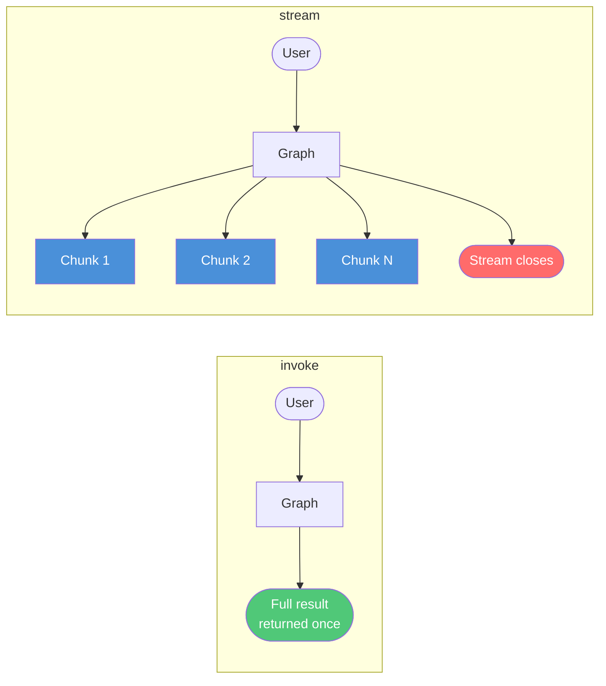
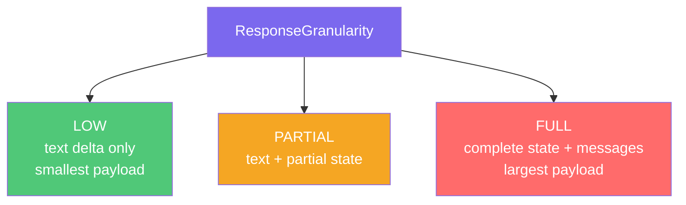
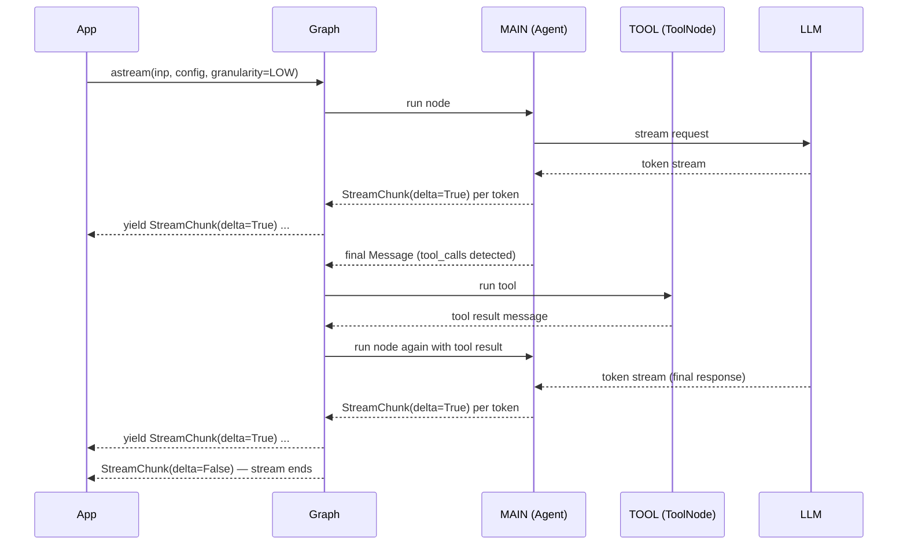

# React Streaming

**Source example:** [`agentflow/examples/react_stream/stream_react_agent.py`](https://github.com/10xHub/Agentflow/blob/main/examples/react_stream/stream_react_agent.py)

## What you will build

An async ReAct agent that calls `astream` instead of `invoke`. Each node emits `StreamChunk` messages as the LLM produces tokens. You will learn how to consume the async generator and control how much data each chunk contains using `ResponseGranularity`.

## Prerequisites

- Python 3.11 or later
- `10xscale-agentflow` installed
- Google Gemini API key set as `GEMINI_API_KEY`

## invoke vs stream — the core difference



| Method | Returns | When to use |
|---|---|---|
| `app.invoke(...)` | Complete final state | Simple request/response; no UI progress bar needed |
| `app.stream(...)` | Synchronous generator of `StreamChunk` | Real-time display in a CLI or background task |
| `app.astream(...)` | Async generator of `StreamChunk` | Async servers (FastAPI, aiohttp), modern UI backends |

## Step 1 — Define the tool

The tool returns a structured `Message` object instead of a plain string. This is the recommended pattern when you want the tool result to carry explicit role and `tool_call_id` metadata.

```python
from agentflow.core.state import AgentState, Message


def get_weather(
    location: str,
    tool_call_id: str,
    state: AgentState,
) -> Message:
    """Get weather — returns a fully formed tool Message."""
    result = f"The weather in {location} is sunny."
    return Message.tool_message(
        content=result,
        tool_call_id=tool_call_id,
    )
```

## Step 2 — Build agent and graph

```python
from agentflow.core import Agent, StateGraph, ToolNode
from agentflow.storage.checkpointer import InMemoryCheckpointer
from agentflow.utils.constants import END

checkpointer = InMemoryCheckpointer()
tool_node = ToolNode([get_weather])

main_agent = Agent(
    model="gemini-2.5-flash",
    provider="google",
    system_prompt=[
        {"role": "system", "content": "You are a helpful assistant. Use tools when needed."}
    ],
    tools=tool_node,          # pass ToolNode directly (not as string)
    trim_context=True,
)


def should_use_tools(state: AgentState) -> str:
    if not state.context:
        return "TOOL"
    last = state.context[-1]
    if hasattr(last, "tools_calls") and last.tools_calls and last.role == "assistant":
        return "TOOL"
    if last.role == "tool":
        return END
    return END


graph = StateGraph()
graph.add_node("MAIN", main_agent)
graph.add_node("TOOL", tool_node)

graph.add_conditional_edges("MAIN", should_use_tools, {"TOOL": "TOOL", END: END})
graph.add_edge("TOOL", "MAIN")
graph.set_entry_point("MAIN")

app = graph.compile(checkpointer=checkpointer)
```

## Step 3 — Stream with `astream`

```python
import asyncio
from agentflow.utils import ResponseGranularity


async def run_stream_test():
    inp = {"messages": [Message.text_message("Call get_weather for Tokyo, then reply.")]}
    config = {"thread_id": "stream-1", "recursion_limit": 10}

    stream_gen = app.astream(
        inp,
        config=config,
        response_granularity=ResponseGranularity.LOW,
    )
    async for chunk in stream_gen:
        print(chunk.model_dump(), end="\n", flush=True)


asyncio.run(run_stream_test())
```

## ResponseGranularity explained

`ResponseGranularity` controls how much information is in each `StreamChunk`:



| Value | Chunk contains | Use case |
|---|---|---|
| `ResponseGranularity.LOW` | Text delta only | Token-by-token UI streaming |
| `ResponseGranularity.PARTIAL` | Text delta + partial state snapshot | Progress tracking |
| `ResponseGranularity.FULL` | Complete state + all messages | Debugging; audit logging |

## StreamChunk structure

```python
# Each chunk yielded by astream
chunk.model_dump()
# {
#   "content": "The weather in Tokyo ...",  # partial text
#   "delta": True,                          # True = streaming, False = final
#   "node": "MAIN",                        # which node emitted this chunk
#   "metadata": {...}                       # optional metadata
# }
```

## Complete async streaming example

```python
import asyncio
import logging
from dotenv import load_dotenv

from agentflow.core import Agent, StateGraph, ToolNode
from agentflow.core.state import AgentState, Message
from agentflow.storage.checkpointer import InMemoryCheckpointer
from agentflow.utils import ResponseGranularity
from agentflow.utils.constants import END

logging.basicConfig(level=logging.INFO)
load_dotenv()

checkpointer = InMemoryCheckpointer()


def get_weather(location: str, tool_call_id: str, state: AgentState) -> Message:
    return Message.tool_message(
        content=f"The weather in {location} is sunny.",
        tool_call_id=tool_call_id,
    )


tool_node = ToolNode([get_weather])

main_agent = Agent(
    model="gemini-2.5-flash",
    provider="google",
    system_prompt=[{"role": "system", "content": "You are a helpful assistant."}],
    tools=tool_node,
    trim_context=True,
)


def should_use_tools(state: AgentState) -> str:
    if not state.context:
        return "TOOL"
    last = state.context[-1]
    if hasattr(last, "tools_calls") and last.tools_calls and last.role == "assistant":
        return "TOOL"
    if last.role == "tool":
        return END
    return END


graph = StateGraph()
graph.add_node("MAIN", main_agent)
graph.add_node("TOOL", tool_node)
graph.add_conditional_edges("MAIN", should_use_tools, {"TOOL": "TOOL", END: END})
graph.add_edge("TOOL", "MAIN")
graph.set_entry_point("MAIN")

app = graph.compile(checkpointer=checkpointer)


async def main():
    inp = {"messages": [Message.text_message("Call get_weather for Tokyo, then reply.")]}
    config = {"thread_id": "stream-1", "recursion_limit": 10}

    async for chunk in app.astream(inp, config=config, response_granularity=ResponseGranularity.LOW):
        print(chunk.model_dump())


asyncio.run(main())
```

## Streaming sequence



## Key concepts

| Concept | Details |
|---|---|
| `app.astream(...)` | Async generator returning `StreamChunk` objects as nodes execute |
| `app.stream(...)` | Synchronous version of `astream` for non-async contexts |
| `ResponseGranularity.LOW` | Minimal payload — just text deltas |
| `chunk.delta` | `True` while streaming, `False` on the final assembled chunk |
| `Message.tool_message(...)` | Create a tool-result message with explicit `tool_call_id` |

## What you learned

- The difference between `invoke`, `stream`, and `astream`.
- How to use `ResponseGranularity` to control chunk size.
- How to interpret `chunk.delta` to distinguish partial from final output.
- How to return a typed `Message` from a tool function.

## Next step

→ [Stream Sync](./stream-sync) — use the synchronous `stream` method with custom state in a non-async context.
