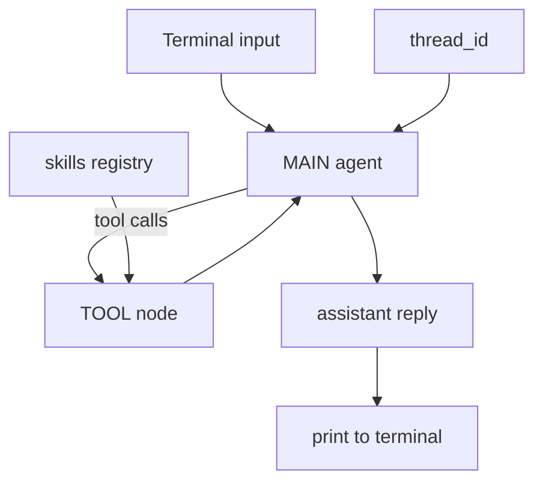
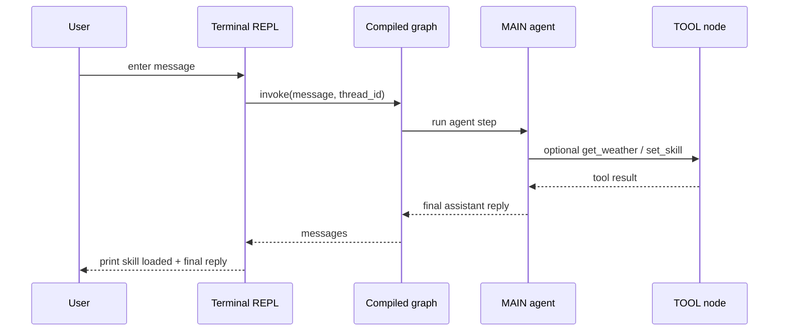
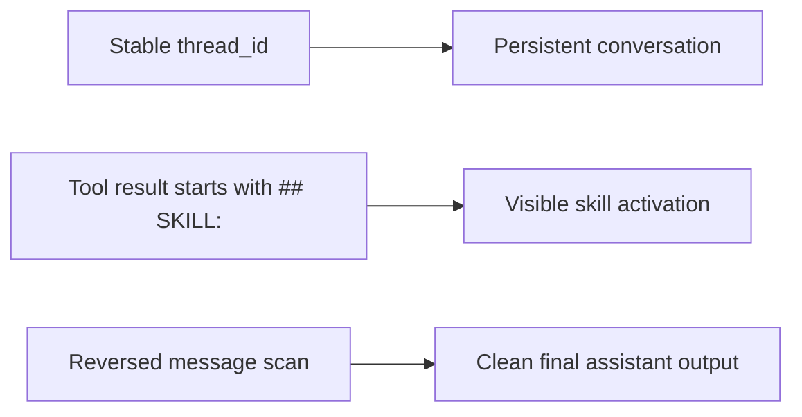

# Skills Chat

**Source example:** `agentflow/examples/skills/chat.py`

## What you will build

An interactive terminal chat that keeps a single thread alive across turns while dynamically loading skills like:

- `code-review`
- `data-analysis`
- `writing-assistant`
- `humanizer`

This tutorial builds directly on the previous skills example, but adds a real conversation loop so you can see how skills behave over time.

## Prerequisites

- everything from [Skills](/docs/tutorials/from-examples/skills)
- comfort running a Python script in a terminal

## Chat architecture



The graph structure is almost the same as the one-shot `graph.py` example. The main differences are:

- a stable `thread_id` is generated once at startup
- a `while True` loop keeps sending messages into the same compiled graph
- the script inspects tool messages so it can print which skill was loaded

## Step 1 - Configure the agent with skills and tools

The agent is created like this:

```python
agent = Agent(
    model="google/gemini-2.5-flash",
    system_prompt=[...],
    tools=[get_weather],
    skills=SkillConfig(
        skills_dir=SKILLS_DIR,
        inject_trigger_table=True,
        hot_reload=True,
    ),
    trim_context=True,
)
```

Two nice details here:

- the example passes `tools=[get_weather]` directly
- skills still inject `set_skill` automatically behind the scenes

Then it gets the merged tool node:

```python
tool_node = agent.get_tool_node()
```

## Step 2 - Use one thread across the whole session

At startup, the script creates a session-specific thread ID:

```python
thread_id = f"skills-chat-{uuid4().hex[:8]}"
```

That thread ID is reused on every invoke:

```python
result = app.invoke(
    {"messages": [Message.text_message(user_input)]},
    config={"thread_id": thread_id, "recursion_limit": 20},
)
```

Why this matters:

- the graph can keep conversation history attached to one session
- the user gets a natural chat experience instead of isolated one-shot requests
- context trimming still keeps the conversation bounded because the graph uses `MessageContextManager(max_messages=20)`

## Conversation lifecycle



## Step 3 - Print a useful banner

The example introspects the loaded skills registry and prints a mini dashboard:

```python
skills = agent._skills_registry.get_all()
```

Then it shows:

- available skill names
- a couple of trigger phrases for each skill
- the generated thread ID
- how to exit

This is a small touch, but it makes the example much easier to explore because the user immediately sees what kinds of requests should activate each skill.

## Step 4 - Detect which skill was loaded

After each invocation, the script walks through the returned messages:

```python
for msg in result["messages"]:
    if msg.role == "tool":
        text = msg.text() or ""
        if text.startswith("## SKILL:"):
            skill_line = text.split("\n")[0]
            skill_name = skill_line.replace("## SKILL:", "").strip()
            print(f"  >> Skill loaded: {skill_name}")
```

This is a practical debugging technique.

Instead of guessing whether the model used a skill, the script watches for the tool result payload returned by `set_skill`.

That gives you immediate feedback like:

```text
>> Skill loaded: code-review
```

## Step 5 - Print only the final assistant response

The result contains multiple messages, including tool messages. The REPL walks backward through the list to find the latest assistant message with text:

```python
for msg in reversed(result["messages"]):
    if msg.role == "assistant" and msg.text():
        print(f"\nAssistant: {msg.text()}\n")
        break
```

That keeps the chat output clean.

## Run the REPL

```bash
cd agentflow/examples/skills
python chat.py
```

Example prompts to try:

```text
Review this Python function and find bugs.
Analyse this data: sales=[120,95,140,88,160]
Humanize this product announcement.
Write an apology email to a client.
What's the weather in Paris?
```

## What to verify

You should see the following pattern:

1. banner with available skills
2. input prompt `You:`
3. optional `Skill loaded:` line when a skill is triggered
4. final assistant response

A weather request is a good control case. It should answer using the weather tool without loading a writing or analysis skill.

## Why this example matters

The one-shot skills example proves the feature works. This chat example shows the operational shape you would use for:

- internal terminal assistants
- rapid prompt tuning for skill files
- authoring and debugging `SKILL.md` content before wiring a full API server

## Common mistakes

- Creating a new `thread_id` on every message and then wondering why the conversation feels stateless.
- Printing every tool message directly, which makes the REPL noisy.
- Treating skills as permanent mode switches. In practice, the model decides turn by turn whether to call `set_skill`.
- Forgetting to handle `KeyboardInterrupt` and `EOFError` in terminal apps.

## Design summary



## Related docs

- [Skills Tutorial](/docs/tutorials/from-examples/skills)
- [Skills Reference](/docs/reference/python/skills)
- [Checkpointing and Threads](/docs/concepts/checkpointing-and-threads)

## What you learned

- How to reuse the skills system in a multi-turn REPL.
- How a stable `thread_id` keeps one terminal session coherent.
- How to inspect tool messages to confirm which skill was activated.

## Next step

→ Continue with [Testing](/docs/tutorials/from-examples/testing) to add fast deterministic tests around graphs like this one.
