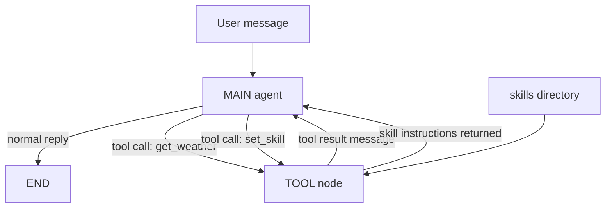
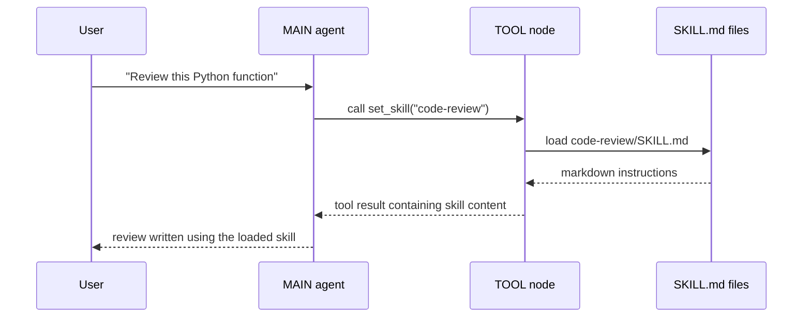
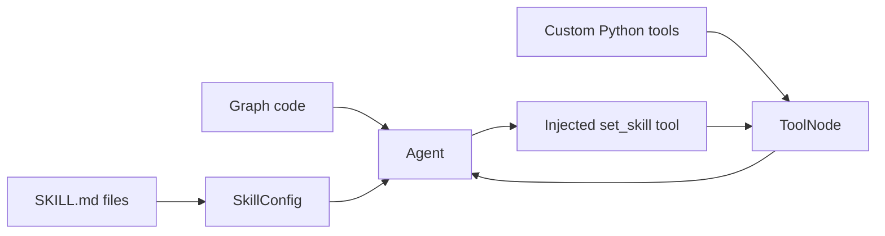

# Skills

**Source example:** `agentflow/examples/skills/graph.py`

## What you will build

A graph where one assistant can switch into specialized modes at runtime by loading `SKILL.md` files from disk.

In this tutorial the agent can:

- answer normal questions directly
- call a regular Python tool like `get_weather`
- call the auto-injected `set_skill` tool when a request matches a skill
- return to the main loop after the skill content has been loaded

## Prerequisites

- Python 3.11 or later
- `10xscale-agentflow` installed
- `python-dotenv` installed
- a model key for the provider used by the example

Install the basics:

```bash
pip install 10xscale-agentflow python-dotenv
```

## How the skills system works



The key idea is simple:

1. you keep reusable instructions in `SKILL.md` files
2. `SkillConfig` makes those skills discoverable to the agent
3. AgentFlow injects a `set_skill` tool automatically
4. when the model decides a skill fits, it calls `set_skill("skill-name")`
5. the skill content comes back as a tool result and becomes part of the next model turn

## Step 1 - Create a skills directory

The example stores skills next to the graph file:

```text
agentflow/examples/skills/
├── graph.py
├── chat.py
└── skills/
    ├── code-review/
    │   └── SKILL.md
    ├── data-analysis/
    │   └── SKILL.md
    ├── humanizer/
    │   └── SKILL.md
    └── writing-assistant/
        └── SKILL.md
```

Each skill is just a Markdown file with YAML frontmatter.

Example shape:

```markdown
---
name: code-review
description: Perform thorough code reviews
metadata:
  triggers:
    - review my code
    - find bugs
  tags:
    - engineering
  priority: 10
---

You are now in CODE REVIEW mode.
```

The frontmatter gives the runtime enough structure to:

- identify the skill
- expose it to the model
- decide which trigger phrases should activate it
- order multiple matching skills by priority

## Step 2 - Point `SkillConfig` at the directory

The example builds the path like this:

```python
from pathlib import Path
from agentflow.core.skills import SkillConfig

SKILLS_DIR = str(Path(__file__).parent / "skills")
```

Then it passes that into the agent:

```python
agent = Agent(
    model="google/gemini-2.5-flash",
    system_prompt=[...],
    tool_node=ToolNode([get_weather]),
    skills=SkillConfig(
        skills_dir=SKILLS_DIR,
        inject_trigger_table=True,
        hot_reload=True,
    ),
    trim_context=True,
)
```

What these options do:

| Field | Effect |
|---|---|
| `skills_dir` | Tells AgentFlow where to find `SKILL.md` files |
| `inject_trigger_table=True` | Adds a summary of available skills and triggers to the prompt |
| `hot_reload=True` | Re-reads skill files on each call so edits are picked up immediately |

`hot_reload=True` is especially useful while authoring skills because you can edit a file and retry without restarting the process.

## Step 3 - Combine skills with normal tools

This example is useful because it shows that skills do not replace regular tools.

The graph still exposes a standard weather function:

```python
def get_weather(location: str) -> str:
    weather_data = {
        "london": "Cloudy, 15°C",
        "new york": "Sunny, 22°C",
        "tokyo": "Rainy, 18°C",
        "paris": "Partly cloudy, 17°C",
    }
    ...
```

Then the agent is created with that tool node:

```python
tool_node = ToolNode([get_weather])
```

When skills are enabled, AgentFlow augments that tool node by injecting `set_skill` into it. The final tool node therefore contains both kinds of capability:

- hand-written Python tools
- the automatically generated `set_skill` loader

The example makes that explicit:

```python
tool_node = agent.get_tool_node()
```

That is the important call. It returns the final tool node after skill tooling has been attached.

## Step 4 - Route between the agent and tools

The tutorial uses a standard ReAct loop:

```python
def should_use_tools(state: AgentState) -> str:
    if not state.context:
        return END

    last = state.context[-1]

    if last.role == "assistant" and hasattr(last, "tools_calls") and last.tools_calls:
        return "TOOL"

    if last.role == "tool":
        return "MAIN"

    return END
```

Execution flow:



The same loop also handles regular tools. If the user asks for weather, the agent can call `get_weather` instead of `set_skill`.

## Step 5 - Understand what the model actually sees

With `inject_trigger_table=True`, the model gets a compact map of skills in the prompt. That helps it decide whether a request like:

- `review this code`
- `analyse this data`
- `humanize this text`
- `write an apology email`

should trigger a skill.

When the skill is loaded, the tool returns the full markdown instructions. That means the next assistant turn is grounded in the exact contents of the relevant `SKILL.md` file.

A useful mental model is:

- the trigger table helps the model choose
- `set_skill` delivers the full instructions
- the next assistant step applies those instructions

## Step 6 - Compile and run the graph

The example graph is a classic two-node setup:

```python
graph = StateGraph(
    context_manager=MessageContextManager(max_messages=20),
)
graph.add_node("MAIN", agent)
graph.add_node("TOOL", tool_node)

graph.add_conditional_edges(
    "MAIN",
    should_use_tools,
    {"TOOL": "TOOL", END: END},
)
graph.add_edge("TOOL", "MAIN")
graph.set_entry_point("MAIN")

app = graph.compile()
```

Run it:

```bash
cd agentflow/examples/skills
python graph.py
```

Or pass a query directly:

```bash
python graph.py "Review this Python code: def add(a,b): return a+b"
python graph.py "Help me write a professional apology email to a client"
python graph.py "Analyse this data: sales=[120,95,140,88,160] by month"
python graph.py "What's the weather in Tokyo?"
```

## What to verify

When the example starts, it prints the registered tools. You should see:

- `set_skill`
- `get_weather`

Then test these scenarios:

| Input | Expected behavior |
|---|---|
| code review request | agent loads `code-review` skill |
| writing request | agent loads `writing-assistant` skill |
| humanization request | agent loads `humanizer` skill |
| weather request | agent uses `get_weather` instead of a skill |

## Why this pattern works well

This design keeps responsibilities separate:

- graph code handles orchestration
- Python tools handle deterministic actions
- `SKILL.md` files hold specialized writing and reasoning instructions

That separation is valuable because non-engineers can often improve a skill file without touching graph wiring.

## Common mistakes

- Registering the original `ToolNode` instead of `agent.get_tool_node()`. That drops the injected `set_skill` tool.
- Putting all domain instructions in the base system prompt instead of splitting them into focused skills.
- Forgetting that skill selection is still model-driven. Good trigger phrases matter.
- Leaving `hot_reload=True` in a production environment where you want more predictable file loading behavior.

## Skills architecture recap



## Related docs

- [Skills Reference](/docs/reference/python/skills)
- [Agents and Tools](/docs/concepts/agents-and-tools)
- [Tool Decorator Tutorial](/docs/tutorials/from-examples/tool-decorator)

## What you learned

- How AgentFlow discovers `SKILL.md` files.
- How `SkillConfig` injects a `set_skill` tool into the tool node.
- How to combine skill loading with normal Python tools in one graph.

## Next step

→ Continue with [Skills Chat](/docs/tutorials/from-examples/skills-chat) to turn the same pattern into a persistent interactive REPL.
