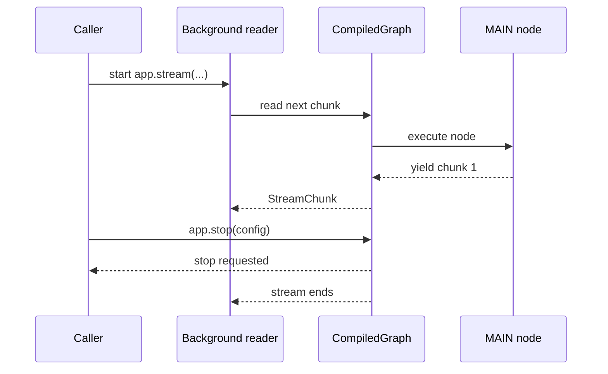

# Stop Stream

**Source example:** [`agentflow/examples/react_stream/stop_stream.py`](https://github.com/10xHub/Agentflow/blob/main/examples/react_stream/stop_stream.py)

## What you will build

A long-running streaming graph that emits output over time and a caller that stops it before the stream naturally finishes. This pattern is useful when a user clicks "Stop generating" in a UI or when an API client cancels a request.

## Prerequisites

- Python 3.11 or later
- `10xscale-agentflow` installed

## Why stream cancellation matters

Without cancellation, a long-running graph keeps producing chunks until the node finishes or the graph reaches `END`. In interactive apps, that is not always what you want. Users may:

- submit a better prompt and want to cancel the old run
- navigate away from the page
- stop a costly or obviously wrong response

`app.stop(config)` gives the caller a way to request termination for a running execution that matches the same config, especially the same `thread_id`.

## Cancellation flow



## Step 1 — Build a streaming node

This example uses an async node that yields `Message` objects over time:

```python
import asyncio

from agentflow.core.state import AgentState, Message


async def main_agent(state: AgentState, config: dict | None = None):
    for idx in range(50):
        await asyncio.sleep(1)
        yield Message.text_message(f"Chunk {idx + 1} from MAIN")
```

This simulates a long-running task. In a real system this could be:

- a streaming LLM response
- a multi-step retrieval workflow
- a report generator producing progress updates

## Step 2 — Wire the graph

The graph itself is intentionally simple. The node streams chunks and then exits.

```python
from agentflow.core.graph import StateGraph
from agentflow.storage.checkpointer import InMemoryCheckpointer
from agentflow.utils.constants import END

checkpointer = InMemoryCheckpointer()


def should_use_tools(state: AgentState) -> str:
    return END


def build_app():
    graph = StateGraph()
    graph.add_node("MAIN", main_agent)
    graph.add_conditional_edges("MAIN", should_use_tools, {END: END})
    graph.set_entry_point("MAIN")
    return graph.compile(checkpointer=checkpointer)
```

## Step 3 — Start reading the stream in the background

The example starts a background thread that iterates over `app.stream(...)`:

```python
import logging
import threading

from agentflow.core.state import Message


def run_and_stop():
    app = build_app()
    inp = {"messages": [Message.text_message("Start streaming and then stop")]}
    config = {"thread_id": "stop-demo-thread", "recursion_limit": 10, "is_stream": True}

    def reader():
        for chunk in app.stream(inp, config=config):
            logging.info("STREAM: %s", getattr(chunk, "content", chunk))

    t = threading.Thread(target=reader, daemon=True)
    t.start()
```

This is a practical pattern when your caller is synchronous but the graph is still producing an incremental stream.

## Step 4 — Request stop from the caller

After a short delay, the caller asks the compiled graph to stop the run:

```python
import time

    time.sleep(1.0)
    status = app.stop(config)
    logging.info("Requested stop: %s", status)
```

The important detail is that `stop()` receives the same config identity used by the running stream. In practice, `thread_id` is the key value you should keep stable for the lifecycle of a single run.

## Full example

```python
import asyncio
import logging
import threading
import time

from dotenv import load_dotenv

from agentflow.core.graph import StateGraph
from agentflow.core.state import AgentState, Message
from agentflow.storage.checkpointer import InMemoryCheckpointer
from agentflow.utils.constants import END

logging.basicConfig(level=logging.INFO)
load_dotenv()

checkpointer = InMemoryCheckpointer()


async def main_agent(state: AgentState, config: dict | None = None):
    for idx in range(50):
        await asyncio.sleep(1)
        yield Message.text_message(f"Chunk {idx + 1} from MAIN")


def should_use_tools(state: AgentState) -> str:
    return END


def build_app():
    graph = StateGraph()
    graph.add_node("MAIN", main_agent)
    graph.add_conditional_edges("MAIN", should_use_tools, {END: END})
    graph.set_entry_point("MAIN")
    return graph.compile(checkpointer=checkpointer)


def run_and_stop():
    app = build_app()
    inp = {"messages": [Message.text_message("Start streaming and then stop")]}
    config = {"thread_id": "stop-demo-thread", "recursion_limit": 10, "is_stream": True}

    def reader():
        for chunk in app.stream(inp, config=config):
            logging.info("STREAM: %s", getattr(chunk, "content", chunk))

    t = threading.Thread(target=reader, daemon=True)
    t.start()

    time.sleep(1.0)
    status = app.stop(config)
    logging.info("Requested stop: %s", status)

    t.join(timeout=5)


if __name__ == "__main__":
    run_and_stop()
```

## Expected behavior

When you run the example, you should see:

- one or more streamed chunks logged from the reader thread
- a log line showing that stop was requested
- the stream ending before all 50 chunks are emitted

Example output:

```text
INFO:root:STREAM: Chunk 1 from MAIN
INFO:root:Requested stop: True
```

The exact output depends on timing, so you may sometimes see two chunks before the stop completes.

## What `stop()` is and is not

```mermaid
flowchart TD
    A[app.stop(config)] --> B[Request graceful stop]
    B --> C[Running stream checks stop signal]
    C --> D[Stream exits]

    E[Tool exception or node crash] --> F[Execution error]

    style A fill:#F5A623,color:#fff
    style D fill:#50C878,color:#fff
    style F fill:#FF6B6B,color:#fff
```

`app.stop(config)` is:

- a caller-driven cancellation request
- useful for UI stop buttons and client disconnects
- part of normal control flow for streaming apps

`app.stop(config)` is not:

- the same thing as a tool failure
- a substitute for timeouts
- a replacement for node cleanup logic

## Common mistakes

- Calling `stop()` with a different `thread_id` than the active run.
- Assuming cancellation is instant. One more chunk may arrive before the stop is observed.
- Treating a stopped stream like a failed run in the UI.
- Forgetting to clean up caller-side resources after the stream ends.

## Key concepts

| Concept | Details |
|---|---|
| `app.stream(...)` | Starts a synchronous stream that yields chunks to the caller |
| `app.stop(config)` | Requests termination for the matching in-flight execution |
| `thread_id` | Stable execution identity used to route stop requests |
| background reader thread | Lets a synchronous caller consume a live stream while another thread controls it |

## What you learned

- How to build a graph that streams over time.
- How to consume the stream from a background reader.
- How to use `app.stop(config)` to cancel an active run.
- Why cancellation is a normal part of streaming UX, not an error case.

## Next step

→ Continue with the advanced example tutorials in Sprint 8, such as memory, MCP integration, and multi-agent coordination.
