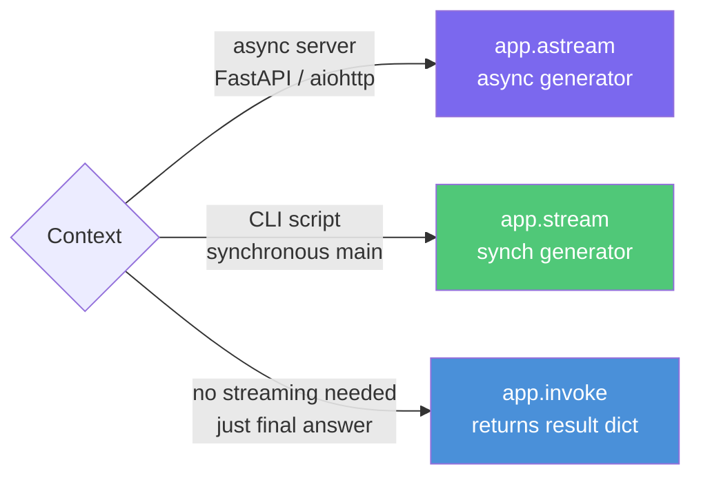
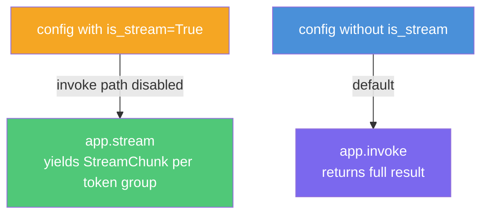

# Synchronous Streaming

**Source example:** [`agentflow/examples/react_stream/stream_sync.py`](https://github.com/10xHub/Agentflow/blob/main/examples/react_stream/stream_sync.py)

## What you will build

A ReAct agent that uses `app.stream()` — the synchronous streaming API — within a script context. You will learn how `is_stream: True` in the config activates streaming mode and how to iterate over `StreamChunk` objects without async/await.

## Prerequisites

- Python 3.11 or later
- `10xscale-agentflow` installed
- Google Gemini API key set as `GEMINI_API_KEY`

## When to use synchronous streaming



Use `app.stream()` when:
- You are writing a CLI script without an event loop.
- You want to print progress to a terminal as the agent thinks.
- You cannot use `asyncio.run(...)` because your outer code is already synchronous.

## Step 1 — Define custom state

```python
from agentflow.core.state import AgentState, Message


class CustomAgentState(AgentState):
    jd_text: str = ""
    cv_text: str = ""
```

## Step 2 — Build the graph with typed state

Pass an instance of the custom state to `StateGraph` so the runtime knows which type to use:

```python
from agentflow.core import Agent, StateGraph, ToolNode
from agentflow.storage.checkpointer import InMemoryCheckpointer
from agentflow.utils.constants import END

checkpointer = InMemoryCheckpointer()


def get_weather(
    location: str,
    tool_call_id: str | None = None,
    state: AgentState | None = None,
) -> str:
    return f"The weather in {location} is sunny"


tool_node = ToolNode([get_weather])

main_agent = Agent(
    model="gemini-2.5-flash",
    provider="google",
    system_prompt=[
        {"role": "system", "content": "You are a helpful assistant."},
        {"role": "user", "content": "Today Date is 2024-06-15"},
    ],
    tools=tool_node,
    trim_context=True,
)


def should_use_tools(state: AgentState) -> str:
    if not state.context:
        return "TOOL"
    last = state.context[-1]
    if hasattr(last, "tools_calls") and last.tools_calls and last.role == "assistant":
        return "TOOL"
    if last.role == "tool":
        return "MAIN"
    return END


# Pass CustomAgentState instance as the initial state
graph = StateGraph(CustomAgentState())
graph.add_node("MAIN", main_agent)
graph.add_node("TOOL", tool_node)
graph.add_conditional_edges("MAIN", should_use_tools, {"TOOL": "TOOL", END: END})
graph.add_edge("TOOL", "MAIN")
graph.set_entry_point("MAIN")

app = graph.compile(checkpointer=checkpointer)
```

## Step 3 — Stream synchronously

```python
inp = {"messages": [Message.text_message("HI")]}
config = {
    "thread_id": "12345",
    "recursion_limit": 10,
    "is_stream": True,          # activates streaming mode
}

res = app.stream(inp, config=config)

message_count = 0
for chunk in res:
    message_count += 1
    print(chunk.model_dump())

print(f"Total chunks received: {message_count}")
```

### `is_stream: True` — what it does

Setting `is_stream: True` in the config dict tells the graph runtime to use the streaming execution path. Without it, `app.stream()` may return a single-chunk iterator (behaving like `invoke` wrapped in a generator). With it, the graph emits one `StreamChunk` per token group.



## Example output

```text
{'content': 'The weather', 'delta': True, 'node': 'MAIN', 'metadata': {}}
{'content': ' in your location', 'delta': True, 'node': 'MAIN', 'metadata': {}}
{'content': ' is not something', 'delta': True, 'node': 'MAIN', 'metadata': {}}
...
{'content': None, 'delta': False, 'node': 'MAIN', 'metadata': {}}
Total chunks received: 12
```

The last chunk has `delta=False`, signalling the stream is complete.

## Passing custom state fields at invoke time

You can seed custom state fields via the `state` key in the input dict:

```python
inp = {
    "messages": [Message.text_message("Analyse my CV against this job description.")],
    "state": {
        "cv_text": "Alice — Senior Python Engineer, 6 years ML experience",
        "jd_text": "Seeking Senior Python Engineer with ML background",
    },
}
config = {"thread_id": "cv-analysis", "recursion_limit": 10, "is_stream": True}

for chunk in app.stream(inp, config=config):
    if chunk.delta:
        print(chunk.content, end="", flush=True)
```

## Complete source

```python
from dotenv import load_dotenv

from agentflow.core import Agent, StateGraph, ToolNode
from agentflow.core.state import AgentState, Message
from agentflow.storage.checkpointer import InMemoryCheckpointer
from agentflow.utils.constants import END

load_dotenv()
checkpointer = InMemoryCheckpointer()


class CustomAgentState(AgentState):
    jd_text: str = ""
    cv_text: str = ""


def get_weather(
    location: str,
    tool_call_id: str | None = None,
    state: AgentState | None = None,
) -> str:
    return f"The weather in {location} is sunny"


tool_node = ToolNode([get_weather])

main_agent = Agent(
    model="gemini-2.5-flash",
    provider="google",
    system_prompt=[
        {"role": "system", "content": "You are a helpful assistant."},
        {"role": "user", "content": "Today Date is 2024-06-15"},
    ],
    tools=tool_node,
    trim_context=True,
)


def should_use_tools(state: AgentState) -> str:
    if not state.context:
        return "TOOL"
    last = state.context[-1]
    if hasattr(last, "tools_calls") and last.tools_calls and last.role == "assistant":
        return "TOOL"
    if last.role == "tool":
        return "MAIN"
    return END


graph = StateGraph(CustomAgentState())
graph.add_node("MAIN", main_agent)
graph.add_node("TOOL", tool_node)
graph.add_conditional_edges("MAIN", should_use_tools, {"TOOL": "TOOL", END: END})
graph.add_edge("TOOL", "MAIN")
graph.set_entry_point("MAIN")

app = graph.compile(checkpointer=checkpointer)

inp = {"messages": [Message.text_message("HI")]}
config = {"thread_id": "12345", "recursion_limit": 10, "is_stream": True}

message_count = 0
for chunk in app.stream(inp, config=config):
    message_count += 1
    print(chunk.model_dump())

print(f"Total chunks received: {message_count}")
```

## Key concepts

| Concept | Details |
|---|---|
| `app.stream(inp, config)` | Synchronous generator; use in CLI/script contexts |
| `is_stream: True` | Config flag that activates the streaming execution path inside the graph |
| `chunk.delta` | `True` for partial chunks, `False` for the final sentinel chunk |
| `StateGraph(CustomAgentState())` | Pass a state instance to set the type and default field values |

## What you learned

- How `app.stream()` differs from `app.astream()` and when to use each.
- Why `is_stream: True` must appear in the config dict.
- How to consume streaming chunks in a simple `for` loop.
- How to combine custom state fields with synchronous streaming.

## Next step

→ [Stop Stream](./stop-stream) — learn how to gracefully cancel a running stream mid-execution using `app.stop()`.
