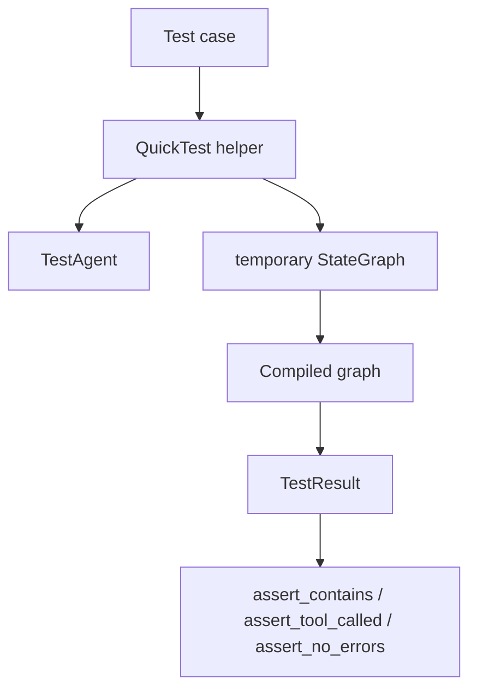
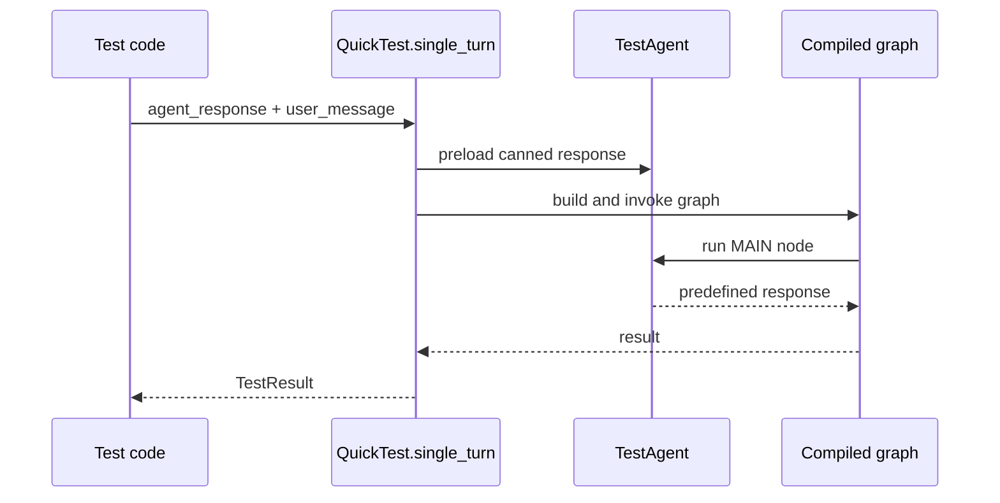
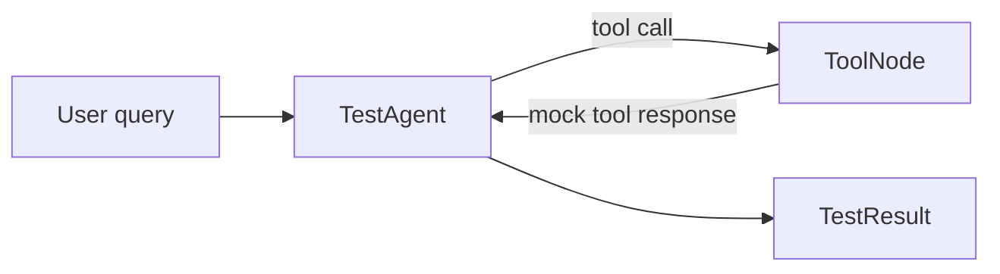
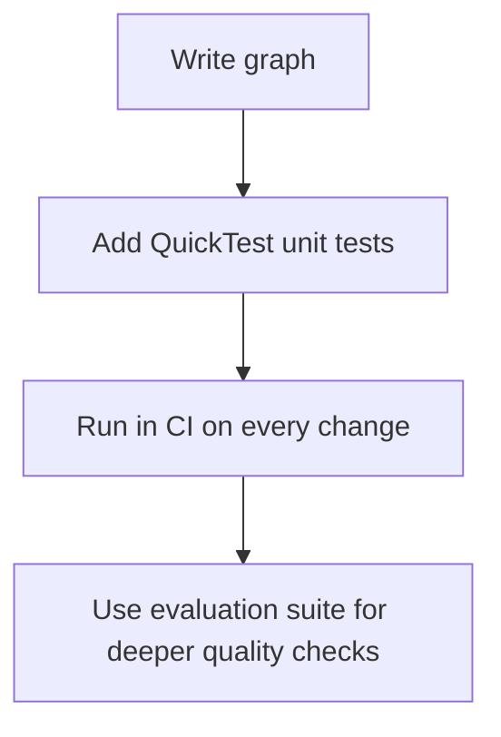

# Testing

**Source example:** `agentflow/examples/testing/quick_test_example.py`

## What you will build

A testing workflow that lets you validate graph behavior without calling a real LLM.

The example focuses on `QuickTest`, which gives you short, readable tests for:

- single-turn responses
- multi-turn conversations
- tool-calling flows
- chained assertions

## Why this matters

Unit tests should be:

- fast
- deterministic
- cheap to run in CI
- easy to read when they fail

That is exactly the problem `QuickTest` is solving.

## Testing model



Instead of talking to a live model, `QuickTest` builds a graph around `TestAgent`, which returns predefined responses.

## Step 1 - Test a single-turn interaction

The smallest example is:

```python
result = await QuickTest.single_turn(
    agent_response="Hello! How can I help you today?",
    user_message="Hi there",
)

result.assert_contains("Hello")
result.assert_contains("help")
result.assert_no_errors()
```

What happens under the hood:

1. `QuickTest.single_turn()` creates a `TestAgent`
2. it builds a one-node graph: `MAIN -> END`
3. it invokes the graph with your user message
4. it returns a `TestResult`

This means you can test downstream formatting or routing assumptions without paying for a model call.

## Single-turn flow



## Step 2 - Test a multi-turn conversation

The example then moves to multi-turn testing:

```python
result = await QuickTest.multi_turn(
    [
        ("Hello", "Hi! How can I help you?"),
        ("What's the weather?", "I'll check the weather for you."),
        ("Thank you", "You're welcome!"),
    ]
)

result.assert_contains("welcome")
result.assert_message_count(6)
```

This helper re-invokes the graph across multiple turns while accumulating conversation state.

That makes it useful when you want to verify:

- follow-up behavior
- conversational continuity
- response shape after several turns

The message count of `6` is a nice sanity check here because the conversation contains:

- 3 user messages
- 3 assistant messages

## Step 3 - Test tool usage without real tool integrations

Tool-calling tests are where `QuickTest.with_tools()` becomes really helpful.

Example:

```python
result = await QuickTest.with_tools(
    query="What's the weather in New York?",
    response="The weather in New York is sunny, 72°F",
    tools=["get_weather"],
    tool_responses={"get_weather": "Sunny, 72°F"},
)

result.assert_contains("sunny")
result.assert_tool_called("get_weather")
```

The helper builds a small ReAct-like graph:

- `MAIN` is a `TestAgent`
- `TOOL` is a generated `ToolNode`
- the graph loops back from `TOOL` to `MAIN`

That lets you validate that a tool name was called, and optionally that the call carried the right arguments.

## Tool test flow



This is ideal for CI because it exercises your graph structure without introducing flaky network dependencies.

## Step 4 - Use assertion chaining for readable tests

The example shows chained assertions:

```python
(
    result.assert_contains("Python")
    .assert_contains("programming")
    .assert_not_contains("Java")
    .assert_no_errors()
)
```

This style has two benefits:

- tests stay compact
- the intent stays readable even when you check several properties

## Step 5 - Structure tests for CI

A practical way to use this example in CI is:

1. keep `QuickTest` for fast unit-style validation
2. reserve live model tests for a much smaller smoke-test suite
3. run deterministic tests on every pull request
4. run slower end-to-end tests on a schedule or in a gated pipeline

Recommended split:

| Test type | Best tool |
|---|---|
| graph wiring and simple behavior | `QuickTest` |
| tool call assertions | `QuickTest.with_tools` |
| live response quality scoring | evaluation framework |
| manual exploration | example scripts or playground |

## Turn the example into a real test file

A minimal pytest version looks like this:

```python
import pytest
from agentflow.qa.testing import QuickTest


@pytest.mark.asyncio
async def test_greeting_response():
    result = await QuickTest.single_turn(
        agent_response="Hello! How can I help you today?",
        user_message="Hi there",
    )

    result.assert_contains("Hello").assert_no_errors()
```

## Run the example script

```bash
python agentflow/examples/testing/quick_test_example.py
```

You should see four sections:

- single turn
- multi-turn
- tools
- assertions

Each section prints a success line when its checks pass.

## What to verify

When you run the script, confirm that:

- all examples complete successfully
- the tool example reports a tool call to `get_weather`
- the multi-turn example ends with a six-message transcript
- no example depends on an external API key

## Common mistakes

- Using `QuickTest` for questions that actually require a live model's reasoning quality.
- Forgetting that canned responses only prove your graph and assertions, not model intelligence.
- Mixing deterministic test helpers with non-deterministic external services in the same CI step.
- Writing assertions that are so loose they can pass even when the behavior regresses.

## Testing workflow summary



## Related docs

- [Testing Reference](/docs/reference/python/testing)
- [Evaluation Reference](/docs/reference/python/evaluation)
- [ReAct Agent Tutorial](/docs/tutorials/from-examples/react-agent)

## What you learned

- How `QuickTest` removes most graph testing boilerplate.
- How to test single-turn, multi-turn, and tool-based flows deterministically.
- How to position `QuickTest` as a CI-friendly unit testing layer.

## Next step

→ Continue with [Evaluation](/docs/tutorials/from-examples/evaluation) when you need scored quality checks rather than deterministic unit tests.
