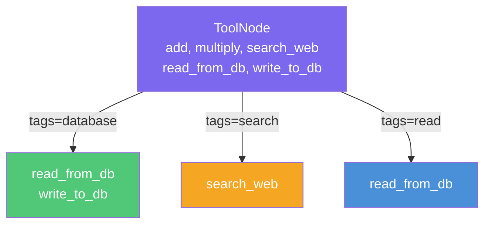

# Tool Decorator

**Source example:** [`agentflow/examples/tool-decorator/basic_decorator_usage.py`](https://github.com/10xHub/Agentflow/blob/main/examples/tool-decorator/basic_decorator_usage.py)

## What you will build

A collection of decorated tools that demonstrate every feature of the `@tool` decorator: basic usage, full metadata, tag-based filtering, metadata inspection, injectable parameters, and async tools.

## Prerequisites

- Python 3.11 or later
- `10xscale-agentflow` installed (`pip install 10xscale-agentflow`)

## Why use `@tool`?

Without the decorator, a function registered in a `ToolNode` exposes only its name, docstring, and parameter types to the LLM. The `@tool` decorator lets you attach rich metadata — descriptions, tags, provider hints, capabilities, and arbitrary key-value metadata — that your application code can query at runtime for filtering, routing, or auditing.

```mermaid
flowchart LR
    A[Python function] -->|@tool decorator| B[Decorated function]
    B -->|ToolNode| C[LLM tool schema]
    B -->|get_tool_metadata| D[Runtime metadata]

    style A fill:#4A90D9,color:#fff
    style B fill:#7B68EE,color:#fff
    style C fill:#50C878,color:#fff
    style D fill:#F5A623,color:#fff
```

## Imports

```python
from agentflow.utils import (
    tool,
    get_tool_metadata,
    has_tool_decorator,
    END,
    START,
)
from agentflow.core.graph.tool_node import ToolNode
from agentflow.core.state import AgentState
```

## Example 1 — Basic tool with explicit name

```python
@tool(name="add_numbers")
def add(a: int, b: int) -> int:
    """Add two numbers together."""
    return a + b
```

The `name` parameter overrides the Python function name in the LLM schema. Everything else (description, parameter types) is derived from the docstring and annotations.

## Example 2 — Decorator with no arguments (uses function name)

```python
@tool
def multiply(x: int, y: int) -> int:
    """Multiply two numbers together."""
    return x * y
```

When no arguments are provided, `@tool` uses the function name (`multiply`) and docstring as-is.

## Example 3 — Full metadata

```python
@tool(
    name="web_search",
    description="Search the web for information using a search engine",
    tags=["search", "web", "external"],
    provider="custom",
    capabilities=["network_access"],
    metadata={"rate_limit": 100, "timeout": 30},
)
def search_web(query: str, max_results: int = 10) -> list[str]:
    """Simulate a web search."""
    return [f"Result {i + 1} for '{query}'" for i in range(max_results)]
```

### Metadata fields

| Field | Type | Description |
|---|---|---|
| `name` | `str` | Name exposed to the LLM in the tool schema |
| `description` | `str` | Description shown to the LLM (defaults to docstring) |
| `tags` | `list[str]` | Arbitrary labels for filtering at runtime |
| `provider` | `str` | Hint about which system provides this tool |
| `capabilities` | `list[str]` | Capability strings (e.g. `"network_access"`, `"database_write"`) |
| `metadata` | `dict` | Arbitrary key-value data for application use |

## Example 4 — Async tool

```python
import asyncio

@tool(
    name="fetch_data",
    description="Asynchronously fetch data from a remote API",
    tags=["async", "api", "fetch"],
)
async def fetch_data_async(endpoint: str, timeout: int = 5) -> dict:
    """Fetch data asynchronously from an API endpoint."""
    await asyncio.sleep(0.1)  # simulated I/O
    return {"endpoint": endpoint, "data": "sample data"}
```

`ToolNode` handles async functions automatically. You do not need to change any other part of your graph.

## Example 5 — Injectable parameters

Parameters annotated with AgentFlow types (like `AgentState`) are **injected automatically** by the framework and do **not** appear in the LLM schema. This lets tools access conversation state without the LLM needing to pass it.

```python
@tool(
    name="stateful_calculator",
    description="Calculator that can access agent state",
    tags=["calculator", "stateful"],
)
def stateful_add(a: int, b: int, state: AgentState | None = None) -> int:
    """The 'state' parameter is injected — it won't appear in the LLM's tool schema."""
    result = a + b
    if state:
        # Access conversation history, custom fields, etc.
        pass
    return result
```

Other injectable parameters include `tool_call_id: str` (the call ID from the LLM).

## Registering tools with ToolNode

```python
tool_node = ToolNode([add, multiply, search_web, fetch_data_async, stateful_add])
tools = tool_node.get_local_tool()  # returns list of tool schema dicts

for schema in tools:
    fn = schema["function"]
    print(fn["name"], "-", fn["description"])
```

## Tag-based filtering

At runtime you can request only tools that match a set of tags:

```python
# Only database tools
db_tools = tool_node.get_local_tool(tags={"database"})

# Only read-safe tools
read_tools = tool_node.get_local_tool(tags={"read"})

# Only tools that need network access
network_tools = tool_node.get_local_tool(tags={"external"})
```



## Inspecting metadata at runtime

```python
from agentflow.utils import has_tool_decorator, get_tool_metadata

# Check if a function was decorated
print(has_tool_decorator(add))          # True
print(has_tool_decorator(lambda x: x)) # False

# Read full metadata
meta = get_tool_metadata(search_web)
print(meta["name"])          # "web_search"
print(meta["tags"])          # ["search", "web", "external"]
print(meta["capabilities"])  # ["network_access"]
print(meta["metadata"])      # {"rate_limit": 100, "timeout": 30}
```

## Complete source

```python
import asyncio
from agentflow.core.graph.tool_node import ToolNode
from agentflow.core.state import AgentState
from agentflow.utils import END, START, get_tool_metadata, has_tool_decorator, tool


@tool(name="add_numbers")
def add(a: int, b: int) -> int:
    """Add two numbers together."""
    return a + b


@tool
def multiply(x: int, y: int) -> int:
    """Multiply two numbers."""
    return x * y


@tool(
    name="web_search",
    description="Search the web for information",
    tags=["search", "web", "external"],
    metadata={"rate_limit": 100},
)
def search_web(query: str, max_results: int = 10) -> list[str]:
    return [f"Result {i + 1} for '{query}'" for i in range(max_results)]


@tool(name="fetch_data", tags=["async", "api"])
async def fetch_data_async(endpoint: str) -> dict:
    await asyncio.sleep(0.1)
    return {"endpoint": endpoint}


@tool(name="database_read", tags=["database", "read"])
def read_from_db(table: str, record_id: int) -> dict:
    return {"table": table, "id": record_id}


@tool(name="database_write", tags=["database", "write"])
def write_to_db(table: str, data: dict) -> bool:
    return True


if __name__ == "__main__":
    tool_node = ToolNode([add, multiply, search_web, read_from_db, write_to_db])

    # All tools
    print("All tools:", [t["function"]["name"] for t in tool_node.get_local_tool()])

    # Filtered by tag
    print("Database tools:", [t["function"]["name"] for t in tool_node.get_local_tool(tags={"database"})])

    # Metadata inspection
    print("search_web tags:", get_tool_metadata(search_web)["tags"])
```

## Key concepts

| Concept | Details |
|---|---|
| `@tool` | Decorator that attaches metadata to a Python function for use in `ToolNode` |
| `tags` | Arbitrary string labels; filter with `get_local_tool(tags={...})` |
| Injectable params | `AgentState`, `tool_call_id` — supplied by the runtime, hidden from LLM schema |
| `has_tool_decorator` | Returns `True` if a function was wrapped with `@tool` |
| `get_tool_metadata` | Returns the full metadata dict from a decorated function |

## What you learned

- How to use `@tool` with no arguments, with just a name, and with full metadata.
- How to add async tools transparently.
- How to use injectable parameters to give tools access to conversation state.
- How to filter tools by tag at runtime.
- How to introspect tool metadata programmatically.

## Next step

→ [ReAct Agent](./react-agent) — build a full ReAct loop with a checkpointer for persistent conversation history.
