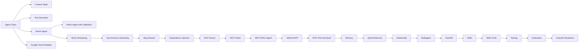

# Tutorials

AgentFlow tutorials are the bridge between the quickstart pages and the reference docs. They take real example code from the repository and turn it into guided, runnable walkthroughs.

## Tutorial track

## From examples

These tutorials are based on code in `agentflow/examples/`:

- [Agent Class Pattern](/docs/tutorials/from-examples/agent-class)
- [Custom State](/docs/tutorials/from-examples/custom-state)
- [Google GenAI Adapter](/docs/tutorials/from-examples/google-genai)
- [Tool Decorator](/docs/tutorials/from-examples/tool-decorator)
- [ReAct Agent](/docs/tutorials/from-examples/react-agent)
- [ReAct Agent with Validation](/docs/tutorials/from-examples/react-agent-validation)
- [React Streaming](/docs/tutorials/from-examples/react-streaming)
- [Synchronous Streaming](/docs/tutorials/from-examples/stream-sync)
- [Stop Stream](/docs/tutorials/from-examples/stop-stream)

## Advanced integrations

- [Dependency Injection](/docs/tutorials/from-examples/dependency-injection)
- [MCP Server](/docs/tutorials/from-examples/mcp-server)
- [MCP Client](/docs/tutorials/from-examples/mcp-client)
- [MCP ReAct Agent](/docs/tutorials/from-examples/mcp-react-agent)
- [GitHub MCP](/docs/tutorials/from-examples/github-mcp)
- [MCP File Download](/docs/tutorials/from-examples/mcp-file-download)
- [Memory](/docs/tutorials/from-examples/memory)
- [Qdrant Memory](/docs/tutorials/from-examples/qdrant-memory)
- [Multimodal](/docs/tutorials/from-examples/multimodal)
- [Multiagent](/docs/tutorials/from-examples/multiagent)
- [Handoff](/docs/tutorials/from-examples/handoff)
- [Skills](/docs/tutorials/from-examples/skills)
- [Skills Chat](/docs/tutorials/from-examples/skills-chat)
- [Testing](/docs/tutorials/from-examples/testing)
- [Evaluation](/docs/tutorials/from-examples/evaluation)
- [Graceful Shutdown](/docs/tutorials/from-examples/graceful-shutdown)

## How to use this section

If you are new to AgentFlow, follow the pages in the order shown above. The tutorials are designed to build on each other:

- Start with `Agent Class Pattern` to learn the smallest useful graph.
- Move to `Custom State` and `Tool Decorator` to understand how state and tools are modeled.
- Use `ReAct Agent` to assemble the core graph loop.
- Add `ReAct Agent with Validation` for safer input handling.
- Finish with the streaming tutorials to learn real-time output and cancellation patterns.
- Continue into the advanced section for MCP, memory, multimodal input, and multi-agent coordination.
- Finish with the sprint 9 tutorials to learn skills, testing, evaluation, and clean shutdown behavior.

## Before you start

Most tutorials assume:

- Python 3.11 or later
- `10xscale-agentflow` installed
- Environment variables loaded from `.env`
- A provider key such as `GEMINI_API_KEY` for Google-based examples

## Related docs

- [First Python Agent](/docs/get-started/first-python-agent)
- [State Graph](/docs/concepts/state-graph)
- [Agents and Tools](/docs/concepts/agents-and-tools)
- [Streaming](/docs/concepts/streaming)
