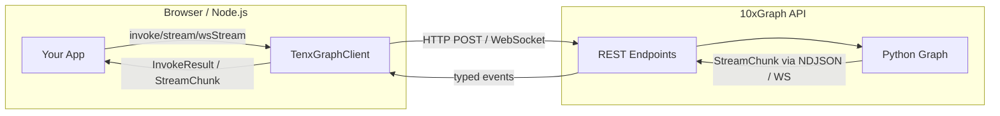

The `10xgraph-client` TypeScript SDK is a typed wrapper that connects browser and Node.js apps to a running 10xGraph API. It handles session threading, multiple transport modes, auth headers, file uploads, memory access, and client-side tool execution.

## What you need

Install Node 18 or later and the client package:

```bash
npm install 10xgraph-client
```

For WebSocket support on Node 18-20, also install the `ws` package and pass it to the client config:

```bash
npm install ws
```

```typescript
import { TenxGraphClient } from '10xgraph-client';
import WebSocket from 'ws';

const client = new TenxGraphClient({
  baseUrl: 'http://localhost:8000',
  webSocketImpl: WebSocket,  // required on Node < 21
  authToken: 'your-token',
});
```

## How it works

Your app calls the client with messages and config. The client connects to the 10xGraph API over your chosen transport, runs the graph, and returns the result. The server restores the thread's history from the checkpointer.



## Transport modes

Choose the transport that fits your application's latency, concurrency, and environment:

| Method | Protocol | Granularity | Latency | Bidirectional | Best for |
|---|---|---|---|---|---|
| `invoke()` | HTTP POST | Full response | Highest | No | One-off requests, simple chat |
| `stream()` | HTTP NDJSON body | Token-by-token | Medium | No | Progressive display, token streaming UI |
| `wsStream()` | WebSocket | Token-by-token | Low | Yes | Chat apps, real-time collaboration |
| `realtime()` | WebSocket (binary) | Audio frames | Lowest | Yes | Voice-to-voice conversations |

All modes restore your conversation history from the thread automatically, so you never repeat context.

## Core concepts

**Threads**: Pass a `thread_id` to maintain a conversation across multiple API calls. The checkpointer on the server persists the full agent state, so each new request picks up where the last one stopped.

**Remote tools**: Tool schemas live on the server (in `10xgraph.json`), but implementation runs in your client. This lets you call browser APIs (clipboard, geolocation), keep secrets local, or run integrations the server cannot access.

**Response granularity**: `response_granularity` controls how much comes back. `'low'` returns only the latest messages, `'partial'` adds context and summary, and `'full'` adds the graph state.

## Pages in this section

### Basics

- [Create and configure a client](/docs/client/create-client): Set auth tokens, timeout, proxy headers, and environment-specific URLs
- [Invoke and get results](/docs/client/invoke-agent): Call the agent and await the final response
- [Stream responses](/docs/client/stream-responses): Consume token-by-token or message-by-message as they arrive
- [Manage threads](/docs/client/manage-threads): List threads, fetch history, update state, delete old conversations

### Features

- [Run client-side tools](/docs/client/remote-tools): Register handlers for tools, auto-execute them during stream
- [Send files and media](/docs/client/files-and-multimodal): Upload images, audio, documents; send them in messages
- [Use the memory API](/docs/client/use-memory-api): Store and search long-term memory (semantic, metadata, facts)
- [Graph utilities](/docs/client/graph-utilities): Inspect schemas, stop runs, fix state, observe execution metadata
- [Realtime audio](/docs/client/realtime-audio): Voice-to-voice audio over the `/v1/graph/live` WebSocket bridge
- [Handle errors](/docs/client/error-handling): Catch and retry transient failures, parse error details

### Frameworks

- [Next.js and React](/docs/client/nextjs-and-react): Route handler proxy (keep tokens server-side), streaming React components, abort patterns
