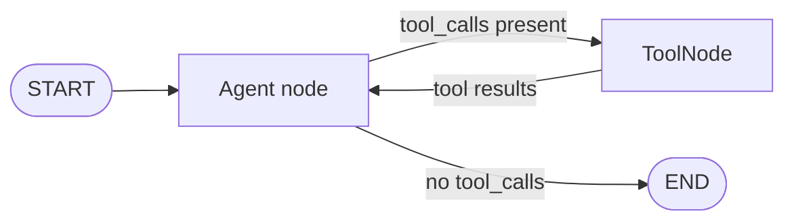

`Agent` and `ToolNode` are the two built-in node types that handle language model interaction. `Agent` sends the current state to a language model and appends its response. `ToolNode` executes the tool calls the model requested and runs them in parallel. Together they form the core of tool-using agents.

## Why Agent exists

You can wrap an LLM call in a plain graph node function, but `Agent` exists to handle the machinery that all language model nodes need: message formatting, provider detection, retry logic with backoff, fallback models when retries are exhausted, response parsing, system prompt templating with state interpolation, streaming, tool integration, skills, memory, multimodal content, and reasoning modes.

Writing all of that by hand for each node is error-prone and verbose. An `Agent` node does it for you. Use `Agent` whenever a node needs to call an LLM. Use a plain function node only when you need custom logic that `Agent` does not support (custom model logic, external API calls, data processing, or routing decisions).

---

## Agent

`Agent` is a graph node that wraps any LLM provider. When the graph reaches an `Agent` node it sends the current conversation to the model and appends the response to state.

### Constructor

```python
from tenxgraph.core.graph import Agent

agent = Agent(
    # --- Required ---
    model="gemini-2.5-flash",        # Any model name; no parsing needed
    provider="google",               # "openai" | "google" | "anthropic"; auto-detected if omitted

    # --- Output type ---
    output_type="text",              # "text" | "image" | "video" | "audio"

    # --- System prompt ---
    system_prompt=[
        {"role": "system", "content": "You are a helpful assistant."},
        {"role": "user",   "content": "Today is {date}."},  # state interpolation
    ],

    # --- Tool integration ---
    tool_node=tool_node,             # ToolNode instance, or str name of a graph node

    # --- Context management ---
    trim_context=True,               # trim old messages to stay within token limits

    # --- Reasoning ---
    reasoning_config={"effort": "medium"},  # see Reasoning section below

    # --- Retry & fallback ---
    retry_config=True,               # True = default RetryConfig(3 retries, 1s delay)
    fallback_models=["gpt-4o-mini"], # fallback when all retries exhausted

    # --- Multimodal ---
    multimodal_config=MultimodalConfig(...),

    # --- Long-term memory ---
    memory=MemoryConfig(...),

    # --- Skills ---
    skills=SkillConfig(...),

    # --- Extra provider kwargs ---
    temperature=0.7,
    max_tokens=2048,
    base_url="http://localhost:11434",  # for Ollama / openrouter / vllm
)
```

### System prompt interpolation

The system prompt supports `{field_name}` placeholders. Fields are resolved against the current `AgentState` at runtime:

```python
class MyState(AgentState):
    user_name: str = "Guest"
    occasion: str = "casual"

agent = Agent(
    model="gpt-4o",
    system_prompt=[
        {"role": "system", "content": "You are helping {user_name} with {occasion} planning."}
    ],
)
# At runtime the placeholder is replaced with state.user_name, state.occasion
```

### Skills

A skill is a folder with a `SKILL.md` (instructions plus a short description) and optional bundled files such as scripts and reference docs. Skills follow the [Agent Skills specification](https://agentskills.io/specification). With `skills=SkillConfig(skills_dir=...)`:

- The agent lists each skill's name and description in the system prompt.
- The model calls `activate_skill` to load a skill's instructions only when a task matches the description.
- The model calls `read_skill_resource` to read a bundled file when the instructions point to one.

Unused skills cost only their one-line description. See [How to give an agent skills](/docs/guides/use-skills).

### Retry and fallback

```python
from tenxgraph.core.graph.agent_internal.constants import RetryConfig

agent = Agent(
    model="gemini-2.5-flash",
    # Custom retry: 5 attempts, 2 s initial delay, 2x backoff, 60 s max
    retry_config=RetryConfig(
        max_retries=5,
        initial_delay=2.0,
        backoff_factor=2.0,
        max_delay=60.0,
        retryable_status_codes=frozenset({429, 500, 502, 503, 529}),
    ),
    # Cross-provider fallback after all retries are exhausted
    fallback_models=[
        "gpt-4o-mini",                          # inherits agent's provider
        ("gemini-2.0-flash", "google"),         # explicit (model, provider) tuple
    ],
)
```

### Reasoning config

```python
# OFF
reasoning_config=None

# On, medium effort (default for Google: thinking_budget=8192)
reasoning_config={"effort": "medium"}

# High effort, Google
reasoning_config={"effort": "high"}          # translates to thinking_budget=24576

# Google exact budget
reasoning_config={"thinking_budget": 5000}

# OpenAI with summary
reasoning_config={"effort": "low", "summary": "auto"}
```

Default is `{"effort": "medium"}`, so thinking is **on by default** for Google models.

---

## ToolNode

`ToolNode` is a unified registry and executor for callable functions. It supports local Python functions and MCP tools.

### Basic usage

```python
from tenxgraph.core.graph import ToolNode

def lookup_order(order_id: str) -> str:
    """Look up the status of a customer order."""
    return f"Order {order_id}: shipped"

def refund_order(order_id: str, amount: float) -> str:
    """Refund an order for the given amount."""
    return f"Refunded {amount:.2f} for order {order_id}"

tool_node = ToolNode([lookup_order, refund_order])
```

The function's **docstring** becomes the tool description shown to the model. **Type annotations** define the parameter schema. Both are required for good model behavior.

### Parallel tool dispatch

When the model requests multiple tool calls, `ToolNode` executes them in parallel using `asyncio.gather`. This is faster than running them sequentially: if the model calls three tools that each take 2 seconds, parallel execution takes 2 seconds; sequential would take 6 seconds. All tool results are collected and appended to state together, so the next node in the graph sees them all at once.

To opt out of parallelism and execute tools sequentially, you can iterate over tool calls and invoke them one at a time in your own node. In practice, parallelism is the right default.

### Adding tools after creation

```python
tool_node = ToolNode([lookup_order])

def search_db(query: str) -> str:
    """Search the internal database."""
    ...

tool_node.add_tool(search_db)
```

### Injectable parameters

Tool functions can declare special parameters that `ToolNode` injects automatically. These are invisible to the model and do not appear in the tool schema:

| Parameter | Type | What is injected |
|---|---|---|
| `state` | `AgentState \| None` | Current graph state |
| `tool_call_id` | `str \| None` | ID of this specific tool call |
| `config` | `dict` | Current execution config (includes `thread_id`, `user_id`, etc.) |
| `emit` | stream emitter | Emit custom stream chunks |
| `generated_id` | `str` | A newly generated ID from the graph's ID generator |
| `context_manager` | context manager | The configured message context manager |
| `publisher` | `BasePublisher` | The graph's event publisher |
| `checkpointer` | `BaseCheckpointer` | The configured checkpointer |
| `store` | `BaseStore` | The configured memory store |
| `task_manager` | `BackgroundTaskManager` | Fire-and-forget task manager |

The full set is `INJECTABLE_PARAMS` in `tenxgraph/core/graph/tool_node/constants.py`. Services can also be injected with `Inject[...]` defaults; see [Dependency injection](/docs/concepts/dependency-injection).

```python
from tenxgraph.core.state import AgentState

def lookup_order(
    order_id: str,                        # from model tool call
    state: AgentState | None = None,       # injected, invisible to model
    tool_call_id: str | None = None,       # injected, invisible to model
    config: dict | None = None,            # injected, invisible to model
) -> str:
    """Look up the status of a customer order."""
    user = config.get("user_id", "anon") if config else "anon"
    return f"Order {order_id}: shipped (requested by {user})"
```

### Returning state updates from a tool

Use `ToolResult` when a tool needs to update state fields **and** return a message to the model:

```python
from tenxgraph.core.state.tool_result import ToolResult

class MyState(AgentState):
    selected_city: str = ""

def select_city(city: str) -> ToolResult:
    """Set the currently selected city."""
    return ToolResult(
        message=f"City set to '{city}'.",
        state={"selected_city": city},  # updates state.selected_city
    )
```

### MCP tools

10xGraph supports the Model Context Protocol (MCP), allowing you to expose both local Python functions and MCP server tools through the same `ToolNode`. Install with `pip install "10xgraph[mcp]"`, create an MCP client (using fastmcp or another MCP SDK), and pass it to `ToolNode(client=...)`. The same parallel execution, error handling, and injectable parameters apply to MCP tools. Set `pass_user_info_to_mcp=True` to forward the caller's `user_id` and other config to the MCP server so it can scope resource access. For details, see [Using MCP](/docs/guides/use-mcp).

---

## Tool errors

When a tool raises an exception, `ToolNode` catches it and returns the error as a `ToolResultBlock` with `is_error=True` and status `"failed"`. The error message is forwarded to the model so it can retry with different arguments or report the failure to the user.

This is the right default: a tool failure is not a graph failure. The model sees the error and decides what to do next. For details on exception taxonomy and handling, see [Errors and limits](/docs/concepts/errors-and-limits).

Tool errors are also published as events, so you can monitor and alert on them. Tool functions can also return a `ToolResult` with `is_error=True` to signal a business error (e.g., "insufficient permissions") rather than an exception.

---

## The `@tool` decorator

Use `@tool` to attach metadata to any function. Metadata does not change injection behavior. It enriches the schema the model receives:

```python
from tenxgraph.utils import tool

@tool(
    name="web_search",
    description="Search the web for up-to-date information on any topic.",
    tags=["search", "web"],
    provider="custom",
    capabilities=["network_access"],
    metadata={"rate_limit": 100, "timeout": 30},
)
async def search_web(query: str, max_results: int = 5) -> list[str]:
    """Search the web."""
    ...
```

The decorator stores metadata as private attributes (`_py_tool_name`, `_py_tool_description`, `_py_tool_tags`, …) which `ToolNode` reads when building the schema.

You can also use it without arguments (function name and docstring as defaults):

```python
@tool
def multiply(x: int, y: int) -> int:
    """Multiply two numbers."""
    return x * y
```

---

## The ReAct loop pattern

The standard routing pattern for tool-using agents is a loop between `Agent` and `ToolNode`. The routing function inspects the last message to decide where to go next:

```python
from tenxgraph.core.state import AgentState
from tenxgraph.utils import END

def route(state: AgentState) -> str:
    if not state.context:
        return END
    last = state.context[-1]
    # Model wants to call a tool
    if hasattr(last, "tools_calls") and last.tools_calls and last.role == "assistant":
        return "TOOL"
    # Tool result came back, so go back to agent for final answer
    if last.role == "tool":
        return "MAIN"
    return END
```

```python
from tenxgraph.core.graph import StateGraph, Agent, ToolNode
from tenxgraph.utils import END

tool_node = ToolNode([lookup_order, refund_order])
agent = Agent(model="gemini-2.5-flash", provider="google", tool_node=tool_node)

graph = StateGraph()
graph.add_node("MAIN", agent)
graph.add_node("TOOL", tool_node)
graph.add_conditional_edges("MAIN", route, {"TOOL": "TOOL", END: END})
graph.add_edge("TOOL", "MAIN")
graph.set_entry_point("MAIN")

app = graph.compile()
```



---

## Passing tool_node by name

Instead of passing the `ToolNode` instance directly to `Agent`, you can pass a string that names an existing graph node. The agent resolves it at runtime via the DI container:

```python
agent = Agent(
    model="gemini-2.5-flash",
    tool_node="TOOL",          # resolved from the graph node named "TOOL"
)

graph.add_node("MAIN", agent)
graph.add_node("TOOL", tool_node)
```

This is useful when you want to share one `ToolNode` across multiple agents.

---

## Execution methods compared

| Method | Returns | Use when |
|---|---|---|
| `compiled.invoke(input, config)` | Result dict with `messages` (more keys via `response_granularity`) | You only need the end result |
| `compiled.stream(input, config)` | Sync generator of `StreamChunk` | Sync context, real-time display |
| `compiled.astream(input, config)` | Async generator of `StreamChunk` | Async context (FastAPI, WebSocket) |
| `compiled.ainvoke(input, config)` | Awaitable result dict, same as `invoke` | Async context, no streaming needed |

Use `ainvoke` and `astream` inside an async context. `invoke` and `stream` are sync wrappers. See [Streaming](/docs/concepts/streaming) for chunk fields and events.

For prebuilt agents, callbacks, `Command`, validators and background tasks, see [Callbacks and Command](/docs/concepts/callbacks-and-command), [Choosing a building block](/docs/concepts/choosing-a-building-block), [Security and validators](/docs/concepts/security-and-validators) and [Context management](/docs/concepts/context-management).

---

## What you learned

- `Agent` exists to handle all LLM integration machinery (retry, fallback, system prompts, streaming, tools, skills, memory, reasoning) so you do not have to build it by hand.
- `ToolNode` executes tool calls from the model in parallel, making multi-tool workflows faster than sequential execution.
- Tools are ordinary Python functions with docstrings and type hints; MCP tools work the same way through the `client` parameter.
- Tool errors are caught and returned to the model as failed results, not graph failures; the model decides what to do next.
- `state`, `tool_call_id`, `config` and other services are injectable parameters that do not appear in the tool schema.
- The ReAct loop uses a conditional edge to route between `Agent` and `ToolNode`.

## Related concepts

- [StateGraph and nodes](/docs/concepts/state-graph)
- [Dependency injection](/docs/concepts/dependency-injection)
- [State and messages](/docs/concepts/state-and-messages)
