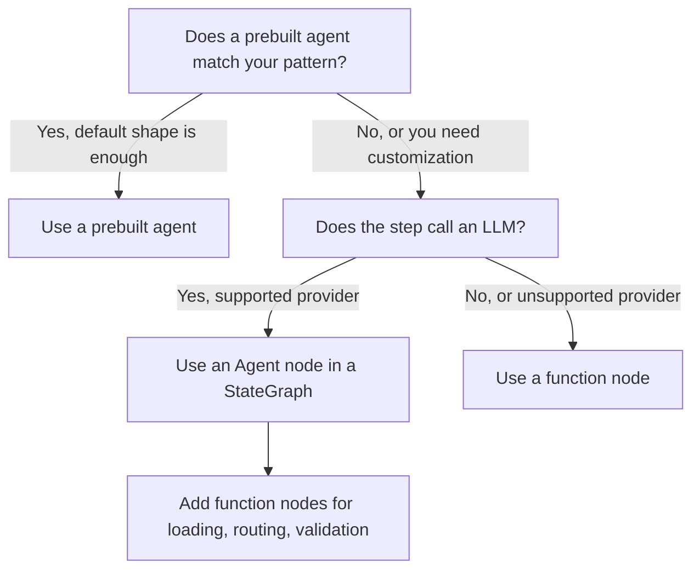

Pick a prebuilt agent when your workflow is a standard pattern, an `Agent` node inside your own `StateGraph` when you need custom routing or extra steps around the model, and a plain function node for logic that does not call an LLM. This page compares the three and shows how to combine them.

## The three levels

10xGraph offers three levels of abstraction, and each trades convenience for control. The table summarizes the differences so you can decide before reading the details.

| Dimension | Prebuilt agent | `Agent` node in a graph | Function node |
|---|---|---|---|
| Setup | One constructor call, then `compile()` | You build a `StateGraph` and wire edges | A plain Python function you register |
| LLM call | Handled | Handled by `Agent` | You write it, or none |
| Graph shape | Fixed by the pattern | You define it | You define it |
| Routing control | Limited to constructor options | Full | Full, including `Command(goto=...)` |
| Dependency injection | Not available inside the graph | Not on the agent itself, available on other nodes | `Inject[T]` on any parameter |
| Best for | Standard patterns, prototypes | Most production agents | Non-LLM steps, custom providers |

Choosing too high a level forces a rewrite when you need custom routing. Choosing too low a level means you rebuild behavior that already exists. Match the level to the pattern you actually have.

## Prebuilt agents

A prebuilt agent is a complete graph behind one class. You construct it, call `compile()`, and get a `CompiledGraph`, with no edges to wire. All of them import from `tenxgraph.prebuilt`.

| Agent | Pattern | Use it when | Guide |
|---|---|---|---|
| `ReactAgent` | Think, call tools, observe, repeat | One agent answers questions using tools | [React agent](/docs/guides/prebuilt/react-agent) |
| `PlanActReflectAgent` | Plan first, act, then reflect on results | Complex tasks that benefit from structured reasoning | [Plan-act-reflect agent](/docs/guides/prebuilt/plan-act-reflect-agent) |
| `RAGAgent` | Retrieve documents, then synthesize an answer | Question answering over a knowledge base | [RAG agent](/docs/guides/prebuilt/rag-agent) |
| `StructuredOutputAgent` | Forces the final answer into a schema | You need typed JSON from the model | [Structured output agent](/docs/guides/prebuilt/structured-output-agent) |
| `SupervisorTeamAgent` | A supervisor routes work to specialist workers | Several agents under one coordinator | [Supervisor team agent](/docs/guides/prebuilt/supervisor-team-agent) |
| `SwarmAgent` | Peer agents hand control to each other | Several agents without a central coordinator | [Swarm agent](/docs/guides/prebuilt/swarm-agent) |
| `AudioAgent` | Realtime audio over a live connection | Low-latency voice conversations | [Audio agent](/docs/guides/prebuilt/audio-agent) |

`RAGAgent` also accepts a reranker. `tenxgraph.prebuilt` exports `BaseReranker` (the interface for your own), `CohereReranker` and `CrossEncoderReranker`. For parameters of every agent see the [prebuilt agents reference](/docs/reference/python/prebuilt-agents), and for a side-by-side tour see the [prebuilt agents guide](/docs/guides/prebuilt-agents).

### Build and run a prebuilt agent

The example creates a `ReactAgent` with one tool and runs it once. Install the provider extra first: `pip install "10xgraph[openai]"`, and set `OPENAI_API_KEY`.

```python title="prebuilt_react.py"
from tenxgraph.core.state import Message
from tenxgraph.prebuilt import ReactAgent


def get_weather(location: str) -> str:
    """Get the current weather for a location."""
    return f"The weather in {location} is sunny"


# One constructor call plus compile() gives a runnable CompiledGraph.
app = ReactAgent(
    model="gpt-4o",
    system_prompt=[{"role": "system", "content": "You are a helpful assistant."}],
    tools=[get_weather],
).compile()

result = app.invoke(
    {"messages": [Message.text_message("What is the weather in Paris?")]},
    config={"thread_id": "t1"},
)
print(result["messages"][-1].text())
```

### When a prebuilt agent fits

Use one when the pattern matches exactly, when you are prototyping or shipping an MVP, and when the constructor options cover your configuration. Avoid it when you need:

- extra nodes before, after or around the agent,
- non-standard edges or your own routing,
- several agents with custom hand-off rules,
- input preprocessing or output postprocessing at the graph level.

## The Agent node in a custom graph

`Agent` is a single node, not a whole graph. You place it in a `StateGraph` next to other nodes and define the edges yourself, which makes it the most common choice for production agents.

`Agent` owns the model interaction: message conversion, provider selection, tool call handling, retries (`retry_config` is on by default), optional context trimming (`trim_context`), reasoning configuration, fallback models and multimodal output. You own the graph. See [Configure Agent](/docs/guides/configure-agent) for every option.

### Wire an Agent node with a tool loop

The graph below sends the agent's tool calls to a `ToolNode` and loops back until the model answers without calling a tool. This is the same shape `ReactAgent` builds for you.

```python title="agent_in_graph.py"
from tenxgraph.core.graph import Agent, StateGraph, ToolNode
from tenxgraph.core.state import AgentState, Message
from tenxgraph.utils import END


def get_weather(location: str) -> str:
    """Get the current weather for a location."""
    return f"The weather in {location} is sunny"


tool_node = ToolNode([get_weather])

agent = Agent(
    model="gpt-4o",
    system_prompt=[{"role": "system", "content": "You are a helpful assistant."}],
    tool_node=tool_node,
    trim_context=True,
)


def should_use_tools(state: AgentState) -> str:
    """Route to the tool node when the last assistant message requests tools."""
    last = state.context[-1] if state.context else None
    if last and last.role == "assistant" and getattr(last, "tools_calls", None):
        return "TOOL"
    return END


graph = StateGraph()
graph.add_node("MAIN", agent)
graph.add_node("TOOL", tool_node)
graph.set_entry_point("MAIN")
graph.add_conditional_edges("MAIN", should_use_tools, {"TOOL": "TOOL", END: END})
graph.add_edge("TOOL", "MAIN")

app = graph.compile()
result = app.invoke(
    {"messages": [Message.text_message("What is the weather in Paris?")]},
    config={"thread_id": "t2"},
)
print(result["messages"][-1].text())
```

### When an Agent node fits

Use it when the node's job is to call an LLM on a supported provider (OpenAI, Google or Anthropic), when you want built-in retries and fallback models, and when you want your own nodes around the call or several agents in one graph. Do not use it when the node makes no LLM call, when you must call an unsupported provider directly, or when you need full control of the request format. Those cases need a function node.

## Function nodes

A function node is a plain Python function, sync or async, registered with `add_node`. The framework passes `state` and `config` by name, and any other parameter can receive a registered service through `Inject[T]`.

Use function nodes for work that is not an LLM call: loading data, validating input, logging, calling external APIs, or routing. They can also wrap a model provider that `Agent` does not support.

A node may return a `str`, a `Message`, a list of messages, an `AgentState`, or a `Command`. A `Command` combines a state update with `goto`, which names the next node and overrides the static edge. Returning a plain `dict` is not supported.

The signature below injects a service the same way the repository's `react-injection` example does. See [Use dependency injection](/docs/guides/use-dependency-injection) for what can be injected.

```python title="injected_node.py"
from injectq import Inject

from tenxgraph.core.state import AgentState
from tenxgraph.storage.store.base_store import BaseStore


async def load_context(
    state: AgentState,
    config: dict,
    store: BaseStore | None = Inject[BaseStore],
) -> AgentState:
    """Runs before the agent; store is resolved from the container."""
    return state
```

## Combine all three levels

Most production graphs mix function nodes and an `Agent` node. The example adds a guard before the model and an audit step after it. The guard uses `Command(goto=END)` to stop early on empty input.

```python title="mixed_graph.py"
from tenxgraph.core.graph import Agent, StateGraph, ToolNode
from tenxgraph.core.state import AgentState, Message
from tenxgraph.utils import END, Command


def search_docs(query: str) -> str:
    """Search the documentation."""
    return f"Top result for {query}"


# Function node 1: reject empty input before spending a model call.
def guard_input(state: AgentState, config: dict) -> Command:
    last = state.context[-1] if state.context else None
    if last is None or not last.text().strip():
        return Command(update="Please send a question.", goto=END)
    return Command(goto="AGENT")


# Agent node: owns the model call and the tool loop.
tool_node = ToolNode([search_docs])
agent = Agent(model="gpt-4o", tool_node=tool_node)


def route(state: AgentState) -> str:
    last = state.context[-1] if state.context else None
    if last and last.role == "assistant" and getattr(last, "tools_calls", None):
        return "TOOL"
    return "AUDIT"


# Function node 2: log the final answer after the agent.
def audit_response(state: AgentState, config: dict) -> AgentState:
    print(f"[{config['thread_id']}] {state.context[-1].text()}")
    return state


graph = StateGraph()
graph.add_node("GUARD", guard_input)
graph.add_node("AGENT", agent)
graph.add_node("TOOL", tool_node)
graph.add_node("AUDIT", audit_response)

graph.set_entry_point("GUARD")
graph.add_edge("GUARD", "AGENT")
graph.add_conditional_edges("AGENT", route, {"TOOL": "TOOL", "AUDIT": "AUDIT"})
graph.add_edge("TOOL", "AGENT")
graph.add_edge("AUDIT", END)

app = graph.compile()
result = app.invoke(
    {"messages": [Message.text_message("How do I add a checkpointer?")]},
    config={"thread_id": "t3"},
)
```

## Decision flow

Work through these questions in order. The first yes decides the block.



## Prebuilt tools

Tools are separate from agents. The package ships ready-made functions you can pass to any `ToolNode` or `tools=` list, such as `safe_calculator`, `fetch_url`, `file_read`, `file_write`, `file_search`, `google_web_search`, `vertex_ai_search`, the memory tools (`memory_tool`, `make_user_memory_tool`, `make_agent_memory_tool`) and the handoff helpers (`create_handoff_tool`, `is_handoff_tool`). The [prebuilt tools guide](/docs/guides/prebuilt-tools) covers each one.

## Related pages

- [Prebuilt agents guide](/docs/guides/prebuilt-agents): overview and chooser for all prebuilt agents.
- [Build a graph](/docs/guides/build-a-graph): construct, run and route a custom `StateGraph`.
- [Configure Agent](/docs/guides/configure-agent): constructor options for the `Agent` node.
- [Use custom nodes](/docs/guides/use-custom-nodes): write and register function nodes.
- [Agents and tools](/docs/concepts/agents-and-tools): how agents and tool nodes work together.
