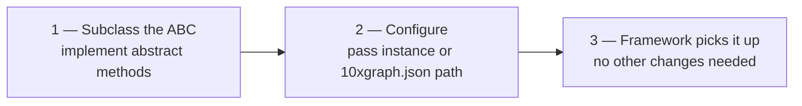

10xGraph's major components are built on abstract base classes. Extend any of them to swap storage backends, auth mechanisms, LLM providers, ID schemes, rate limiting, or event routing. Your graph logic stays unchanged. This page explains the pattern and shows when and how to extend each.

---

## Extension points at a glance

```mermaid
flowchart TB
  subgraph "Storage"
    BCP[BaseCheckpointer]
    BS[BaseStore]
    BE[BaseEmbedding]
    BMS[BaseMediaStore]
  end
  subgraph "Agent & LLM"
    BA[BaseAgent]
    BC[BaseConverter]
    BCM[BaseContextManager]
  end
  subgraph "API / Server"
    BAUTH[BaseAuth]
    BAUTHZ[AuthorizationBackend]
    BRL[BaseRateLimitBackend]
    TNG[ThreadNameGenerator]
    BID[BaseIDGenerator]
  end
  subgraph "Events & QA"
    BP[BasePublisher]
    BV[BaseValidator]
    BCR[BaseCriterion]
    BR[BaseReporter]
  end
  YOUR[Your Subclass] -->|extend any| BCP & BS & BE & BMS
  YOUR -->|extend any| BA & BC & BCM
  YOUR -->|extend any| BAUTH & BAUTHZ & BRL & TNG & BID
  YOUR -->|extend any| BP & BV & BCR & BR
```



| ABC | File | What you override |
|---|---|---|
| `BaseAgent` | `tenxgraph/core/graph/base_agent.py` | `execute()` |
| `BaseContextManager` | `tenxgraph/core/state/base_context.py` | `trim_context()`, `atrim_context()` |
| `BaseCheckpointer` | `tenxgraph/storage/checkpointer/base_checkpointer.py` | State, message, thread, cache API |
| `BaseStore` | `tenxgraph/storage/store/base_store.py` | Vector store read/write |
| `BaseEmbedding` | `tenxgraph/storage/store/embedding/base_embedding.py` | `aembed()`, `aembed_batch()`, `dimension` |
| `BaseMediaStore` | `tenxgraph/storage/media/storage/base.py` | `store()`, `retrieve()`, `delete()`, `exists()` |
| `BasePublisher` | `tenxgraph/runtime/publisher/base_publisher.py` | `publish(EventModel)`, `close()` |
| `BaseConverter` | `tenxgraph/runtime/adapters/llm/base_converter.py` | `convert_response()`, `convert_streaming_response()` |
| `BaseValidator` | `tenxgraph/utils/callbacks.py` | `validate(messages)` |
| `BaseIDGenerator` | `tenxgraph/utils/id_generator.py` | `generate()` |
| `BaseAuth` | `tenxgraph_api/src/app/core/auth/base_auth.py` | `authenticate(request, response, credential)` |
| `AuthorizationBackend` | `tenxgraph_api/src/app/core/auth/authorization.py` | `authorize(user, resource, action, resource_id=None, **context)` |
| `BaseRateLimitBackend` | `tenxgraph_api/src/app/core/middleware/rate_limit/base.py` | `check(key, limit, window)`, `close()` |
| `ThreadNameGenerator` | `tenxgraph_api/src/app/utils/thread_name_generator.py` | `generate_name(messages)` |
| `BaseCriterion` | `tenxgraph/qa/evaluation/criteria/base.py` | `score(trajectory, response)` |
| `BaseReporter` | `tenxgraph/qa/evaluation/reporters/base.py` | `generate(report, output_dir)` |

---

## Common extension pattern

Every extension follows three steps. You create a subclass, pass an instance to the framework (either during graph compilation or via config file), and the framework uses your implementation without any other changes needed.



1. Subclass the ABC and implement its abstract methods.
2. Pass the instance at compile time (such as `graph.compile(checkpointer=...)`) or set the path in `10xgraph.json` for server-layer ABCs. A checkpointer always goes to `compile()`: the server does not apply the checkpointer key in `10xgraph.json` yet.
3. The framework picks it up. Graph logic, routing, and API endpoints are unchanged.

---

## Storage extension points

10xGraph ships with an in-memory checkpointer for dev and a Postgres+Redis checkpointer for production. Extend `BaseCheckpointer` if you need to use DynamoDB, Google Cloud Datastore, or a custom backend. The other storage ABCs let you bring your own embedding models, vector stores, and file storage. All four follow the same pattern: subclass, implement the abstract methods, pass the instance at `compile()`.

### BaseCheckpointer: conversational state

A checkpointer persists your graph's state and thread history to a backend. You extend `BaseCheckpointer` when your deployment requires a specific database (DynamoDB for AWS shops, Firestore for Google Cloud, or something custom like a legacy oracle system). The minimum required methods handle state and thread lifecycle. Message and cache methods have default no-op implementations; override them only if your backend can serve them efficiently.

```python
from tenxgraph.storage.checkpointer.base_checkpointer import BaseCheckpointer

class DynamoCheckpointer(BaseCheckpointer):
    # Required: control state and thread lifecycle
    async def asetup(self) -> None: ...                                  # create tables / connect
    async def aput_state(self, config, state) -> None: ...               # persist full state
    async def aget_state(self, config) -> AgentState | None: ...         # load state by thread_id
    async def aclear_state(self, config) -> None: ...                    # delete state for thread
    async def aclean_thread(self, config) -> None: ...                   # delete all thread data
    async def arelease(self) -> None: ...                                # close connections

    # Optional: override if your backend supports them efficiently
    async def aput_state_cache(self, config, state) -> None: ...         # hot-path write cache
    async def aget_state_cache(self, config) -> AgentState | None: ...   # hot-path read cache
    async def aput_messages(self, config, messages) -> None: ...         # store messages separately
    async def aget_message(self, config, message_id) -> Message: ...     # fetch single message
    async def alist_messages(self, config) -> list[Message]: ...         # list thread messages
    async def adelete_message(self, config, message_id) -> None: ...     # delete single message
    async def aput_thread(self, config, info) -> None: ...               # store thread metadata
    async def aget_thread(self, config) -> dict | None: ...              # fetch thread metadata
    async def alist_threads(self, config) -> list[dict]: ...             # list threads for user

compiled = graph.compile(checkpointer=DynamoCheckpointer())
```

### BaseStore: long-term vector memory

A store holds embeddings and metadata for long-term retrieval across conversation threads. You extend `BaseStore` to integrate with a vector database your team already uses (Pinecone, Weaviate, your own Postgres pgvector setup). Your store methods handle the read/write/search lifecycle.

```python
from tenxgraph.storage.store.base_store import BaseStore

class PineconeStore(BaseStore):
    async def astore(self, user_id, content, metadata) -> str: ...
    async def asearch(self, user_id, query, limit) -> list[dict]: ...
    async def aget(self, memory_id) -> dict | None: ...
    async def aupdate(self, memory_id, content) -> None: ...
    async def adelete(self, memory_id) -> None: ...
    async def alist(self, user_id) -> list[dict]: ...

compiled = graph.compile(store=PineconeStore())
```

### BaseEmbedding: custom embedding model

An embedding model converts text into vectors for storage and search. You extend `BaseEmbedding` when you need an embedding provider other than the framework defaults or when you want to use a fine-tuned embedding model specific to your domain.

```python
from tenxgraph.storage.store.embedding.base_embedding import BaseEmbedding

class CohereEmbedding(BaseEmbedding):
    @property
    def dimension(self) -> int:
        return 1024

    async def aembed(self, text: str) -> list[float]:
        return await cohere_client.embed(text)

    async def aembed_batch(self, texts: list[str]) -> list[list[float]]:
        return await cohere_client.embed_batch(texts)
```

### BaseMediaStore: file storage backend

A media store handles the upload and retrieval of images, audio, and documents. You extend `BaseMediaStore` to integrate with your file storage infrastructure: AWS S3, Google Cloud Storage, your own MinIO instance, or a specialized media service.

```python
from tenxgraph.storage.media.storage.base import BaseMediaStore

class S3MediaStore(BaseMediaStore):
    async def store(self, data: bytes, mime_type: str, metadata: dict | None = None) -> str:
        """Store bytes and return an opaque storage key."""
        ...

    async def retrieve(self, storage_key: str) -> tuple[bytes, str]:
        """Return (bytes, mime_type). Raise KeyError if not found."""
        ...

    async def delete(self, storage_key: str) -> bool:
        """Delete by storage key. Return True if deleted."""
        ...

    async def exists(self, storage_key: str) -> bool: ...
```

---

## Agent and LLM extension

### BaseAgent: bring your own LLM

The `Agent` class extends `BaseAgent`. You subclass `BaseAgent` to call any LLM provider, add pre/post-processing, or change how messages are constructed. This is useful when you need to integrate a provider or inference service that 10xGraph does not ship with built-in support for.

```python
from tenxgraph.core.graph.base_agent import BaseAgent
from tenxgraph.core.state import AgentState, Message

class AnthropicAgent(BaseAgent):
    async def execute(self, state: AgentState, config: dict) -> Message:
        # Convert 10xGraph messages to the format Anthropic expects
        messages = [
            {"role": m.role, "content": m.text}
            for m in state.context
            if m.role in ("user", "assistant")
        ]
        response = await anthropic_client.messages.create(
            model="claude-opus-4-7",
            messages=messages,
        )
        return Message.text_message(response.content[0].text, role="assistant")
```

### BaseConverter: LLM response normalization

`BaseConverter` maps a raw provider response into 10xGraph's `Message` format. You implement one when integrating a provider that isn't OpenAI or Google and need to normalize its output shape into the framework's message format.

```python
from tenxgraph.runtime.adapters.llm.base_converter import BaseConverter

class MyProviderConverter(BaseConverter):
    async def convert_response(self, raw_response) -> Message:
        return Message.text_message(raw_response["output"], role="assistant")

    async def convert_streaming_response(self, chunk) -> Message | None:
        text = chunk.get("delta", "")
        return Message.text_message(text, role="assistant") if text else None
```

### BaseContextManager: custom context trimming

Context grows as the conversation continues. You extend `BaseContextManager` when the built-in trimming strategies (keep last N messages, remove old messages) do not fit your use case. Examples: keep messages tagged as important, prioritize system context, or drop messages matching a pattern.

```python
from tenxgraph.core.state.base_context import BaseContextManager
from tenxgraph.core.state import AgentState

class PriorityContextManager(BaseContextManager):
    def trim_context(self, state: AgentState) -> AgentState:
        # keep system message + last N turns + any pinned messages
        ...
        return state

    async def atrim_context(self, state: AgentState) -> AgentState:
        return self.trim_context(state)

graph = StateGraph(state=MyState(), context_manager=PriorityContextManager())
```

---

## ID generation

Five built-in generators cover most needs. Swap them globally or per-graph.

| Class | Format | Example |
|---|---|---|
| `UUIDGenerator` | UUID v4 | `550e8400-e29b-41d4-a716-446655440000` |
| `BigIntIDGenerator` | 64-bit integer | `7891234567890123` |
| `TimestampIDGenerator` | ms timestamp with random suffix | `1716480000000-a3f2` |
| `HexIDGenerator` | Hex string | `4a8f3c1d` |
| `ShortIDGenerator` | Short alphanumeric | `xK9mP2` |

You extend `BaseIDGenerator` when you need IDs in a specific format: employee IDs matching your company's naming scheme, snowflake IDs for distributed systems, or UUIDs with a custom prefix.

```python
from tenxgraph.utils.id_generator import TimestampIDGenerator

graph = StateGraph(id_generator=TimestampIDGenerator())
compiled = graph.compile()
```

Custom generator:

```python
from tenxgraph.utils.id_generator import BaseIDGenerator

class PrefixedIDGenerator(BaseIDGenerator):
    def generate(self) -> str:
        return f"run_{uuid4().hex[:8]}"
```

---

## API and server extension

Server-layer ABCs are wired via `10xgraph.json`, with no code changes to the server required. You extend these to enforce your deployment's security policies, integrate custom identity systems, or implement rate limiting specific to your infrastructure.

### BaseAuth

Extend `BaseAuth` when you need custom authentication beyond JWT: API key lookup, LDAP integration, OAuth2 with your identity provider, or a legacy auth system. The `authenticate` method is synchronous and receives the request, response, and credential.

```python
from tenxgraph_api import BaseAuth

class ApiKeyAuth(BaseAuth):
    def authenticate(self, request, response, credential) -> dict | None:
        key = request.headers.get("X-API-Key")
        return lookup_api_key(key)   # dict with user_id, or None for 401
```

### AuthorizationBackend

You extend `AuthorizationBackend` when the built-in authorization models (default, ownership, RBAC) do not fit your permission model. Examples: attribute-based access control (ABAC), graph-based permissions, or integration with an external policy engine.

```python
from tenxgraph_api.src.app.core.auth.authorization import AuthorizationBackend

class RBACBackend(AuthorizationBackend):
    async def authorize(self, user, resource, action, resource_id=None, **context) -> bool:
        return f"{resource}:{action}" in ROLE_PERMISSIONS[user["role"]]
```

For simple role-to-scope mapping, you do not need a class. Set `authorization` to an RBAC config block (`{"backend": "rbac", "roles": {...}}`). The built-in `ownership` backend gives owner-only threads with no code.

### BaseRateLimitBackend

You extend `BaseRateLimitBackend` when you need rate limiting with custom logic: tiered limits based on user tier, graceful degradation, or integration with an external rate limiter service.

```python
from tenxgraph_api.src.app.core.middleware.rate_limit.base import BaseRateLimitBackend

class RedisClusterRateLimiter(BaseRateLimitBackend):
    async def check(self, key: str, *, limit: int, window: int) -> RateLimitDecision: ...
    async def close(self) -> None: ...
```

The `check` method returns a `RateLimitDecision(allowed, remaining, reset_after)` (import it from the same `base` module). Bind an instance of your backend in the InjectQ container and set `backend: custom`; there is no import-path key for rate-limit backends.

### ThreadNameGenerator

You extend `ThreadNameGenerator` when you want custom thread names: date-prefixed names, user-specific prefixes, or names derived from the conversation topic. The built-in `AIThreadNameGenerator` uses an LLM to generate topic-based names.

```python
from tenxgraph_api.src.app.utils.thread_name_generator import ThreadNameGenerator

class DatePrefixNameGenerator(ThreadNameGenerator):
    async def generate_name(self, messages: list[str]) -> str:
        return f"{date.today()}: {messages[0][:30]}"
```

Wire any of these in `10xgraph.json`. Auth, authorization, and thread naming each have a dedicated top-level key. Custom rate-limit backends are bound in the InjectQ container instead:

```json
{
  "auth": { "method": "custom", "path": "auth.my_auth:ApiKeyAuth" },
  "authorization": "auth.my_auth:RBACBackend",
  "thread_name_generator": "services.naming:DatePrefixNameGenerator",
  "rate_limit": {
    "enabled": true,
    "backend": "custom",
    "requests": 100,
    "window": 60
  }
}
```

The string format for class references is `module.path:ClassName` (dot-separated module path, colon, then the class or instance name). For the custom rate-limit backend, bind it in the module your injectq key points to:

```python
from injectq import InjectQ
from tenxgraph_api.src.app.core.middleware.rate_limit.base import BaseRateLimitBackend

container = InjectQ.get_instance()
container.bind_instance(BaseRateLimitBackend, RedisClusterRateLimiter())
```

---

## Event stream extension

You extend `BasePublisher` to send execution events to a custom endpoint: your internal event bus, a webhook, a monitoring system, or a custom log aggregator. Multiple publishers can run together with `CompositePublisher`.

```python
from tenxgraph.runtime.publisher.base_publisher import BasePublisher
from tenxgraph.runtime.publisher.events import EventModel

class WebhookPublisher(BasePublisher):
    def __init__(self, url: str):
        self.url = url

    async def publish(self, event: EventModel) -> None:
        await httpx.post(self.url, json=event.dict())

    async def close(self) -> None:
        pass

    def sync_close(self) -> None:
        pass
```

Compose multiple publishers:

```python
from tenxgraph.runtime.publisher import CompositePublisher

graph = StateGraph(
    publisher=CompositePublisher([ConsolePublisher(), WebhookPublisher("https://...")])
)
compiled = graph.compile()
```

---

## Validation and evaluation extension

### BaseValidator: input screening

You extend `BaseValidator` to add custom input validation before messages reach the graph: length checks, content filtering, PII detection, or rate limiting per user. Register validators with the callback manager.

```python
from tenxgraph.utils.callbacks import BaseValidator

class LengthValidator(BaseValidator):
    def validate(self, messages: list[Message]) -> list[Message]:
        for m in messages:
            if len(m.text) > 10_000:
                raise ValueError("Message exceeds maximum length")
        return messages

cb = CallbackManager()
cb.register_input_validator(LengthValidator())
```

### BaseCriterion: custom evaluation criterion

You extend `BaseCriterion` to score agent responses against custom metrics when running evaluations. Examples: keyword presence, output format compliance, or domain-specific quality signals.

```python
from tenxgraph.qa.evaluation.criteria.base import BaseCriterion

class KeywordCriterion(BaseCriterion):
    def __init__(self, keywords: list[str]):
        self.keywords = keywords

    async def score(self, trajectory, response) -> float:
        hits = sum(1 for kw in self.keywords if kw in response.text)
        return hits / len(self.keywords)
```

### BaseReporter: custom evaluation report

You extend `BaseReporter` to generate evaluation reports in a custom format or send them to your internal systems: post to Slack, write to a database, generate a PDF, or integrate with your BI tools.

```python
from tenxgraph.qa.evaluation.reporters.base import BaseReporter

class SlackReporter(BaseReporter):
    async def generate(self, report, output_dir: str) -> None:
        summary = f"Score: {report.overall_score:.2f}"
        await slack_client.post(channel="#evals", text=summary)
```

---

## What's next

| Page | What it covers |
|---|---|
| [Agents and Tools](/docs/concepts/agents-and-tools) | BaseValidator, CallbackManager, GraphLifecycleHook in practice |
| [Serving Agents](/docs/concepts/serving-agents) | BaseAuth, AuthorizationBackend, BasePublisher wired to a running server |
| [Memory](/docs/concepts/memory) | BaseCheckpointer, BaseStore, BaseEmbedding in the memory layer context |
| [Testing and Evaluation](/docs/testing) | BaseCriterion, BaseReporter in the evaluation pipeline |
