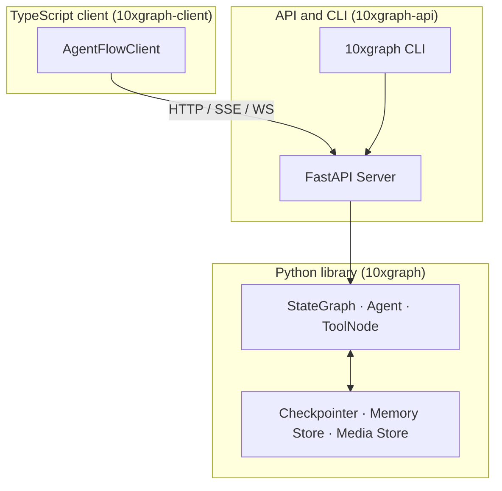
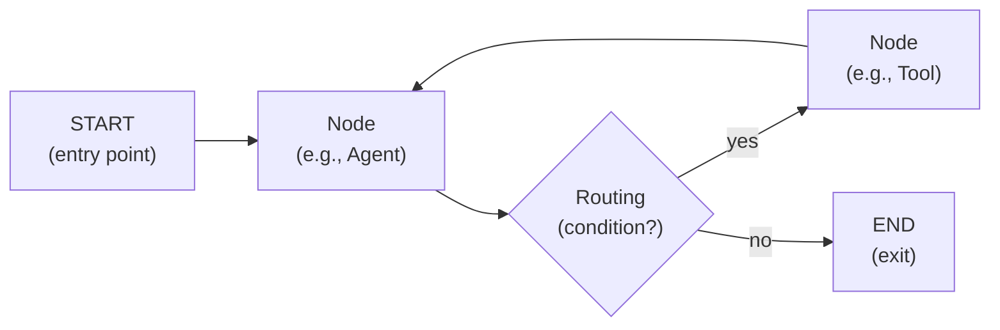

The Concepts section explains how 10xGraph works: the three-layer architecture (library, server, client), how a request flows from client through the server to your graph, the execution model (state, messages, nodes, edges), and advanced patterns for memory, reliability, and production deployments. Read this section to understand the mental model before building.

## Why graphs?

10xGraph uses a graph-based execution model instead of a linear pipeline or free-form function calls. This model gives you:

- **Reproducibility**: The same input with the same `thread_id` always produces the same output. Tool calls are [replay-safe](/docs/concepts/replay-safe-tools), so if a tool runs and the process crashes, resuming the same thread never re-executes the finished call.
- **Durability**: Intermediate state is [checkpointed](/docs/concepts/checkpointing-and-threads) at each step, so you can pause an agent for human approval, resume it later, and it continues from exactly where it left off.
- **Observability**: Every state change, tool call, and error is captured as an event you can stream, log, or send to tracing systems.
- **Control**: You route between nodes using conditional logic you define, so complex multi-step and multi-agent workflows are explicit and testable.
- **Concurrency**: Tools run in parallel by default, and the graph engine scales across stateless servers with per-thread durability.

## Three-layer architecture

10xGraph is built in three independent layers. You can use just the Python library for agents in a script, or add the API server and TypeScript client to serve agents over HTTP.



| Layer | Package | What it does |
|-------|---------|-------------|
| **Core library** | `10xgraph` (import `tenxgraph`) | Graph engine, agents, tools, state, checkpointing, memory stores, media handling, publishers. Use this to build agents locally or embed graphs in your own apps. |
| **API server & CLI** | `10xgraph-api` (import `tenxgraph_api`, command `10xgraph`) | FastAPI server that wraps your compiled graph, REST and WebSocket endpoints, auth, authorization, rate limiting, thread management. Use this to serve agents over HTTP. |
| **TypeScript client** | `10xgraph-client` (npm `@10xgraph/client`) | Typed HTTP wrapper for browser and Node.js, handles auth, streaming, thread management, file uploads. Use this to call the server from your frontend or backend. |

Python code imports from `tenxgraph`: `from tenxgraph.core.graph import StateGraph`. The deprecated alias `agentflow` still works until 2.0.

## How a request flows through the system

When you call an agent over HTTP, here is what happens:

1. **Client sends a request** (TypeScript SDK or curl) to `POST /v1/graph/invoke` with messages and a `thread_id`.
2. **API server verifies auth** via JWT or custom auth middleware.
3. **Server loads the graph** from the module path in `10xgraph.json`, then loads the thread state (if resuming) or starts fresh.
4. **Server calls the compiled graph** with the input state and config.
5. **Graph runs**: nodes execute, state is updated via reducers, tool calls are dispatched in parallel, intermediate steps are checkpointed.
6. **Graph returns the final state** (updated messages, execution metadata, thread-level side effects).
7. **Server saves the checkpoint**, then returns the final messages (and stream events, if streaming) to the client.

For streaming, the graph emits `StreamChunk` events as execution progresses (message appended, tool called, tool result received, node entered/exited, error). The server sends these as NDJSON over HTTP, or as WebSocket events over the `/v1/graph/ws` endpoint.

## The execution model

Four core concepts form the foundation of every 10xGraph agent.

### Message

The unit of all communication. Every piece of information flowing through a graph is a `Message`: user questions, assistant responses, tool calls, tool results, and errors.

```python
from tenxgraph.core.state import Message

# Create a user message
Message.text_message("What is the weather?", role="user")

# Create an assistant response
Message.text_message("Let me check...", role="assistant")
```

A message carries one or more **content blocks**: `TextBlock`, `ToolCallBlock`, `ToolResultBlock`, `ImageBlock`, `AudioBlock`, `VideoBlock`, `DocumentBlock`, `ReasoningBlock`, `ErrorBlock`. Nodes read the content blocks to decide what to do next.

### AgentState

The moving container passed from node to node. `AgentState` has three built-in fields; subclass it and add your own.

| Field | Type | Purpose |
|-------|------|---------|
| `context` | `list[Message]` | Live message list; appended to by every node via the `add_messages` reducer. |
| `context_summary` | `str \| None` | Optional summary written by `SummaryContextManager` when old messages are trimmed. |
| `execution_meta` | `ExecMeta` | Internal runtime bookkeeping (current node, step count, interrupt status, parent thread), managed by the framework. |

```python
from tenxgraph.core.state import AgentState
from pydantic import Field

class MyState(AgentState):
    # context, context_summary, and execution_meta are already defined
    user_name: str = "Guest"
    order_data: dict = Field(default_factory=dict)
```

Fields use **annotated reducers** to control how new values merge with old. The `context` field uses `add_messages`, which appends new messages and deduplicates by ID:

```python
from typing import Annotated
from tenxgraph.core.state import add_messages, Message

context: Annotated[list[Message], add_messages]
```

### Node

Any Python function that receives `AgentState` and returns a message or a state update. Nodes are the unit of work.

```python
async def my_node(state: MyState) -> Message:
    # The graph injects state, config, and any Inject[T] dependencies
    return Message.text_message(f"Hello {state.user_name}", role="assistant")
```

Nodes are never called manually. The graph discovers them, injects dependencies, and calls them in order (or in parallel, if the graph topology allows).

### Node execution cycle

Each node receives the full state, does its work, and returns a message or partial state update. The graph merges the result via reducers, saves a checkpoint, then routes to the next node.



The key insight: **state is immutable during a single step**. Each node receives a consistent snapshot, returns an update, and the graph applies all updates (via reducers) before the next step. This isolation enables replay-safety and resumability.

### Edge and routing

Edges connect nodes. You define them as static (always goes to node B) or conditional (a function decides where to go):

```python
graph.add_edge("AGENT", "TOOLS")                    # static

graph.add_conditional_edges("AGENT", route_fn)      # dynamic
# or
graph.add_conditional_edges("AGENT", route_fn, {    # mapped
    "tool":  "TOOLS",
    "done":  END,
})
```

## Building and running a graph

Every graph has three stages: **Define** (add nodes and edges), **Compile** (wire dependency injection, checkpointer, and storage), and **Run** (invoke, stream, or resume).

```python
from tenxgraph.core.graph import StateGraph, Agent, ToolNode
from tenxgraph.utils import START, END
from tenxgraph.prebuilt.agent import ReactAgent

# Define nodes
agent = Agent(model="gpt-4o", tools=[tool_1, tool_2])
tool_node = ToolNode([tool_1, tool_2])

# Define edges
graph = StateGraph()
graph.add_edge(START, "AGENT")
graph.add_conditional_edges("AGENT", route_fn, {"tool": "TOOLS", "done": END})
graph.add_edge("TOOLS", "AGENT")

# Compile
compiled = graph.compile()

# Run
result = compiled.invoke(input_state, config={"thread_id": "abc"})
```

Or use a prebuilt agent to skip graph definition:

```python
compiled = ReactAgent(model="gpt-4o", tools=[tool_1, tool_2]).compile()
```

Pass the same `thread_id` on the next call and the graph resumes where it left off, with all tool calls replayed safely.

## What's in this section

The Concepts section is organized into three groups:

### Foundations

Start here to understand the execution model in depth: state graphs, messages, agents, tools, routing, dependency injection, and streaming.

- [StateGraph](/docs/concepts/state-graph): The core workflow engine, how compile() wires everything, and recursion limits.
- [State and messages](/docs/concepts/state-and-messages): Message structure, content blocks, state reducers, and the message catalog.
- [Agents and tools](/docs/concepts/agents-and-tools): Why Agent exists, how ToolNode dispatches (parallel by default), MCP, and tool errors.
- [Choosing a building block](/docs/concepts/choosing-a-building-block): When to use a plain node vs Agent vs prebuilt agent vs custom graph.
- [Routing, Command and callbacks](/docs/concepts/callbacks-and-command): Conditional edges, the Command API, and callback handling.
- [Interrupts](/docs/concepts/interrupts): Human-in-the-loop: pausing execution, saving checkpoints, and resuming.
- [Dependency injection](/docs/concepts/dependency-injection): Why DI vs globals, and the injectable parameters you can request.
- [Streaming](/docs/concepts/streaming): Python streaming granularity, why stream, and transport summary.

### Memory and reliability

Build robust agents: checkpointing threads, long-term memory stores, context trimming, error handling, and tool replay safety.

- [Checkpointing and threads](/docs/concepts/checkpointing-and-threads): Threads, checkpoints, and choosing a checkpointer (in-memory, SQLite, Postgres+Redis).
- [How PgCheckpointer works](/docs/concepts/memory): The dual-layer write and read paths, versioning, and recovery.
- [Long-term memory](/docs/concepts/memory-and-store): Store vs checkpointer, retrieval, scoping, and when to use memory tools.
- [Context management](/docs/concepts/context-management): Why context grows, message trimming vs summarization, and trade-offs.
- [Replay-safe tools](/docs/concepts/replay-safe-tools): How tool ledgers prevent duplicate execution on resume.
- [Errors and limits](/docs/concepts/errors-and-limits): Exception types, recursion limits, timeouts, and retry policies.

### Serving

Production patterns: serving agents over HTTP, auth, observability, media handling, and extensibility.

- [Serving agents](/docs/concepts/serving-agents): How the API server loads graphs, request lifecycle, workers, and config vs code.
- [Security and validators](/docs/concepts/security-and-validators): Input validation, authorization models, and isolation scopes.
- [Events and observability](/docs/concepts/events-and-observability): The event model, publishers, metrics, and tracing.
- [Remote tools](/docs/concepts/remote-tools): When to use remote tool execution.
- [Media and files](/docs/concepts/media-and-files): Media refs, offload policies, storage backends, and provider file APIs.
- [Extension points](/docs/concepts/extensibility): The base classes you can subclass: BaseAgent, BaseCheckpointer, BaseStore, BaseAuth, and more.

## Recommended reading order

1. **First read** (15 min): [StateGraph](/docs/concepts/state-graph) to see how the workflow engine chains nodes.
2. **Then read** (30 min): [State and messages](/docs/concepts/state-and-messages), [Agents and tools](/docs/concepts/agents-and-tools), and [Streaming](/docs/concepts/streaming) to understand the execution model and granularity.
3. **Go build** in the [Get started](/docs/get-started) section. Build a graph in Python, serve it with `10xgraph api`, and call it from TypeScript. The tutorial is more hands-on.
4. **Return here** to dive deeper: checkpointing, memory, context management, error handling, auth, observability.

## Next steps

- [Get started](/docs/get-started): Build your first agent, step by step.
- [Build agents](/docs/guides): Task guides for everything from custom nodes to prebuilt agents to production patterns.
- [API server](/docs/server): Serve agents over HTTP with auth, rate limiting, and observability.
- [TypeScript client](/docs/client): Call the server from your app with the typed client.
- [Reference](/docs/reference): API signatures, CLI flags, environment variables, and error codes.
