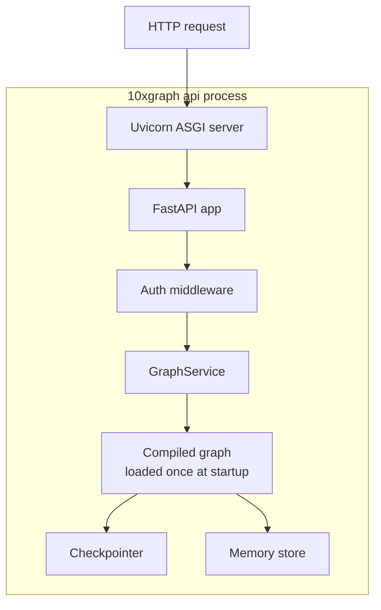
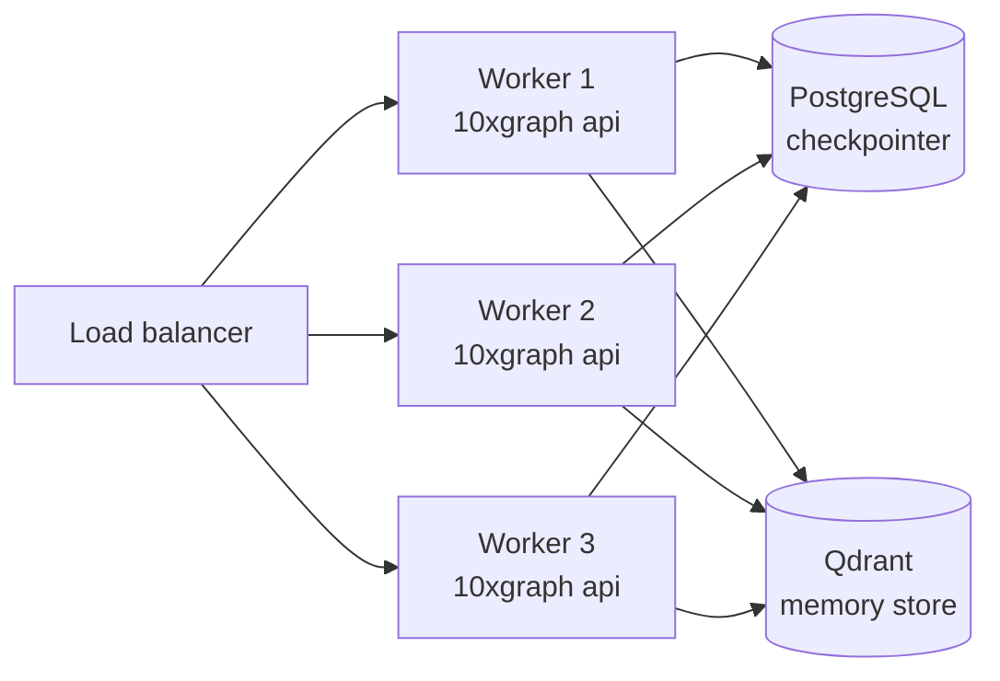

Running `app.invoke` in a script is fine for experimentation. Production deployments require an HTTP server, async execution, state persistence, and the ability to handle concurrent requests.

## How the API server works



The CLI starts a Uvicorn ASGI server. The FastAPI app loads your compiled graph **once** at startup and reuses it for every request. This avoids module loading overhead per request.

## Async execution

The `GraphService` awaits `ainvoke` for `POST /v1/graph/invoke` and iterates `astream` for `POST /v1/graph/stream`, returning the chunks as a `StreamingResponse`. Nodes can be sync or async functions; the runtime handles scheduling.

## Publishers

A publisher receives structured `EventModel` payloads (source, phase, content type, node name, thread ID, run ID, payload, timestamp, metadata) from graph execution. Pass one to `StateGraph(...)`, not to `compile()`:

```python
from tenxgraph.core.graph import StateGraph
from tenxgraph.runtime.publisher import ConsolePublisher

graph = StateGraph(publisher=ConsolePublisher(config={"format": "json"}))
app = graph.compile()
```

`StateGraph(publisher=...)` also accepts a list of publishers, which it wraps in a `CompositePublisher`.

| Publisher | Use case |
|---|---|
| `ConsolePublisher` | Local debugging. |
| `RedisPublisher` | Pub/Sub or stream-backed event distribution. |
| `KafkaPublisher` | Kafka event pipelines. |
| `RabbitMQPublisher` | RabbitMQ messaging. |
| `CompositePublisher` | Fan an event out to several publishers at once. |
| `OtelPublisher` | OpenTelemetry spans for each run, node, and tool call. |
| `LogfirePublisher` | Logfire traces. |
| `LangsmithPublisher` | LangSmith traces over OTLP. |

Rules of thumb:

- Prefer publishers over ad hoc print statements, so events stay structured and backend-agnostic.
- Close network publishers on shutdown. Redis, Kafka, and RabbitMQ publishers own connections.
- Keep optional publisher dependencies optional, so core graph imports stay light.

See the [Publishers reference](/docs/reference/python/publishers) and the [graceful shutdown tutorial](/docs/tutorials/from-examples/graceful-shutdown).

## LLM response converters

Converters normalize provider-native responses into 10xGraph messages, tool calls and usage. `tenxgraph.runtime.adapters` exports `BaseConverter`, `ConverterType`, `GoogleGenAIConverter`, `OpenAIConverter` and `OpenAIResponsesConverter`. You rarely use them directly; see [Providers](/docs/providers).

## Multi-worker deployment

For production scale, run multiple worker processes behind a load balancer. Because state is stored in the checkpointer (and optionally in the memory store), any worker can handle any request as long as they share the same storage backend.



Use `PgCheckpointer` (backed by Postgres + Redis) so that state is shared across workers. `InMemoryCheckpointer` is process-local and breaks in a multi-worker setup.

## Environment configuration

The API server reads settings from environment variables. Key variables:

| Variable | Description | Default |
| --- | --- | --- |
| `MODE` | `development` or `production` | `development` |
| `LOG_LEVEL` | Logging verbosity | `INFO` |
| `ORIGINS` | Comma-separated allowed CORS origins | `*` |
| `JWT_SECRET_KEY` | Secret key for JWT auth | None |
| `JWT_ALGORITHM` | JWT signing algorithm | `HS256` |
| `REDIS_URL` | Redis URL for `PgCheckpointer` | None |

In production, set `MODE=production`. This enables stricter security header checks and logs warnings for unsafe defaults like `ORIGINS=*`.

## Docker deployment

Generate a Dockerfile:

```bash
10xgraph build --docker-compose
```

This creates a `Dockerfile` and `docker-compose.yml` configured for the standard API server. See [Generate Docker files](/docs/how-to/api-cli/generate-docker-files) for options.

## What you learned

- The API server loads the compiled graph once at startup.
- Async scheduling is handled by the runtime, so nodes can be sync or async.
- Multi-worker deployments require `PgCheckpointer` for shared state.
- Set `MODE=production` and configure `ORIGINS` for secure production deployments.

## Related concepts

- [Checkpointing and threads](/docs/concepts/checkpointing-and-threads)
- [API/CLI: Configuration](/docs/reference/api-cli/configuration)
- [How to: Generate Docker files](/docs/how-to/api-cli/generate-docker-files)
