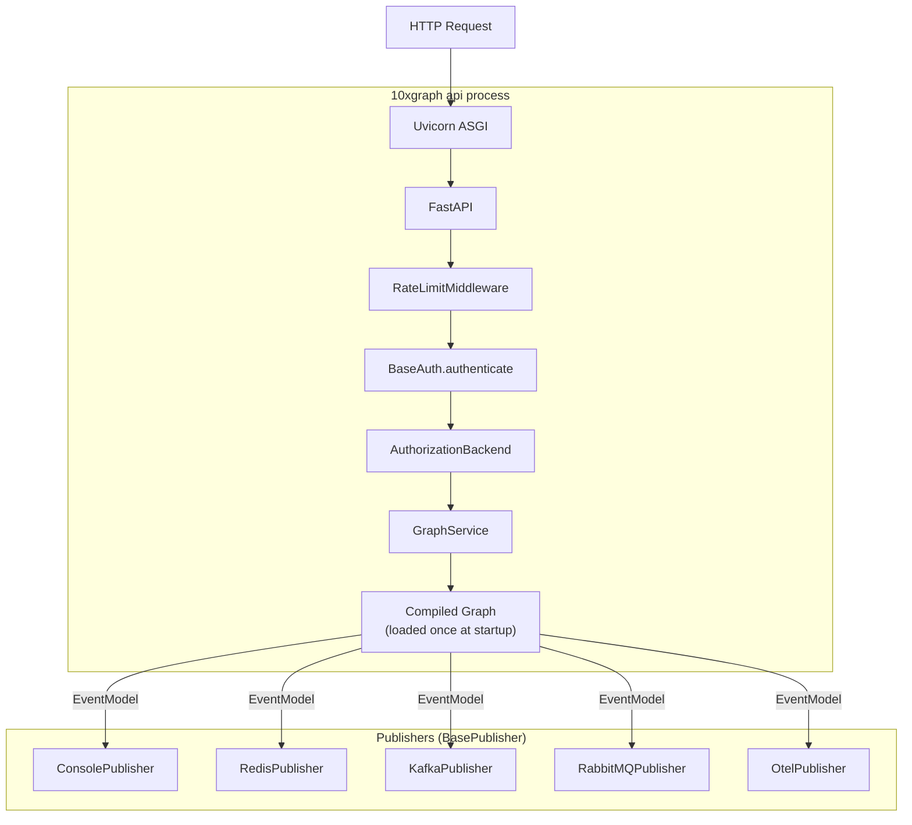

The 10xGraph API server transforms a compiled graph into a production-ready HTTP service. This page explains how the server loads and runs your agent, how authentication and authorization protect it, how publishers stream execution events to external systems, and what configuration controls each piece.

## How the server loads and runs your graph



The API server is a Uvicorn ASGI process that loads your compiled graph **once at startup** and reuses it for every request. This avoids module-loading overhead. The graph itself is stateless; per-request isolation comes from the `thread_id` in the request. In development, `10xgraph api --reload` auto-restarts on file changes. In production, run multiple workers behind a load balancer and use `PgCheckpointer` to share state across them.

## Configuration: `10xgraph.json`

`10xgraph.json` is the single file that wires everything together. The CLI and API server read it at startup to determine which graph to load, which auth to use, and how to configure every service.

Import paths are **dotted module paths** (`module:attribute`), resolved with `importlib`, not file paths.

**Minimal example:**

```json
{
  "agent": "graph.agent:get_compiled_graph",
  "auth": "jwt",
  "rate_limit": {
    "backend": "memory",
    "requests": 100,
    "window": 60
  }
}
```

**Full example with all extensible pieces:**

```json
{
  "agent": "graph.agent:get_compiled_graph",
  "env": ".env",
  "auth": "jwt",
  "authorization": "auth.agent_auth:MyAuthorizationBackend",
  "injectq": "graph.agent:container",
  "store": "services.store:my_store",
  "redis": "redis://localhost:6379",
  "thread_name_generator": "services.naming:MyNameGenerator",
  "rate_limit": {
    "backend": "redis",
    "requests": 1000,
    "window": 60,
    "by": "ip",
    "trusted_proxy_headers": true,
    "exclude_paths": ["/ping", "/docs"],
    "redis": {"url": "redis://localhost:6379"}
  }
}
```

| Key | Type | Purpose |
|---|---|---|
| `agent` | module:callable | Returns a `CompiledGraph`. Required. |
| `env` | file path | Path to a `.env` file, loaded at startup. |
| `auth` | `"jwt"` \| object | `"jwt"` enables built-in JWT auth; `{"method": "custom", "path": "module:Class"}` loads your `BaseAuth` subclass. |
| `authorization` | module:path \| name \| object | Your `AuthorizationBackend`, a built-in name, or an RBAC config. See Authorization. |
| `checkpointer` | module:path | Accepted in the file, but the server does not load it. Pass the checkpointer to `compile(checkpointer=...)` in your graph module instead. |
| `injectq` | module:path | Points to an `InjectQ` container instance. |
| `store` | module:path | Loads your `BaseStore` for long-term memory. |
| `redis` | URL string | Redis URL. The ownership authorization cache uses it as a shared cache tier. |
| `thread_name_generator` | module:path | Loads your `ThreadNameGenerator` class or instance. |
| `rate_limit` | object | Rate limiting config (see below). |

**Starting the server:**

```bash
10xgraph api                                    # development, auto-reload
10xgraph api --config custom.json              # explicit config path (also -c)
10xgraph api --host 0.0.0.0 --port 8000        # bind address
10xgraph play                                   # API + playground in browser
```

## REST endpoints and request flow

The API exposes these routers (all under `/v1` except `/ping`):

| Router | Endpoints | Purpose |
|---|---|---|
| Graph | `POST /v1/graph/invoke`, `POST /v1/graph/stream`, `WebSocket /v1/graph/ws`, `WebSocket /v1/graph/live`, `POST /v1/graph/stop`, `POST /v1/graph/fix`, `GET /v1/graph`, `GET /v1/graph/tools` | Invoke or stream the agent, stop a run, fix interrupted state, get graph info. |
| Threads | `GET /v1/threads`, `GET /v1/threads/{id}`, `GET`/`PUT`/`DELETE /v1/threads/{id}/state`, `GET`/`POST /v1/threads/{id}/messages` | Manage thread state and message history. |
| Store | `POST /v1/store/memories`, `POST /v1/store/memories/list`, `POST /v1/store/memories/{id}`, `POST /v1/store/search` | Long-term memory operations. |
| Files | `POST /v1/files/upload`, `GET /v1/files/{id}`, `GET /v1/files/{id}/info`, `GET /v1/files/{id}/url` | Upload, retrieve, and get signed URLs for media. |
| Config | `GET /v1/config/multimodal` | Get multimodal settings. |
| Ping | `GET /ping` | Health check. |

When configured, rate limiting runs first as middleware. Each protected route then runs authentication (`BaseAuth.authenticate`) and authorization (`AuthorizationBackend.authorize`) before the handler. If no `auth` is configured, authentication and authorization are skipped and every request runs as an anonymous user.

## Authentication

Authentication is pluggable via `BaseAuth`. The framework ships with JWT auth; you can subclass `BaseAuth` to add any other backend.

**Built-in: JWT**

Point `10xgraph.json` to the built-in class by setting `auth` to `"jwt"`:

```json
{
  "auth": "jwt"
}
```

Then set the required environment variables:

```bash
export JWT_SECRET_KEY="your-secret"        # required; use at least 32 random chars
export JWT_ALGORITHM="HS256"               # required to be set in the environment
```

Clients send credentials as `Authorization: Bearer <token>`.

**Custom authentication**

Subclass `BaseAuth` and point `10xgraph.json` to your class:

```python
# auth/firebase_auth.py
from typing import Any
from fastapi import Request, Response
from fastapi.security import HTTPAuthorizationCredentials
from tenxgraph_api import BaseAuth

class FirebaseAuth(BaseAuth):  # assumes firebase_admin is installed and initialized
    def authenticate(
        self, request: Request, response: Response,
        credential: HTTPAuthorizationCredentials | None,
    ) -> dict[str, Any] | None:
        if credential is None:
            return None  # treated as an anonymous user
        try:
            claims = firebase_admin.auth.verify_id_token(credential.credentials)
            return {"user_id": claims["uid"], **claims}
        except Exception:
            return None  # treated as an anonymous user
```

Important: `authenticate` is **synchronous**. Declaring it `async def` returns an un-awaited coroutine and breaks auth.

```json
{
  "auth": {"method": "custom", "path": "auth.firebase_auth:FirebaseAuth"}
}
```

Returning `None` or an empty dict gives the request an empty identity rather than a 401 by itself. To reject a request, raise an `HTTPException` (the built-in JWT auth raises a 401 error). The returned keys must include `user_id`.

## Authorization

Authorization is separate from authentication. After the user is identified, `AuthorizationBackend` decides whether they can perform a specific operation on a specific resource.

```python
# auth/multi_tenant.py
from typing import Any
from tenxgraph_api.src.app.core.auth.authorization import AuthorizationBackend

class TenantAuthorizationBackend(AuthorizationBackend):
    async def authorize(
        self, user: dict[str, Any], resource: str, action: str,
        resource_id: str | None = None, **context: Any,
    ) -> bool:
        # resource: "graph" | "checkpointer" | "store" | "files" | "config"
        # action: "invoke" | "stream" | "stop" | "fix" | "read" | "write" | "delete" | "upload"
        # resource_id: thread_id or memory_id when applicable
        return user.get("tenant_id") == context.get("tenant_id")
```

```json
{
  "authorization": "auth.multi_tenant:TenantAuthorizationBackend"
}
```

If no `authorization` key is set, the default depends on `MODE`:
- **production**: `"ownership"` (a user can read, run, stop and fix only threads they own)
- **development**: `"allow_all"` (any authenticated user can access all threads)

Override by setting `authorization` to a `module:attr` path, a built-in name (`"ownership"`, `"allow_all"`, `"default"`, `"none"`), or an RBAC config object (`{"backend": "rbac", "roles": {...}}`).

## Rate limiting

Rate limiting is pluggable via `BaseRateLimitBackend`. Two backends are built in (`memory` and `redis`); set `backend` to `custom` to supply your own.

```json
{
  "rate_limit": {
    "backend": "memory",
    "requests": 100,
    "window": 60,
    "by": "ip",
    "trusted_proxy_headers": true,
    "fail_open": false,
    "exclude_paths": ["/ping"]
  }
}
```

The memory backend counts per process, so use `redis` when you run several workers.

| Config key | Default | Purpose |
|---|---|---|
| `enabled` | true | Set `false` to turn rate limiting off. |
| `backend` | `memory` | `memory` (single-worker dev), `redis` (multi-worker), or `custom` (a `BaseRateLimitBackend` bound in InjectQ). |
| `requests` | 100 | Requests allowed per window. |
| `window` | 60 | Time window in seconds. |
| `by` | `ip` | `ip` (per client IP), `user`, or `global` (all callers share one limit). |
| `trusted_proxy_headers` | false | Honor `X-Forwarded-For` when true. |
| `fail_open` | true | Allow requests if the backend is unreachable. |
| `exclude_paths` | `[]` | Paths exempt from rate limiting. |

For the `redis` backend, add a `redis` key with the connection URL:

```json
{
  "rate_limit": {
    "backend": "redis",
    "redis": {
      "url": "redis://localhost:6379",
      "prefix": "ratelimit:"
    }
  }
}
```

**Custom backend:**

```python
# services/rate_limit.py
from tenxgraph_api.src.app.core.middleware.rate_limit.base import (
    BaseRateLimitBackend,
    RateLimitDecision,
)

class CustomRateLimitBackend(BaseRateLimitBackend):
    async def check(self, key: str, *, limit: int, window: int) -> RateLimitDecision:
        # Atomically count the request, then return a decision.
        # allowed=False produces a 429 response.
        return RateLimitDecision(allowed=True, remaining=limit - 1, reset_after=window)

    async def close(self) -> None:
        ...
```

Set `"backend": "custom"` in `rate_limit`, and register the backend through the container that `injectq` points to:

```json
{
  "injectq": "graph.agent:container",
  "rate_limit": {"backend": "custom", "requests": 100, "window": 60}
}
```

Then in your graph module:

```python
from injectq import InjectQ
from services.rate_limit import CustomRateLimitBackend
from tenxgraph_api.src.app.core.middleware.rate_limit.base import BaseRateLimitBackend

container = InjectQ.get_instance()
container.bind_instance(BaseRateLimitBackend, CustomRateLimitBackend())
```

## Publishers

Publishers emit `EventModel` on every execution event: node start/end, tool calls, state updates, errors. Each takes a config dict. Wire them at `StateGraph` initialization, not at compile. Install the extras you use, for example `pip install "10xgraph[redis,kafka]"`:

```python
from tenxgraph.runtime.publisher import CompositePublisher, RedisPublisher, KafkaPublisher
from tenxgraph.core.graph import StateGraph

publisher = CompositePublisher([
    RedisPublisher({"url": "redis://localhost:6379/0", "channel": "agent.events"}),
    KafkaPublisher({"bootstrap_servers": "kafka:9092", "topic": "agent-events"}),
])

graph = StateGraph(publisher=publisher)  # a list of publishers also works
# ... add nodes and edges ...
compiled = graph.compile()
```

| Publisher | Transport | Use case |
|---|---|---|
| `ConsolePublisher` | stdout | Development, debugging |
| `RedisPublisher` | Redis pub/sub | Real-time dashboards, fan-out |
| `KafkaPublisher` | Kafka topic | High-throughput event pipelines |
| `RabbitMQPublisher` | RabbitMQ exchange | Queue-based workflows, notifications |
| `OtelPublisher` | OpenTelemetry | Distributed tracing, observability |

**Custom publisher:**

```python
from tenxgraph.runtime.publisher.base_publisher import BasePublisher
from tenxgraph.runtime.publisher.events import EventModel

class DatadogPublisher(BasePublisher):
    async def publish(self, event: EventModel) -> None:
        datadog.send_event(event.model_dump())

    async def close(self) -> None:
        pass

    def sync_close(self) -> None:
        pass
```

`CompositePublisher` fans each event out to all of its publishers concurrently; a failure in one is logged and does not block the others.

## Dependency injection

`InjectQ` is the DI container shipped with 10xGraph. Create a container, register service instances, pass it to `StateGraph`, and node functions receive their dependencies automatically.

**Setting up a container:**

```python
# graph/agent.py
from injectq import InjectQ
from services.db import DatabaseService

container = InjectQ.get_instance()
container.bind_instance(DatabaseService, DatabaseService())
container["api_version"] = "v2"  # named scalar values

graph = StateGraph(container=container)
# ... add nodes and edges ...
```

**Using the container in the API:**

Point `injectq` in `10xgraph.json` to the exported container:

```json
{
  "injectq": "graph.agent:container"
}
```

The value is a dotted `module:attribute` path that resolves to an `InjectQ` instance, not a class, not a dict. The server loads that object and activates it as the global singleton at startup.

**Consuming in nodes:**

```python
from injectq import Inject
from services.db import DatabaseService

async def my_node(
    state: AgentState,
    config: dict,  # run config dict (thread_id, user_id, etc.)
    db: DatabaseService = Inject[DatabaseService],
) -> Message:
    result = await db.query("SELECT ...")
    return Message.text_message(str(result), role="assistant")
```

## Thread naming

By default, each new thread gets a random adjective-noun name (e.g., `"thoughtful-dialogue"`, `"creative-insight"`) generated by `AIThreadNameGenerator`. Override it by subclassing `ThreadNameGenerator`:

```python
# services/naming.py
from tenxgraph_api import ThreadNameGenerator

class SlugThreadNameGenerator(ThreadNameGenerator):
    async def generate_name(self, messages: list[str]) -> str:
        first = next((m for m in messages if m and m.strip()), "")
        first = " ".join(first.split())
        return (first[:50] + "…") if len(first) > 50 else first or "new-thread"
```

```json
{
  "thread_name_generator": "services.naming:SlugThreadNameGenerator"
}
```

## Production deployment

For production scale, run multiple worker processes behind a load balancer. Because state is stored in the checkpointer (and optionally in the memory store), any worker can handle any request as long as they share the same storage backend.

```bash
10xgraph build                          # Generate Dockerfile
10xgraph build --docker-compose         # + docker-compose.yml
```

Key environment variables (set in `.env`, as Docker `ENV`, or via `--env-file`):

```bash
MODE=production              # enables security guards
REDIS_URL=redis://redis:6379
JWT_SECRET_KEY=your-secret-32-chars
SENTRY_DSN=https://...@sentry.io/123
OTEL_ENABLED=true
OTEL_SERVICE_NAME=my-agent
OTEL_EXPORTER_OTLP_ENDPOINT=http://collector:4317
ORIGINS=https://example.com,https://app.example.com
```

| Variable | Default | Purpose |
|---|---|---|
| `MODE` | `development` | Set to `production` to enable security checks |
| `REDIS_URL` | none | Redis connection used by server components such as the ownership cache |
| `JWT_SECRET_KEY` | none | Required for JWT auth; use 32+ random chars |
| `SENTRY_DSN` | none | Sentry error tracking |
| `OTEL_ENABLED` | `false` | Enable OpenTelemetry tracing |
| `OTEL_SERVICE_NAME` | `10xgraph-api` | Service name in traces |
| `OTEL_EXPORTER_OTLP_ENDPOINT` | none | OTLP collector URL; omit to log spans to console |
| `ORIGINS` | `*` | CORS allowed origins; restrict in production |

## OpenTelemetry

10xGraph has built-in OpenTelemetry support at two layers: the API (HTTP spans) and the graph (execution spans).

**Enable automatically:**

```bash
OTEL_ENABLED=true
OTEL_SERVICE_NAME=my-agent
OTEL_EXPORTER_OTLP_ENDPOINT=http://collector:4317
OTEL_LEVEL=standard    # spans | standard | full
```

No code changes needed. The API server automatically:
- Instruments the FastAPI app (HTTP-level spans)
- Wires `OtelPublisher` into the graph
- Exports via OTLP when configured; falls back to console output in dev

The span tree is:

```
tenxgraph.graph      ← one per invoke/stream
  tenxgraph.node     ← one per node (e.g. MAIN, TOOL)
    tenxgraph.llm    ← one per LLM call (tokens, model, finish)
    tenxgraph.tool   ← one per tool call (name, type)
```

The `tenxgraph.graph` span carries `thread_id` as `session.id`, so tools like Langfuse group multi-turn conversations automatically.

**Install:**

```bash
pip install "10xgraph[otel]"        # graph-level spans
pip install "10xgraph-api[otel]"    # API layer spans + OTLP exporter
```

## What's next

Read the [API server guide](/docs/server) for tasks like configuring auth, setting up multi-worker deployments, and monitoring production systems. See the [Memory](/docs/concepts/memory) page to understand checkpointing and the long-term store. The [Extensibility](/docs/concepts/extensibility) page covers all extension points: `BaseAuth`, `AuthorizationBackend`, `BasePublisher`, `BaseCheckpointer`, and `BaseStore`.
