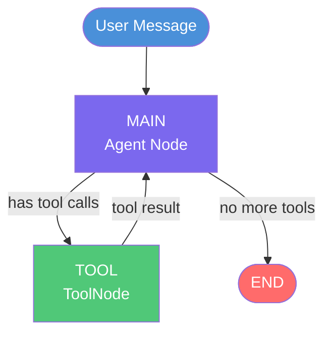

## What you will build

A conversational weather assistant that demonstrates the core building blocks of a 10xGraph agent. The example shows how an `Agent` orchestrates LLM calls, how `ToolNode` exposes Python functions as callable tools, and how conditional routing decides whether to execute a tool or return a final response to the user. The graph loops between the agent and a tool node until the LLM produces a plain text reply, then stops.

This is a foundation pattern you extend for search agents, customer support, data extraction, and multi-agent systems.

## How to run it

Clone the 10xGraph repository and run the example from the `agentflow/examples/agent-class/` directory:

```bash
cd agentflow/examples/agent-class
pip install "10xgraph[google-genai]"
export GEMINI_API_KEY="<your_key>"
python graph.py
```

For other providers, install the corresponding extra: `10xgraph[openai]`, `10xgraph[anthropic]`.

Environment variables:
- `GEMINI_API_KEY`: your Google API key (required if using Gemini)
- `OPENAI_API_KEY`: your OpenAI key (required if using GPT)
- `ANTHROPIC_API_KEY`: your Anthropic key (required if using Claude)

## How the graph works

The agent runs in a loop: it receives a user message, decides whether to call a tool, executes the tool if needed, and then responds. A routing function (`should_use_tools`) controls the flow.



The sequence of execution:

1. User sends a message to the graph.
2. The MAIN node (an `Agent`) forwards messages and any available tools to the LLM.
3. The LLM responds: either with a tool call or a plain text reply.
4. The routing function checks the response. If it contains a tool call, it sends the state to the TOOL node. Otherwise, it sends the state to END.
5. The TOOL node executes the requested tool (e.g., `get_weather`), captures the result as a message, and returns to MAIN.
6. MAIN sends the tool result to the LLM again, and the loop repeats.
7. When the LLM produces a plain text reply with no tool calls, the routing function routes to END and the graph stops.

This loop handles multi-turn conversations where the agent calls tools multiple times before answering.

## The example code, step by step

### Step 1: Define your tool

A tool is a Python function with type hints. The type hints and docstring become the JSON schema the LLM sees.

```python title="agentflow/examples/agent-class/graph.py"
def get_weather(location: str) -> str:
    """Get the current weather for a specific location."""
    return f"The weather in {location} is sunny"
```

In production, this function would call a real weather API. For this example, it returns a simple mock response.

### Step 2: Wrap the tool in a ToolNode

A `ToolNode` takes a list of callables and exposes them as tools the LLM can invoke. The node executes tools in parallel if the LLM requests multiple tools at once.

```python
from tenxgraph.core.graph import ToolNode

tool_node = ToolNode([get_weather])
```

### Step 3: Create the graph and add the Agent node

Create a `StateGraph` and add an `Agent` node. The Agent handles LLM calls, message formatting, and tool integration. The `tool_node` parameter tells the Agent which node name to route to when tools are called.

```python
from tenxgraph.core.graph import Agent, StateGraph

graph = StateGraph()

graph.add_node(
    "MAIN",
    Agent(
        model="google/gemini-2.5-flash",
        system_prompt=[
            {
                "role": "system",
                "content": "You are a helpful assistant. Help user queries effectively.",
            }
        ],
        tool_node="TOOL",
    ),
)
```

The `model` parameter accepts provider-qualified strings: `google/gemini-2.5-flash`, `openai/gpt-4o`, `anthropic/claude-opus-5`. The system prompt is a list of message dicts; the Agent will include these in every LLM call.

### Step 4: Add the tool node

```python
graph.add_node("TOOL", tool_node)
```

### Step 5: Write the routing function

After each node runs, the graph calls a routing function to decide the next node. This function inspects the state and returns the name of the next node (or a special constant like `END`).

```python
from tenxgraph.core.state.agent_state import AgentState
from tenxgraph.utils.constants import END

def should_use_tools(state: AgentState) -> str:
    """Route to TOOL if the last message has tool calls, else END."""
    if not state.context or len(state.context) == 0:
        return "TOOL"

    last_message = state.context[-1]

    # If assistant message has tool calls, go to TOOL
    if (
        hasattr(last_message, "tools_calls")
        and last_message.tools_calls
        and len(last_message.tools_calls) > 0
        and last_message.role == "assistant"
    ):
        return "TOOL"

    # If tool message, go back to MAIN for a response
    if last_message.role == "tool":
        return "MAIN"

    # Otherwise end
    return END
```

`AgentState` is the state object passed through the graph. `state.context` is a list of messages. The `role` field tells you who sent the message: `"user"`, `"assistant"`, or `"tool"`.

### Step 6: Wire the edges and compile

Connect the nodes with edges and a conditional routing rule. The conditional edge calls `should_use_tools` after the MAIN node runs, and routes based on the returned node name.

```python
graph.add_conditional_edges(
    "MAIN",
    should_use_tools,
    {"TOOL": "TOOL", END: END},
)

graph.add_edge("TOOL", "MAIN")  # Always return to MAIN after tools run
graph.set_entry_point("MAIN")

app = graph.compile()
```

### Step 7: Invoke the graph

Create an input dict with messages, set a config (thread_id for persistence, recursion_limit to prevent infinite loops), and invoke.

```python
from tenxgraph.core.state.message import Message

inp = {"messages": [Message.text_message("How is weather in London?")]}
config = {"thread_id": "12345", "recursion_limit": 10}

res = app.invoke(inp, config=config)

for msg in res["messages"]:
    print(f"[{msg.role}] {msg.text()}")
```

The messages come back in order: the user message, an assistant message carrying the `get_weather` tool call (empty text), the tool result, and the final assistant reply. The final wording depends on the model.

## Complete source

```python title="agentflow/examples/agent-class/graph.py"
import os

from dotenv import load_dotenv

from tenxgraph.core.graph import Agent, StateGraph, ToolNode
from tenxgraph.core.state.agent_state import AgentState
from tenxgraph.core.state.message import Message
from tenxgraph.utils.constants import END


load_dotenv()


def get_weather(
    location: str,
) -> str:
    """
    Get the current weather for a specific location.
    This demo shows injectable parameters: tool_call_id and state are automatically injected.
    """
    return f"The weather in {location} is sunny"


tool_node = ToolNode([get_weather])


graph = StateGraph()
graph.add_node(
    "MAIN",
    Agent(
        model="google/gemini-2.5-flash",
        system_prompt=[
            {
                "role": "system",
                "content": "You are a helpful assistant, Help user queries effectively.",
            }
        ],
        tool_node="TOOL",
    ),
)
graph.add_node("TOOL", tool_node)


def should_use_tools(state: AgentState) -> str:
    """Determine if we should use tools or end the conversation."""
    if not state.context or len(state.context) == 0:
        return "TOOL"  # No context, might need tools

    last_message = state.context[-1]

    # If the last message is from assistant and has tool calls, go to TOOL
    if (
        hasattr(last_message, "tools_calls")
        and last_message.tools_calls
        and len(last_message.tools_calls) > 0
        and last_message.role == "assistant"
    ):
        return "TOOL"

    # If last message is a tool result, we should be done (AI will make final response)
    if last_message.role == "tool":
        return "MAIN"

    # Default to END for other cases
    return END


# Add conditional edges from MAIN
graph.add_conditional_edges(
    "MAIN",
    should_use_tools,
    {"TOOL": "TOOL", END: END},
)

# Always go back to MAIN after TOOL execution
graph.add_edge("TOOL", "MAIN")
graph.set_entry_point("MAIN")

app = graph.compile()


if __name__ == "__main__":
    inp = {"messages": [Message.text_message("How is weather in London?")]}
    config = {"thread_id": "12345", "recursion_limit": 10}

    res = app.invoke(inp, config=config)

    for i in res["messages"]:
        print("**********************")
        print("Message Type: ", i.role)
        print(i)
        print("**********************")
        print("\n\n")
```

## Key concepts

| Concept | Purpose |
|---|---|
| `Agent` | Wraps LLM calls and message conversion. Set `tool_node` to the name of the node that runs its tool calls. |
| `ToolNode` | Wraps a list of callables, executes them in parallel, and returns tool-result messages. Injectable params like `state` and `tool_call_id` are filled automatically. |
| `should_use_tools` | The routing function. Runs after every node and returns the next node name. |
| Conditional edge | Connects a node to a routing function and maps return values to next nodes. |
| `AgentState` | The graph state. Contains `context` (list of messages) and any custom fields you add by subclassing. |
| Recursion limit | Prevents infinite loops. Default is 25 hops (LLM calls + tool calls). |

## What to try next

- Add more tools: pass additional functions to `ToolNode([get_weather, get_news, search])`.
- Add custom state: subclass `AgentState` to track user context, session data, or conversation metadata.
- Enable memory: use a `Checkpointer` (SQLite or Postgres+Redis) to persist state across runs on the same thread.
- Serve over HTTP: create a `10xgraph.json` config and run `10xgraph api` to expose the graph as a REST API.

## See also

- [Agent class reference](/docs/reference/python/agent): all constructor options and methods.
- [ToolNode and tool decorator](/docs/guides/use-tool-decorator): write custom tools, injectable parameters, error handling.
- [Conditional edges and routing](/docs/guides/build-a-graph): routing patterns and control flow.
- [Checkpoint and persist state](/docs/guides/set-up-checkpointing): keep conversation memory across runs.
