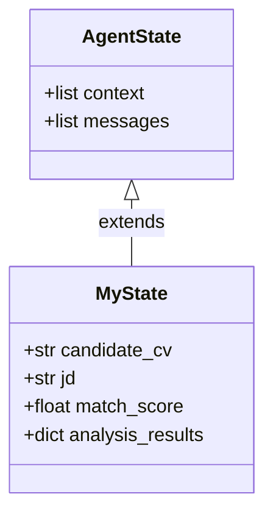
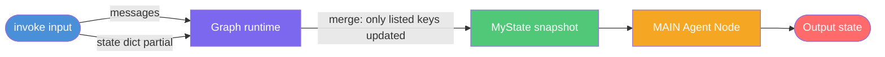

**Source example:** [`examples/custom-state/custom_state.py`](https://github.com/10xGraph/10xGraph/blob/main/examples/custom-state/custom_state.py)

## What you will build

An HR assistant that evaluates candidates by matching their CVs against job descriptions. Unlike a simple chatbot that only remembers conversation history, this agent carries domain-specific data: the candidate's CV text, the job description, a computed match score, and detailed analysis results. You will learn how to subclass `AgentState` to add typed fields, wire them into the graph and checkpointer, seed them before running, and update them selectively without affecting other state.

## Why custom state matters

The default `AgentState` holds two fields: `context` (the conversation history) and `messages` (incoming user messages). These are sufficient for a chatbot, but real agents need to carry structured context. For an HR assistant, you need the candidate information, job details, and scores. For a data analyst, you might track data sources and computed metrics. For a support agent, you track the customer account, ticket ID, and resolution state.

By extending `AgentState`, you make that data:
- **Typed**: your IDE and type checker catch field name and type errors.
- **Persistent**: checkpointers save and restore it across turns automatically.
- **Mergeable**: you update individual fields at invoke time without losing the rest.
- **Introspectable**: the agent can read these fields in routing logic and tool implementations.



## How to run this example

Clone the repository and navigate to the example directory:

```bash
git clone https://github.com/10xGraph/10xGraph.git
cd 10xGraph/examples/custom-state
```

Install the core library with Google Gemini support:

```bash
pip install "10xgraph[google-genai]"
```

Set your API key:

```bash
export GEMINI_API_KEY="your-api-key-here"
```

Run the example:

```bash
python custom_state.py
```

The script runs three test functions that demonstrate basic invocation, pre-populating custom fields, and partial state updates.

## Building the custom state class

Start by subclassing `AgentState` and adding typed fields with defaults:

```python
from typing import Any
from tenxgraph.core.state import AgentState

class MyState(AgentState):
    """Custom state with additional fields for resume matching."""
    candidate_cv: str = ""
    jd: str = ""
    match_score: float = 0.0
    analysis_results: dict[str, Any] = {}
```

Every field must have a default value. Pydantic enforces this because the state is serialized and restored from checkpoints. You can use any JSON-serializable type: strings, numbers, booleans, lists, dicts, or nested Pydantic models.

## Creating a typed checkpointer

The checkpointer preserves state across turns. Pass your custom state as a generic parameter so the checkpointer knows how to serialize and deserialize it correctly:

```python
from tenxgraph.storage.checkpointer import InMemoryCheckpointer

checkpointer = InMemoryCheckpointer[MyState]()
```

For production, use `PgCheckpointer[MyState]()` instead to persist state across server restarts. The type parameter is required in both cases.

## Building the graph with custom state

Pass an instance of your custom state class to `StateGraph`:

```python
from tenxgraph.core import Agent, StateGraph

def create_app(initial_state: MyState | None = None):
    state = initial_state or MyState()

    agent = Agent(
        model="gemini-2.5-flash",
        provider="google",
        system_prompt=[
            {
                "role": "system",
                "content": "You are a helpful HR assistant. Analyse CVs against job descriptions.",
            }
        ],
        trim_context=True,
    )

    graph = StateGraph[MyState](state)
    graph.add_node("MAIN", agent)
    graph.set_entry_point("MAIN")

    return graph.compile(checkpointer=checkpointer)
```

The `StateGraph[MyState]` generic parameter tells 10xGraph to use your custom state class. When you compile the graph, the checkpointer is wired in automatically, so state persists across invocations within the same thread.

## Three ways to invoke the agent

### 1. Basic invocation

The simplest case: just send a message and let the default state fields be used:

```python
from tenxgraph.core.state import Message

app = create_app()
res = app.invoke(
    {"messages": [Message.text_message("Hello, can you help me with CV analysis?")]},
    config={"thread_id": "basic_test", "recursion_limit": 10},
)
```

The agent runs with empty CV, job description, and match score fields. It can still help, but has no candidate data to work with.

### 2. Pre-populate custom fields before creation

Create a state instance and populate fields, then pass it to `create_app`:

```python
custom_state = MyState()
custom_state.candidate_cv = "John Doe — Senior Python Engineer, 5 years experience"
custom_state.jd = "Looking for Senior Python Developer with 3+ years experience"
custom_state.match_score = 0.85
custom_state.analysis_results = {"skills_match": True, "experience_match": True}

app = create_app(custom_state)
res = app.invoke(
    {"messages": [Message.text_message("What's the match score for this candidate?")]},
    config={"thread_id": "custom_test"},
)
```

The agent sees all the context: it knows the candidate's background, the job requirements, and can provide intelligent analysis.

### 3. Partial state update at invoke time

Update only the fields you need without touching the rest. Pass a `state` dict in the input:

```python
from tenxgraph.utils import ResponseGranularity

res = app.invoke(
    {
        "messages": [Message.text_message("Update the job description only.")],
        "state": {"jd": "Looking for Data Scientist with deep learning experience"},
    },
    config={"thread_id": "partial_update_test"},
    response_granularity=ResponseGranularity.FULL,
)

# The returned state reflects the partial update
updated_state = res["state"]
print(updated_state.jd)           # new value
print(updated_state.candidate_cv)  # unchanged from before
```

This is the most powerful pattern for multi-turn interactions. You can update the job description without rewriting the CV or resetting scores. Other fields remain exactly as they were in the checkpoint.

## Understanding partial state merge

When you invoke with a `state` dict, 10xGraph merges it with the existing checkpoint state by updating only the keys you provide. This is crucial for multi-step workflows where different API calls handle different aspects of the agent's context.



## Running the complete example

The example file includes three test functions that you can run sequentially:

```python
if __name__ == "__main__":
    # Run tests
    try:
        test_basic_functionality()           # Invoke with default state
        test_custom_state_fields()           # Pre-populate fields
        test_partial_state_update()          # Update one field at invoke time
        print("\n=== All tests completed successfully! ===")
    except Exception as e:
        print(f"Error during testing: {e}")
        raise
```

Each test demonstrates a pattern:
1. **Basic**: no custom data, just chat
2. **Custom fields**: pre-seed state before creating the app
3. **Partial update**: merge new values at invoke time while preserving the rest

## Key patterns to remember

| Pattern | Use case | Example |
|---|---|---|
| Subclass `AgentState` | Add domain fields once | `class MyState(AgentState): candidate_cv: str = ""` |
| Generic `StateGraph[MyState]` | Tell the runtime the state type | `graph = StateGraph[MyState](state)` |
| Generic `Checkpointer[MyState]` | Type-safe persistence | `InMemoryCheckpointer[MyState]()` |
| Pre-populate fields | Set context before first invoke | `state.candidate_cv = "..."` then `create_app(state)` |
| Partial `state` dict at invoke | Update single fields between turns | `invoke({..., "state": {"jd": "..."}})` |
| `ResponseGranularity.FULL` | Get the full state back | Inspect `res["state"]` after invoke |

## What you learned

- How to extend `AgentState` with custom typed fields for domain context.
- How to use generics (`StateGraph[MyState]`, `Checkpointer[MyState]`) to wire state through the runtime.
- Three ways to populate state: defaults, pre-seeding, and partial updates at invoke time.
- How partial state merge preserves untouched fields across turns.
- Why typing your state fields matters for IDE support and production reliability.

## Next steps

- Read the [custom state guide](/docs/guides/use-custom-state) for complete details on reducers and serialization.
- See [state and messages concepts](/docs/concepts/state-and-messages) to understand the full state model.
- Explore [checkpointing and threads](/docs/concepts/checkpointing-and-threads) to choose the right persistence strategy for production.
- Try the [tool decorator example](/docs/examples/tool-decorator) to learn how agents access and use state inside tools.
