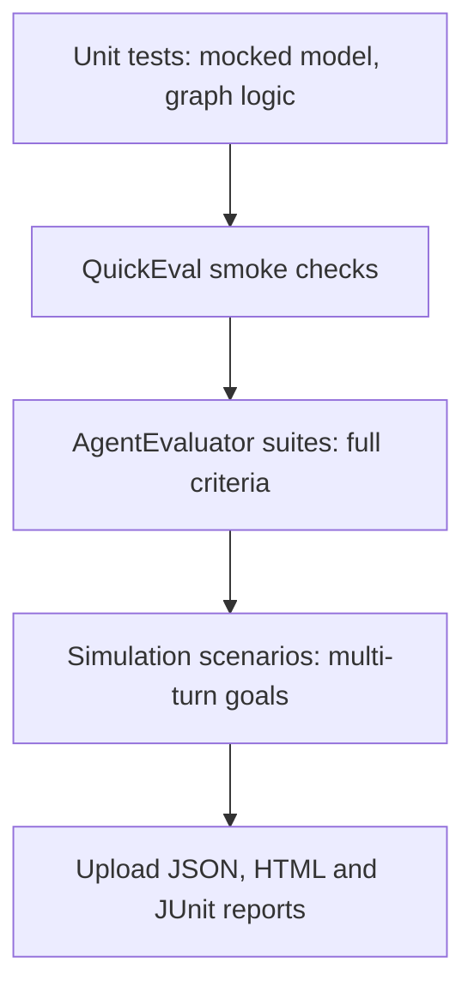

This example evaluates a small weather agent end to end: it defines eval cases, runs quick checks, scores tool trajectories, simulates multi-turn users and writes JSON, HTML and JUnit reports. It shows how to measure whether a real agent behaves correctly, which unit tests with a mocked model cannot do.

## What the example contains

The example lives in `agentflow/examples/evaluation`. One shared weather agent graph backs five test folders, each focused on a different part of the evaluation API.

| Path | What it shows |
|---|---|
| `test_graph/__init__.py` | The weather agent graph and `create_app_and_collector()` |
| `samples.py` | Shared `EvalCase` and `EvalSet` definitions, including trajectory cases |
| `test1/` | Criteria on single cases (the module is entirely commented out, kept as a reference) |
| `test2/` | Every criterion type in `AgentEvaluator` |
| `test3/` | `UserSimulator`, `BatchSimulator` and `SimulationGoalsCriterion` |
| `test4/` | `QuickEval`, `EvalSetBuilder`, presets and reporters |
| `test5/` | `evaluate_case`, `evaluate`, rubrics, presets and `EvaluationRunner` |

## Run the example

The tests call a live Gemini model, so install the Google extra and set an API key first. Each test module calls `pytest.skip` at import time so a root pytest run stays offline; delete that call in the module you want to run.

```bash
# From the agentflow/ directory of the repo
pip install "10xgraph[google-genai]"
export GEMINI_API_KEY="your-key"   # GOOGLE_API_KEY also works

# After removing the module-level pytest.skip in test4
pytest examples/evaluation/test4/ -v -s
```

The tests use relative imports (`from ..test_graph import ...`), so run pytest from the `agentflow/` directory rather than from inside the example folder.

## The weather agent under test

The shared graph has one model node and one tool node, wired with the usual tool loop. Two plain Python functions are the tools, and `create_app_and_collector()` compiles the graph with a trajectory collector so evaluators can see which tools ran.

```python
# examples/evaluation/test_graph/__init__.py (condensed)
from tenxgraph.core.graph import Agent, StateGraph, ToolNode
from tenxgraph.core.state import AgentState
from tenxgraph.qa.evaluation.testing import create_eval_app
from tenxgraph.utils.constants import END


def get_weather(location: str) -> str:
    """Get the current weather for a location."""
    return f"The weather in {location} is sunny"


def get_forecast(location: str, days: int = 3) -> str:
    """Get a multi-day weather forecast for a location."""
    return f"{days}-day forecast for {location}: sunny, cloudy, sunny"


agent = Agent(
    model="gemini-2.5-flash",
    provider="google",
    system_prompt=[{"role": "system", "content": "You are a helpful weather assistant."}],
    tool_node="TOOL",
)


def should_use_tools(state: AgentState) -> str:
    last = state.context[-1] if state.context else None
    if last is None:
        return "TOOL"
    if getattr(last, "tools_calls", None) and last.role == "assistant":
        return "TOOL"
    if last.role == "tool":
        return "MAIN"
    return END


graph = StateGraph()
graph.add_node("MAIN", agent)
graph.add_node("TOOL", ToolNode([get_weather, get_forecast]))
graph.add_conditional_edges("MAIN", should_use_tools, {"TOOL": "TOOL", END: END})
graph.add_edge("TOOL", "MAIN")
graph.set_entry_point("MAIN")

# Returns (compiled_graph, collector)
compiled_graph, collector = create_eval_app(graph)
```

The example file uses a fuller system prompt and builds the graph inside a function; the structure is the same. Each test folder exposes `compiled_graph` and `collector` as session-scoped pytest fixtures in its `conftest.py`.

## Define eval cases and an eval set

Eval cases describe what the agent should do for one input. `samples.py` is the single source of truth, so every test folder reuses the same cases.

```python
# examples/evaluation/samples.py (excerpt)
from tenxgraph.qa.evaluation.dataset import EvalCase, ToolCall
from tenxgraph.qa.evaluation.dataset.eval_set import EvalSet

NYC = EvalCase.single_turn(
    eval_id="nyc_happy",
    name="NYC happy path",
    user_query="Please call the get_weather function for New York City",
    expected_response="The weather in New York City is sunny",
    expected_tools=[ToolCall(name="get_weather")],
)

CAPITAL_QUESTION = EvalCase.single_turn(
    eval_id="capital_no_tool",
    name="General knowledge, no tool",
    user_query="What is the capital of France?",
    expected_response="Paris",
    expected_tools=[],  # empty list asserts zero tool calls
)

EVAL_SET = EvalSet(
    eval_set_id="weather_agent_eval",
    name="Weather Agent Evaluation Suite",
    eval_cases=[NYC, CAPITAL_QUESTION],
)
```

`samples.py` also defines trajectory cases such as `WEATHER_THEN_FORECAST`, whose `expected_tools` list `get_weather` then `get_forecast`. See [Eval sets](/docs/testing/eval-sets) for the full dataset format.

## Get fast feedback with QuickEval

`QuickEval` scores a query without building an eval set or config. Test4 uses `check()` for one query, `batch()` for query and response pairs, `tool_usage()` for tool expectations and `conversation_flow()` for a short multi-turn run.

```python
# examples/evaluation/test4/test_single_turn.py (excerpt)
from tenxgraph.qa.evaluation import QuickEval, assert_eval_passed

report = await QuickEval.check(
    graph=compiled_graph,
    collector=collector,
    query="What is the weather in London?",
    expected_response_contains="sunny",
    expected_tools=["get_weather"],
    threshold=0.5,
    print_results=True,
)
assert_eval_passed(report)  # raises if the pass rate is below 1.0

# Several query and expected-response pairs at once
report = await QuickEval.batch(
    graph=compiled_graph,
    collector=collector,
    test_pairs=[
        ("Weather in NYC?", "The weather in NYC is sunny"),
        ("Capital of Spain?", "The capital of Spain is Madrid"),
    ],
    threshold=0.3,
)
```

Test4 also covers `EvalSetBuilder` with `QuickEval.from_builder()` and `QuickEval.preset()` with `EvalPresets.quick_check()`.

## Score tool usage and trajectories

Trajectory criteria compare the tools the agent actually called against `expected_tools`. Test2 combines the criteria that need no judge model in one config, so a single agent run is scored several ways.

```python
# examples/evaluation/test2/test_weather_agent.py (excerpt)
from tenxgraph.qa.evaluation import AgentEvaluator, CriterionConfig, EvalConfig, MatchType

config = EvalConfig(
    criteria={
        "tool_name_match_score": CriterionConfig.tool_name_match(threshold=1.0),
        "tool_trajectory_avg_score": CriterionConfig.trajectory(
            threshold=1.0,
            match_type=MatchType.EXACT,
        ),
        "rouge_match": CriterionConfig.rouge_match(threshold=0.4),
        "contains_keywords": CriterionConfig.contains_keywords(
            keywords=["New York", "sunny"], threshold=0.5
        ),
    },
    reporter={"enabled": True},
)
evaluator = AgentEvaluator(compiled_graph, collector, config=config)
result = await evaluator.evaluate_case(WEATHER_NYC)
assert result.passed, [c.criterion for c in result.failed_criteria]
```

`MatchType` controls how strict the comparison is.

| Match type | Passes when |
|---|---|
| `EXACT` | The same tools are called with the same arguments and order |
| `IN_ORDER` | Expected tools appear in order, extra calls are allowed |
| `ANY_ORDER` | Expected tools all appear in any order, extra calls are allowed |

The result object carries the pass state, a score per criterion, the actual response, the actual tool calls and the duration. Test5 asserts on each of these fields. See [Criteria](/docs/testing/criteria) for every criterion.

## Simulate a multi-turn user

A simulated user plays a scenario against your agent and a judge scores whether the goals were met. Use it when success depends on the whole conversation rather than one reply. Test3 runs a scenario, attaches `SimulationGoalsCriterion`, and runs several scenarios with `BatchSimulator`.

```python
# examples/evaluation/test3/test_weather_simulator.py (excerpt)
from tenxgraph.qa.evaluation import (
    BatchSimulator,
    ConversationScenario,
    CriterionConfig,
    SimulationGoalsCriterion,
    UserSimulator,
)

scenario = ConversationScenario(
    scenario_id="weather_single_city",
    description="User wants to know the current weather in Tokyo for trip planning",
    starting_prompt="I'm thinking of visiting Tokyo soon. Can you help me?",
    conversation_plan=(
        "1. User hints at travel interest\n"
        "2. User explicitly asks for Tokyo weather\n"
        "3. User confirms they got the information they needed"
    ),
    goals=["Get weather information for Tokyo"],
    max_turns=4,
)

judge = SimulationGoalsCriterion(config=CriterionConfig(enabled=True, threshold=0.5))
simulator = UserSimulator(model="gemini/gemini-2.5-flash", criteria=[judge])

result = await simulator.run(compiled_graph, scenario)
print(result.turns, result.criterion_scores["simulation_goals"])

# Run many scenarios, then summarize
batch = BatchSimulator(simulator=simulator)
results = await batch.run_batch(compiled_graph, [scenario])
print(batch.summary(results))
```

`UserSimulator` makes its own model calls to play the user, so a simulation costs more than a single-turn check. See [User simulation](/docs/testing/user-simulation) for the options.

## Write reports for CI

Reporters turn an evaluation run into files a CI system can store. Test5 and test4 configure `ReporterConfig` and then check which files appear.

```python
# examples/evaluation/test5/test_multi_turn.py (excerpt)
from tenxgraph.qa.evaluation import AgentEvaluator, CriterionConfig, EvalConfig, ReporterConfig

config = EvalConfig(
    criteria={"response_match_score": CriterionConfig.response_match(threshold=0.3)},
    reporter=ReporterConfig(
        enabled=True,
        output_dir="./eval_reports",
        console=False,
        json_report=True,
        html=True,
        junit_xml=True,        # off by default
        timestamp_files=False, # stable filenames for CI artifacts
    ),
)
evaluator = AgentEvaluator(compiled_graph, collector, config=config)
report = await evaluator.evaluate(EVAL_SET)
```

`json_report`, `html` and `console` are on by default; `junit_xml` is off, and `timestamp_files` defaults to `True`. See [Reports](/docs/testing/reports) for the report formats.

## Layer evaluation in CI

Run cheap deterministic checks first and the model-backed ones later, so a broken graph fails fast before you spend on judge or simulator calls.



Use evaluation when you need to know whether the agent called the right tools in the right order, whether the response matches the expected answer, or whether a conversation reached its goals. Do not use it to test deterministic graph structure; [unit tests](/docs/examples/testing) are faster and free of model cost.

## What to try next

- Run the same cases with `EvalPresets.comprehensive(threshold=0.3, use_llm_judge=False)` and compare the criteria count against `EvalPresets.quick_check()`, as test5 does.
- Aggregate several eval sets with `EvaluationRunner`.
- Add a case with `ToolCall` arguments and `CriterionConfig.trajectory(check_args=True)`.
- Run evals from the command line with [Run evals](/docs/testing/run-evals), or inside pytest with [Evals in pytest](/docs/testing/evals-in-pytest).

For the concepts behind this example, read [Evaluation](/docs/testing/evaluation). For the next production example, see [Graceful shutdown](/docs/examples/graceful-shutdown).
