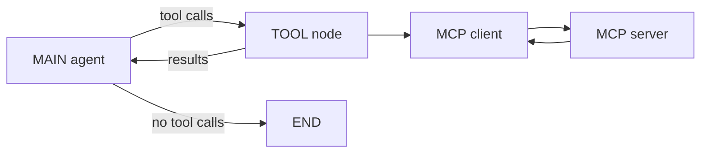

This example builds a ReAct agent graph whose tools live on a remote MCP server instead of in your Python process. The model sees the server's tool schemas, picks a tool, and a `ToolNode` backed by an MCP client runs it. Use it when tools are hosted separately or shared between applications.

## Run the example

The code is `examples/react-mcp/react-mcp.py` in the [10xGraph repository](https://github.com/10xGraph/10xGraph/tree/main/examples/react-mcp), next to `server.py`, a small FastMCP server that exposes a `get_weather` tool.

| Item | Value |
|---|---|
| Python | 3.12 or later |
| Install | `pip install "10xgraph[google-genai]" fastmcp python-dotenv` |
| Environment | `GOOGLE_API_KEY` in your environment or `.env` file |
| Model | `gemini-2.0-flash` (provider `google`) |

Start the server in one terminal, then the agent in another:

```bash
# Terminal 1: serves http://127.0.0.1:8000/mcp over streamable HTTP
python examples/react-mcp/server.py

# Terminal 2: run the agent graph
python examples/react-mcp/react-mcp.py
```

## How the graph works

The agent node asks the model for a response. If the response contains tool calls, a conditional edge sends the state to the `TOOL` node, which executes them through the MCP client and returns the results to the agent. When the model answers without tool calls, the run ends.



## Configure the MCP client

The client is a `fastmcp.Client` built from a config dict that names each server and its transport. Every entry becomes a source of remote tools, and the client discovers their schemas when the graph runs.

```python
from dotenv import load_dotenv
from fastmcp import Client

load_dotenv()  # loads GOOGLE_API_KEY from a .env file if you use one

# Each entry is a named MCP server reachable over streamable HTTP
mcp_config = {
    "mcpServers": {
        "weather": {
            "url": "http://127.0.0.1:8000/mcp",
            "transport": "streamable-http",
        },
        "github": {
            "url": "http://127.0.0.1:8000/mcp",
            "transport": "streamable-http",
        },
    }
}

client_http = Client(mcp_config)
```

Both entries in the example point at the same local server so it runs with one process. Replace them with the real URLs of your own servers.

## Create a ToolNode backed by MCP

Pass an empty tools list and the MCP client. With no local functions registered, every tool the model can call comes from the servers in the config.

```python
from tenxgraph.core import ToolNode

# No local Python tools: all tools come from the MCP client
tool_node = ToolNode(tools=[], client=client_http)
```

`ToolNode` also accepts local functions in `tools`, so one node can serve local and remote tools together.

## Create the agent

Build the `Agent` as you would for local tools and give it the same `tool_node`. The agent reads the tool schemas from that node and sends them to the model.

```python
from tenxgraph.core import Agent

main_agent = Agent(
    model="gemini-2.0-flash",
    provider="google",
    system_prompt=[
        {
            "role": "system",
            "content": "You are a helpful assistant. Help the user find information and answer questions.",
        },
    ],
    tool_node=tool_node,  # the agent exposes these tools to the model
    trim_context=True,
)
```

## Route between the agent and the tool node

The routing function decides where to go after the agent runs. It returns `"TOOL"` when the last assistant message contains tool calls, and `END` otherwise, including after a tool result, because the edge from `TOOL` already loops back to the agent.

```python
from tenxgraph.core import StateGraph
from tenxgraph.core.state import AgentState
from tenxgraph.storage.checkpointer import InMemoryCheckpointer
from tenxgraph.utils.constants import END


def should_use_tools(state: AgentState) -> str:
    """Route to TOOL if the assistant requested tools, otherwise finish."""
    if not state.context:
        return "TOOL"  # no context yet, same default as the example file

    last_message = state.context[-1]

    # Assistant message with tool calls: execute them
    if last_message.role == "assistant" and last_message.tools_calls:
        return "TOOL"

    return END


graph = StateGraph()
graph.add_node("MAIN", main_agent)
graph.add_node("TOOL", tool_node)

graph.add_conditional_edges("MAIN", should_use_tools, {"TOOL": "TOOL", END: END})
graph.add_edge("TOOL", "MAIN")  # always return to the agent after tools run
graph.set_entry_point("MAIN")

app = graph.compile(checkpointer=InMemoryCheckpointer())
```

## Invoke the graph

Send a user message that needs a tool and read back the messages. The `thread_id` selects the checkpointed conversation and `recursion_limit` caps how many steps the graph may take.

```python
from tenxgraph.core.state import Message

inp = {"messages": [Message.text_message("Please call the get_weather function for New York City")]}
run_config = {"thread_id": "12345", "recursion_limit": 10}

res = app.invoke(inp, config=run_config)

for msg in res["messages"]:
    print(msg)
    print()
```

A successful run contains the user message, an assistant message with a `get_weather` tool call, a tool message with the server's result, and a final assistant answer. The exact text depends on the model.

## Local tools or MCP tools

Choose by where the tool code should live. The graph does not change either way.

| Pattern | Use when |
|---|---|
| `ToolNode([fn1, fn2])` | Tools are Python functions in the same process |
| `ToolNode(tools=[], client=mcp_client)` | Tools are hosted on MCP servers |
| `ToolNode([fn1], client=mcp_client)` | Some tools are local and others are remote |

Prefer MCP when the tools already exist as MCP servers, when you want tool execution isolated from the graph, or when several applications share the same tools. Prefer local functions for simple in-process logic, where a network hop adds latency and a failure mode for no benefit.

## Common errors

- **Connection refused or timeout.** The server is not running or the URL is wrong. Start the server and confirm each URL in the config is reachable before calling `invoke()`.
- **Wrong transport.** The `transport` value must match how the server runs. The bundled server uses `streamable-http`.
- **The model never calls a tool.** Check that `tool_node=tool_node` is set on the `Agent` and that the server is exposing tools.
- **Import error for `fastmcp`.** Install it with `pip install fastmcp`; the MCP client needs it.
- **Tool execution errors.** A failing tool comes back as a tool result block with `is_error` set, so the model can read the error and recover.

## What to try next

- Run it against a real server, as in [GitHub MCP](/docs/examples/github-mcp).
- Add more servers to the config and watch the model choose between them.
- Mix local Python tools with MCP tools in one `ToolNode`.
- Read [Use MCP](/docs/guides/use-mcp) for MCP configuration and testing.
