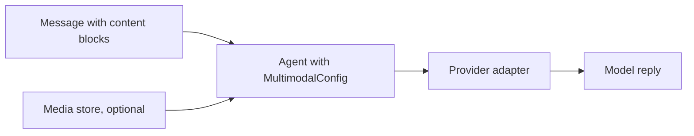

This example sends images, audio, video and documents to a multimodal model. You build a one-node graph with a configured `Agent`, then pass media in three ways: an external URL, inline base64, or a `file_id` from a media store. Every message is a list of typed content blocks.

**Source:** `examples/multimodal/multimodal_agent.py` in the [10xGraph repository](https://github.com/10xGraph/10xGraph).

## What the example shows

The graph has a single agent node, so the focus stays on media handling instead of orchestration.

| Topic | What you see |
|---|---|
| Media delivery | `MediaRef` with `kind="url"`, `"data"` and `"file_id"` |
| Content blocks | `TextBlock`, `ImageBlock`, `AudioBlock`, `DocumentBlock`, `VideoBlock` |
| Agent setup | `MultimodalConfig` with `ImageHandling` and `DocumentHandling` |
| Storage | `InMemoryMediaStore` for `file_id` workflows |
| Scenarios | Seven named builders: `url`, `base64`, `file_id`, `audio`, `document`, `video`, `mixed` |



## Install and run the example

The example needs the Google GenAI extra and a Gemini API key. Run it from the `agentflow` folder of the repository, and pass scenario names to choose what runs (with no arguments it runs `url`, `base64` and `file_id`).

```bash
# Install 10xGraph with the Google GenAI provider
pip install "10xgraph[google-genai]"

# The example calls load_dotenv(); a .env file with GOOGLE_API_KEY works, or export it
export GOOGLE_API_KEY=your-api-key

# Run the default scenarios, or name the ones you want
python examples/multimodal/multimodal_agent.py
python examples/multimodal/multimodal_agent.py url base64 audio
```

<aside class="callout callout-note" role="note"><p class="callout-title">Imports in the repository file</p>

The file in the repository imports every name from the top-level `tenxgraph` package. Only `Agent`, `StateGraph`, `END`, `START`, `Message`, `AgentState` and `ToolNode` are exported there, so use the canonical import paths shown below in your own code.

</aside>

## Import the building blocks

The names live in four modules. The code in the following sections forms one script, so keep these imports at the top.

```python title="multimodal_agent.py"
import asyncio
import base64

from dotenv import load_dotenv

from tenxgraph.core.graph import Agent, StateGraph
from tenxgraph.core.state import (
    AudioBlock,
    DocumentBlock,
    ImageBlock,
    MediaRef,
    Message,
    TextBlock,
    VideoBlock,
)
from tenxgraph.storage.checkpointer import InMemoryCheckpointer
from tenxgraph.storage.media import (
    DocumentHandling,
    ImageHandling,
    InMemoryMediaStore,
    MultimodalConfig,
)
from tenxgraph.utils.constants import END

load_dotenv()
```

## Set up storage

The checkpointer keeps thread state between runs. The media store holds uploaded bytes that you reference later by `file_id`. If you only use URLs or base64, you can skip the media store.

```python title="multimodal_agent.py"
checkpointer = InMemoryCheckpointer()
media_store = InMemoryMediaStore()  # needed only for file_id workflows
```

## Configure the agent for multimodal input

`MultimodalConfig` tells the adapter how to prepare media for the provider. Both settings below are the defaults, shown explicitly so you can see the options.

```python title="multimodal_agent.py"
agent = Agent(
    model="gemini-2.5-flash",
    provider="google",
    system_prompt=[
        {
            "role": "system",
            "content": (
                "You are a helpful multimodal assistant. "
                "Describe what you see in any images, "
                "transcribe any audio, and summarize any documents."
            ),
        },
    ],
    multimodal_config=MultimodalConfig(
        image_handling=ImageHandling.BASE64,
        document_handling=DocumentHandling.EXTRACT_TEXT,
    ),
)
```

| Setting | Options | Default |
|---|---|---|
| `image_handling` | `ImageHandling.BASE64`, `URL`, `FILE_ID` | `BASE64` |
| `document_handling` | `DocumentHandling.EXTRACT_TEXT`, `FORWARD_RAW`, `SKIP` | `EXTRACT_TEXT` |
| `max_image_size_mb` | float | `10.0` |
| `max_image_dimension` | int, larger images are resized | `2048` |

## Build and compile the graph

The graph is one node that goes straight to `END`. Passing `media_store` to `compile` makes the store available to the graph for media references.

```python title="multimodal_agent.py"
graph = StateGraph()
graph.add_node("agent", agent)
graph.set_entry_point("agent")
graph.add_edge("agent", END)

app = graph.compile(checkpointer=checkpointer, media_store=media_store)
```

## Send an image by URL

A `url` reference is the lightest option: you pass the address and the adapter handles the rest. Use it for media that is already public.

```python title="multimodal_agent.py"
def build_message_with_external_url() -> list[Message]:
    return [
        Message(
            role="user",
            content=[
                TextBlock(text="What is in this image?"),
                ImageBlock(
                    media=MediaRef(
                        kind="url",
                        url="https://upload.wikimedia.org/wikipedia/commons/thumb/4/47/PNG_transparency_demonstration_1.png/280px-PNG_transparency_demonstration_1.png",
                        mime_type="image/png",
                    )
                ),
            ],
        ),
    ]
```

## Send an image as inline base64

A `data` reference embeds the bytes in the request through `data_base64`. It suits small payloads such as test images.

```python title="multimodal_agent.py"
def build_message_with_base64() -> list[Message]:
    # A 10x10 red PNG, base64 encoded
    png_b64 = "iVBORw0KGgoAAAANSUhEUgAAAAoAAAAKCAIAAAACUFjqAAAAE0lEQVR4nGP8z4APMOGVZRip0gBBLAETee26JgAAAABJRU5ErkJggg=="
    return [
        Message(
            role="user",
            content=[
                TextBlock(text="Here is a tiny red pixel image encoded as base64."),
                ImageBlock(
                    media=MediaRef(kind="data", data_base64=png_b64, mime_type="image/png")
                ),
            ],
        ),
    ]
```

## Upload once and send by file_id

A `file_id` reference points to media you stored earlier. `store()` is async, takes `data` and `mime_type`, and returns the generated key, which you use as the `file_id`. Upload once and reference many times; this is the pattern for production and large files.

```python title="multimodal_agent.py"
def build_message_with_file_id() -> list[Message]:
    # Placeholder bytes: replace with a real image, a provider will reject these
    sample_image = b"\x89PNG\r\n\x1a\n" + b"\x00" * 100
    file_id = asyncio.run(media_store.store(data=sample_image, mime_type="image/png"))
    return [
        Message(
            role="user",
            content=[
                TextBlock(text="Analyze this uploaded image."),
                ImageBlock(media=MediaRef(kind="file_id", file_id=file_id, mime_type="image/png")),
            ],
        ),
    ]
```

## Send audio, video and documents

`AudioBlock`, `VideoBlock` and `DocumentBlock` take the same `media=MediaRef(...)` argument. `DocumentBlock` also accepts a `text` field with the extracted text.

```python title="multimodal_agent.py"
def build_message_with_audio() -> list[Message]:
    audio_bytes = b"RIFF" + b"\x00" * 50  # placeholder WAV bytes
    b64 = base64.b64encode(audio_bytes).decode()
    return [
        Message(
            role="user",
            content=[
                TextBlock(text="Transcribe this audio."),
                AudioBlock(media=MediaRef(kind="data", data_base64=b64, mime_type="audio/wav")),
            ],
        ),
    ]


def build_message_with_video() -> list[Message]:
    video_bytes = b"\x00\x00\x00\x1cftypmp42" + b"\x00" * 50  # placeholder MP4 bytes
    b64 = base64.b64encode(video_bytes).decode()
    return [
        Message(
            role="user",
            content=[
                TextBlock(text="Describe this video."),
                VideoBlock(media=MediaRef(kind="data", data_base64=b64, mime_type="video/mp4")),
            ],
        ),
    ]


def build_message_with_document() -> list[Message]:
    return [
        Message(
            role="user",
            content=[
                TextBlock(text="Summarize this document."),
                DocumentBlock(
                    text="10xGraph is a multi-agent framework. "
                    "It provides checkpointing, storage, and media handling.",
                    media=MediaRef(kind="file_id", file_id="doc-001", mime_type="text/plain"),
                ),
            ],
        ),
    ]
```

The example also has a `mixed` scenario that puts a URL image and a document in one message, because `content` is just a list of blocks.

## Invoke the graph and print the reply

Each scenario is registered by name, then `run_example` invokes the compiled graph with `{"messages": [...]}` and a config containing `thread_id` and `recursion_limit`. The result's `messages` list holds the conversation, including the model reply.

```python title="multimodal_agent.py"
EXAMPLES = {
    "url": build_message_with_external_url,
    "base64": build_message_with_base64,
    "file_id": build_message_with_file_id,
    "audio": build_message_with_audio,
    "document": build_message_with_document,
    "video": build_message_with_video,
}


def run_example(name: str) -> None:
    config = {"thread_id": f"demo-{name}", "recursion_limit": 10}
    result = app.invoke({"messages": EXAMPLES[name]()}, config=config)
    for msg in result.get("messages", []):
        print(f"[{msg.role}]")
        for block in msg.content:
            if getattr(block, "type", None) == "text":
                print("  ", block.text[:300])


if __name__ == "__main__":
    for scenario in ("url", "base64"):
        run_example(scenario)
```

The model's description varies between runs, so there is no fixed output to compare against. A successful run prints a `[user]` entry followed by an `[assistant]` entry with the model's text.

## Choose a media strategy

Pick the delivery strategy by where the media lives and how large it is.

| Strategy | Best for | Trade-off |
|---|---|---|
| `url` | Public media already hosted elsewhere | The provider must be able to fetch it |
| `data` (base64) | Small test data and quick experiments | Large payloads bloat every request |
| `file_id` | Production, reuse, large files | Requires a media store |

## Common mistakes

- **Base64 for large files.** It inflates request size and can time out. Use `file_id` instead.
- **Referencing a `file_id` that is not in a store.** The lookup fails. Store the bytes first and use the key `store()` returned.
- **Wrong MIME type.** Match `mime_type` to the real bytes; providers can reject a mismatch.
- **Unsupported media for the model.** Some models accept images but not audio or video.
- **Placeholder bytes.** The fake PNG, WAV and MP4 bytes in the example only demonstrate wiring. Use real files to get meaningful answers.

## What to try next

- Replace the placeholder bytes with real files and re-run the `file_id` and `audio` scenarios.
- Swap `InMemoryMediaStore` for `LocalFileMediaStore` or `CloudMediaStore` from `tenxgraph.storage.media.storage` to persist uploads.
- Change `ImageHandling` to `URL` or `FILE_ID` and compare how the adapter prepares the image.
- Combine multimodal input with tools and memory to build a document analysis agent.

For production handling, read [Send media](/docs/guides/send-media). To route between several specialized nodes in one graph, continue with [Multiagent](/docs/examples/multiagent).
