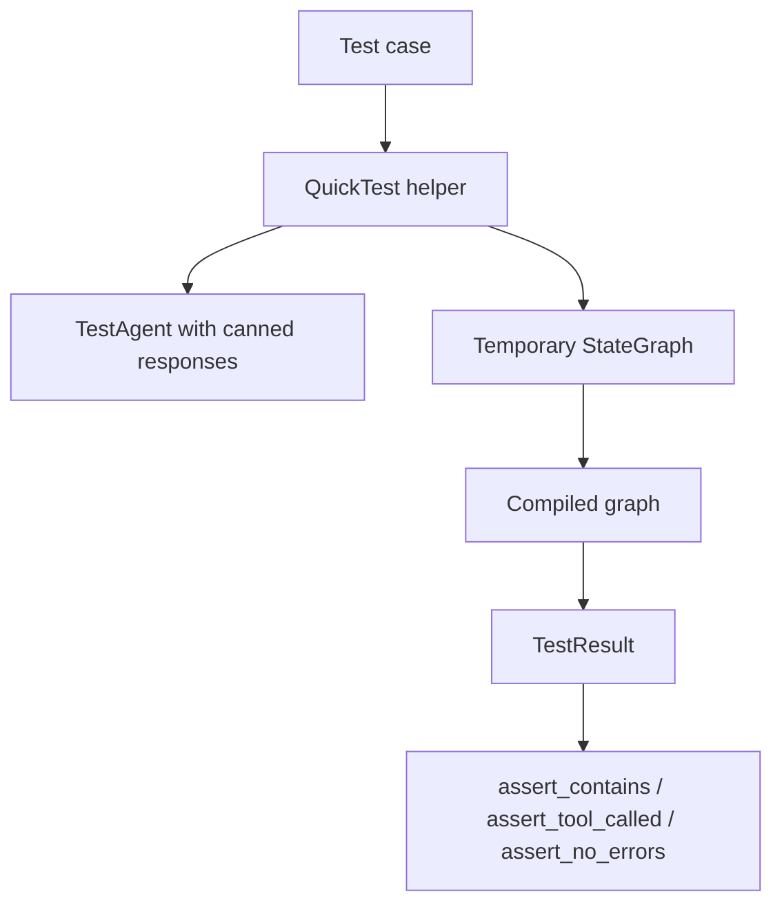
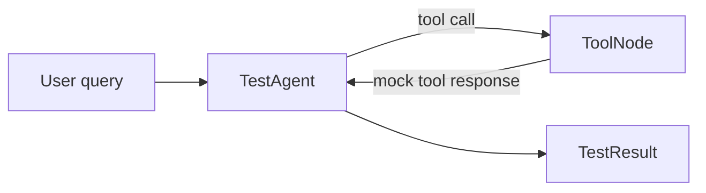
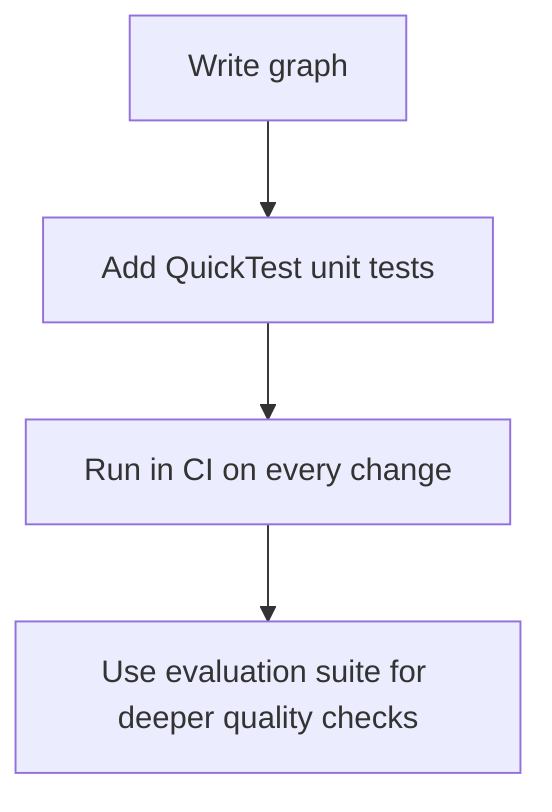

`QuickTest` lets you test a 10xGraph graph in a few lines without calling a live model. It wraps a canned `TestAgent` in a temporary graph and returns a `TestResult` with chainable assertions. This walkthrough covers single-turn, multi-turn and tool tests, and how to place them in CI.

The code comes from `agentflow/examples/testing/quick_test_example.py`. It needs only the core package and no API key:

```bash
pip install 10xgraph
python agentflow/examples/testing/quick_test_example.py
```

## Why use QuickTest for unit tests

Good graph unit tests are fast, deterministic, cheap to run in CI and easy to read when they fail. A live model gives you none of these. `QuickTest` removes the model from the loop and the graph boilerplate (nodes, edges, compile, invoke) with it, so you can check wiring and routing on every pull request.

Canned responses prove your graph and assertions work, not that a model is smart. Quality of live answers belongs to the [evaluation framework](/docs/examples/evaluation).

## How QuickTest builds a test graph

Each helper builds a temporary `StateGraph` around a `TestAgent`, compiles it, invokes it and wraps the output in a `TestResult`. Nothing is sent over the network.



| Helper | Use it to test |
|---|---|
| `QuickTest.single_turn(agent_response, user_message="Hello")` | One user message and one reply |
| `QuickTest.multi_turn(conversation)` | A list of `(user_message, agent_response)` tuples |
| `QuickTest.with_tools(query, response, tools, tool_responses=None)` | A ReAct-style loop with mock tools |
| `QuickTest.custom(agent, user_message, graph_setup=None)` | Your own agent or a customized graph |

All helpers also accept `model` (a label, default `"test-model"`) and `config` (passed to the graph invocation).

## Test a single-turn reply

`QuickTest.single_turn` builds a one-node graph (`MAIN` to `END`), sends your message and returns the canned response as `result.final_response`.

```python
import asyncio

from tenxgraph.qa.testing import QuickTest


async def main():
    result = await QuickTest.single_turn(
        agent_response="Hello! How can I help you today?",
        user_message="Hi there",
    )

    result.assert_contains("Hello")
    result.assert_contains("help")
    result.assert_no_errors()
    print(f"Passed. Response: {result.final_response}")


asyncio.run(main())
```

Use this to check downstream formatting or routing assumptions without paying for a model call.

## Test a multi-turn conversation

`QuickTest.multi_turn` takes a list of `(user_message, agent_response)` tuples, re-invokes the graph once per turn and accumulates the conversation. The agent returns the responses in order.

```python
result = await QuickTest.multi_turn(
    [
        ("Hello", "Hi! How can I help you?"),
        ("What's the weather?", "I'll check the weather for you."),
        ("Thank you", "You're welcome!"),
    ]
)

result.assert_contains("welcome")  # checks the final response only
result.assert_message_count(6)  # 3 user + 3 assistant
```

The count of 6 is a sanity check that every turn was recorded. Use this helper to verify follow-ups, continuity and the response shape after several turns.

## Test tool calls with mock tools

`QuickTest.with_tools` builds a small ReAct-style graph: `MAIN` is a `TestAgent`, `TOOL` is a generated `ToolNode`, and the graph loops from `TOOL` back to `MAIN`. Tools passed as strings become mock functions that record each call and return your `tool_responses` entry (or `"Mock result from <name>"`).

```python
result = await QuickTest.with_tools(
    query="What's the weather in New York?",
    response="The weather in New York is sunny, 72°F",
    tools=["get_weather"],
    tool_responses={"get_weather": "Sunny, 72°F"},
)

result.assert_contains("sunny")
result.assert_tool_called("get_weather")
```

`assert_tool_called` also accepts keyword arguments to check call arguments, for example `assert_tool_called("get_weather", query="...")`. Mock tools record the `query` argument plus any extra keyword arguments. You can also pass real functions in `tools` instead of strings. The graph runs with a recursion limit of 10 unless you override it in `config`.



This exercises your graph structure without flaky network dependencies, which suits CI.

## Chain assertions for readable tests

Every assertion returns the same `TestResult`, so you can chain checks into one readable block.

```python
result = await QuickTest.single_turn(
    agent_response="I can help you with Python programming.",
    user_message="Can you help with coding?",
)

(
    result.assert_contains("Python")
    .assert_contains("programming")
    .assert_not_contains("Java")
    .assert_no_errors()
)
```

| Assertion | Checks |
|---|---|
| `assert_contains(text)` | Substring is in `final_response` (case sensitive) |
| `assert_not_contains(text)` | Substring is absent from `final_response` |
| `assert_equals(expected)` | `final_response` equals the string exactly |
| `assert_tool_called(name, **args)` | A recorded call to the tool exists, with matching args if given |
| `assert_tool_not_called(name)` | No recorded call to the tool |
| `assert_message_count(n)` | The transcript has exactly `n` messages |
| `assert_no_errors()` | No message has the role `error` |

## Write a pytest test file

To run these checks in CI, put them in a normal async pytest test. This assumes `pytest-asyncio` is installed.

```python
# tests/test_greeting.py
import pytest

from tenxgraph.qa.testing import QuickTest


@pytest.mark.asyncio
async def test_greeting_response():
    result = await QuickTest.single_turn(
        agent_response="Hello! How can I help you today?",
        user_message="Hi there",
    )

    result.assert_contains("Hello").assert_no_errors()
```

## Split unit tests from live quality checks

Run `QuickTest` on every pull request and keep live-model tests to a much smaller suite on a schedule or in a gated pipeline.

| Test type | Best tool |
|---|---|
| Graph wiring and simple behavior | `QuickTest` |
| Tool call assertions | `QuickTest.with_tools` |
| Live response quality scoring | Evaluation framework |
| Manual exploration | Example scripts or the playground |



## Verify the example ran

Run the script from the repository root. It prints four sections: single turn, multi-turn, tools and assertions, each ending with a success line. Confirm that:

- all four sections complete without an `AssertionError`
- the tool example finds a call to `get_weather`
- the multi-turn example ends with a six-message transcript
- nothing needs an external API key

## Common mistakes

- Using `QuickTest` for questions that need a live model's reasoning quality.
- Writing assertions so loose that they pass when behavior regresses.
- Forgetting that `assert_contains` is case sensitive.
- Mixing deterministic helpers with non-deterministic external services in the same CI step.

## Related pages

- [Testing reference](/docs/reference/python/testing)
- [Evaluation reference](/docs/reference/python/evaluation)
- [ReAct agent tutorial](/docs/examples/react-agent)

Next, continue with [Evaluation](/docs/examples/evaluation) when you need scored quality checks rather than deterministic unit tests.
