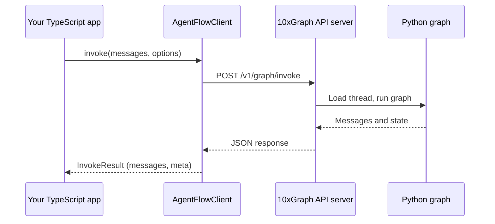

In this step you call the agent server from step 4 with the TypeScript client. You create an `AgentFlowClient`, get a full reply with `invoke()`, read a live reply with `stream()`, keep a conversation on one `thread_id`, and send an auth token. By the end, a Node.js script talks to your Python graph over HTTP.

## Prerequisites

You need the server from [Serve and inspect](/docs/get-started/tutorial/serve-and-inspect) running, and Node.js 18 or later (the client uses the built-in `fetch`).

- The API server is started with `10xgraph api --host 127.0.0.1 --port 8000`, from the folder that holds `10xgraph.json`.
- The graph has a weather tool and a checkpointer, as built in the previous steps.
- The server is reachable at `http://127.0.0.1:8000`.

Keep the server running in one terminal and use a second terminal for the scripts below.

## Install the TypeScript client

Install the client in any Node.js or browser project. It has no Python dependency and talks to the server over HTTP.

```bash
# Install the 10xGraph TypeScript client
npm install @10xgraph/client
```

Until the renamed package is published on npm, the published name is `@10xscale/agentflow-client`. Install that instead and change the import path in the examples to match. The class is called `AgentFlowClient` in both.

To run TypeScript files directly, install a runner such as `tsx`:

```bash
npm install --save-dev tsx
```

## Create the client

The client needs only the address of your server. Every other option is optional.

```ts title="client.ts"
import { AgentFlowClient } from "@10xgraph/client";

// One client per server. Reuse it for every call.
export const client = new AgentFlowClient({
  baseUrl: "http://127.0.0.1:8000",
});
```

| Option | Type | Default | Description |
|---|---|---|---|
| `baseUrl` | `string` | required | URL of the 10xGraph API server |
| `authToken` | `string \| null` | none | Bearer token, sent as `Authorization: Bearer <token>` |
| `headers` | `HeadersInit` | none | Extra headers sent with every request |
| `timeout` | `number` | `300000` | Request timeout in milliseconds (5 minutes) |
| `debug` | `boolean` | `false` | Log request details to the console |

See [Create the client](/docs/client/create-client) for the remaining options such as `auth` and `credentials`.

## Invoke the agent and read the full reply

`client.invoke()` sends your messages to `POST /v1/graph/invoke`, waits for the graph to finish, and returns every message the run produced. Use it when you need the complete answer before you do anything else.

```ts title="call-agent.ts"
import { AgentFlowClient, Message } from "@10xgraph/client";

const client = new AgentFlowClient({ baseUrl: "http://127.0.0.1:8000" });

async function main() {
  // Send one user message on a named thread
  const result = await client.invoke(
    [Message.text_message("What is the weather in Tokyo?")],
    { config: { thread_id: "tutorial-thread" } },
  );

  // The last message is the agent's final answer
  const reply = result.messages.at(-1);
  console.log("Agent replied:", reply?.text());
  console.log("Thread:", result.meta.thread_id, "new:", result.meta.is_new_thread);
}

main().catch(console.error);
```

Run it:

```bash
npx tsx call-agent.ts
```

The output depends on your model. It looks like this:

```text
Agent replied: The weather in Tokyo is sunny and 22°C.
Thread: tutorial-thread new: true
```

What the call does:

1. `Message.text_message(text)` builds a user message. Its second argument is the role, which defaults to `"user"`.
2. `invoke()` posts the messages, your `config` and the run options to the server. The default `recursion_limit` is 25 and the default `response_granularity` is `"full"`.
3. The server loads the thread from the checkpointer, runs the graph (including any server-side tools) and returns the messages.
4. `result.messages` holds the messages from the run. `result.meta` holds `thread_id` and `is_new_thread`.
5. `reply.text()` joins the text blocks of a message into one string.

If the graph asks the client to run a tool in your app (a remote tool), `invoke()` runs it and calls the server again until the run finishes. Remote tools are covered in [Remote tools](/docs/client/remote-tools).

## Keep a conversation on one thread

A `thread_id` names a conversation. The server stores the state under that ID through the checkpointer, so a second call with the same ID continues where the first stopped.

```ts title="multi-turn.ts"
import { AgentFlowClient, Message } from "@10xgraph/client";

const client = new AgentFlowClient({ baseUrl: "http://127.0.0.1:8000" });
const config = { thread_id: "conversation-with-user-123" };

async function main() {
  // First turn: give the agent a fact
  const first = await client.invoke([Message.text_message("My name is Alex.")], { config });
  console.log(first.messages.at(-1)?.text());

  // Second turn: same thread_id, so the server restores the history
  const second = await client.invoke([Message.text_message("What is my name?")], { config });
  console.log(second.messages.at(-1)?.text());
}

main().catch(console.error);
```

The second answer mentions Alex because the server, not your app, holds the history. You send only the new message each time. A different `thread_id` starts a fresh conversation. Reading and editing stored threads is covered in [Manage threads](/docs/client/manage-threads).

## Stream the reply as it is generated

`client.stream()` posts to `POST /v1/graph/stream` and returns an async generator. The server answers with newline-delimited JSON (NDJSON), not Server-Sent Events, and the client yields one chunk per line as it arrives.

```ts title="stream-agent.ts"
import { AgentFlowClient, Message, StreamEventType } from "@10xgraph/client";

const client = new AgentFlowClient({ baseUrl: "http://127.0.0.1:8000" });

async function main() {
  const stream = client.stream(
    [Message.text_message("Write a short story about a robot.")],
    { config: { thread_id: "streaming-demo" } },
  );

  // Print each piece of the reply as soon as it arrives
  for await (const chunk of stream) {
    if (chunk.event === StreamEventType.MESSAGE && chunk.message) {
      process.stdout.write(chunk.message.text());
    }
  }
  console.log();
}

main().catch(console.error);
```

The default `response_granularity` for `stream()` is `"low"`, which keeps chunks small. If the graph calls a remote tool, `stream()` runs it and continues the stream for you.

Use `stream()` for chat interfaces where the user should see text appear. Use `invoke()` for scripts and background jobs that need the finished answer.

### Chunk fields and event types

Every chunk has an `event` field that tells you which other fields are set.

| `event` | `StreamEventType` | Set fields | Meaning |
|---|---|---|---|
| `"message"` | `MESSAGE` | `message` | A message from the agent or a tool |
| `"updates"` | `UPDATES` | `data` | A progress or status update |
| `"state"` | `STATE` | `state` | The graph state |
| `"error"` | `ERROR` | `data` | An error reported by the server during the run |

Chunks can also carry `thread_id`, `run_id`, `metadata` and `timestamp`. Handle all four event types with a `switch`:

```ts title="stream-events.ts"
import { AgentFlowClient, Message, StreamEventType } from "@10xgraph/client";

const client = new AgentFlowClient({ baseUrl: "http://127.0.0.1:8000" });

async function main() {
  const stream = client.stream(
    [Message.text_message("What is 2 + 2? Explain briefly.")],
    { config: { thread_id: "event-demo" } },
  );

  for await (const chunk of stream) {
    switch (chunk.event) {
      case StreamEventType.MESSAGE:
        if (chunk.message) process.stdout.write(chunk.message.text());
        break;
      case StreamEventType.UPDATES:
        console.log("\n[update]", chunk.data);
        break;
      case StreamEventType.STATE:
        console.log("\n[state]", chunk.state);
        break;
      case StreamEventType.ERROR:
        console.error("\n[error]", chunk.data);
        break;
    }
  }
}

main().catch(console.error);
```

Most apps only need the `message` event. The `state` and `updates` events help when you build a progress view or debug a run. The full list of options is in [Stream responses](/docs/client/stream-responses).

## Send an auth token

If the server has authentication enabled, pass the token when you create the client. The client then adds `Authorization: Bearer <token>` to every request.

```ts title="authenticated-client.ts"
import { AgentFlowClient } from "@10xgraph/client";

// Read the token from the environment, never hard-code it
const client = new AgentFlowClient({
  baseUrl: "http://127.0.0.1:8000",
  authToken: process.env.AGENT_TOKEN,
});
```

To send other headers as well, use the `headers` option. A `headers` entry named `Authorization` takes priority over `authToken`.

```ts title="custom-headers.ts"
import { AgentFlowClient } from "@10xgraph/client";

const client = new AgentFlowClient({
  baseUrl: "http://127.0.0.1:8000",
  headers: { "X-Request-Source": "tutorial" },
});
```

The token is fixed for the lifetime of the client. Create a new client to use a different token. Never put a token in code that ships to a browser; proxy the call through your own backend instead, as shown in [Next.js and React](/docs/client/nextjs-and-react). How the server issues and checks tokens is covered in [Authentication](/docs/server/auth).

## How a call travels

The client turns your call into one HTTP request and parses the response back into typed objects.



`stream()` follows the same path to `POST /v1/graph/stream` and yields NDJSON lines instead of one JSON body.

## Verify it works

Run one script that exercises both calls. If it prints a reply for each, your app is connected.

```ts title="verify.ts"
import { AgentFlowClient, Message, StreamEventType } from "@10xgraph/client";

const client = new AgentFlowClient({ baseUrl: "http://127.0.0.1:8000" });

async function testInvoke() {
  console.log("Testing invoke...");
  const result = await client.invoke(
    [Message.text_message("Hello, what tools do you have?")],
    { config: { thread_id: "test-invoke" } },
  );
  console.log("Reply:", result.messages.at(-1)?.text());
  console.log("Thread ID:", result.meta.thread_id);
}

async function testStream() {
  console.log("\nTesting stream...");
  let count = 0;
  const stream = client.stream(
    [Message.text_message("Tell me a fact.")],
    { config: { thread_id: "test-stream" } },
  );
  for await (const chunk of stream) {
    count++;
    if (chunk.event === StreamEventType.MESSAGE) {
      process.stdout.write(chunk.message?.text() ?? "");
    }
  }
  console.log(`\n(Received ${count} chunks)`);
}

async function main() {
  await testInvoke();
  await testStream();
}

main().catch(console.error);
```

```bash
npx tsx verify.ts
```

### Common errors

- **`fetch failed` or connection refused:** the server is not running or `baseUrl` is wrong. Check `10xgraph api` is up on the same host and port.
- **HTTP 401 or 403:** the server requires auth. Pass `authToken` as shown above.
- **CORS error in a browser:** the server must allow your page's origin through the `ORIGINS` environment variable. See the [production checklist](/docs/server/production-checklist).
- **`Request timeout after 300000ms`:** the run took longer than `timeout`. Raise `timeout` or use `stream()`.

More fixes are in [Client troubleshooting](/docs/troubleshooting/client).

## What you learned

- `AgentFlowClient` talks to your running server; only `baseUrl` is required.
- `client.invoke()` returns the full reply in one call, with `messages` and `meta`.
- `client.stream()` yields NDJSON chunks; `message`, `updates`, `state` and `error` are the event types.
- A shared `thread_id` makes the server restore the conversation on every call.
- `authToken` or `headers` carry credentials, and tokens stay on the server side in browser apps.

## Next steps

- [Client API reference](/docs/reference/client/client): every method and type.
- [Manage threads](/docs/client/manage-threads): read and edit conversation history from your app.
- [Next.js and React](/docs/client/nextjs-and-react): build a UI that streams a reply.
- [Production checklist](/docs/server/production-checklist): harden the server before you deploy.
