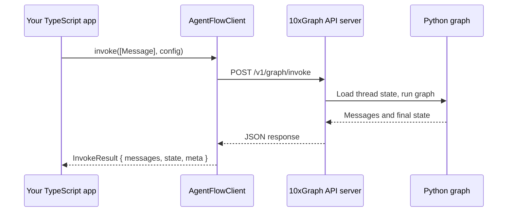

Now that your agent is running as an HTTP server, you can invoke it from any TypeScript or JavaScript application using the 10xGraph client. The client abstracts away HTTP details, handles message serialization, and supports both one-shot invocations and real-time streaming of results.

## Prerequisites

From the previous tutorial step, you have:

- A running API server: `10xgraph api --host 127.0.0.1 --port 8000`
- A Python agent with tools, checkpointing, and a `10xgraph.json` config file
- Access to the server at `http://127.0.0.1:8000`

Keep the API server running in a terminal for the examples in this step.

## Install the TypeScript client

In your TypeScript or Node.js project, install the 10xGraph client:

```bash
npm install @10xgraph/client
```

If you are using an older version of the 10xGraph project, the published package may still be under the old name. Check the latest version on npm:

```bash
npm install @10xscale/agentflow-client
```

## Create the client instance

Import the client and connect to your running server:

```typescript
import { AgentFlowClient, Message } from "@10xgraph/client";

const client = new AgentFlowClient({
  baseUrl: "http://127.0.0.1:8000",
});
```

The `AgentFlowClient` constructor accepts a configuration object with:

- `baseUrl` (required): the URL where your 10xGraph API server is running
- `authToken` (optional): a JWT token if your server requires authentication
- `timeout` (optional): request timeout in milliseconds (default: 5 minutes)
- `headers` (optional): additional HTTP headers to send with every request

## Invoke the agent and get a response

Send a message to your agent and wait for the full response:

```typescript
const result = await client.invoke(
  [Message.text_message("What is the weather in Tokyo?")],
  {
    config: {
      thread_id: "my-first-thread",
    },
  }
);

const reply = result.messages.at(-1);
console.log("Agent replied:", reply?.text());
```

Here is what happens:

1. `Message.text_message(...)` creates a message object with the text content
2. `client.invoke(...)` sends the message to the server at `/v1/graph/invoke`
3. The server runs your graph: it loads the thread state (if the `thread_id` exists), passes your message to the agent, the agent calls tools if needed, and returns all messages
4. `result.messages` contains all messages in the conversation: your input and the agent's response
5. The result also includes `result.meta` with metadata like `thread_id` and `is_new_thread`

Create a file called `call-agent.ts`:

```typescript
import { AgentFlowClient, Message } from "@10xgraph/client";

const client = new AgentFlowClient({
  baseUrl: "http://127.0.0.1:8000",
});

async function main() {
  const result = await client.invoke(
    [Message.text_message("What is the weather in Tokyo?")],
    {
      config: {
        thread_id: "tutorial-thread",
      },
    }
  );

  const reply = result.messages.at(-1);
  console.log("Agent replied:", reply?.text());
}

main().catch(console.error);
```

Run it using `tsx` (or your project's TypeScript runner):

```bash
npx tsx call-agent.ts
```

If your agent has access to a weather tool, you see output like:

```text
Agent replied: The weather in Tokyo is sunny and 22°C.
```

## Build a multi-turn conversation with thread IDs

A `thread_id` is a persistent identifier for a conversation. The server stores all messages and state under that ID. By reusing the same `thread_id`, your agent remembers context across calls:

```typescript
const THREAD_ID = "conversation-with-user-123";

// First turn
const first = await client.invoke(
  [Message.text_message("My name is Alex.")],
  { config: { thread_id: THREAD_ID } }
);
console.log(first.messages.at(-1)?.text());

// Second turn — server recalls "My name is Alex"
const second = await client.invoke(
  [Message.text_message("What is my name?")],
  { config: { thread_id: THREAD_ID } }
);
console.log(second.messages.at(-1)?.text());
```

Expected output:

```text
Nice to meet you, Alex!
Your name is Alex.
```

The agent can see the entire conversation history on the server because you passed the same `thread_id`. If you create a new thread with a different ID, the agent starts fresh without memory of previous turns.

## Stream responses for real-time updates

For a responsive user experience, stream the agent's response as it is generated instead of waiting for the full reply:

```typescript
const stream = client.stream(
  [Message.text_message("Write a short story about a robot.")],
  { config: { thread_id: "streaming-demo" } }
);

for await (const chunk of stream) {
  if (chunk.event === "message" && chunk.message) {
    // A token from the model was just received
    process.stdout.write(chunk.message.text());
  }
}
console.log();
```

The `stream()` method returns an async generator that yields chunks as they arrive. Each chunk has:

- `event`: one of `StreamEventType.MESSAGE`, `StreamEventType.UPDATES`, `StreamEventType.STATE`, or `StreamEventType.ERROR`
- `message`: the current `Message` object (present when `event === "message"`)
- `state`: the current graph state (present when `event === "state"`)
- `data`: additional metadata (present when `event === "updates"`)
- `thread_id`: the thread ID for this run
- `run_id`: the unique ID of this invocation

When the agent calls a tool, the stream pauses while the tool executes on the server. You see state updates and then the agent's response continues. This is NDJSON (newline-delimited JSON) over HTTP, so you get incremental, real-time feedback.

## Handle stream events

Different event types carry different information. Here is how to distinguish them:

```typescript
const stream = client.stream(
  [Message.text_message("Solve 2 + 2 in detail.")],
  { config: { thread_id: "event-demo" } }
);

for await (const chunk of stream) {
  switch (chunk.event) {
    case "message":
      if (chunk.message) {
        process.stdout.write(chunk.message.text());
      }
      break;

    case "updates":
      if (chunk.data?.status === "done") {
        console.log("\nRun completed.");
      }
      break;

    case "state":
      if (chunk.state) {
        console.log("Graph state updated:", chunk.state);
      }
      break;

    case "error":
      console.error("Error in stream:", chunk.data);
      break;
  }
}
```

Most of the time you care about the `message` event to display the agent's response. The `updates` event signals completion or tool calls. The `state` event carries the full graph state if you need it for debugging or building advanced UI.

## Add authentication

If your API server is configured with JWT authentication (which you set up with `"auth": "jwt"` in `10xgraph.json`), pass a bearer token when creating the client:

```typescript
const client = new AgentFlowClient({
  baseUrl: "http://127.0.0.1:8000",
  authToken: process.env.AGENT_TOKEN, // or pass it directly
});
```

The client automatically adds the `Authorization: Bearer <token>` header to all requests. For more control, use the `headers` option:

```typescript
const client = new AgentFlowClient({
  baseUrl: "http://127.0.0.1:8000",
  headers: {
    Authorization: `Bearer ${myToken}`,
    "X-Custom-Header": "value",
  },
});
```

## Understanding the communication flow

When you call `client.invoke()` or `client.stream()`, here is what happens:



The `Message.text_message()` helper creates a message in the same format your Python agent expects. You can also construct messages with other content blocks (images, files, etc.), which the client serializes and the server handles.

## Verify it works

Create a test script that exercises both invoke and streaming:

```typescript
import { AgentFlowClient, Message, StreamEventType } from "@10xgraph/client";

const client = new AgentFlowClient({
  baseUrl: "http://127.0.0.1:8000",
});

async function testInvoke() {
  console.log("Testing invoke...");
  const result = await client.invoke(
    [Message.text_message("Hello, what tools do you have?")],
    { config: { thread_id: "test-invoke" } }
  );
  console.log("Result:", result.messages.at(-1)?.text());
  console.log("Thread ID:", result.meta.thread_id);
}

async function testStream() {
  console.log("\nTesting stream...");
  let count = 0;
  const stream = client.stream(
    [Message.text_message("Tell me a fact.")],
    { config: { thread_id: "test-stream" } }
  );

  for await (const chunk of stream) {
    count++;
    if (chunk.event === StreamEventType.MESSAGE) {
      process.stdout.write(chunk.message?.text() || "");
    }
  }
  console.log(`\n(Received ${count} chunks)`);
}

async function main() {
  await testInvoke();
  await testStream();
}

main().catch(console.error);
```

Run it:

```bash
npx tsx test.ts
```

If both tests complete, you have successfully connected your TypeScript app to your 10xGraph server. The agent processed your messages, and you received responses via both invoke and streaming.

## What you learned

- The `AgentFlowClient` abstracts HTTP communication with your running agent server
- Use `client.invoke()` for a complete response in one call
- Use `client.stream()` for real-time, incremental updates as the agent processes
- A `thread_id` persists conversation context across multiple calls
- `Message.text_message()` creates the message format your agent understands
- Stream events (`message`, `updates`, `state`, `error`) carry different types of information
- Authentication is handled automatically when you pass an `authToken` or headers

## Next steps

- **TypeScript client reference** — explore all methods and types ([Client API](/docs/reference/client/client))
- **Manage threads and memory** — read and modify conversation history from your app ([Threads guide](/docs/client/manage-threads))
- **Build a React UI** — use the client with React hooks for a real application ([React guide](/docs/client/nextjs-and-react))
- **Production deployment** — production checklist for the API server ([Server production](/docs/server/production-checklist))
