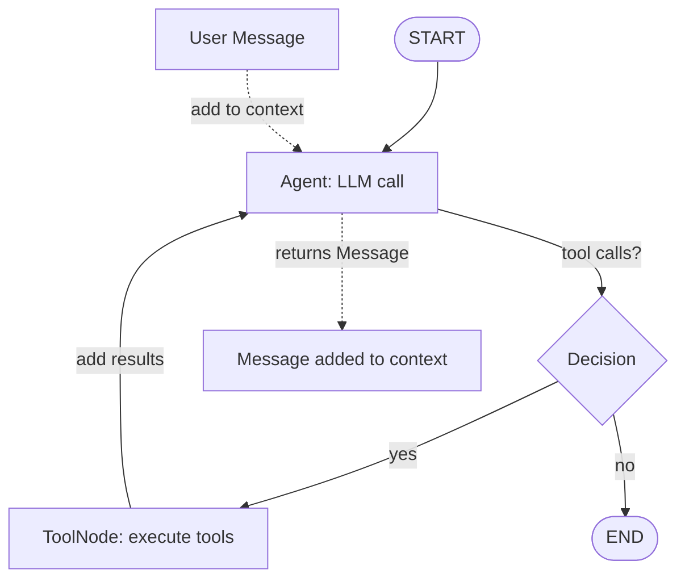

This tutorial teaches you to build a Python agent step by step, starting with understanding how 10xGraph thinks about agent workflows. By the end of this page, you will know the six core concepts that everything else builds on: message, state, node, edge, graph, and agent. You will also understand how they work together and what you build across the seven tutorial steps.

## What you build in this tutorial

This is a seven-step path from an empty folder to a production-ready agent. Each step teaches one concept with a complete, runnable code example.

| Step | What you build | Page |
|---|---|---|
| 1 | Understand the mental model | This page |
| 2 | Compile and run a single-node workflow | [Build a graph](/docs/get-started/tutorial/build-a-graph) |
| 3 | Add a tool and set up ReAct routing | [Build a graph](/docs/get-started/tutorial/build-a-graph) |
| 4 | Persist conversation state with a checkpointer | [Threads and memory](/docs/get-started/tutorial/threads-and-memory) |
| 5 | Expose the agent over HTTP | [Serve and inspect](/docs/get-started/tutorial/serve-and-inspect) |
| 6 | Test it in the hosted playground | [Serve and inspect](/docs/get-started/tutorial/serve-and-inspect) |
| 7 | Call it from a TypeScript application | [Call from your app](/docs/get-started/tutorial/call-from-your-app) |

By the end, you will have an agent that calls tools, persists conversation state, runs behind an HTTP API, and can be called from TypeScript.

## The six core concepts

Before writing code, it helps to understand the six ideas that 10xGraph is built on. This section explains each one.

### 1. Message

A **message** is the unit of communication in 10xGraph. Every input to an agent and every output is a message. A message has a role (who sent it) and content.

The four roles are:
- `user`: input from a person or client
- `assistant`: output from the language model
- `tool`: output from a tool or function
- `system`: instructions or context for the model

```python
from tenxgraph.core.state import Message

user_msg = Message.text_message("What is the capital of France?", role="user")
assistant_msg = Message.text_message("Paris.", role="assistant")
tool_msg = Message.text_message("Result: ...", role="tool")
```

Messages contain content blocks. The simplest is a text block, but messages can also hold images, audio, documents, or tool calls and results. You will see more content types later as your agent grows.

### 2. State

**State** is the container that moves through your graph. It holds the conversation history and any data your application needs. The base state class is `AgentState`.

The `AgentState` class has three fields:
- `context`: A list of `Message` objects, ordered by time
- `context_summary`: A compressed summary of the context (used by advanced features)
- `execution_meta`: Internal data that 10xGraph tracks (current node, interrupts, etc.)

```python
from tenxgraph.core.state import AgentState

state = AgentState()
state.context           # Empty list of messages to start
state.context.append(msg)  # Add a message
state.context[-1]       # Access the most recent message
```

You can extend `AgentState` to add custom fields for your application, like user preferences or extracted data. Every node in your graph receives the current state and can read it and update it.

### 3. Node

A **node** is a Python function that processes state. A node receives the current state as input and returns a message or a state update. Nodes are where your application logic lives.

```python
from tenxgraph.core.state import AgentState, Message

def my_node(state: AgentState) -> Message:
    # Read from state
    latest_message = state.context[-1]
    user_input = latest_message.text()
    
    # Process
    response = f"You said: {user_input}"
    
    # Return a new message
    return Message.text_message(response, role="assistant")
```

10xGraph provides two special built-in nodes:
- **Agent**: Wraps a language model. It reads the conversation history, sends it to the LLM, and returns the model's response as a message.
- **ToolNode**: Executes the tool calls that the LLM requested. It looks at the most recent assistant message, finds the tool calls in it, runs them, and returns the results.

### 4. Edge

An **edge** is a connection between two nodes that defines the workflow. An edge says "after node A completes, run node B next" or "if condition C is true, run node D".

The simplest edges are unconditional:

```python
graph.add_edge("node_a", "node_b")  # Always run node_b after node_a
```

Conditional edges let you branch based on state:

```python
def route_to_tool(state: AgentState) -> str:
    # Check if the last message has tool calls
    last_msg = state.context[-1]
    if last_msg.tools_calls:
        return "tool_node"
    else:
        return "end"

graph.add_conditional_edges("agent", route_to_tool)
```

The most common pattern is the ReAct (Reasoning + Acting) loop: Agent → check if tools were called → ToolNode → back to Agent (or END).

### 5. Graph

A **graph** (a `StateGraph`) connects your nodes and edges into a complete workflow. You define the entry point (where execution starts) and the edges between nodes, then compile it into a runnable application.

```python
from tenxgraph.core.graph import StateGraph
from tenxgraph.core.state import AgentState
from tenxgraph.utils import START, END

graph = StateGraph(AgentState)
graph.add_node("my_node", my_node)
graph.set_entry_point("my_node")
graph.add_edge("my_node", END)

app = graph.compile()
```

Once compiled, the graph becomes a `CompiledGraph`: a runnable application that executes nodes in order, manages state transitions, and optionally saves state for persistence.

### 6. Agent

An **agent** is a built-in node that wraps a language model and handles the interaction. You give it a model (like `"gpt-4o"` or `"claude-opus-5"`), and it:
1. Reads the conversation history from state
2. Sends it to the language model
3. Returns the model's response as a message (added to the context)
4. If the model requested tool calls, includes them in the message so a ToolNode can execute them

```python
from tenxgraph.core.graph import Agent

agent = Agent(model="gpt-4o")
message = agent(state)  # Calls the model and returns a message
```

An Agent is a regular node—it just does more work internally. You can combine it with other nodes, add tools, and build complex workflows around it.

## How they work together

This diagram shows the flow of data through a simple graph:



Here is what happens step by step:

1. You invoke the graph with an initial message (e.g., `"What is 2+2?"`).
2. The graph creates an `AgentState` and adds your message to `context`.
3. The graph runs the entry point node (often an `Agent`).
4. The Agent reads `context`, sends it to the language model, and returns the model's response.
5. The response message is appended to `context`.
6. The graph checks the edge from the Agent node. Is there a conditional route based on tool calls? If the model requested tools, the graph moves to the ToolNode. Otherwise, it ends.
7. The ToolNode executes the requested tools and returns results as messages, added to `context`.
8. Control returns to the Agent, which reads the updated context (including tool results) and calls the model again.
9. The loop repeats until the Agent says it is done (no more tool calls).
10. The graph returns the final state and context.

## Threads and persistence

One key insight: a **thread** is a conversation. Each call to your compiled graph belongs to a thread, identified by a `thread_id`. When you invoke the graph, you pass a `thread_id`. The graph saves the state to a **checkpointer** (a kind of database). The next time you invoke with the same `thread_id`, the graph loads the saved state and picks up where it left off.

You will set up this in [step 4](/docs/get-started/tutorial/threads-and-memory), but it is good to know now: every state and message history is tied to a thread. Threads allow conversations to persist across server restarts and enable multi-turn interactions.

## What you learned

- A **message** is a unit of communication with a role and content.
- **State** is a container that holds the conversation history and application data.
- A **node** is a function that reads state and returns messages or updates.
- An **edge** is a connection between nodes that defines the workflow.
- A **graph** wires nodes and edges together and compiles them into a runnable app.
- An **agent** is a built-in node that calls a language model and handles tool integration.
- Messages flow through nodes in order, accumulating in the state's `context` field.

## Next step

Now that you understand the mental model, build your [first working graph](/docs/get-started/tutorial/build-a-graph). You will create nodes, wire them together, and run your first 10xGraph application.

For a deeper dive into how graphs execute, see [StateGraph](/docs/concepts/state-graph) in Concepts.
