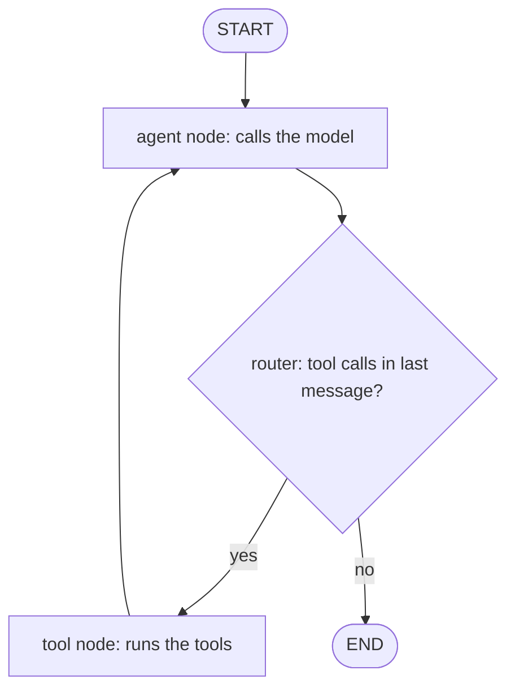

A 10xGraph agent is a graph. Messages accumulate in a shared state, nodes (plain functions or an LLM-backed agent) read and update that state, and edges decide which node runs next. A thread identifies one conversation so state can be saved and resumed. This page defines each idea once.

## What you build across the tutorial

The tutorial takes you from an empty folder to an agent that calls tools, remembers conversations, runs behind an HTTP API, and is called from TypeScript. Each step has complete, runnable code that builds on the previous one.

| Step | What you do | Page |
|---|---|---|
| 1 | Learn the mental model | This page |
| 2 | Build a graph by hand with an agent, a tool node and routing | [Build a graph](/docs/get-started/tutorial/build-a-graph) |
| 3 | Add memory with a checkpointer and thread IDs | [Threads and memory](/docs/get-started/tutorial/threads-and-memory) |
| 4 | Serve the graph over HTTP and inspect it | [Serve and inspect](/docs/get-started/tutorial/serve-and-inspect) |
| 5 | Call the server from TypeScript | [Call from your app](/docs/get-started/tutorial/call-from-your-app) |
| 6 | Stream a run and pause for human approval | [Stream and approve](/docs/get-started/tutorial/stream-and-approve) |
| 7 | Test and evaluate the agent | [Test and evaluate](/docs/get-started/tutorial/test-and-evaluate) |

If you only want a working agent in a few minutes, use the [first agent quickstart](/docs/get-started/first-agent) instead, then come back here to understand what it does.

## The seven core concepts

Seven terms cover the whole framework: message, state, node, edge, graph, agent and thread. The first six are Python objects you create; the thread is an ID you pass at run time.

### Message

A message is the unit of communication. Every input to a graph and every output from a node is a message, made of a role and a list of content blocks. The role is one of `user`, `assistant`, `system` or `tool`.

```python
from tenxgraph.core.state import Message

# role defaults to "user" when omitted
user_msg = Message.text_message("What is the capital of France?", role="user")
assistant_msg = Message.text_message("Paris.", role="assistant")

print(assistant_msg.text())  # "Paris."
```

The simplest content block is text. Messages can also carry images, audio, documents, and the tool calls and tool results that connect an agent to its tools. An assistant message that requests tools exposes them in `message.tools_calls` (the attribute name is spelled with an `s` after `tool`).

### State

State is the object that travels through the graph. It holds the conversation and any data your application needs. The base class is `AgentState`, and every node receives the current state.

| Field | Type | Purpose |
|---|---|---|
| `context` | `list[Message]` | The conversation, in order. New messages are appended and deduplicated by `message_id`. |
| `context_summary` | `str \| None` | An optional compressed summary of older context. Defaults to `None`. |
| `execution_meta` | `ExecMeta` | Internal progress data: current node, step, interrupts. Managed by the runtime. |

```python
from tenxgraph.core.state import AgentState, Message

state = AgentState()
state.context.append(Message.text_message("Hello"))
print(state.context[-1].text())  # the most recent message
```

`AgentState` is a Pydantic model, so you extend it by subclassing and adding fields. The base fields are preserved.

```python
from pydantic import Field

from tenxgraph.core.state import AgentState


class SupportState(AgentState):
    # Custom application data that travels with the conversation
    customer_id: str = ""
    tags: list[str] = Field(default_factory=list)
```

### Node

A node is a function that takes the state and returns work to add to it. Most nodes return a `Message`. Nodes are where your logic lives: calling a model, running a tool, validating input.

```python
from tenxgraph.core.state import AgentState, Message


def echo(state: AgentState) -> Message:
    # Read the latest message from state
    user_input = state.context[-1].text()
    # Return a new message; it is appended to state.context
    return Message.text_message(f"You said: {user_input}", role="assistant")
```

10xGraph ships two ready-made nodes for LLM work:

- **Agent** wraps a language model. It reads the context, calls the model and returns the response, including any tool calls.
- **ToolNode** executes the tool calls found in the latest assistant message and returns the results as tool messages.

### Edge

An edge connects two nodes and defines what runs next. An unconditional edge always runs the target after the source. A conditional edge calls a routing function that inspects the state and returns the name of the next node.

```python
from tenxgraph.core.state import AgentState
from tenxgraph.utils import END

# Unconditional: always run "tools" after "agent"
# graph.add_edge("agent", "tools")


def route(state: AgentState) -> str:
    # Go to the tool node when the model asked for tools, otherwise finish
    last = state.context[-1]
    if last.role == "assistant" and last.tools_calls:
        return "tools"
    return END


# Conditional: the path map lists the nodes the router may choose
# graph.add_conditional_edges("agent", route, {"tools": "tools", END: END})
```

`END` is the constant `"__end__"`. Returning it from a router finishes the run. Routers receive the state and should have no side effects.

The most common shape is the ReAct loop: the agent runs, a router checks for tool calls, the tool node runs, and control returns to the agent until no more tools are requested.

### Graph

A graph is a `StateGraph`. You register nodes, connect them with edges, set the entry point, and call `compile()`. The result is a `CompiledGraph`, the runnable application.

```python
from tenxgraph.core.graph import StateGraph
from tenxgraph.core.state import AgentState, Message
from tenxgraph.utils import END


def echo(state: AgentState) -> Message:
    return Message.text_message(f"You said: {state.context[-1].text()}", role="assistant")


graph = StateGraph(AgentState)
graph.add_node("echo", echo)       # register a node by name
graph.set_entry_point("echo")      # where execution starts
graph.add_edge("echo", END)        # finish after echo

app = graph.compile()

# Input is a dict with a "messages" list; config carries the thread_id
result = app.invoke(
    {"messages": [Message.text_message("Hello")]},
    config={"thread_id": "demo"},
)
for message in result["messages"]:
    print(message.role, message.text())
```

`compile()` accepts optional arguments such as `checkpointer`, `store`, `interrupt_before` and `interrupt_after`. You use `checkpointer` in step 3. See [StateGraph](/docs/concepts/state-graph) for the full model.

### Agent

An agent is a node backed by a language model. You construct `Agent` with a model name and optional settings, then register it like any other node. It reads `context`, calls the model, and returns the response as a message. If the model requests tools, the message carries the tool calls so a `ToolNode` can run them.

```python
from tenxgraph.core.graph import Agent, StateGraph

agent = Agent(
    model="gpt-4o",       # the model to call
    provider="openai",    # optional: detected from the model name when omitted
)

graph = StateGraph()
graph.add_node("agent", agent)  # an Agent is registered like any node
```

An `Agent` is a regular node that does more work internally. You build the full tool-calling loop around it in [step 2](/docs/get-started/tutorial/build-a-graph). Running it needs the provider extra installed (for example `pip install "10xgraph[openai]"`) and an API key. See [installation](/docs/get-started/installation).

### Thread

A thread is one conversation, identified by a `thread_id` in the run config. With a checkpointer attached at compile time, the graph saves state under that ID after each run. Invoking again with the same `thread_id` loads the saved state and continues. A different `thread_id` starts a fresh conversation.

If you omit `thread_id`, the runtime generates a random one, so that run cannot be resumed. You set up persistence in [step 3](/docs/get-started/tutorial/threads-and-memory).

## How the concepts fit together

A tool-calling agent is the graph below. The agent node calls the model, a router reads the last message, and either the tool node runs and loops back or the run ends.



One run proceeds like this:

1. You call `invoke` with a message and a `thread_id`.
2. The runtime builds the state and appends your message to `context`. If a checkpointer holds state for that thread, it is loaded first.
3. The entry point node runs and returns a message, which is appended to `context`.
4. The graph follows the outgoing edge. For a conditional edge, the router reads the state and picks the next node.
5. The tool node appends tool results to `context`, and control returns to the agent, which sees them and calls the model again.
6. When a router returns `END`, the run finishes and the result is returned. The checkpointer saves the final state under the thread.

## When to use a graph

Use a graph when your workflow has more than one step, loops, branches, or needs to survive restarts. For a single model call with no tools or memory, calling the provider SDK directly is simpler. For the common tool-calling pattern, the prebuilt `ReactAgent` assembles this graph for you, and step 2 shows both forms so you can pick.

## What you learned

- A message has a role and content blocks.
- State (`AgentState`) holds `context`, `context_summary` and `execution_meta`, and you extend it by subclassing.
- A node is a function from state to a message or update.
- Edges are unconditional or routed by a function; `END` finishes the run.
- A `StateGraph` compiles into a runnable `CompiledGraph`.
- An `Agent` is a model-backed node, and a `ToolNode` runs its tool calls.
- A thread is a conversation identified by `thread_id`.

## Next step

Build a working tool-calling graph in [Build a graph](/docs/get-started/tutorial/build-a-graph). For how execution works in depth, read [StateGraph](/docs/concepts/state-graph).
