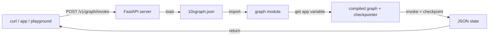

So far, you have built and tested an agent locally in Python. To use it from a web application or share it across a team, you need to expose it as an HTTP API. 10xGraph's API server turns your compiled graph into a production-ready FastAPI service in one command.

In this step, you will start the API server from the agent and memory you built in step 3, test it with curl, read thread state over REST, and use the hosted playground for interactive testing.

## Prerequisites

You need the step 3 graph with memory. If you skipped that step, create `graph/react.py`:

```python
from tenxgraph.core.graph import Agent, StateGraph, ToolNode
from tenxgraph.core.state import AgentState
from tenxgraph.storage.checkpointer import InMemoryCheckpointer
from tenxgraph.utils import END

def get_weather(location: str) -> str:
    """Get the current weather for a specific location."""
    return f"The weather in {location} is sunny and 22°C."

tool_node = ToolNode([get_weather])
checkpointer = InMemoryCheckpointer()

agent = Agent(
    model="google/gemini-2.5-flash",
    system_prompt=[
        {
            "role": "system",
            "content": "You are a helpful assistant. Use tools when you need specific information.",
        }
    ],
    tool_node="TOOL",
)

graph = StateGraph(AgentState)
graph.add_node("MAIN", agent)
graph.add_node("TOOL", tool_node)

def route(state: AgentState) -> str:
    if not state.context:
        return END
    last = state.context[-1]
    if hasattr(last, "tools_calls") and last.tools_calls and last.role == "assistant":
        return "TOOL"
    if last.role == "tool":
        return "MAIN"
    return END

graph.add_conditional_edges("MAIN", route, {"TOOL": "TOOL", END: END})
graph.add_edge("TOOL", "MAIN")
graph.set_entry_point("MAIN")

app = graph.compile(checkpointer=checkpointer)
```

Your `10xgraph.json` already points to this graph at `graph.react:app`.

## Start the API server

From the folder containing `10xgraph.json`, run:

```bash
10xgraph api --host 127.0.0.1 --port 8000
```

Expected output:

```text
INFO: Uvicorn running on http://127.0.0.1:8000
INFO: OpenAPI docs at http://127.0.0.1:8000/docs
```

The server is now running. The API server loaded your graph module, compiled the graph once at startup, and is ready to handle requests.

## Explore the API in Swagger UI

Open the Swagger UI at `http://127.0.0.1:8000/docs`. You will see every endpoint the server exposes, grouped by tag (Graph, checkpointer, etc.). Each endpoint shows its request and response schema, so you can test directly in the browser.

Check server health with a simple endpoint:

```bash
curl http://127.0.0.1:8000/ping
```

Response:

```json
{"data":"pong"}
```

## Test the graph with `invoke`

The `/v1/graph/invoke` endpoint executes the graph end-to-end and returns the final state. Open a second terminal and send:

```bash
curl -X POST http://127.0.0.1:8000/v1/graph/invoke \
  -H "Content-Type: application/json" \
  -d '{
    "messages": [{"role": "user", "content": "What is the weather in Paris?"}],
    "config": {"thread_id": "step4-thread-1"}
  }'
```

The response is the full final state:

```json
{
  "data": {
    "messages": [
      {"role": "user", "content": "What is the weather in Paris?"},
      {"role": "assistant", "content": "The weather in Paris is sunny and 22°C."}
    ]
  }
}
```

The `thread_id` in config tells the checkpointer which thread to use. Send another message on the same thread to test memory:

```bash
curl -X POST http://127.0.0.1:8000/v1/graph/invoke \
  -H "Content-Type: application/json" \
  -d '{
    "messages": [{"role": "user", "content": "What did I ask about first?"}],
    "config": {"thread_id": "step4-thread-1"}
  }'
```

The agent remembers your first question because the checkpointer loaded the earlier messages.

## Stream responses with `stream`

For real-time feedback, use `/v1/graph/stream`. The server sends newline-delimited JSON (NDJSON) chunks, one per event:

```bash
curl -X POST http://127.0.0.1:8000/v1/graph/stream \
  -H "Content-Type: application/json" \
  -d '{
    "messages": [{"role": "user", "content": "What is the weather in London?"}],
    "config": {"thread_id": "step4-thread-2"}
  }' | head -20
```

Output (each line is a separate JSON object):

```json
{"type":"message_delta","index":0,"delta":{"content":"The"}}
{"type":"message_delta","index":0,"delta":{"content":" weather"}}
{"type":"message_delta","index":0,"delta":{"content":" in"}}
...
```

The streaming format is useful for chatbots and real-time UIs where you display tokens as they arrive.

## Read thread state over REST

You can inspect any thread without invoking the graph again. The `GET /v1/threads/{thread_id}/state` endpoint returns the full checkpoint:

```bash
curl http://127.0.0.1:8000/v1/threads/step4-thread-1/state
```

Response:

```json
{
  "data": {
    "messages": [
      {"role": "user", "content": "What is the weather in Paris?"},
      {"role": "assistant", "content": "The weather in Paris is sunny and 22°C."},
      {"role": "user", "content": "What did I ask about first?"},
      {"role": "assistant", "content": "You asked about the weather in Paris."}
    ]
  }
}
```

This endpoint does not run the graph; it only retrieves what the checkpointer saved. It is useful for debugging, auditing, or building a chat history UI without replaying the graph.

## Test interactively with the playground

The hosted playground gives you a chat UI without writing frontend code. Start the playground:

```bash
10xgraph play --host 127.0.0.1 --port 8000
```

The browser opens automatically (if not, copy the URL from the terminal). The playground connects to your local API and shows a chat interface.

In the playground, you can:

1. **Send messages**: type naturally. Each message calls `POST /v1/graph/invoke` on your API.
2. **See tool calls**: if the agent uses tools, you see what was called and the result.
3. **Inspect raw state**: expand the debug panel to see the full message array.
4. **Test multiple threads**: create a new conversation to start a fresh thread.

Try the same questions:

```
What is the weather in Tokyo?
What about London?
What did I ask first?
```

The last question tests memory. The playground passes the same `thread_id` for each turn, so the checkpointer restores context.

When you stop the server (Ctrl+C), the playground loses its connection and shows an error until you restart.

## Request/response flow

Here is what happens when you call the API:



The server loads your config once at startup. For each request, it invokes the graph, passes the checkpointer, and returns the final state as JSON.

## Available endpoints

| Endpoint | Method | Description |
|---|---|---|
| `/v1/graph/invoke` | POST | Invoke the graph, return final state |
| `/v1/graph/stream` | POST | Invoke the graph, stream NDJSON chunks |
| `/v1/graph/stop` | POST | Stop a running graph |
| `/v1/graph/fix` | POST | Remove broken tool calls from state |
| `/v1/threads/{thread_id}/state` | GET | Read thread checkpoint |
| `/v1/threads/{thread_id}/messages` | GET | List thread messages |
| `/ping` | GET | Health check |
| `/docs` | GET | Swagger UI |

Full details are in the [API reference](/docs/reference/rest-api/graph).

## What you learned

- `10xgraph api` starts a production-ready FastAPI server that loads your graph from `10xgraph.json`.
- The `/v1/graph/invoke` endpoint runs the graph and returns the final state.
- The `/v1/graph/stream` endpoint sends results as NDJSON for real-time streaming.
- Thread state is readable via `GET /v1/threads/{thread_id}/state` without replaying the graph.
- The hosted playground (`10xgraph play`) provides a chat UI for testing without code.
- The checkpointer saves state automatically; pass the same `thread_id` to restore context across requests.

## Next step

Call the server from a TypeScript application using the 10xGraph client, [Call from your app](/docs/get-started/tutorial/call-from-your-app).
