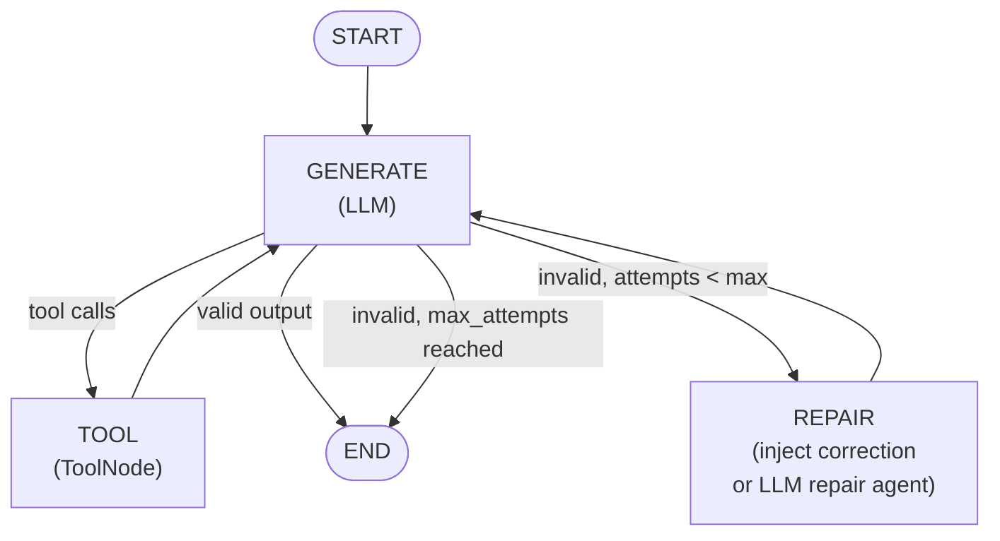
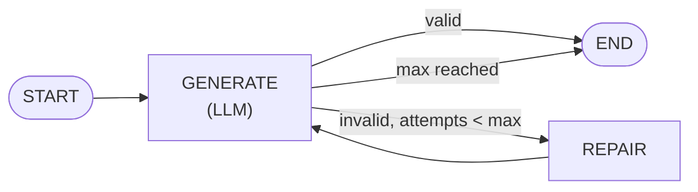

An agent that guarantees its output matches a Pydantic schema, with automatic validation and self-repair on failure. Perfect for applications requiring guaranteed structured output: data extraction, form completion, API request generation, and report synthesis.

**Import path:** `tenxgraph.prebuilt.agent`

---

## When to use

Use `StructuredOutputAgent` when:

- You need the LLM to return structured data that your application depends on (JSON, typed objects, dicts with specific fields).
- You cannot tolerate malformed output; validation and retry must be automatic.
- You want to limit token usage during repair (the lightweight mode is cheaper than a full LLM call).
- You are extracting data from text, completing forms, generating API payloads, or synthesizing reports.
- You need optional tools during generation (search, lookup, calculations) but the final output must match your schema.

Do not use it when:

- You need free-form text output (use `ReactAgent` instead).
- The schema is so complex that repair prompts alone cannot fix invalid JSON (you would need `repair_system_prompt`, which doubles token usage).
- You require output_schema functionality only, without the agent wrapper (use the plain `Agent` class with `output_schema=...` in a custom graph).

---

## How it works

`StructuredOutputAgent` is a two-stage graph: generate, validate, and repair on failure.

### Graph topology

With tools:



Without tools:



### Validation process

After the LLM responds, the agent validates the output in two stages:

1. **Native structured output**: If the LLM SDK populated `message.parsed_content` (when you use native structured-output mode), the agent validates it directly as a Python object.
2. **JSON text parsing**: If no parsed content is available, the agent parses the response text as JSON (stripping markdown code fences if present), then validates with `pydantic.TypeAdapter`.

If validation succeeds, the agent returns the output. Otherwise, it moves to repair.

### Repair modes

| Mode | Cost | When to use |
|---|---|---|
| **Lightweight** (default) | 1 LLM call total | Simple schemas, well-behaved models. The agent injects the error and schema, then re-generates. No extra LLM calls. |
| **LLM repair** | 2+ LLM calls | Complex schemas or frequent failures. Enable by setting `repair_system_prompt`. A dedicated agent actively rewrites the output. |

Lightweight repair injects this message:

```
Your previous response did not conform to the required output schema.
Validation error:
<pydantic error>

Target JSON Schema:
<full JSON Schema>

Please produce a response that is **valid JSON** and strictly matches the schema above.
Output only the JSON object, no extra text or code fences.
```

The agent re-calls the LLM and validates again. If validation succeeds or `max_attempts` is reached, it returns the best response.

---

## Constructor parameters

Essential parameters:

| Parameter | Type | Default | Description |
|---|---|---|---|
| `model` | `str` | required | LLM model identifier, e.g. `"gpt-4o-mini"`, `"gemini-2.5-flash"`, `"claude-opus-5"`. The agent detects the provider from the model name; pass `provider="..."` in kwargs to override. |
| `output_schema` | `type` | required | Pydantic `BaseModel` subclass or `TypedDict` subclass. Defines the expected shape of the structured output. |

Repair and generation control:

| Parameter | Type | Default | Description |
|---|---|---|---|
| `max_attempts` | `int` | `2` | Maximum validation+repair cycles. After this many failures, the agent returns the best-effort response even if validation failed. |
| `repair_system_prompt` | `list[dict] \| None` | `None` | Set to enable a dedicated LLM repair agent. Pass a list of message dicts with the repair instructions. When `None` (default), repair uses lightweight context injection (no extra LLM call). |
| `system_prompt` | `list[dict] \| None` | `None` | System prompt for the generation agent. Example: `[{"role": "system", "content": "You are a data analyst..."}]`. |

Tools and optional features:

| Parameter | Type | Default | Description |
|---|---|---|---|
| `tools` | `Iterable[Callable]` | `None` | Optional tools for the agent to call during generation. Tools run in parallel when the LLM requests multiple at once. The final output must still match the schema. |
| `trim_context` | `bool` | `False` | When `True`, old messages are trimmed when the context window grows too large. Useful for long multi-turn conversations. |
| `memory` | `MemoryConfig` | `None` | Long-term memory configuration. Enables the agent to retrieve and store facts across threads. |

Advanced options (passed to the inner `Agent`):

| Parameter | Type | Default | Description |
|---|---|---|---|
| `reasoning_config` | `dict \| bool` | `True` | Extended thinking configuration. When `True`, enables default reasoning. Pass a dict for fine-grained control (e.g., `{"effort": "medium"}`). |
| `retry_config` | `Any` | `True` | Retry strategy for LLM call failures. When `True`, uses exponential backoff. Pass a custom config for finer control. |
| `fallback_models` | `list[str \| tuple[str, str]]` | `None` | List of backup models. If the primary model fails, the agent tries these in order. Each entry is a model string or a tuple of `(model, provider)`. |
| `extra_messages` | `list[Message]` | `None` | Additional messages to prepend to the conversation. Useful for few-shot examples or context. |
| `multimodal_config` | `MultimodalConfig` | `None` | Multimodal input configuration for images, audio, and documents. |

---

## Compile to graph

The agent is not runnable until you call `.compile()`, which wires the graph and returns a `CompiledGraph`. All invoke, stream, and control-flow operations happen on the compiled graph.

```python
app = agent.compile(checkpointer=my_checkpointer, store=my_store)
result = await app.ainvoke({"messages": [Message.text_message("...")]}, config={"thread_id": "t1"})
```

Compile parameters:

| Parameter | Type | Default | Description |
|---|---|---|---|
| `checkpointer` | `BaseCheckpointer \| None` | `None` | Persistence backend. Saves and restores conversation state per thread. Examples: `InMemoryCheckpointer()` for dev, `PgCheckpointer(...)` for production. |
| `store` | `BaseStore \| None` | `None` | Long-term cross-thread storage. Used by memory tools and retrieval-augmented generation. Examples: `QdrantStore(...)`, `Mem0Store(...)`. |
| `interrupt_before` | `list[str] \| None` | `None` | Node names to pause before (e.g., `["GENERATE"]`). When paused, the run saves state and awaits `resume()` or a new message. |
| `interrupt_after` | `list[str] \| None` | `None` | Node names to pause after. Useful for human approval steps. |
| `callback_manager` | `CallbackManager` | default (empty) | Lifecycle hooks for observability: `on_invoke_start`, `on_invoke_end`, `on_error`, etc. |
| `media_store` | `BaseMediaStore \| None` | `None` | Binary/media file storage backend. Required if your schema includes file references. |
| `shutdown_timeout` | `float` | `30.0` | Graceful-shutdown timeout in seconds. How long the agent waits for in-flight tasks before force-closing. |

---

## Examples

### Basic usage with Pydantic schema

The simplest case: define your output schema as a Pydantic model, create the agent, and invoke it.

```python
import asyncio
from dotenv import load_dotenv
from pydantic import BaseModel, Field
from tenxgraph.prebuilt.agent import StructuredOutputAgent
from tenxgraph.core.state import Message

load_dotenv()

class ProductAnalysis(BaseModel):
    product_name: str
    sentiment: str = Field(description="positive, negative, or neutral")
    score: float = Field(ge=0.0, le=10.0)
    key_points: list[str]

agent = StructuredOutputAgent(
    model="gpt-4o-mini",
    output_schema=ProductAnalysis,
    system_prompt=[{
        "role": "system",
        "content": "Analyze the given product review and return a structured analysis.",
    }],
    max_attempts=3,
)

app = agent.compile()

async def main():
    result = await app.ainvoke(
        {"messages": [Message.text_message(
            "Review: 'Amazing build quality but the battery life is terrible.'"
        )]},
        config={"thread_id": "struct-1"},
    )
    output_text = result["context"][-1].text()
    print(output_text)
    # {"product_name": "...", "sentiment": "neutral", "score": 6.5, "key_points": [...]}

asyncio.run(main())
```

The agent validates the LLM's response against your schema. If validation fails, it injects the error and schema, then retries up to `max_attempts` times.

### Using TypedDict instead of Pydantic

If you prefer plain Python `TypedDict` over Pydantic models, StructuredOutputAgent supports it equally well.

```python
from typing import TypedDict
from tenxgraph.prebuilt.agent import StructuredOutputAgent
from tenxgraph.core.state import Message

class WeatherReport(TypedDict):
    city: str
    temperature_celsius: float
    conditions: str

agent = StructuredOutputAgent(
    model="gpt-4o-mini",
    output_schema=WeatherReport,
    system_prompt=[{"role": "system", "content": "Extract weather data for the given location."}],
)
app = agent.compile()

# Invoke it with any location
result = await app.ainvoke(
    {"messages": [Message.text_message("What's the weather in Seattle?")]},
    config={"thread_id": "weather-1"},
)
```

### With tools

Tools run inside the agent's generation loop, before validation occurs. Use tools to search, lookup data, or perform calculations that inform the structured output. The final response must still match your schema.

```python
from tenxgraph.prebuilt.agent import StructuredOutputAgent
from tenxgraph.prebuilt.tools import google_web_search
from pydantic import BaseModel

class ProductAnalysis(BaseModel):
    product_name: str
    sentiment: str
    score: float
    key_points: list[str]

agent = StructuredOutputAgent(
    model="gpt-4o-mini",
    output_schema=ProductAnalysis,
    tools=[google_web_search],
    system_prompt=[{
        "role": "system",
        "content": (
            "Search for recent reviews of the given product. "
            "Synthesize them into a structured analysis with sentiment, score (0-10), and key points. "
            "Output must be valid JSON matching the required schema."
        ),
    }],
    max_attempts=2,
)
app = agent.compile()
```

### Enable LLM repair for complex schemas

By default, StructuredOutputAgent uses lightweight repair: it injects the error message and schema, then re-generates without an extra LLM call. For very complex or nested schemas, enable a dedicated repair agent.

```python
from tenxgraph.prebuilt.agent import StructuredOutputAgent
from pydantic import BaseModel

class ProductAnalysis(BaseModel):
    product_name: str
    sentiment: str
    score: float
    key_points: list[str]

agent = StructuredOutputAgent(
    model="gpt-4o",
    output_schema=ProductAnalysis,
    max_attempts=2,
    repair_system_prompt=[{
        "role": "system",
        "content": (
            "You are a JSON repair expert. Your job is to fix broken or incomplete JSON "
            "to strictly match the provided schema. Output only valid JSON, no explanation, "
            "no code fences, no markdown. Just the JSON object."
        ),
    }],
)
app = agent.compile()
```

When `repair_system_prompt` is set, failed validations trigger a second LLM call with your repair instructions. This costs more tokens but can fix structural errors the lightweight mode cannot.

### Multi-provider example: Google Gemini

StructuredOutputAgent works with any supported LLM. The provider is detected automatically from the model name.

```python
from tenxgraph.prebuilt.agent import StructuredOutputAgent
from pydantic import BaseModel

class Summary(BaseModel):
    title: str
    body: str
    tags: list[str]

agent = StructuredOutputAgent(
    model="gemini-2.5-flash",
    output_schema=Summary,
    system_prompt=[{
        "role": "system",
        "content": "Summarize the given text into a structured JSON object with title, body, and relevant tags.",
    }],
    max_attempts=3,
    trim_context=True,
)
app = agent.compile()
```

### Streaming event-by-event output

Use `.astream()` to receive validation events, tool calls, and the final output as they occur.

```python
import asyncio
from tenxgraph.prebuilt.agent import StructuredOutputAgent
from pydantic import BaseModel
from tenxgraph.core.state import Message

class MovieReview(BaseModel):
    title: str
    rating: float
    summary: str

agent = StructuredOutputAgent(
    model="gpt-4o-mini",
    output_schema=MovieReview,
    system_prompt=[{"role": "system", "content": "Review the film with a rating 0-10."}],
)
app = agent.compile()

async def main():
    async for event in app.astream(
        {"messages": [Message.text_message("Review the film Inception.")]},
        config={"thread_id": "stream-struct-1"},
    ):
        print(f"Event: {event}")

asyncio.run(main())
```

Each event carries state updates, node execution details, and final output. See `/docs/guides/stream-graph` for details on interpreting stream events.

---

## Test it with the playground

The 10xGraph playground lets you test your agent interactively without writing a client. Create three files:

**`graph.py`**, Your agent definition:

```python
from pydantic import BaseModel
from tenxgraph.prebuilt.agent import StructuredOutputAgent

class SummaryOutput(BaseModel):
    title: str
    summary: str
    tags: list[str]

agent = StructuredOutputAgent(
    model="gpt-4o-mini",
    output_schema=SummaryOutput,
    system_prompt=[{
        "role": "system",
        "content": "Summarize the given text. Return a JSON object with title, summary, and tags.",
    }],
    max_attempts=3,
)

app = agent.compile()
```

**`10xgraph.json`**, Configuration:

```json
{
  "agent": "graph:app",
  "env": ".env",
  "auth": null,
  "checkpointer": null,
  "injectq": null,
  "store": null,
  "redis": null,
  "thread_name_generator": null
}
```

**`.env`**, API credentials:

```
OPENAI_API_KEY=sk-...
```

Then run:

```bash
10xgraph play
```

The playground opens at `http://localhost:3000`. Type a message and watch the agent invoke, validate, and return structured output. If validation fails, the playground shows the error and the retry attempt.

---

## Next steps

- **See it in action:** Full reference of all StructuredOutputAgent parameters is at `/docs/reference/python/prebuilt-agents`.
- **Handle longer conversations:** Use `/docs/guides/set-up-checkpointing` to persist state across threads, so the agent remembers previous turns.
- **Add more tools:** Pass additional tools via the `tools=` parameter, or see `/docs/guides/prebuilt-tools` for a catalog of prebuilt tools.
- **Stream and monitor:** Use `/docs/guides/stream-graph` to process events as the agent runs, or `/docs/guides/use-publishers` to emit events to observability platforms.
- **Build a custom graph:** If you need more control over routing or node execution, see `/docs/guides/build-a-graph` to build a plain `StateGraph` and add your own nodes.
