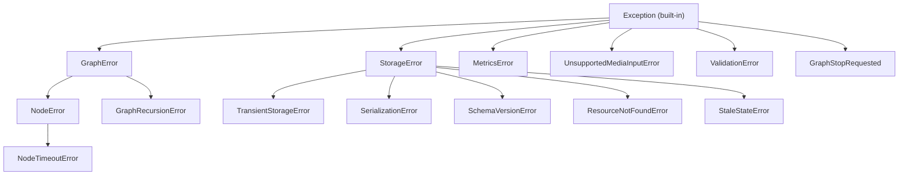

10xGraph raises typed exceptions. Most carry a stable `error_code` such as `NODE_TIMEOUT_000` and a `context` dictionary, so you can branch on the code in your own handlers, filter logs by it, and know which errors are safe to retry. This page lists every exception, its code, and its fix.

## Exception hierarchy

Graph and storage errors share a base class that carries `error_code`, `message` and `context`. Media, validation and stop signals are separate `Exception` subclasses with their own attributes.



Note that `MetricsError` derives from `Exception` directly, not from `StorageError`.

## Import paths

All coded exceptions and `GraphStopRequested` come from `tenxgraph.core.exceptions`. The media and validation exceptions live elsewhere.

```python title="imports.py"
from tenxgraph.core.exceptions import (
    GraphError,
    GraphRecursionError,
    GraphStopRequested,
    MetricsError,
    NodeError,
    NodeTimeoutError,
    ResourceNotFoundError,
    SchemaVersionError,
    SerializationError,
    StaleStateError,
    StorageError,
    TransientStorageError,
)
from tenxgraph.core.exceptions.media_exceptions import UnsupportedMediaInputError
from tenxgraph.utils import ValidationError
```

## Quick reference

Use this table to find an exception by its code prefix. Codes ending in `_000` are the defaults; a raiser may pass a higher number (for example `NODE_TIMEOUT_001` or `STORAGE_CONFLICT_001`) for a specific case.

| Code | Class | Retryable | API status |
|---|---|---|---|
| `GRAPH_000` | `GraphError` | No | 500 |
| `NODE_000` | `NodeError` | Depends on cause | 500 |
| `NODE_TIMEOUT_000` | `NodeTimeoutError` | Sometimes | 500 |
| `RECURSION_000` | `GraphRecursionError` | No, needs a config change | 500 |
| `STORAGE_000` | `StorageError` | No | 500 |
| `STORAGE_TRANSIENT_000` | `TransientStorageError` | Yes, with backoff | 503 |
| `STORAGE_SERIALIZATION_000` | `SerializationError` | No | 500 |
| `STORAGE_SCHEMA_000` | `SchemaVersionError` | No, needs migration | 422 |
| `STORAGE_NOT_FOUND_000` | `ResourceNotFoundError` | No | 500 |
| `STORAGE_CONFLICT_000` | `StaleStateError` | Yes, after reloading state | 500 |
| `METRICS_000` | `MetricsError` | No | 500 |
| none | `UnsupportedMediaInputError` | No | not mapped by the server |
| none | `ValidationError` | No | 422 |
| none | `GraphStopRequested` | Not applicable | never reaches the server |

## Graph errors

`GraphError` is the base for failures in graph execution. Its default code is `GRAPH_000`, it is not retryable, and everything below it in the hierarchy is a `GraphError` too, so one `except GraphError` catches them all.

```python title="raise_graph_error.py"
from tenxgraph.core.exceptions import GraphError

raise GraphError(
    message="Graph failed to initialize",
    error_code="GRAPH_000",
    context={"graph_name": "my_agent"},
)
```

Common causes: invalid graph configuration, node initialization failure, an edge routing error. Other codes such as `GRAPH_001` are conventions you pass in when you raise your own `GraphError`; the library does not assign meaning to them.

## Node errors

`NodeError` (default `NODE_000`) reports a failure inside one node. Whether it is retryable depends on the cause, so read `context` and the message before retrying.

```python title="raise_node_error.py"
from tenxgraph.core.exceptions import NodeError

raise NodeError(
    message="Node execution failed",
    error_code="NODE_000",
    context={"node_name": "process_data", "input_size": 100},
)
```

Common causes: a tool that raised, invalid node input, resource exhaustion.

### Node or tool timeout

`NodeTimeoutError` (default `NODE_TIMEOUT_000`, a subclass of `NodeError`) is raised when a node or tool call exceeds its deadline. Defaults are 900 seconds per node and 300 seconds per tool call. A transient hang is worth a retry; a genuinely slow operation is not.

Without a deadline, a node that hangs on a half-open socket or an unresponsive MCP server blocks the graph forever: the loop never advances a step, so the recursion limit never trips and the between-nodes stop check is never reached. The timeout turns that hang into a normal node error the execution loop can persist and report.

Common causes: a custom tool that never returns, an unresponsive MCP server, or a node that legitimately works longer than its deadline.

Fix: raise `node_timeout` or `tool_timeout` in the run config, or fix the hanging call. Pass `None` or a non-positive number to disable a deadline. See [execution deadlines](/docs/reference/python/graph#execution-deadlines).

## Recursion errors

`GraphRecursionError` (default `RECURSION_000`) is raised when a run takes more steps than `recursion_limit`, which defaults to 25. It is not retryable because the same input will loop the same way.

```python title="raise_recursion_error.py"
from tenxgraph.core.exceptions import GraphRecursionError

raise GraphRecursionError(
    message="Recursion limit exceeded in graph execution",
    error_code="RECURSION_000",
    context={"recursion_depth": 100, "max_depth": 50},
)
```

Common causes: a routing loop with no path to `END`, a tool the model keeps calling, a missing termination condition.

Fix: make sure every path reaches `END`, or raise `recursion_limit` in the run config if the work genuinely needs more steps.

## Storage errors

`StorageError` (default `STORAGE_000`) is the base for persistence failures in checkpointers and stores. It is not retryable; the subclasses below say which failures are.

### Transient storage error

`TransientStorageError` (`STORAGE_TRANSIENT_000`) marks a temporary failure that may succeed on retry: a connection timeout, a network interruption, lock contention. Retry with exponential backoff (see the helper below).

```python title="raise_transient_error.py"
from tenxgraph.core.exceptions import TransientStorageError

raise TransientStorageError(
    message="Database connection timeout",
    error_code="STORAGE_TRANSIENT_000",
    context={"operation": "read_thread", "timeout_ms": 5000},
)
```

### Serialization error

`SerializationError` (`STORAGE_SERIALIZATION_000`) means state or a message could not be encoded or decoded. It is not retryable because the data itself is the problem: an invalid state schema, corrupt checkpoint data, or a value that is not JSON-serializable. Keep state to serializable types.

### Schema version error

`SchemaVersionError` (`STORAGE_SCHEMA_000`) means schema version detection or migration failed. The usual cause is upgrading 10xGraph without migrating the database, or a database out of sync with the installed version. It is not retryable. Check the stored schema version against the installed version and migrate.

### Resource not found

`ResourceNotFoundError` (`STORAGE_NOT_FOUND_000`) means the requested thread, checkpoint or other resource does not exist in storage. Check the `thread_id`, whether the thread was deleted, and that the graph was compiled with a `checkpointer`. It is not retryable.

```python title="raise_not_found.py"
from tenxgraph.core.exceptions import ResourceNotFoundError

raise ResourceNotFoundError(
    message="Thread not found",
    error_code="STORAGE_NOT_FOUND_000",
    context={"thread_id": "abc123"},
)
```

### Stale state

`StaleStateError` (`STORAGE_CONFLICT_000`; the Postgres checkpointer raises `STORAGE_CONFLICT_001` for a version mismatch on write) means a state write lost its optimistic-concurrency check. Another execution committed a newer state for the same thread first, and committing anyway would silently discard that work, so the write is rejected.

The `context` holds `thread_id`, `expected_version` and `current_version`. Common causes: two requests processing the same `thread_id` at once, several replicas serving one thread, or a retried request racing the original.

Fix: reload the latest state and retry the turn rather than overwriting blindly. On conflict the checkpointer invalidates its cache for the thread, so the next read comes from Postgres. The API server has no dedicated handler for this error, so it surfaces as a 500 from the generic `StorageError` handler. See [Durability and concurrency](/docs/guides/durability-and-concurrency#optimistic-concurrency-and-stalestateerror).

### Metrics error

`MetricsError` (`METRICS_000`) reports a failed metrics emission. It is not retryable and is non-critical: a metrics failure should not interrupt a run.

## Control flow signals

`GraphStopRequested` is not a failure. It is raised inside a node when a stop is requested mid-run. The execution loop catches it, marks the run stopped, persists that, and returns normally. It has no error code and one attribute, `node_name`, the node that was running when the stop arrived.

Do not catch it in node code or in a broad `except Exception` around `invoke`, or you turn a clean stop into an error.

## Media errors

`UnsupportedMediaInputError` is raised before the provider call when the model does not support the media type or no transport path exists. It has no error code.

| Attribute | Type | Description |
|---|---|---|
| `provider` | `str` | Provider identifier, for example `openai` |
| `model` | `str` | Model name |
| `media_type` | `str` | Kind of media, for example `image` or `document` |
| `source_kind` | `str` | How the media was supplied, for example `url` or `file_id` |
| `transports_attempted` | `list[MediaTransportMode]` | Transport modes tried before failing |

Its `to_dict()` returns `error_type`, `provider`, `model`, `media_type`, `source_kind`, `transports_attempted` and `message`; it has no `error_code` or `context`.

```python title="handle_media_error.py"
from tenxgraph.core.exceptions.media_exceptions import UnsupportedMediaInputError


async def run(app, messages):
    try:
        return await app.ainvoke({"messages": messages})
    except UnsupportedMediaInputError as e:
        # Switch to a model that accepts this media type, or drop the attachment
        print(f"{e.provider}/{e.model} does not support {e.media_type} inputs")
        raise
```

Fix: use a model that supports the media type, or remove the media input.

## Validation errors

`ValidationError` is raised by input validators when a message violates a policy. It has no error code. It carries `violation_type` (a string), `details` (a dict) and the message as its text.

Violation types raised by the built-in validators:

| `violation_type` | Raised by | Meaning |
|---|---|---|
| `length_exceeded` | `PromptInjectionValidator` | Input longer than `max_length` |
| `injection_pattern` | `PromptInjectionValidator` | Input matched a blocked injection pattern |
| `encoding_attack` | `PromptInjectionValidator` | Obfuscation through encoding detected |
| `suspicious_keywords` | `PromptInjectionValidator` | Too many attack-related keywords |
| `payload_splitting` | `PromptInjectionValidator` | Attack split across inputs |
| `invalid_role` | `MessageContentValidator` | Message role not in `allowed_roles` |
| `too_many_blocks` | `MessageContentValidator` | More content blocks than `max_content_blocks` |

Custom validators can raise any `violation_type` string. In `strict_mode=True` the prompt injection validator raises; otherwise it logs a warning and sanitizes.

```python title="handle_validation_error.py"
from tenxgraph.utils import ValidationError


async def run(app, messages):
    try:
        return await app.ainvoke({"messages": messages})
    except ValidationError as e:
        # Reject the input and report why
        print(f"Rejected: {e} (type={e.violation_type}, details={e.details})")
        raise
```

Fix: inspect `violation_type`, change the input, or tune the validator. Register validators on a `CallbackManager` passed to `compile(callback_manager=...)`.

## Symptom lookup

Start from what you see and jump to the code that explains it.

| Symptom | Likely error | What to do |
|---|---|---|
| Run stops on a step limit, repeated tool calls | `RECURSION_000` | Give every path a route to `END`, or raise `recursion_limit` |
| A node or tool hangs, then fails with a deadline error | `NODE_TIMEOUT_000` | Fix the hanging call, or set `node_timeout` / `tool_timeout` |
| Empty history or not-found for a thread | `STORAGE_NOT_FOUND_000` | Check the `thread_id` and that the graph has a `checkpointer` |
| Intermittent connection errors under load | `STORAGE_TRANSIENT_000` | Retry with backoff, check connection pool limits |
| Checkpoint fails to encode or decode | `STORAGE_SERIALIZATION_000` | Keep state to JSON-serializable types |
| Errors after upgrading the package | `STORAGE_SCHEMA_000` | Migrate the database |
| Concurrent writes to one thread fail | `STORAGE_CONFLICT_000` | Reload state and retry |
| User input rejected | `ValidationError` | Inspect `violation_type`, tune the validator |
| Media input rejected | `UnsupportedMediaInputError` | Use a model that supports the media type |
| A tool or node raised | `NODE_000` | Read the tool error in the logs, test the tool alone |

Run limits are run-config keys, not `compile()` arguments:

```python title="run_config.py"
config = {
    "thread_id": "support-42",
    "recursion_limit": 50,  # max steps before GraphRecursionError (default 25)
    "node_timeout": 60,     # seconds per node (default 900)
    "tool_timeout": 30,     # seconds per tool call (default 300)
}
result = await app.ainvoke({"messages": [...]}, config)
```

## HTTP status from the API server

The server maps exceptions to responses in `tenxgraph_api/src/app/core/exceptions/handle_errors.py`. In production mode the message is sanitized.

| Exception | Status |
|---|---|
| `ValidationError` (input validators), `SchemaVersionError` | 422 |
| `GraphError`, `NodeError`, `GraphRecursionError`, `StorageError` (including `StaleStateError`, `ResourceNotFoundError`), `SerializationError`, `MetricsError` | 500 |
| `TransientStorageError` | 503 |

## Structured error responses

Every coded exception has `to_dict()`, returning `error_type`, `error_code`, `message` and `context`. Use it for structured logs and API responses.

```python title="structured_error.py"
from tenxgraph.core.exceptions import GraphRecursionError

try:
    raise GraphRecursionError(
        message="Recursion limit exceeded",
        context={"recursion_depth": 100, "max_depth": 50},
    )
except GraphRecursionError as e:
    print(e.to_dict())
    # {'error_type': 'GraphRecursionError', 'error_code': 'RECURSION_000',
    #  'message': 'Recursion limit exceeded',
    #  'context': {'recursion_depth': 100, 'max_depth': 50}}
```

## Handle errors in your code

Catch the most specific class first, because subclasses must precede their bases.

```python title="handle_errors.py"
from tenxgraph.core.exceptions import (
    GraphError,
    GraphRecursionError,
    StaleStateError,
    StorageError,
    TransientStorageError,
)


async def run_turn(app, messages, config):
    try:
        return await app.ainvoke({"messages": messages}, config)
    except GraphRecursionError as e:
        print(f"Loop detected: {e.error_code}")  # fix routing or raise recursion_limit
        raise
    except StaleStateError:
        raise  # reload the thread state and retry the turn
    except TransientStorageError:
        raise  # safe to retry, see the backoff helper below
    except StorageError as e:
        print(f"Storage error: {e.error_code}")
        raise
    except GraphError as e:
        print(f"Graph error: {e.error_code}")
        raise
```

### Retry transient errors with backoff

This helper retries only `TransientStorageError`, doubling the delay each attempt, and re-raises after the last one.

```python title="retry.py"
import asyncio

from tenxgraph.core.exceptions import TransientStorageError


async def retry_with_backoff(func, max_retries=3, base_delay=1.0):
    for attempt in range(max_retries):
        try:
            return await func()
        except TransientStorageError:
            if attempt == max_retries - 1:
                raise
            await asyncio.sleep(base_delay * (2**attempt))


# Usage: result = await retry_with_backoff(lambda: app.ainvoke({"messages": msgs}, config))
```

## Related docs

- [API server troubleshooting](/docs/troubleshooting/api-server): common server errors and fixes
- [Durability and concurrency](/docs/guides/durability-and-concurrency): handling `StaleStateError` and thread isolation
- [Production checklist](/docs/server/production-checklist): production hardening and error recovery
- [Testing reference](/docs/reference/python/testing): test utilities and validation helpers
