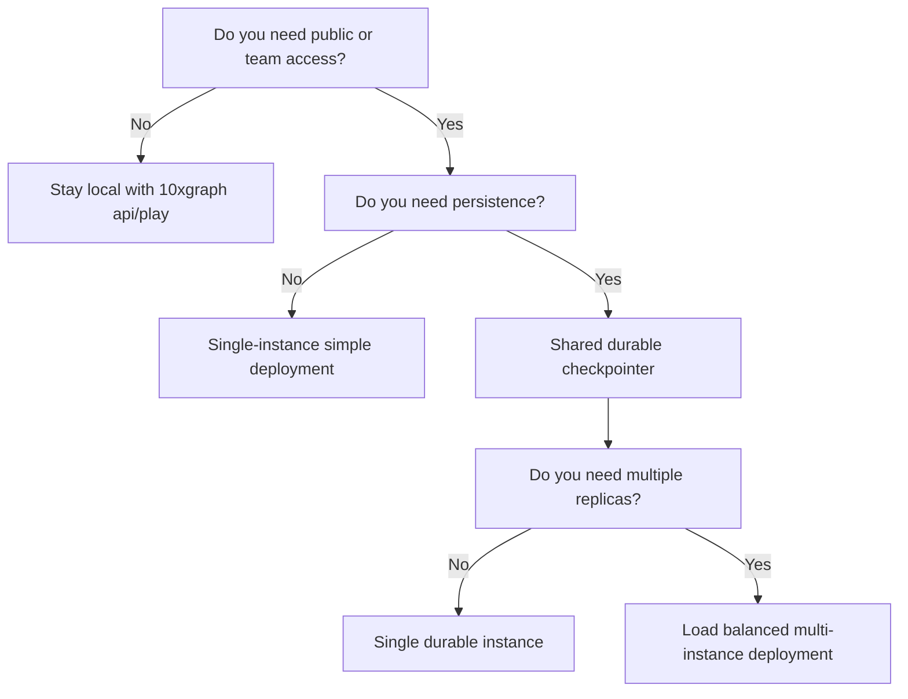

`10xgraph build` generates a production-ready `Dockerfile` and `.dockerignore` for your agent, and with flags also a `docker-compose.yml` and a `k8s.yaml` manifest. The images run Gunicorn with Uvicorn workers in `MODE=production`. This guide covers building, configuring, and shipping your deployment with a release checklist.

<Steps>

1. **Generate the deployment files**

   Run it in the project root, next to `10xgraph.json`.

   ```bash
   10xgraph build --docker-compose --k8s
   ```

2. **Pin your dependencies**

   The Dockerfile installs from the first of `requirements.txt`, `requirements/requirements.txt`, `requirements/base.txt` or `requirements/production.txt` that exists. With none of those, it reads `pyproject.toml` dependencies. With neither, it installs only `10xgraph-api`, so your own packages would be missing.

3. **Build and run**

   ```bash
   docker compose up --build
   ```

4. **Check health**

   ```bash
   curl http://localhost:8000/ping
   ```

</Steps>

## Which flags does build take?

| Flag | Default | Effect |
|---|---|---|
| `--output`, `-o` | `Dockerfile` | Dockerfile path |
| `--force`, `-f` | off | Overwrite existing files |
| `--python-version` | `3.13` | Base image `python:<version>-slim` |
| `--port`, `-p` | `8000` | Port to expose |
| `--docker-compose / --no-docker-compose` | off | Also write `docker-compose.yml` and omit `CMD` from the Dockerfile |
| `--k8s / --no-k8s` | off | Also write `k8s.yaml` |
| `--service-name` | `10xgraph-api` | Service name in compose and Kubernetes files |

Without `--force`, `build` stops if the Dockerfile exists. It skips an existing `.dockerignore`, but errors on an existing `docker-compose.yml` or `k8s.yaml`.

## What files does it generate?

<FileTree>

- your-project/
  - 10xgraph.json
  - **Dockerfile** python:3.13-slim, non-root user, healthcheck on /ping
  - .dockerignore excludes .env, caches, venvs, .git, eval_reports, tests, evals and agent skill folders
  - docker-compose.yml with `--docker-compose`
  - k8s.yaml with `--k8s`

</FileTree>

The Dockerfile sets `MODE=production`, `IS_DEBUG=false` and `WEB_CONCURRENCY=2`, installs `gunicorn` and `uvicorn`, removes the CLI-only files from the installed package, copies your project, drops to a non-root `appuser`, and defines a `HEALTHCHECK` that calls `/ping`. Its `CMD` runs `tenxgraph_api.src.app.main:app` under Gunicorn with `--graceful-timeout 600` and `--timeout 660`.

## Does the image ship the CLI and the config editor?

No. `10xgraph-api` is one package with two halves: the API server, and the CLI you use on your machine (`init`, `build`, `eval`, the `10xgraph config` browser editor, project templates and the bundled agent skill). Seeing CLI code and HTML/JS in the package can look like extra attack surface on a production server. It is not, for two reasons.

**The server never touches the CLI half.** It imports one CLI file, `tenxgraph_api/cli/constants.py`, for the version string. No route serves the editor's HTML or JS, and the editor itself only runs when you type `10xgraph config`. Even then it listens on `127.0.0.1` and needs a random per-session token.

**The generated image removes it anyway.** Right after installing dependencies, the Dockerfile deletes the templates and the config editor from the installed package:

```dockerfile
# Strip CLI-only assets the server never loads: project scaffolds, the bundled
# agent skill, and the local config editor (HTML/JS). Only the server code and
# its dependencies stay in the image.
RUN python -I -c "import importlib.util, pathlib, shutil; spec = importlib.util.find_spec('tenxgraph_api'); cli = pathlib.Path(spec.origin).parent / 'cli' if spec and spec.origin else None; [shutil.rmtree(cli / d, ignore_errors=True) for d in ('templates', 'config_editor') if cli]"
```

The CLI's small Python modules stay, so `10xgraph version` and `10xgraph audit` still work inside a running container for debugging.

The generated `.dockerignore` does the same for your project: `tests/`, `evals/` and installed skill folders (`.claude/`, `.agents/`, `.github/`) are not copied into the image, along with `.env` files, caches and virtual environments.

You can check a built image yourself:

```bash
docker build -t my-agent .
docker run --rm my-agent python -c "import pathlib, tenxgraph_api; print(sorted(p.name for p in (pathlib.Path(tenxgraph_api.__file__).parent / 'cli').iterdir()))"
```

The list has no `templates` or `config_editor` entry.

<Callout type="note" title="Older Dockerfiles">

A Dockerfile generated before `10xgraph-api` 0.7.0 does not have the strip step. Run `10xgraph build --force` to regenerate it, or add the `RUN` line above after your `pip install` step.

</Callout>

## How do I run it in Docker Compose or Kubernetes?

<Tabs syncKey="target">

<TabItem label="Docker Compose">

The compose file defines one service with `build: .`, the production environment, a port mapping, the same Gunicorn command, `stop_grace_period: 600s` and `restart: unless-stopped`. It sets no secrets, so pass them with `--env-file` or an `environment` block.

```bash
docker compose --env-file prod.env up --build -d
```

</TabItem>

<TabItem label="Kubernetes">

`k8s.yaml` holds a Deployment with 2 replicas and a Service on port 80 that targets your container port.

```bash
docker build -t registry.example.com/my-agent:1.0 .
docker push registry.example.com/my-agent:1.0
# edit the image field in k8s.yaml, then:
kubectl apply -f k8s.yaml
```

The settings that protect running agents:

| Setting | Value | Why |
|---|---|---|
| `terminationGracePeriodSeconds` | 660 | Longer than the 600 second Gunicorn drain |
| `preStop` | `sleep 15` | Lets the load balancer stop sending new requests first |
| `readinessProbe` | `/ping`, every 10s | Removes the pod from rotation |
| `livenessProbe` | `/ping`, every 30s, 5 failures | Slack enough that a busy worker is not restarted mid-run |
| Resources | request 500m CPU and 512Mi, limit 2 CPU and 2Gi | Starting point, tune for your load |

The manifest sets only `MODE`, `IS_DEBUG` and a placeholder `ORIGINS`. Add the rest of your configuration from a Secret.

</TabItem>

</Tabs>

## Choose your deployment path

Before building, decide whether you need persistence, multiple instances, and public access. This flowchart guides the decision:



For local development, `10xgraph api` and `10xgraph play` are sufficient. For shared or production use:

- **Persistence required:** Set a durable checkpointer (for example `PgCheckpointer`), either in your graph code or with the `checkpointer` key in `10xgraph.json`. In-memory checkpointing loses all threads on restart.
- **Multiple instances:** Use a shared durable checkpointer and a shared store (if using long-term memory). Each instance must access the same database backend.
- **Rate limiting across instances:** Use the `redis` rate-limit backend (the memory backend counts per process and is not shared).

## Production environment settings

The generated files set `MODE=production` and `IS_DEBUG=false`. Add the following at runtime:

| Variable | Set to | Why |
|---|---|---|
| `ORIGINS` | Comma-separated list of your frontend origins | Wildcard `*` is refused when `CORS_ALLOW_CREDENTIALS` is true |
| `ALLOWED_HOST` | Your hostnames | Comma-separated. The default `*` triggers a startup warning in production |
| `JWT_SECRET_KEY` | 32+ bytes, from a secret manager | Required if `auth` is `jwt`. See [Add JWT authentication](/docs/server/auth) |
| `JWT_ALGORITHM` | `HS256` or your choice | Required with `jwt` |
| `REDIS_URL` | Your Redis connection URL | Optional. The server falls back to it for the shared tier of the authorization ownership cache when the `redis` key in `10xgraph.json` is unset. For shared rate limiting, point `rate_limit.redis.url` at it as `${REDIS_URL}` |
| `WEB_CONCURRENCY` | Workers per container | Default 2. Tune for your CPU and load |

For durable persistence and distributed deployments, also configure:

- A `PgCheckpointer` or equivalent (never rely on in-memory checkpointing in production).
- A `BaseStore` subclass if you use long-term memory.
- An `AuthorizationBackend` to enforce thread ownership or role-based access control.

Full reference is in the [configuration](/docs/reference/api-cli/configuration) and [environment](/docs/reference/api-cli/environment) pages.

<Callout type="warning" title="CORS and credentials">

Replace the placeholder `ORIGINS` and never ship `*` with credentials. In production the server refuses to start with wildcard origins while `CORS_ALLOW_CREDENTIALS` is true. This is a safety check: wildcard CORS with credentials would allow any website to read your data.

</Callout>

## Before release: verification checklist

Before deploying to production, run these checks to catch configuration issues early:

1. **Health endpoint**
   ```bash
   curl http://127.0.0.1:8000/ping
   ```

2. **Graph schema**
   ```bash
   curl http://127.0.0.1:8000/v1/graph
   ```

3. **Auth is enforced** (if enabled)
   - Without credentials: auth-protected routes return 401
   - With valid credentials: requests succeed

4. **CORS is restricted**
   - Requests from allowed origins succeed
   - Requests from disallowed origins are rejected

5. **Documentation is hidden** (if intentional)
   - In `MODE=production` the server turns `/docs` and `/redocs` off unless you set `DOCS_PATH` or `REDOCS_PATH` explicitly (they should return 404)
   - Check that neither variable is set in your deployment

6. **Persistence survives restart**
   - Invoke an agent and save the thread_id
   - Restart the server or container
   - Fetch the same thread: messages and state should be intact

7. **Multiple instances sync** (if deployed with replicas)
   - Invoke an agent on instance A, get a thread_id
   - Fetch that thread on instance B: state should be identical
   - This confirms the checkpointer and store backends are shared

Record the results before going live. If any check fails, fix the configuration and repeat.
