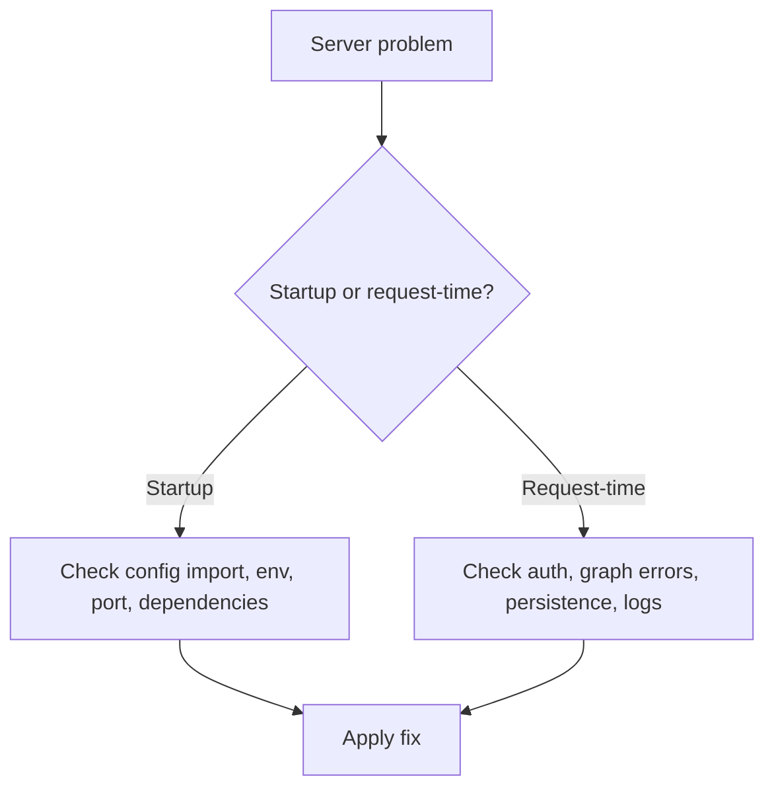

Use this page when `10xgraph api` fails to start, rejects requests, or behaves differently in production than locally. Find your symptom under startup, request-time or production issues, then apply the fix. Each entry lists symptoms, the cause and a concrete fix verified against the server code.

## Server troubleshooting map



## Startup issues

### Issue: server does not start

**Symptoms**

- command exits immediately
- stack trace appears before the server binds

**Likely causes**

- invalid `10xgraph.json`
- graph import failure
- missing required environment variables or provider keys

**Fix**

- verify the config file path
- test the graph import manually: `python -c "from graph.react import app; print(app)"`
- verify required provider keys and dependencies are installed before startup

### Issue: `RuntimeError: Refusing to start: the following routes are not protected`

**Symptoms**

- startup aborts with a `RuntimeError` listing one or more routes

```
RuntimeError: Refusing to start: the following routes are not protected by RequirePermission.
Add the dependency, or add the path to the public allowlist if it is intentionally open:
  - POST /v1/my-new-endpoint
```

**Cause**

Every non-public route must carry a `RequirePermission` guard. The check runs once at startup and walks the entire dependency subtree of every route. This is deliberate: a forgotten guard would otherwise ship a silently open endpoint.

**Fix**

Add the dependency to the handler (the import path is `tenxgraph_api.src.app.core.auth.permissions`):

```python title="my_router.py"
from typing import Any

from fastapi import APIRouter, Depends

from tenxgraph_api.src.app.core.auth.permissions import RequirePermission

router = APIRouter()


@router.post("/v1/my-new-endpoint")
async def my_endpoint(
    user: dict[str, Any] = Depends(RequirePermission("graph", "read")),
):
    return {"ok": True}
```

Only three paths are public: `/ping`, `/v1/evals/runs`, and `/v1/evals/runs/{run_id}`. Modifying the public allowlist requires editing the source code frozenset, which is intentional. Do not use it to silence this error on a route that handles user data.

### Issue: `InsecureCorsConfigError` on startup


**Symptoms**

- the server refuses to start in production with a message beginning "Refusing to start: CORS is configured with ORIGINS='*'"

**Cause**

`ORIGINS="*"` combined with `CORS_ALLOW_CREDENTIALS=true` while `MODE=production`. Starlette reflects the caller's `Origin` back alongside `Access-Control-Allow-Credentials: true`, which makes every origin a trusted, credentialed one.

In development the same combination only logs a warning, so this failure usually appears the first time a working local config is promoted to production.

**Fix**

Pick one:

```bash
# Name the origins explicitly (the usual answer)
ORIGINS=https://yourapp.com,https://api.yourapp.com
```

```bash
# Or serve a public, non-credentialed API
CORS_ALLOW_CREDENTIALS=false
```

### Issue: port already in use

**Symptoms**

- startup fails with address already in use

**Cause**

- another process already listens on the chosen port

**Fix**

- change the port with `--port 8001`
- stop the conflicting process: `lsof -i :8000 | tail -1 | awk '{print $2}' | xargs kill`

### Issue: auto-reload causes unstable behavior

**Symptoms**

- repeated restarts
- duplicate workers
- unstable behavior in Docker or remote filesystems

**Cause**

- reload watcher is not appropriate for that environment

**Fix**

```bash
10xgraph api --no-reload
```

Use reload only for active local development.

## Request-time issues

### Issue: `/ping` works but graph routes fail

This is the most common request-time symptom: the server is up, but the graph fails when it runs. The production entry "deployment starts but requests fail immediately" below covers the deploy-specific causes.

**Symptoms**

- health check succeeds
- `/v1/graph/invoke` returns 500 or import-related errors

**Likely cause**

- the server itself started, but graph dependencies fail when invoked (bad provider keys, network issues with external services, tool initialization errors)

**Fix**

- inspect runtime logs: the error appears there
- verify graph dependencies, provider keys, and tool integrations work outside the server
- test with a minimal invoke payload (e.g., no tools)

### Issue: `403 Missing required scope: <resource>:<action>`

**Symptoms**

- an authenticated user is rejected on a specific endpoint while others work

**Cause**

The identity carries a scope list that does not include this endpoint's `"<resource>:<action>"` pair. Scopes resolve from the authorization backend's `scopes_for` method first, and only fall back to the token's own `scopes` claim when that returns `None`.

A common case: switching to the RBAC backend. `RoleBasedAuthorizationBackend` always returns a list (never `None`), so a user whose role is absent from the `roles` table and for whom `default_scopes` is empty resolves to `[]` and is denied everything. An empty list is not the same as no scopes.

**Fix**

- Add the pair to the role's scopes in your authorization backend, or to `default_scopes`
- Confirm the user's `roles` or `role` claim matches a key in the `roles` table
- To go back to unrestricted, ensure `scopes_for` returns `None` rather than `[]`

### Issue: requests are unexpectedly public

**Symptoms**

- protected routes work without credentials

**Cause**

- auth is disabled in `10xgraph.json` or config change did not reload into the running process

**Fix**

- set `auth` in `10xgraph.json` (for example `"auth": "jwt"`)
- set `JWT_SECRET_KEY` in your environment
- restart the server
- verify with an unauthenticated curl request: `curl -v http://localhost:8000/v1/graph/invoke 2>&1 | grep 401`

### Issue: WebSocket closes immediately

**Symptoms**

- the socket opens and closes before any application frame is exchanged

**Cause and fix by close code**

| Code | Cause | Fix |
| --- | --- | --- |
| `1008` | Auth or authorization rejected at the handshake, or the wrong socket for the graph type | Check the token transport; browsers should offer `["10xgraph-bearer", token]` as the subprotocol. Call `GET /v1/graph` and read `info.is_realtime` to pick between `/v1/graph/ws` (turn-based) and `/v1/graph/live` (realtime). |
| `1013` | The global rate limit or `websocket.max_connections` was exceeded | Handshakes share the REST rate-limit bucket. Raise the limit, increase `max_connections`, or back off and retry. |
| `1003` | Invalid init frame on `/v1/graph/live`: not JSON, or JSON that is not an object | Send the init control frame as a JSON object first, before any audio |
| `1011` | Unexpected server error during the session | Check server logs; this is not an auth or config rejection |

A `404` on `/v1/evals/*` means the server runs with `MODE=production`: the eval report viewer has no auth, so it is mounted only outside production. A `404` on `POST /v1/ag-ui` means `ag_ui.enabled` is not `true` in `10xgraph.json`. The threads, store, and files routers are always mounted.

A `1008` accompanied by an `error` event with `code: "not_live"` or `"not_authorized"` tells you which of the two `1008` causes applies.

### Issue: thread endpoints fail

**Symptoms**

- `/v1/threads` returns errors or empty results unexpectedly

**Likely causes**

- no checkpointer configured
- checkpointer backend unavailable (Postgres, Redis, or SQLite)
- inconsistent `thread_id` usage

**Fix**

- configure a checkpointer in `10xgraph.json`
- verify backend connectivity and health
- use a stable `thread_id` (do not generate a new one per request)

For more details, see [Checkpointing and threads](/docs/concepts/checkpointing-and-threads).

## Production and deployment issues

### Issue: deployment starts but requests fail immediately

**Symptoms**

- `/ping` works but graph routes fail
- first invoke request returns 500
- logs mention import or dependency errors

**Likely causes**

- graph import path is wrong in `10xgraph.json`
- environment variables required by the graph are missing
- production image does not include all dependencies

**Fix**

- verify the graph import works: `python -c "from graph.react import app; print(app)"`
- verify all deploy-time secrets and API keys are present
- verify the image or runtime installed all required Python packages (including provider extras like `google-genai`)

### Issue: threads vanish after restart

**Symptoms**

- conversation history works until the process restarts
- `/v1/threads` becomes empty after deployment recycle

**Likely cause**

- `InMemoryCheckpointer` is still being used

**Fix**

- switch to a durable shared checkpointer such as `PgCheckpointer`
- verify restart behavior before re-releasing

### Issue: one replica sees thread history and another does not

**Symptoms**

- state appears inconsistent across instances
- one request remembers context, the next does not

**Likely cause**

- instances are not sharing the same persistence backend

**Fix**

- point all replicas to the same Postgres/Redis-backed checkpointer
- confirm the same `thread_id` is being used by the caller
- verify the backend (Postgres, Redis) is reachable from all replicas

### Issue: auth works in curl but fails in browser clients

**Symptoms**

- curl with bearer token succeeds: `curl -H "Authorization: Bearer $TOKEN" http://localhost:8000/v1/graph/invoke`
- frontend requests fail or never send credentials

**Likely causes**

- browser client is not attaching the auth header
- reverse proxy strips or corrupts the `Authorization` header
- CORS configuration blocks browser requests

**Fix**

- inspect the browser network tab to confirm the header is sent
- verify frontend client config (token is set correctly)
- verify reverse proxy configuration forwards `Authorization` header unchanged
- verify `ORIGINS` includes the real frontend origin
- confirm `CORS_ALLOW_CREDENTIALS=true` if the frontend sends credentials

### Issue: `X-Forwarded-For` is ignored behind a proxy

**Symptoms**

- rate limiting sees the proxy's IP instead of the client's
- requests through a reverse proxy are affected

**Cause**

Rate limiting ignores `X-Forwarded-For` unless you opt in. `rate_limit.trusted_proxy_headers` defaults to `false`, so behind a proxy every client appears to share the proxy's IP.

**Fix**

Enable the option in `10xgraph.json` only when the app sits behind a proxy you control, and list the proxy networks so direct clients cannot spoof the header:

```json
{
  "rate_limit": {
    "trusted_proxy_headers": true,
    "trusted_proxy_hops": 1,
    "trusted_proxies": ["10.0.0.0/8"]
  }
}
```

`trusted_proxies` takes the IPs or CIDR ranges the proxy connects from. `X-Forwarded-For` is ignored for any other source. See [Configure the server](/docs/server/configure) for the full `rate_limit` block.

### Issue: requests time out only in production

**Symptoms**

- local requests are fine
- deployed requests are slow or timing out

**Likely causes**

- external tools or providers are slower in the deployed environment
- reverse proxy timeouts are too aggressive
- graph is making too many sequential tool calls

**Fix**

- inspect server logs for slow nodes or tools
- tune reverse proxy timeout settings (for example Nginx `proxy_connect_timeout`, `proxy_send_timeout`, `proxy_read_timeout`)
- prefer streaming where appropriate
- reduce expensive tool-call chains if possible

### Issue: production deployment exposes too much

**Symptoms**

- the Swagger and ReDoc pages (default paths `/docs` and `/redocs`) are publicly reachable
- cross-origin browser access is broader than intended

**Likely causes**

- `DOCS_PATH` or `REDOCS_PATH` set explicitly (in production they default to empty, which disables the pages and the OpenAPI schema; the server logs a warning when either is set)
- `MODE` is not `production`, so the development defaults apply
- `ORIGINS=*` still set

**Fix**

- set `MODE=production` and remove explicit `DOCS_PATH` and `REDOCS_PATH` values, or set both to empty strings
- replace wildcard origins with explicit domains: `ORIGINS=https://yourapp.com,https://api.yourapp.com`

### Issue: `10xgraph play` works locally but deployed users cannot connect

**Symptoms**

- local playground sessions are fine
- deployed frontend or shared users fail to connect reliably

**Likely cause**

- `10xgraph play` was used as a testing tool, but the deployed system needs a proper hosted API endpoint and browser-safe networking setup

**Fix**

- deploy with `10xgraph api` behind HTTPS and correct CORS/auth settings
- treat `10xgraph play` as an interactive test path, not the deployment architecture

## Error codes

For a complete list of error codes and their meanings, see [Error codes reference](/docs/reference/error-codes).

## Related docs

- [Run the API Server](/docs/server/run-the-server)
- [Configure the server](/docs/server/configure)
- [Auth and Authorization](/docs/server/auth)
- [Observability and logging](/docs/server/observability)
- [Checkpointing and threads](/docs/concepts/checkpointing-and-threads)

## What you learned

- How to separate startup failures from request-time failures
- How to trace common API issues back to config, reload mode, auth, or persistence
- How to troubleshoot production failures by isolating runtime, config, network, auth, and persistence layers
