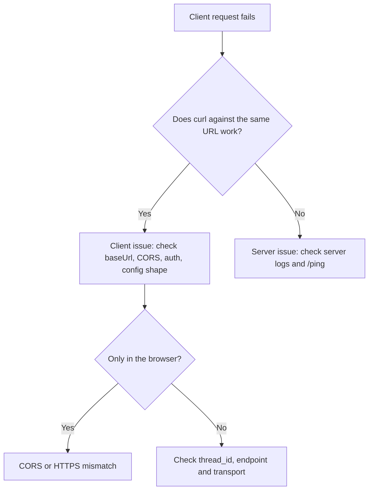

Use this page when the TypeScript client (`AgentFlowClient`) or a hand-written HTTP client cannot invoke, stream or connect to a 10xGraph API server. It walks from a quick client-versus-server triage to the five most common failures, each with symptoms, causes and a tested fix, then lists WebSocket close codes.

## Decide whether the client or the server is at fault

Start by sending the same request with curl. If curl works, the problem is in the client configuration (`baseUrl`, CORS, auth, thread id). If curl fails too, debug the server first with [API server troubleshooting](/docs/troubleshooting/api-server).



Run this health check before anything else. The server answers `/ping` without authentication.

```bash
# Health check: expect HTTP 200 and a body containing "pong"
curl -i http://localhost:8000/ping
```

## Fix requests that fail immediately

If every call fails with a connection error, the client is not reaching the server. Typical messages are `ECONNREFUSED`, `ENOTFOUND`, `EHOSTUNREACH`, "socket hang up" or a timeout.

**Likely causes**

- Wrong `baseUrl`, a typo in the host or port, or the server is not running.
- A reverse proxy or firewall routes to a different place than the one you configured.
- The base URL points at the backend while the app sits behind a proxy (or the reverse).

**Fix**

Confirm the exact URL with the curl check above, then make the client use it. The client also has a `ping()` method and a `debug` flag that logs each request and response.

```ts title="check-connection.ts"
import { AgentFlowClient } from '@10xgraph/client';

const client = new AgentFlowClient({
  baseUrl: 'http://localhost:8000', // no trailing path, must match the curl URL
  debug: true, // logs request and response details to the console
});

// Throws if the server is unreachable or answers with an error status.
console.log(await client.ping());
```

If the API runs behind a proxy, `baseUrl` must point at the proxy address that browsers and services actually use.

## Fix browser requests that fail while curl works

When the browser console shows "CORS error", "net::ERR_FAILED" or "Failed to fetch" but curl succeeds, the browser is blocking the response. Browsers enforce CORS, curl does not.

**Likely causes**

- The server's `ORIGINS` setting does not include the page's origin. The server default is `*`.
- Credentials are sent to a server that allows any origin. The server setting `CORS_ALLOW_CREDENTIALS` defaults to `true`, and in production the combination of `ORIGINS="*"` with credentials is refused at startup.
- The page is served over `https://` while the API is on `http://` (mixed content is blocked).
- The auth header never reaches the server because the token is missing in the client.

**Fix**

List explicit origins on the server, then open the browser DevTools Network tab and inspect the failing request and its preflight `OPTIONS` call. The response must carry `Access-Control-Allow-Origin` with your page's origin.

```bash
# Server environment: comma-separated origins, never * in production
export ORIGINS=https://my-app.com,https://www.my-app.com
```

Then configure the client with the token and, only if you rely on cookies, `credentials`.

```ts title="browser-client.ts"
import { AgentFlowClient } from '@10xgraph/client';

const client = new AgentFlowClient({
  baseUrl: 'https://api.my-app.com', // same scheme (https) as the page
  authToken: 'your-jwt-token', // sent as a Bearer token
  credentials: 'include', // only needed when you use cookies
});
```

Do not expose long-lived tokens in browser code. See [Create a client](/docs/client/create-client) for auth options.

## Fix lost conversations and thread continuity

If each request feels like a new conversation, the server is not seeing the same thread or is not saving state. The server needs both a stable `config.thread_id` from the client and a checkpointer.

**Likely causes**

- `thread_id` is missing, or a new one is generated for every request.
- `thread_id` is nested in the wrong place. The API reads `config.thread_id` at the top level of `config`. A LangGraph style `config.configurable.thread_id` is not read.
- The server has no checkpointer, so nothing is persisted between calls.
- Reading a thread that does not exist returns `STORAGE_NOT_FOUND_000`.

**Fix**

Build messages with `Message.text_message` and reuse one `thread_id` for the whole conversation.

```ts title="thread-continuity.ts"
import { AgentFlowClient, Message } from '@10xgraph/client';

const client = new AgentFlowClient({ baseUrl: 'http://localhost:8000' });
const threadId = 'user-123-conversation-1';

// First call starts the thread.
await client.invoke([Message.text_message('My name is Sam.')], {
  config: { thread_id: threadId }, // top level of config
});

// Second call reuses the same thread, so the agent can recall the name.
const result = await client.invoke([Message.text_message('What is my name?')], {
  config: { thread_id: threadId },
});
console.log(result.messages);
console.log(result.meta.thread_id, result.meta.is_new_thread); // is_new_thread is false here
```

Check whether the server has a checkpointer with `graph()`. The response holds `data.info.checkpointer` (a boolean) and `data.info.checkpointer_type`.

```ts title="check-checkpointer.ts"
import { AgentFlowClient } from '@10xgraph/client';

const client = new AgentFlowClient({ baseUrl: 'http://localhost:8000' });
const graph = await client.graph();
console.log(graph.data.info.checkpointer, graph.data.info.checkpointer_type);
```

If `checkpointer` is `false`, configure one: see [Set up checkpointing](/docs/guides/set-up-checkpointing).

## Fix streaming that behaves differently from invoke

`invoke()` returns one result, while `stream()` yields chunks as the graph runs. When one works and the other does not, the cause is usually the endpoint, a parser that expects the wrong wire format, or a proxy that buffers or cuts long responses.

**Likely causes**

- Different routes: `invoke()` calls `POST /v1/graph/invoke`, `stream()` calls `POST /v1/graph/stream`.
- A hand-written parser expects SSE `data:` frames. The stream endpoint is sent with `Content-Type: text/event-stream`, but the client parses it as newline-delimited JSON chunks.
- A proxy buffers the response or times out long-lived connections.

**Fix**

Use the client methods, which parse the stream for you.

```ts title="stream-vs-invoke.ts"
import { AgentFlowClient, Message } from '@10xgraph/client';

const client = new AgentFlowClient({ baseUrl: 'http://localhost:8000' });
const messages = [Message.text_message('Hello')];
const config = { thread_id: 'stream-test' };

// One response, after the graph finishes.
const result = await client.invoke(messages, { config });
console.log(result.messages);

// Chunks as they are produced.
for await (const chunk of client.stream(messages, { config })) {
  if (chunk.event === 'message') {
    console.log(chunk.message?.content);
  }
}
```

To isolate the transport from your client code, read the raw stream with curl. Each line of output should be one JSON object.

```bash
# --no-buffer prints chunks as they arrive
curl --no-buffer -X POST http://localhost:8000/v1/graph/stream \
  -H "Content-Type: application/json" \
  -d '{"messages": [{"role": "user", "content": [{"type": "text", "text": "Hello"}]}], "config": {"thread_id": "test"}}'
```

If curl streams but your app receives everything at once or loses the tail, a proxy is buffering or timing out. Disable response buffering and raise the read timeout for the stream route (for nginx, `proxy_buffering off` and a larger `proxy_read_timeout`). See [Stream responses](/docs/client/stream-responses) for chunk types.

## Fix WebSocket connection failures

`wsStream()` (turn-based, `/v1/graph/ws`) and `realtime()` (audio, `/v1/graph/live`) share the same auth and similar failure modes. Most failures are a missing WebSocket implementation, the wrong endpoint for the graph type, or an auth problem.

### Provide a WebSocket implementation on older Node

Browsers and Node 21 or later have a global `WebSocket`. On older Node versions the client reports that no WebSocket implementation is available. Install `ws` and pass it in.

```bash
npm install ws
```

```ts title="node-websocket.ts"
import WebSocket from 'ws';
import { AgentFlowClient, Message } from '@10xgraph/client';

const client = new AgentFlowClient({
  baseUrl: 'http://localhost:8000',
  authToken: 'your-jwt-token',
  webSocketImpl: WebSocket as never, // needed on Node < 21
});

for await (const chunk of client.wsStream([Message.text_message('Hello')])) {
  console.log(chunk.event);
}
```

### Read the WebSocket close code

When a socket closes right after opening, the numeric close code tells you why. These codes are set by the server in `/v1/graph/ws` and `/v1/graph/live`.

| Code | Endpoint | Cause | Fix |
|------|----------|-------|-----|
| 1008 | `/v1/graph/live` | The graph is not a live (realtime) agent. An `error` event with `code: 'not_live'` arrives first. | Use `stream()` or `wsStream()`. `graph()` shows the graph type. |
| 1008 | `/v1/graph/ws` | The graph is a live agent, or the token expired or was revoked after the socket opened. | Use `realtime()` for live agents, or refresh the token. |
| 1008 | Either | Not authorized for the requested `thread_id` (on `/live`, an error event with `code: 'not_authorized'` arrives first). | Check the token and the server's authorization rules for that thread. |
| 1003 | `/v1/graph/live` | The init frame was not valid JSON or not a JSON object. | Only relevant if you write the protocol by hand. The client sends valid frames. |
| 1013 | Either | Rate limit or `websocket.max_connections` cap exceeded (default 1000 per server process). | Back off and retry, or raise the cap in the server config. |
| 1011 | `/v1/graph/ws` | Unexpected server error. | Check the server logs. |

### Send the token through the subprotocol

The bearer token never goes in the URL. In browsers it travels in the `Sec-WebSocket-Protocol` header as a subprotocol pair, and on Node the client also sets an `Authorization` header. The server accepts the `10xgraph-bearer` subprotocol, and the older `agentflow-bearer` name (which this client version sends) keeps working as a deprecated alias.

If a reverse proxy strips `Sec-WebSocket-Protocol`, the browser handshake arrives without a token and is rejected. Configure the proxy to forward upgrade headers, including `Sec-WebSocket-Protocol`.

### Tune realtime reconnection

`realtime()` reconnects automatically after an unexpected drop and resumes the same `thread_id`. `wsStream()` does not reconnect. The delay before attempt `n` is `min(baseDelay * 2^(n-1), maxDelay)` seconds. Defaults are `enabled: true`, `baseDelay: 0.5`, `maxDelay: 10` and `maxAttempts: 5`.

After `maxAttempts` failures the session emits a fatal `error` event with `code: 'reconnect_failed'`. No reconnect happens after you call `close()` or after any fatal error. Set `reconnect: { enabled: false }` to turn it off.

```ts title="realtime-reconnect.ts"
import { AgentFlowClient } from '@10xgraph/client';

const client = new AgentFlowClient({
  baseUrl: 'http://localhost:8000',
  authToken: 'your-jwt-token',
});

const session = client.realtime(
  { thread_id: 'voice-session-1' },
  { reconnect: { enabled: true, baseDelay: 1, maxDelay: 30, maxAttempts: 10 } }
);

session.on('reconnecting', (attempt) => console.log(`Reconnecting, attempt ${attempt}`));
session.on('reconnected', () => console.log('Reconnected'));
session.on('error', (e) => {
  if (e.fatal) console.log(`Giving up: ${e.code ?? e.message}`);
});

await session.ready; // resolves when the session is open
```

See [Realtime audio](/docs/client/realtime-audio) for sending and receiving audio.

## Error code quick reference

These codes appear in error responses the client surfaces as typed errors. The full catalog is in [Error codes](/docs/reference/error-codes).

| Error code | Meaning | Action |
|------------|---------|--------|
| `STORAGE_NOT_FOUND_000` | The thread or stored resource does not exist. | Check the `thread_id` and that a checkpointer is enabled. |
| `STORAGE_TRANSIENT_000` | A temporary storage failure, such as an unreachable database. | Retry after a short delay. |
| `VALIDATION_ERROR` | The request body failed validation (HTTP 422). | Check the message format and `config` shape against [Invoke and stream](/docs/client/invoke-agent). |

## Related pages

- [Create a client](/docs/client/create-client)
- [Invoke an agent](/docs/client/invoke-agent)
- [Stream responses](/docs/client/stream-responses)
- [Manage threads](/docs/client/manage-threads)
- [Client error handling](/docs/client/error-handling)
- [API server troubleshooting](/docs/troubleshooting/api-server)
- [Set up checkpointing](/docs/guides/set-up-checkpointing)

## What you learned

- How to separate client problems from server problems with curl and `/ping`.
- Why CORS, `ORIGINS` and HTTPS decide whether browser requests succeed.
- Why `thread_id` belongs at the top level of `config`, and how to confirm a checkpointer exists.
- How `invoke()` and `stream()` differ on the wire and how to debug a stream.
- What each WebSocket close code means and how realtime reconnection behaves.
