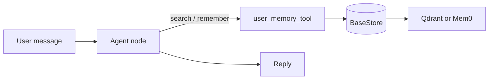

**Source examples:** [`examples/memory/`](https://github.com/10xGraph/10xGraph/tree/main/examples/memory) (`simple_personalized_agent.py` and `personalized_agent_qdrant.py`). Those two scripts call the Mem0 SDK directly from custom graph nodes. This tutorial uses 10xGraph's own memory path instead: `Agent(memory=MemoryConfig(...))` with a `BaseStore`.

## What you will build

A support agent that remembers durable facts about a customer (for example "prefers refunds to store credit") across threads and sessions. You will:

- create a store (`QdrantStore`, or a Mem0-backed store)
- attach it with `MemoryConfig`
- pass a stable `user_id` in the run config so memory follows the customer, not the thread

## Prerequisites

- Python 3.12 or later
- `10xgraph` installed with the `qdrant` extra (and `google-genai` or `openai` for embeddings)
- a Gemini key (`GOOGLE_API_KEY`) or an OpenAI key (`OPENAI_API_KEY`) for the embedding model

```bash
pip install "10xgraph[qdrant,google-genai]"
```

For the Mem0 option, install the `mem0` extra instead (`pip install "10xgraph[mem0]"`).

## How it works



`MemoryConfig` does three things when you pass it to an `Agent`:

1. optionally appends a memory instruction to the system prompt (`inject_system_prompt=True`, the default)
2. in `postload` mode (the default), adds a model-facing `user_memory_tool` to the agent's `ToolNode`, so the model decides when to `search` or `remember`
3. in `preload` mode, searches the store with the latest user message before each model call and injects the results as a system message

## Step 1: Create a store

`QdrantStore` needs an embedding service. The factories wrap `QdrantStore(...)`:

```python
from tenxgraph.storage.store import GoogleEmbedding, create_local_qdrant_store

store = create_local_qdrant_store(
    path="./qdrant_data",
    embedding=GoogleEmbedding(),  # reads GOOGLE_API_KEY
    collection="support_memory",
)
```

For a remote server or Qdrant Cloud use `create_remote_qdrant_store(host, port, embedding, collection)` or `create_cloud_qdrant_store(url, api_key, embedding, collection)`. The vector size comes from `embedding.dimension`, so changing the embedding model on an existing collection needs a new collection.

### Mem0 instead of Qdrant

`create_mem0_store(config, user_id="default_user", app_id="agentflow_app")` returns a `Mem0Store`. The `config` dict is Mem0's own configuration schema:

```python
import os
from tenxgraph.storage.store import create_mem0_store

store = create_mem0_store(
    config={
        "vector_store": {
            "provider": "qdrant",
            "config": {
                "collection_name": "support_memory",
                "url": os.getenv("QDRANT_URL"),
                "api_key": os.getenv("QDRANT_API_KEY"),
                "embedding_model_dims": 768,
            },
        },
        "llm": {"provider": "gemini", "config": {"model": "gemini-2.0-flash-exp"}},
        "embedder": {"provider": "gemini", "config": {"model": "models/text-embedding-004"}},
    },
    app_id="support_app",
)
```

`create_mem0_store_with_qdrant(qdrant_url, qdrant_api_key, collection_name, embedding_model, llm_model, app_id, **kwargs)` builds the same kind of config for you with OpenAI defaults.

## Step 2: Attach memory to the agent

```python
from tenxgraph.core import Agent, StateGraph, ToolNode
from tenxgraph.storage.checkpointer import InMemoryCheckpointer
from tenxgraph.storage.store import MemoryConfig, UserMemoryConfig
from tenxgraph.utils.constants import END


def lookup_order(order_id: str) -> str:
    """Look up an order by id."""
    return f"Order {order_id}: shipped, arriving Thursday."


agent = Agent(
    model="gemini-2.5-flash",
    provider="google",
    system_prompt=[{"role": "system", "content": "You are a support agent."}],
    tool_node=ToolNode([lookup_order]),
    memory=MemoryConfig(
        store=store,
        limit=5,
        score_threshold=0.5,
        user_memory=UserMemoryConfig(memory_type="semantic", category="customer_prefs"),
    ),
)
```

An `Agent` with `memory=` in `postload` mode must have a `ToolNode` (or the name of a `TOOL` node), because the memory tool is added to it. Without one, construction raises a `RuntimeError`.

`MemoryConfig` fields:

| Field | Meaning |
|---|---|
| `store` | Default `BaseStore` for both scopes |
| `retrieval_mode` | `"no_retrieval"`, `"preload"` or `"postload"` (default) |
| `limit` | Max memories per search (default 5) |
| `score_threshold` | Minimum similarity score (default 0.0) |
| `max_tokens` | Optional cap on retrieved memory text, applied in preload mode |
| `inject_system_prompt` | Append the memory instruction to the system prompt (default `True`) |
| `config` | Extra config merged into every store call |
| `user_memory` | `UserMemoryConfig`: the model may search and write (enabled by default) |
| `agent_memory` | `AgentMemoryConfig`: shared agent or app knowledge, search only (disabled by default) |

`UserMemoryConfig` and `AgentMemoryConfig` also accept `store`, `memory_type`, `category`, `limit` and `score_threshold` to override the top-level values, plus `user_id` (user scope) or `agent_id` and `app_id` (agent scope).

## Step 3: Build the graph and pass `user_id`

```python
graph = StateGraph()
graph.add_node("MAIN", agent)
graph.set_entry_point("MAIN")
graph.add_edge("MAIN", END)

app = graph.compile(checkpointer=InMemoryCheckpointer(), store=store)
```

The agent here is a single node. For tool calling, wire a `TOOL` node and a conditional edge as in [React Agent](/docs/tutorials/from-examples/react-agent), reusing `agent.get_tool_node()`.

```python
import asyncio

from tenxgraph.core.state import Message


async def main():
    await app.ainvoke(
        {"messages": [Message.text_message("Remember that I prefer refunds, not store credit.")]},
        config={"thread_id": "cust-42-a", "user_id": "cust-42"},
    )

    # A new thread, same user_id: memory persists across threads.
    result = await app.ainvoke(
        {"messages": [Message.text_message("What refund preference do you have for me?")]},
        config={"thread_id": "cust-42-b", "user_id": "cust-42"},
    )
    print(result["messages"][-1].text())


asyncio.run(main())
```

The user scope reads `config["user_id"]` unless `UserMemoryConfig(user_id=...)` is set. Thread state (the checkpointer) and long-term memory (the store) are separate: a new `thread_id` starts a new conversation but still finds the memories saved under the same `user_id`.

## Preload mode

Set `retrieval_mode="preload"` to search on every turn without relying on the model to call a tool:

```python
memory = MemoryConfig(store=store, retrieval_mode="preload", limit=3)
```

Before each model call, the agent searches with the latest user message and adds a `[Long-term Memory Context]` system message. In this mode the agent exposes no memory tool, so the model cannot write memories itself. Write them from your own code through the store, or use `postload` for model-driven writes.

## Common mistakes

- Changing `user_id` every turn and expecting shared memory.
- Passing `memory=` without a `ToolNode` in `postload` mode.
- Forgetting `store=` in `graph.compile(...)` when you use the store from other nodes or tools.
- Switching the embedding model on an existing Qdrant collection, which changes the vector size.
- Expecting keyword matching: retrieval is semantic similarity.

## Key concepts

| Concept | Details |
|---|---|
| `MemoryConfig` | Public config object for `Agent(memory=...)` |
| `QdrantStore` | Async Qdrant-backed `BaseStore`; needs a `BaseEmbedding` |
| `create_mem0_store` | Factory for a Mem0-backed `BaseStore` |
| `user_memory_tool` | Model-facing tool with `search` and `remember` actions |
| `config["user_id"]` | Partitions user memory |

## What you learned

- How to attach long-term memory to an agent with `MemoryConfig`.
- How to pick a Qdrant or Mem0 store.
- How `user_id` separates user memory from thread state.

## Next step

→ [Multimodal](/docs/tutorials/from-examples/multimodal) to accept images, audio, video, and documents in a 10xGraph graph.
