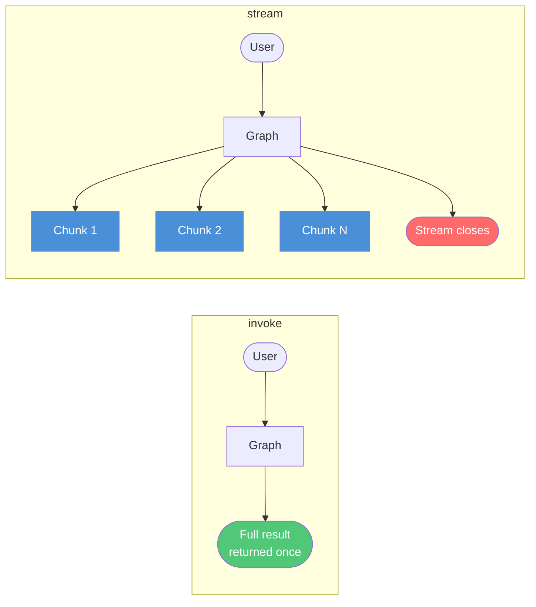
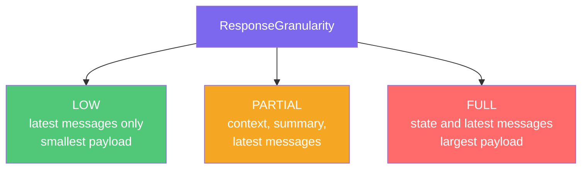
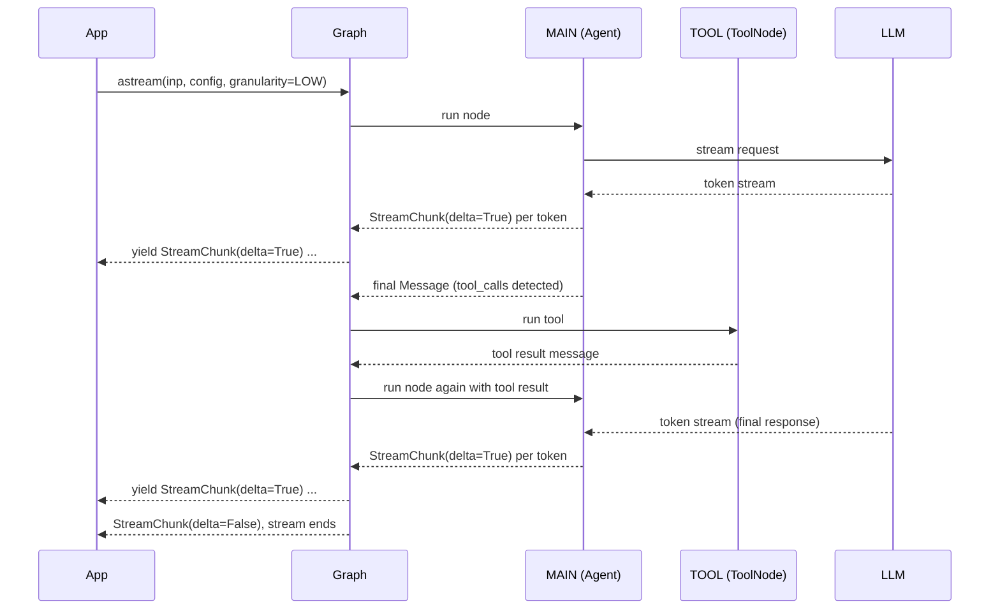

**Source example:** [`agentflow/examples/react_stream/stream_react_agent.py`](https://github.com/10xHub/Agentflow/blob/main/examples/react_stream/stream_react_agent.py)

## What you will build

An async ReAct agent that calls `astream` instead of `invoke`. Each node emits `StreamChunk` messages as the LLM produces tokens. You will learn how to consume the async generator and control how much data each chunk contains using `ResponseGranularity`.

## Prerequisites

- Python 3.12 or later
- `10xgraph` installed
- Google Gemini API key set as `GEMINI_API_KEY`

## invoke vs stream



| Method | Returns | When to use |
|---|---|---|
| `app.invoke(...)` | Complete final state | Simple request/response; no UI progress bar needed |
| `app.stream(...)` | Synchronous generator of `StreamChunk` | Real-time display in a CLI or background task |
| `app.astream(...)` | Async generator of `StreamChunk` | Async servers (FastAPI, aiohttp), modern UI backends |

## Step 1 — Define the tool

The tool returns a structured `Message` object instead of a plain string. This is the recommended pattern when you want the tool result to carry explicit role and `tool_call_id` metadata.

```python
from agentflow.core.state import AgentState, Message

def lookup_order(
    order_id: str,
    tool_call_id: str,
    state: AgentState,
) -> Message:
    """Look up an order and return a fully formed tool Message."""
    result = f"Order {order_id}: shipped, arriving Thursday."
    return Message.tool_message(
        content=result,
        tool_call_id=tool_call_id,
    )
```

## Step 2 — Build agent and graph

```python
from agentflow.core import Agent, StateGraph, ToolNode
from agentflow.storage.checkpointer import InMemoryCheckpointer
from agentflow.utils.constants import END

checkpointer = InMemoryCheckpointer()
tool_node = ToolNode([lookup_order])

main_agent = Agent(
    model="gemini-2.5-flash",
    provider="google",
    system_prompt=[
        {"role": "system", "content": "You are a helpful assistant. Use tools when needed."}
    ],
    tool_node=tool_node,      # pass the ToolNode instance (or the name of a TOOL node)
    trim_context=True,
)

def should_use_tools(state: AgentState) -> str:
    if not state.context:
        return "TOOL"
    last = state.context[-1]
    if hasattr(last, "tools_calls") and last.tools_calls and last.role == "assistant":
        return "TOOL"
    if last.role == "tool":
        return END
    return END

graph = StateGraph()
graph.add_node("MAIN", main_agent)
graph.add_node("TOOL", tool_node)

graph.add_conditional_edges("MAIN", should_use_tools, {"TOOL": "TOOL", END: END})
graph.add_edge("TOOL", "MAIN")
graph.set_entry_point("MAIN")

app = graph.compile(checkpointer=checkpointer)
```

## Step 3 — Stream with `astream`

```python
import asyncio
from agentflow.utils import ResponseGranularity

async def run_stream_test():
    inp = {"messages": [Message.text_message("Call lookup_order for order A-1001, then reply.")]}
    config = {"thread_id": "stream-1", "recursion_limit": 10}

    stream_gen = app.astream(
        inp,
        config=config,
        response_granularity=ResponseGranularity.LOW,
    )
    async for chunk in stream_gen:
        print(chunk.model_dump(), end="\n", flush=True)

asyncio.run(run_stream_test())
```

## ResponseGranularity explained

`ResponseGranularity` controls how much information is in each `StreamChunk`:



| Value | Chunk contains | Use case |
|---|---|---|
| `ResponseGranularity.LOW` | Latest messages only | Token-by-token UI streaming |
| `ResponseGranularity.PARTIAL` | Context, summary and latest messages | Progress tracking |
| `ResponseGranularity.FULL` | State and latest messages | Debugging; audit logging |

## StreamChunk structure

`StreamChunk` has these fields: `event`, `message`, `state`, `data`, `thread_id`, `run_id`, `metadata` and `timestamp`. Branch on `chunk.event` first, then read the matching holder. The `delta` flag lives on the message.

```python
async for chunk in app.astream(inp, config=config):
    if chunk.event == StreamEvent.MESSAGE and chunk.message:
        print(chunk.message.text(), end="", flush=True)   # message.delta is True for partial updates
```

## Complete async streaming example

```python
import asyncio
import logging
from dotenv import load_dotenv

from agentflow.core import Agent, StateGraph, ToolNode
from agentflow.core.state import AgentState, Message, StreamEvent
from agentflow.storage.checkpointer import InMemoryCheckpointer
from agentflow.utils import ResponseGranularity
from agentflow.utils.constants import END

logging.basicConfig(level=logging.INFO)
load_dotenv()

checkpointer = InMemoryCheckpointer()

def lookup_order(order_id: str, tool_call_id: str, state: AgentState) -> Message:
    return Message.tool_message(
        content=f"Order {order_id}: shipped, arriving Thursday.",
        tool_call_id=tool_call_id,
    )

tool_node = ToolNode([lookup_order])

main_agent = Agent(
    model="gemini-2.5-flash",
    provider="google",
    system_prompt=[{"role": "system", "content": "You are a helpful assistant."}],
    tool_node=tool_node,
    trim_context=True,
)

def should_use_tools(state: AgentState) -> str:
    if not state.context:
        return "TOOL"
    last = state.context[-1]
    if hasattr(last, "tools_calls") and last.tools_calls and last.role == "assistant":
        return "TOOL"
    if last.role == "tool":
        return END
    return END

graph = StateGraph()
graph.add_node("MAIN", main_agent)
graph.add_node("TOOL", tool_node)
graph.add_conditional_edges("MAIN", should_use_tools, {"TOOL": "TOOL", END: END})
graph.add_edge("TOOL", "MAIN")
graph.set_entry_point("MAIN")

app = graph.compile(checkpointer=checkpointer)

async def main():
    inp = {"messages": [Message.text_message("Call lookup_order for order A-1001, then reply.")]}
    config = {"thread_id": "stream-1", "recursion_limit": 10}

    async for chunk in app.astream(inp, config=config, response_granularity=ResponseGranularity.LOW):
        print(chunk.model_dump())

asyncio.run(main())
```

## Synchronous streaming with `app.stream()`

Use `app.stream()` in a plain script with no event loop. It wraps `astream` and takes the same arguments. You do not need to set `"is_stream": True` in the config: `astream` sets it for you.

```python
inp = {"messages": [Message.text_message("Where is order A-1001?")]}
config = {"thread_id": "sync-1", "recursion_limit": 10}

for chunk in app.stream(inp, config=config):
    if chunk.event == StreamEvent.MESSAGE and chunk.message:
        print(chunk.message.text(), end="", flush=True)
```

Choose the method by context:

| Context | Method |
|---|---|
| Async server (FastAPI, aiohttp) | `app.astream(...)` |
| Synchronous CLI script | `app.stream(...)` |
| Only the final answer is needed | `app.invoke(...)` |

### Custom state with streaming

Pass a state instance to `StateGraph` to set the state type, and seed fields through the `state` key of the input:

```python
class OrderState(AgentState):
    order_id: str = ""
    customer_email: str = ""

graph = StateGraph(OrderState())
# ... add nodes and edges exactly as above, then compile

inp = {
    "messages": [Message.text_message("Summarise this order.")],
    "state": {"order_id": "A-1001", "customer_email": "alice@example.com"},
}
for chunk in app.stream(inp, config={"thread_id": "order-1", "recursion_limit": 10}):
    if chunk.event == StreamEvent.MESSAGE and chunk.message:
        print(chunk.message.text(), end="", flush=True)
```

The final message chunk has `message.delta` set to `False`; partial chunks have `True`.

## Streaming sequence



## Key concepts

| Concept | Details |
|---|---|
| `app.astream(...)` | Async generator returning `StreamChunk` objects as nodes execute |
| `app.stream(...)` | Synchronous version of `astream` for scripts without an event loop |
| `ResponseGranularity.LOW` | Smallest payload: latest messages only |
| `chunk.message.delta` | `True` while streaming a partial message, `False` on the final assembled message |
| `Message.tool_message(...)` | Create a tool-result message with explicit `tool_call_id` |

## What you learned

- The difference between `invoke`, `stream`, and `astream`, and that `stream` and `astream` set streaming mode themselves.
- How to use `ResponseGranularity` to control chunk size.
- How to interpret `chunk.message.delta` to distinguish partial from final output.
- How to return a typed `Message` from a tool function.

## Next step

→ [Stop Stream](/docs/tutorials/from-examples/stop-stream) to cancel a running stream with `app.stop()`.
