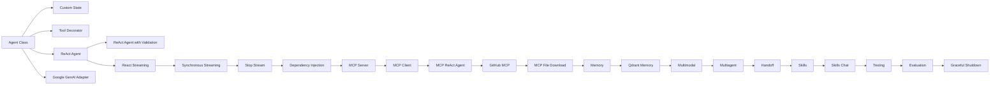

10xGraph tutorials are guided walkthroughs of the example code in the repository's `examples/` folder. They sit between the quickstart pages and the reference: each one explains a working script, covering agents, custom state, tools, streaming, MCP, memory, multimodal input, multi-agent handoff, skills, testing and evaluation. They are for developers who learn best by reading and running real code.

## Start here

Begin with the [Agent Class pattern](/docs/tutorials/from-examples/agent-class), the smallest useful graph. Continue with [Custom state](/docs/tutorials/from-examples/custom-state) and the [Tool decorator](/docs/tutorials/from-examples/tool-decorator) to see how state and tools are modeled, then assemble the loop in the [ReAct agent](/docs/tutorials/from-examples/react-agent) tutorial.

For real-time output, [React streaming](/docs/tutorials/from-examples/react-streaming) and [Stop stream](/docs/tutorials/from-examples/stop-stream) cover token streaming and cancellation. For connecting outside systems, see [MCP ReAct agent](/docs/tutorials/from-examples/mcp-react-agent) and [Memory](/docs/tutorials/from-examples/memory). The [Testing](/docs/tutorials/from-examples/testing) and [Evaluation](/docs/tutorials/from-examples/evaluation) tutorials show how to check an agent before release, and [Graceful shutdown](/docs/tutorials/from-examples/graceful-shutdown) covers stopping cleanly.

Tutorials teach the library. To run an agent as a service, with auth and deployment, use the [how-to guides](/docs/how-to) and the [beginner path](/docs/beginner).

## Tutorial track

## From examples

These tutorials are based on code in `examples/`:

- [Agent Class Pattern](/docs/tutorials/from-examples/agent-class)
- [Custom State](/docs/tutorials/from-examples/custom-state)
- [Google GenAI Adapter](/docs/tutorials/from-examples/google-genai)
- [Tool Decorator](/docs/tutorials/from-examples/tool-decorator)
- [ReAct Agent](/docs/tutorials/from-examples/react-agent)
- [ReAct Agent with Validation](/docs/tutorials/from-examples/react-agent-validation)
- [React Streaming](/docs/tutorials/from-examples/react-streaming)
- [Stop Stream](/docs/tutorials/from-examples/stop-stream)

## Advanced integrations

- [Dependency Injection](/docs/tutorials/from-examples/dependency-injection)
- [MCP Server](/docs/tutorials/from-examples/mcp-server)
- [MCP Client](/docs/tutorials/from-examples/mcp-client)
- [MCP ReAct Agent](/docs/tutorials/from-examples/mcp-react-agent)
- [GitHub MCP](/docs/tutorials/from-examples/github-mcp)
- [Memory](/docs/tutorials/from-examples/memory)
- [Multimodal](/docs/tutorials/from-examples/multimodal)
- [Multiagent](/docs/tutorials/from-examples/multiagent)
- [Handoff](/docs/tutorials/from-examples/handoff)
- [Skills](/docs/tutorials/from-examples/skills)
- [Testing](/docs/tutorials/from-examples/testing)
- [Evaluation](/docs/tutorials/from-examples/evaluation)
- [Graceful Shutdown](/docs/tutorials/from-examples/graceful-shutdown)

## How to use this section

If you are new to 10xGraph, follow the pages in the order shown above. The tutorials are designed to build on each other:

- Start with `Agent Class Pattern` to learn the smallest useful graph.
- Move to `Custom State` and `Tool Decorator` to understand how state and tools are modeled.
- Use `ReAct Agent` to assemble the core graph loop.
- Add `ReAct Agent with Validation` for safer input handling.
- Finish with the streaming tutorials to learn real-time output and cancellation patterns.
- Continue into the advanced section for MCP, memory, multimodal input, and multi-agent coordination.
- Finish with the sprint 9 tutorials to learn skills, testing, evaluation, and clean shutdown behavior.

## Before you start

Most tutorials assume:

- Python 3.12 or later
- 10xGraph installed (`pip install 10xgraph`)
- Environment variables loaded from `.env`
- A provider key such as `GEMINI_API_KEY` for Google-based examples

## Related docs

- [First Python Agent](/docs/get-started/first-agent)
- [State Graph](/docs/concepts/state-graph)
- [Agents and Tools](/docs/concepts/agents-and-tools)
- [Streaming](/docs/concepts/streaming)
